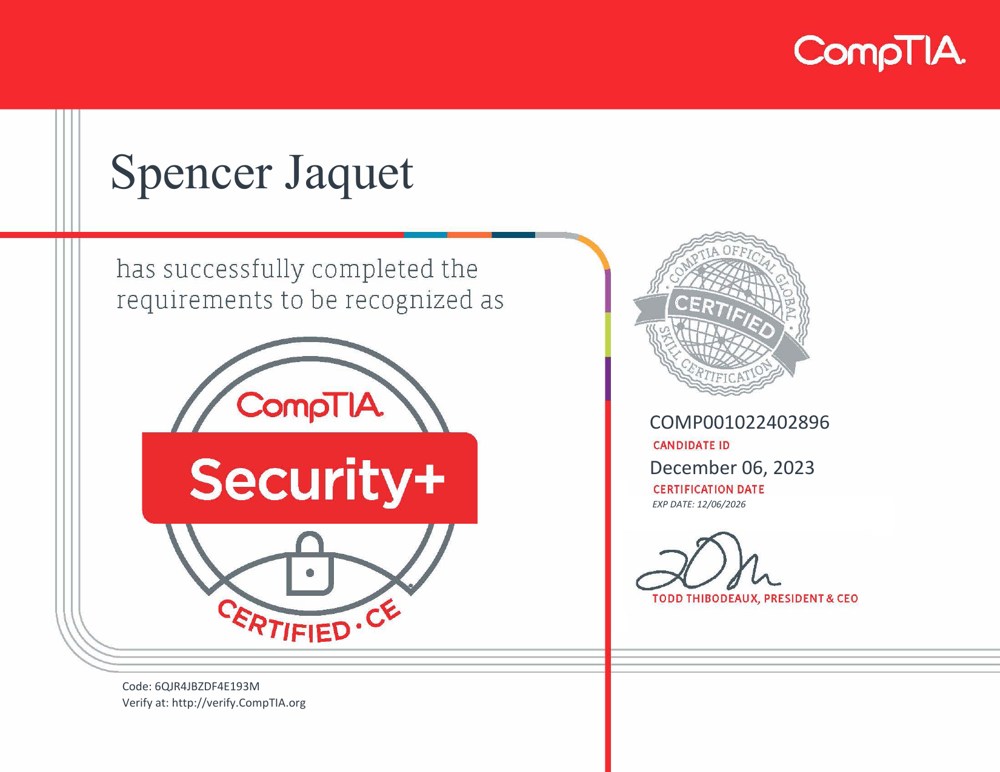
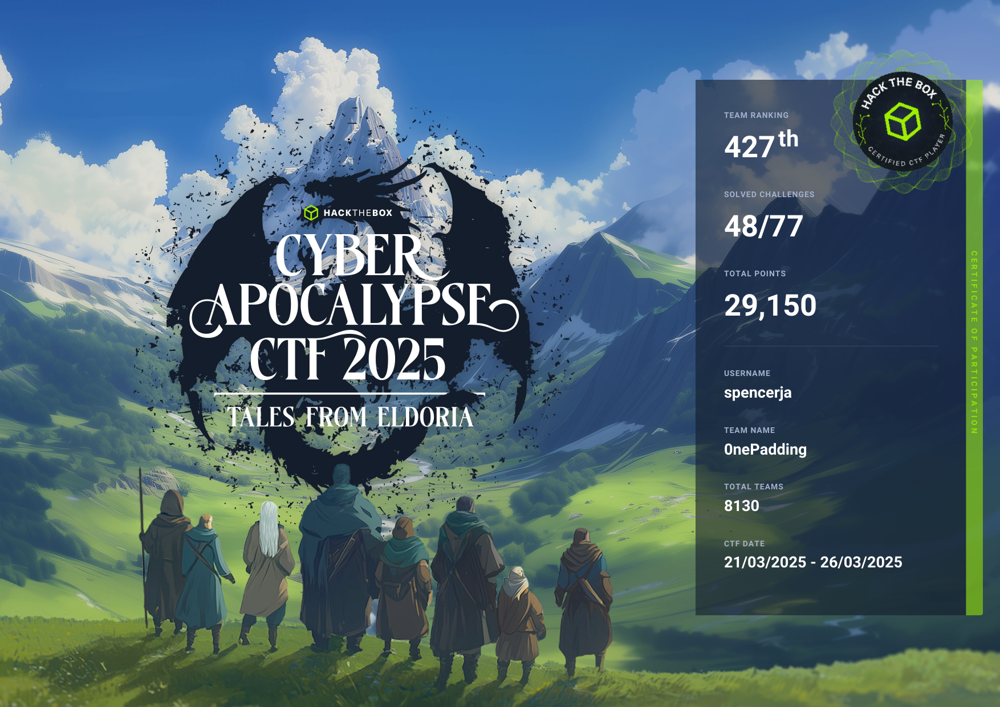
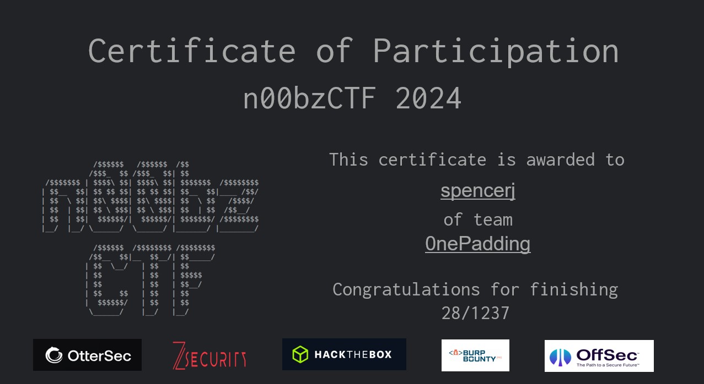
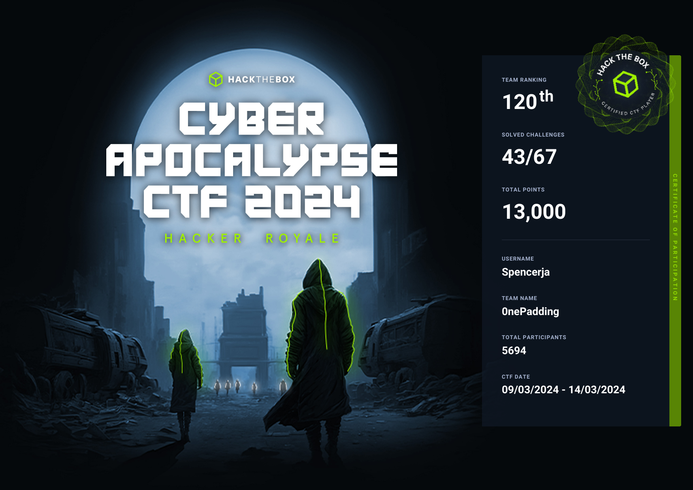
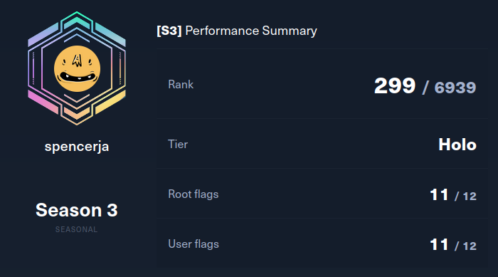
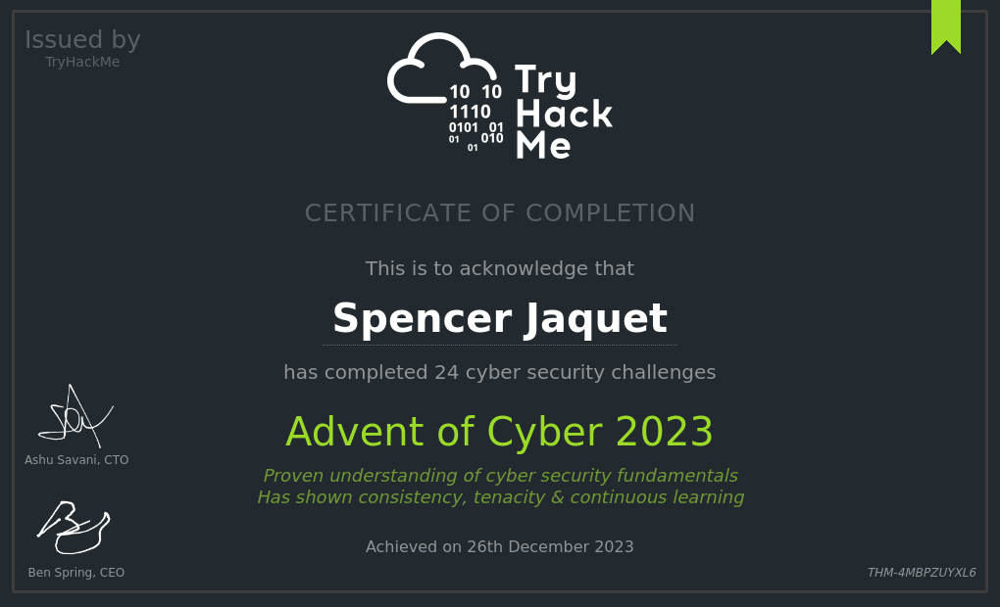
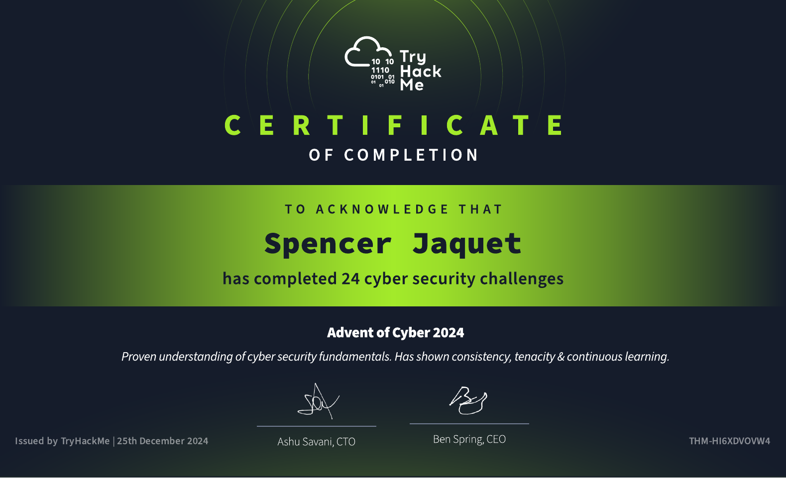

## Certificates
### OSCP by Offensive Security

### CompTIA Security+

## CTFs

### NahamCon CTF 2025
Participated once again in NahamCon CTF and placed at 201st. There were a couple really interesting challenge solutions that I learned from

### HTB Cyber Apocalypse 2025
The team placed 427th in the 2025 iteration of Cyber Apocalypse! There was a very diverse category distribution, but we still had fun learning where we could.

### n00bz CTF 2024
Placed 23rd on n00bz CTF. Was really fun with several challenges we were able to overcome!

### Huntress CTF 2024
Everyone has been super busy lately, but a couple of us managed to get into Huntress CTF and snagged a nice 127th place! This ctf lasted 30 days and had a very large challenge pool. Naturally, some challenges were particularly great! I rather enjoyed Permission To Proxy, MOVEable, Zippy, and Palimpsest!

### HTB Cyber Apocalypse 2024
120th place out of 5694 teams! This year felt a lot more competitive than last year, but we still managed to get a good placement! It was a very satisfying challenge.

### Nahamcon 2023
74th place out of 2522! Very happy to show improvements with the team!

### HTB Cyber Apocalypse 2023
118th place out of 6483 participating teams!

## Hackthebox
### HTB Seasons Beta I
Achieved Platinum Rank in HTB Seasons Beta I. All Easy, Medium and Hard challenges were completed within a week of release except for 1 Hard difficulty machine.

### HTB Seasons III
Achieved the Holo tier in HTB Seasons III. For this, I completed all box challenges within a week of release, except for the final Insane difficulty machine, over a twelve week period. This is the highest achievement tier possible for this competitive season, and was a very tough challenge!

### Achieved Pro Hacker Rank
After completing 14/20 active boxes, I earned Pro Hacker rank on HTB

### Completed ProLab Dante
Completed introductory pro lab Dante. Dante is a small network of 14 machines on a private network, designed to train fundamental penetration testing skills. Learn more about it [here](https://www.hackthebox.com/newsroom/prolab-dante) 

## TryHackMe
### Advent of Cyber 2022
My first cybersecurity "certificate" of completion! The content was fundamental but still had a lot of knowlege to give.

### Advent of Cyber 2023
AoC is quickly becoming my annual tradition; it was very satisfying seeing how far I've come throughout the year, and how much more knowledge I've gained since the previous year's advent.

### Advent of Cyber 2024
Once again some good challenges. I found Day19, the Frida showcase, to be my favorite of the set.

