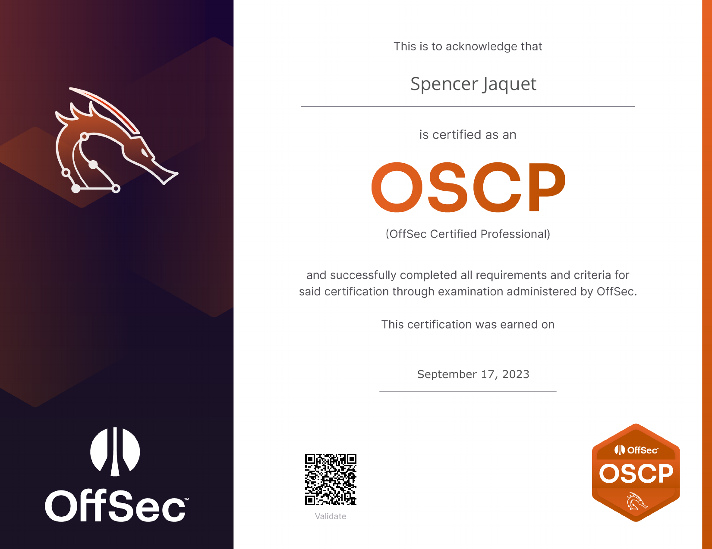
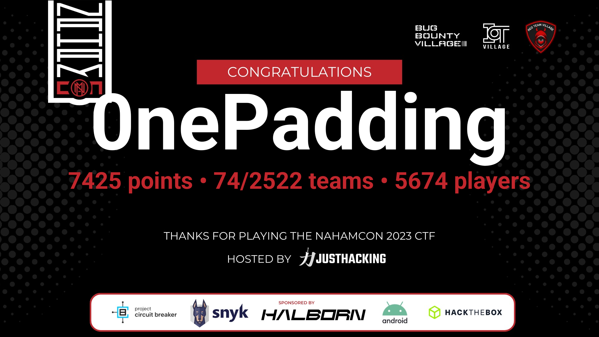
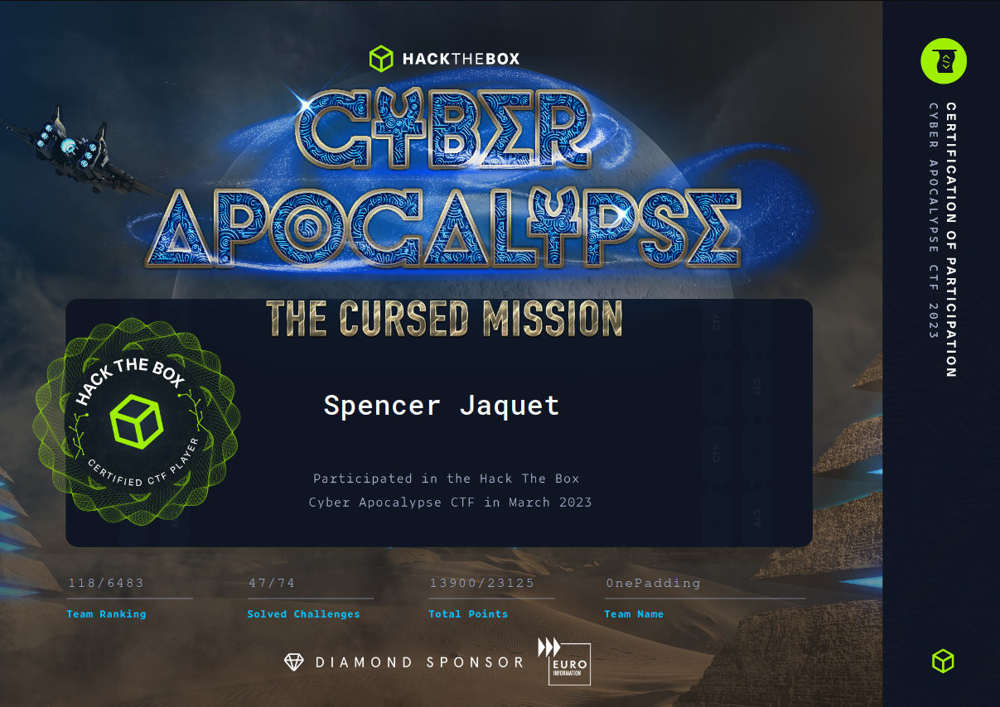
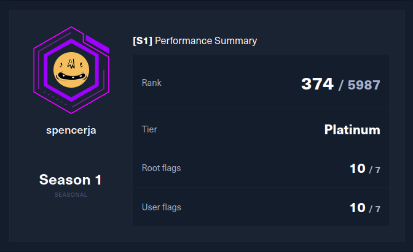
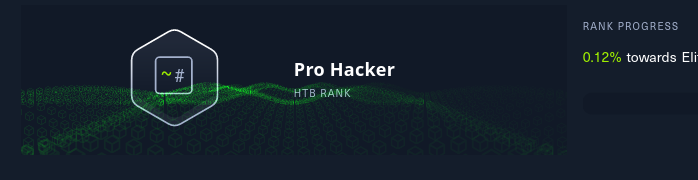
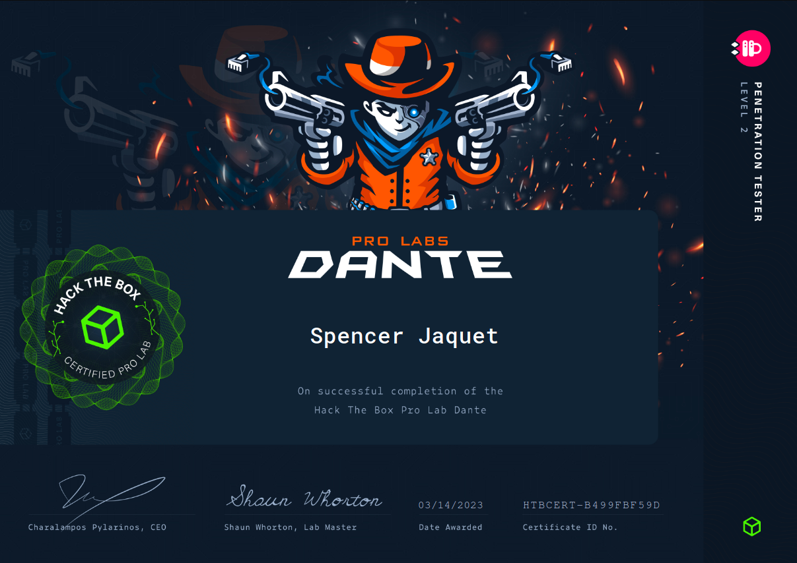
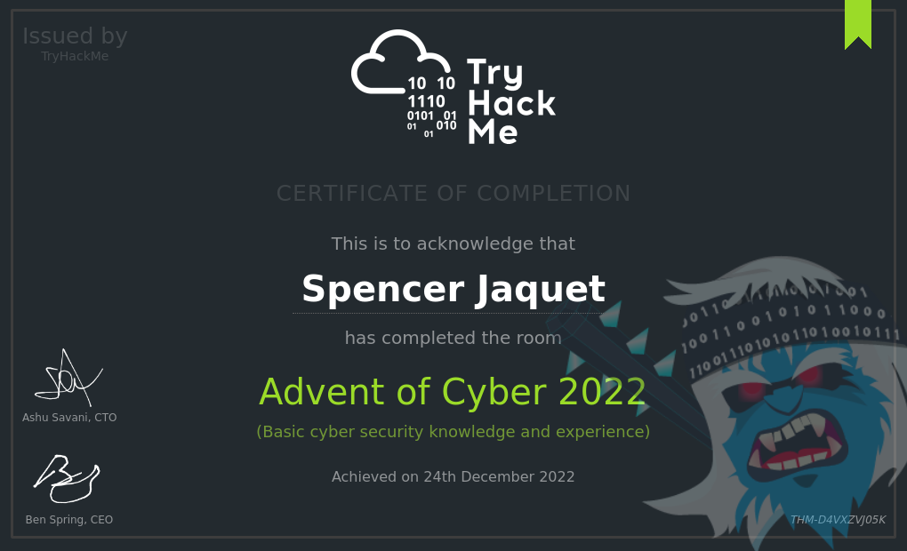

## Certificates
### OSCP by Offensive Security

## CTFs
### Nahamcon 2023
74th place out of 2522! My contribution was 3749 points out of the team's 7425 :)

### HTB Cyber Apocalypse 2023
118th place out of 6483 participating teams!

## Hackthebox
### HTB Seasons Beta I
Achieved Platinum Rank in HTB Seasons Beta I. All Easy, Medium and Hard challenges were completed within a week of release except for 1 Hard difficulty machine.

### Achieved Pro Hacker Rank
After completing 14/20 active boxes, I earned Pro Hacker rank on HTB

### Completed ProLab Dante
Completed introductory pro lab Dante. Dante is a small network of 14 machines on a private network, designed to train fundamental penetration testing skills. Learn more about it [here](https://www.hackthebox.com/newsroom/prolab-dante) 

## TryHackMe
### Completed TryHackMe's Advent of Cyber 2022
My first cybersecurity "certificate" of completion! The content was fundamental but still had a lot of knowlege to give.

