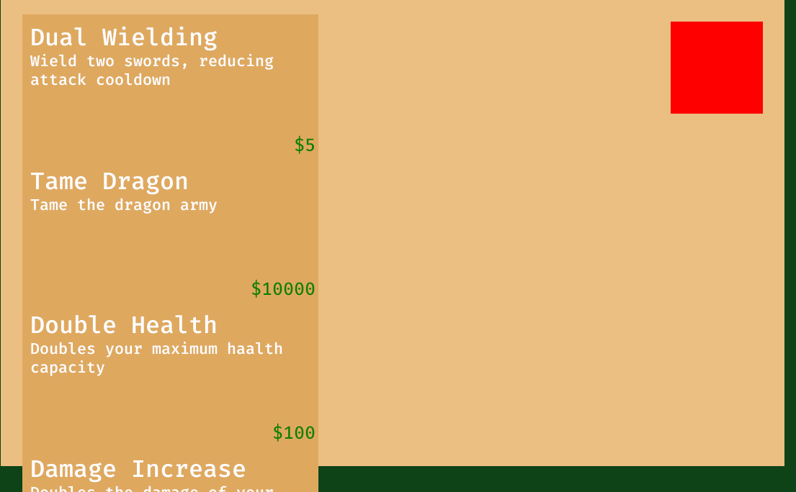
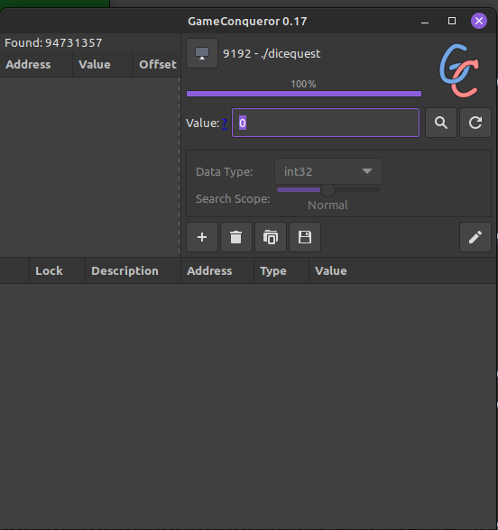
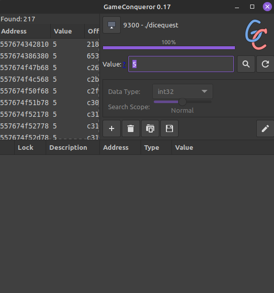
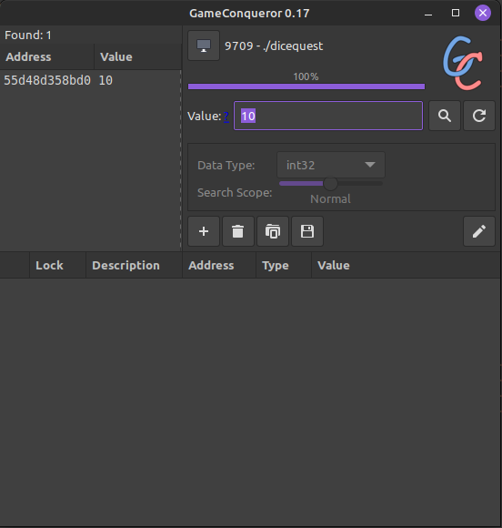
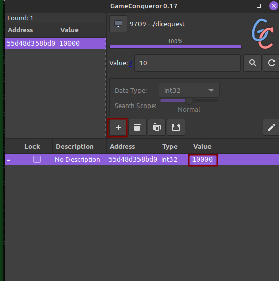
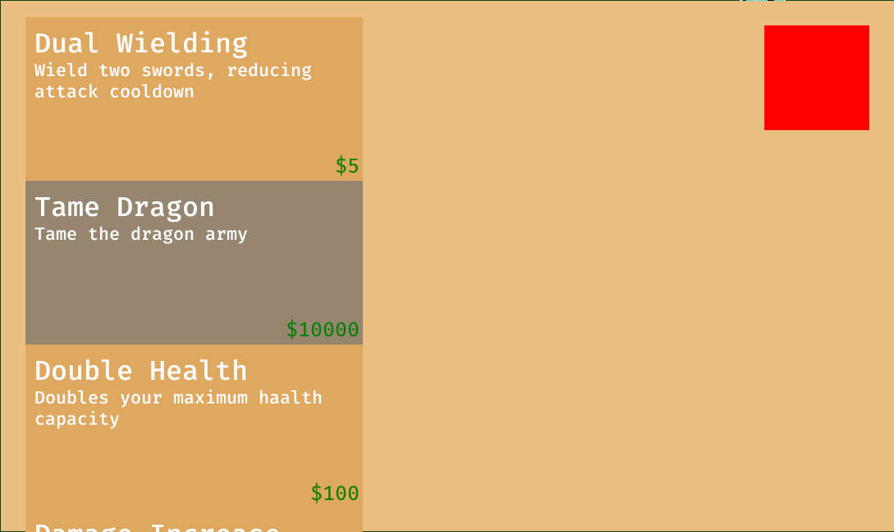
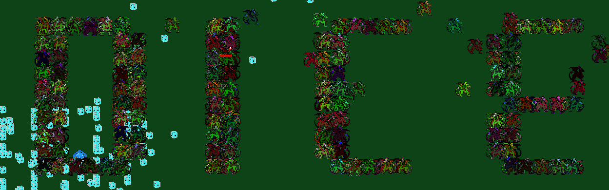

## Rev
### dicequest
>Try 2024's hottest game so far - DiceQuest! Can you survive the onslaught? Custom sprites made by [Gold](https://www.fiverr.com/goldpixela)
>
>note: the flag matches the regex `dice{[a-z_]+}`

-----------
With this challenge, we are given an ELF executable game:
```
$ file dicequest 
dicequest: ELF 64-bit LSB pie executable, x86-64, version 1 (SYSV), dynamically linked, interpreter /lib64/ld-linux-x86-64.so.2, BuildID[sha1]=5a21a66948b7d5fd5c206fbaf90b9c1fbe2e52a4, for GNU/Linux 3.2.0, stripped
```
Checking the contents with strings can show us that the game was made with rust, but not much other details are given. Running the executable puts us in a game with simple graphics:


The big dice is our playable object, to the right is a shop for us. To the left is an "enemy" dice and the top left has our money count. After about a minute or so, it looks as though dragons appear and we die. Checking the contents of the shop:



The shop info is slightly cut off, but we can tame the dragon army if we collect $10,000! Each "enemy" kill grants us $5, so this is completely unfeasible. However, if we can edit our money amount in-game, we can give ourselves as much money as we want. Normally with windows-based executables, I would opt to use [Cheat Engine](https://www.cheatengine.org/), but this is a linux ELF. There seems to be a very competent alternative in [gameconquerer](https://github.com/scanmem/scanmem).

In order to find the memory address responsible for money, we can search for addresses containing the number while we know it. For example, at the start of every game we have 0 dollars. We can search for values containing 0:



Then as we defeat 1 enemy we are brought to $5. Searching again, we can trace values that started at 0 and are 5 after defeating 1 enemy:



We can repeat this process until there is only 1 address left:



Now that we know we have the address, we can add it with the + symbol and edit the value section below. Giving myself 10000:



The score in top left will not change until your score is changed by defeating an enemy, but the money is still there and now we can purchase the dragon tame upgrade:



Now when the dragons come, I survive!


The flag isn't immediately apparent, but we can eventually see that the dragons are creating letters:



We can zoom out pretty far to see the whole flag, but the text is certainly not easy on the eyes:


## Misc

### zshfuck
>may your code be under par. execute the `getflag` binary somewhere in the filesystem to win

----------
We are given the source code for our jail:
```zsh
#!/bin/zsh
print -n -P "%F{green}Specify your charset: %f"
read -r charset
# get uniq characters in charset
charset=("${(us..)charset}")
banned=('*' '?' '`')

if [[ ${#charset} -gt 6 || ${#charset:|banned} -ne ${#charset} ]]; then
    print -P "\n%F{red}That's too easy. Sorry.%f\n"
    exit 1
fi
print -P "\n%F{green}OK! Got $charset.%f"
charset+=($'\n')

# start jail via coproc
coproc zsh -s
exec 3>&p 4<&p

# read chars from fd 4 (jail stdout), print to stdout
while IFS= read -u4 -r -k1 char; do
    print -u1 -n -- "$char"
done &
# read chars from stdin, send to jail stdin if valid
while IFS= read -u0 -r -k1 char; do
    if [[ ! ${#char:|charset} -eq 0 ]]; then
        print -P "\n%F{red}Nope.%f\n"
        exit 1
    fi
    # send to fd 3 (jail stdin)
    print -u3 -n -- "$char"
done
```
The setup is a little complex, but the general behavior is this: You are in a terminal that only accepts up to 6 characters of your choosing. After selection, any string that only contains those characters will be passed to and executed inside `zsh`. There are some characters that are banned, as they would make it too easy. As a start, I tried to learn more about the filesystem by passing an `ls -lR` command:

```
$ nc mc.ax 31774
Specify your charset: ls -R

OK! Got l s   - R.
ls -lR
.:
total 8
-rwxr-xr-x 1 nobody nogroup  795 Feb  2 21:55 run
drwxr-xr-x 1 nobody nogroup 4096 Feb  2 13:31 y0u

./y0u:
total 4
drwxr-xr-x 1 nobody nogroup 4096 Feb  2 13:31 w1ll

./y0u/w1ll:
total 4
drwxr-xr-x 1 nobody nogroup 4096 Feb  2 13:31 n3v3r_g3t

./y0u/w1ll/n3v3r_g3t:
total 4
drwxr-xr-x 1 nobody nogroup 4096 Feb  2 13:31 th1s

./y0u/w1ll/n3v3r_g3t/th1s:
total 16
---x--x--x 1 nobody nogroup 15960 Feb  2 13:30 getflag
```

We can see that our objective executable is buried several folders deep. Naturally, we will have to reach it before being able to execute. We can also learn the current path with pwd or cwd:
```
Specify your charset: pwd

OK! Got p w d.
pwd
/app
```

Thanks to the interesting behavior of passing our characters into another shell, we cannot escape via a simple -i flag:

```
Specify your charset: sh -i

OK! Got s h   - i.
sh -i
sh: 0: can't access tty; job control turned off
$ id

Nope.
```

We see the output `$` indicative of an sh session, but are still incapable of passing banned letters. By this point, it is rather clear why there are certain banned characters. If wildcards were allowed, we could hit it very easily just with `/*/*/*/*/*/*`. Alas, it is not that simple.

After researching some [special characters](https://docstore.mik.ua/orelly/unix3/upt/ch27_17.htm) for zsh, i find an interesting opportunity:

|  [ ]  |  csh, sh  | Match range of characters.   | Section 1.13, Section 33.2 |
|-----|---------|----|----|

Following the example sections, we can see it used to encompass all characters:
```
[a-z]
```
Perhaps something like this can work for our situation? to begin, I try executing /app/run since it is shorter:
```
Specify your charset: /[a-z]

OK! Got / [ a - z ].
/[a-z][a-z][a-z]/[a-z][a-z][a-z]
Specify your charset: asdf

Nope.
```
We can see that after i input my execution string of `/[a-z][a-z][a-z]/[a-z][a-z][a-z]`, the jail is run a 2nd time and asks once again for a charset. I still can't circumvent the original charset, but it is clear that we are executing /app/run! Now the challenge lies in reaching our getflag goal. Remember the path: `/app/y0u/w1ll/n3v3r_g3t/th1s/getflag`. Unlike my simple check, this contains more than just letters. We need to expand our range even further to match all the characters. Using the range starting at 0 and ending at z will include all letters and numbers, but will it include the underscore inside `n3v3r_g3t`? Turns out it will:

```
Specify your charset: /[0-z]

OK! Got / [ 0 - z ].
/[0-z][0-z][0-z]/[0-z][0-z][0-z]/[0-z][0-z][0-z][0-z]/[0-z][0-z][0-z][0-z][0-z][0-z][0-z][0-z][0-z]/[0-z][0-z][0-z][0-z]/[0-z][0-z][0-z][0-z][0-z][0-z][0-z]
dice{d0nt_u_jU5T_l00oo0ve_c0d3_g0lf?}
```

The command is simply replacing every character in `/app/y0u/w1ll/n3v3r_g3t/th1s/getflag` with `[0-z]`, with the exception of forward slashes.
