>Your team has identified unusual network activity originating from a Linux server within the corporate network. The server is continuously making outbound connections to a suspicious IP address. Upon further investigation, it appears that a downloader malware has been installed on the server, potentially downloading and executing malicious payloads.

## Investigation

`Strings` can show some interesting functions in use, such as netowrking behavior in `connect`, `send`, `recv`, `setsockopt`, `socket`. There is a sleep, and an interesting syscall as well. We can start by going through the questions/answers then piecing together how this binary behaves.

## Answers

### 1. What IP address does the program use to create the socket connection?

In `strings` we can see a singular IP address:
```bash
$ strings downloader  
/lib64/ld-linux-x86-64.so.2  
libc.so.6  
socket  
exit  
connect  
send  
fexecve  
recv  
inet_addr  
setsockopt  
realpath  
gethostbyname  
close  
sleep  
syscall  
access  
__libc_start_main  
setenv  
write  
__environ  
__gmon_start__  
GLIBC_2.3  
GLIBC_2.2.5  
<...SNIP...>
/tmp/log_de.log  
l64      
[kworker/0:2]  
65.2.144.170  
<...SNIP...>
```

Alternatively using `Cutter` we can view disassembly of the binary. We can find this IP address loaded soon after `main` is run:

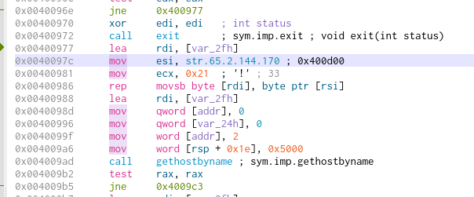
### 2. What file path does the program check for existence at the beginning?

This is also found in strings as one of the only files defined:
```
/tmp/log_de.log
```

Once again also found using `Cutter`:

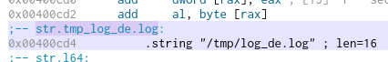

### 3. What system call number is used in the program?

When we search for syscall invokes, we can see `edi` is set to 319 right before it is sent. Syscall 319 points to `memfd_create`, which acts to [create a modifiable file existing in memory](https://man7.org/linux/man-pages/man2/memfd_create.2.html)

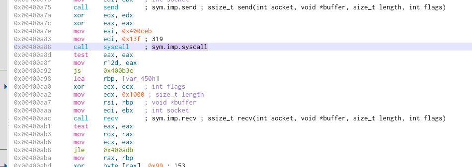
### 4. What string is sent first to the connected socket?

In the `main` function we can see the first `sym.imp.send` function after a sleep:

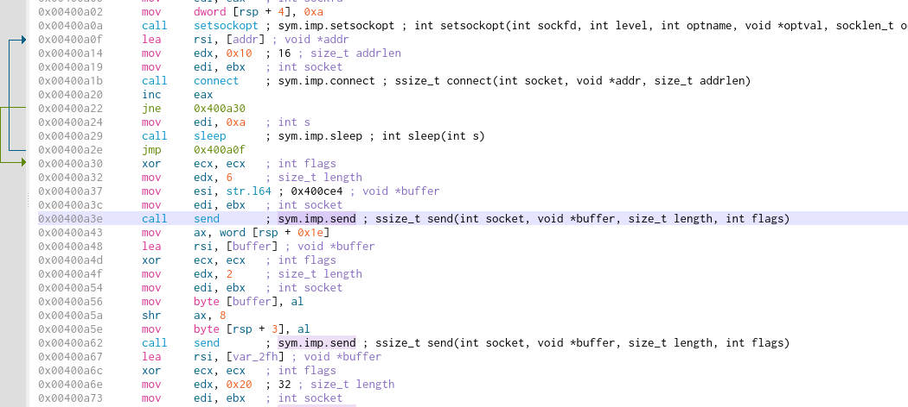

We can see prior to the send, a `mov esi, str.l64`. We can confirm this is the entirety of the string by pivoting to the string in disassembly view:

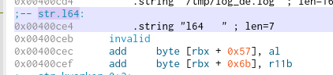

### 5. What num of xor operation is performed on each byte of received data before it is written to sys_fd (in hex)?

Looking for `xor` events we mainly want to look for one that isn't xor'ing itself for a value reset. We can find the following `xor`:

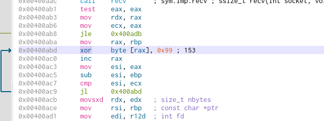

The `xor` value here is `0x99`, or number value 153.

### 6. What environment variable is set before executing the new program, and what value is assigned to it?

We can see a call to `setenv`:

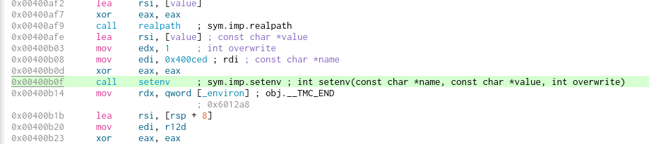

We can see the name is set to `0x400ced` Unfortunately I had trouble identifying the intended path statically, and only found the solution after running in a debugger and checking the `rdi` details:

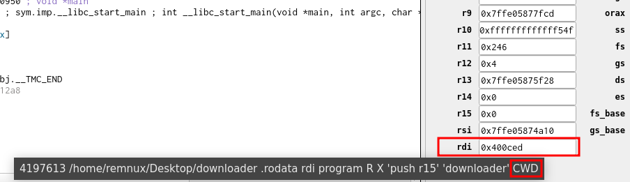

The apparent answer is `CWD`.
### 7. What is the value of argva[0] used in the fexecve call?

We can see qword for str.kworker_0:2 immediately prior to the fexec:

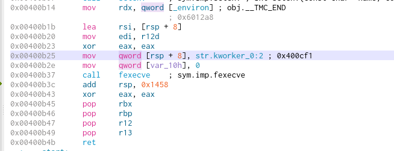

Again pivoting to the str location gives us the full string:

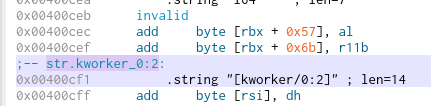

`[kworker/0:2]`
### 8. How many seconds does the program take if the initial connection attempt fails?

Going back to the `sleep` function after the socket connect:

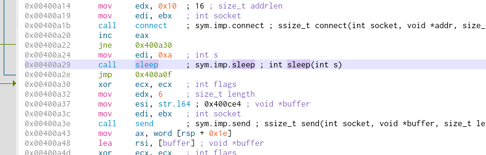

The sleep is for 0xa, or 10 seconds.

## Impact

The file starts by checking the existence of the log file `/tmp/log_de.log`. If the file is found, exit is called and the program ends. If it is not found, an attempt to connect to a remote address `65.2.144.170` is attempted. An unsuccessful connection will `sleep` for 10 seconds before looping back and trying again. After connection is successful, the string `l64` is sent and filespace is allocated in memory via the syscall, `memfd_create`. An expected response is received and written to the file. An environment variable is set pointing to `cwd`, the current path for the binary file. Finally, `fexecve` is called with the string `[kworker/0:2]`, the kernel worker process handler. 

Overall it appear to do essentially exactly what the challenge description details: it downloads content in a Linux executable. whether or not it is malicious depends entirely on the contents of what the remote server is delivering.
