## Description
>You are a cybersecurity analyst at a mid-sized tech company. One morning, you receive multiple reports from employees stating that they are unable to access their files. Upon investigation, you discover that all files have been encrypted and appended with a new extension. A ransom note left on the desktop demands payment in cryptocurrency to decrypt the files. The ransomware responsible for this attack is known as Risen Ransomware. Your task is to analyze the Risen Ransomware.

## Investigation

In PE Studio, we can review indicators to get an overview of potentially suspicious discoveries.
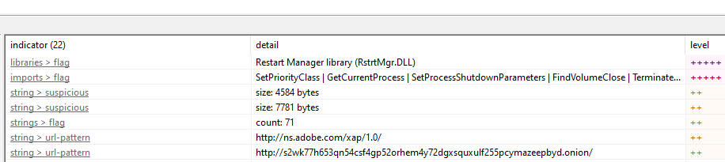

We see among the required libraries for this exists Restart Manager. For ransomeware purposes, Restart Manager is leveraged to force close files so that they are no longer locked, and can be overwritten as encypted/ransomed. This technique is covered in more detail on the [Conti Ransomeware blog from Acronis](https://www.acronis.com/en-us/blog/posts/conti-ransomware/). The string for an Onion link URL also stands out quite obviously here.

There are several imports, including the ability to locate/write over files, the ability to enumerate/terminate running processes, and of course the key to ransomeware attacks, the encryption functions.

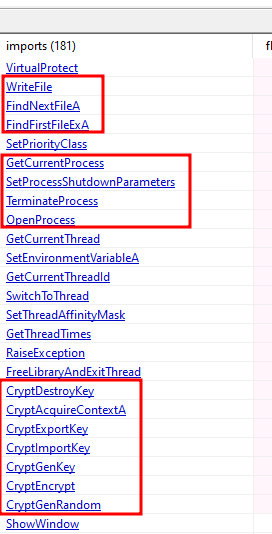

Strings have several fragments that suggest malicious activity, such as the reference to a function IsEncrypt:

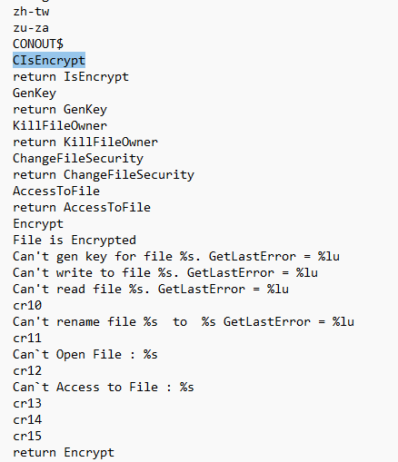

Also interesting to see in strings is the measures taken to remove backup/restoration methods:

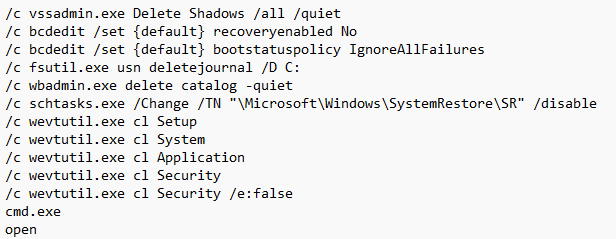

Several registry keys are modified:

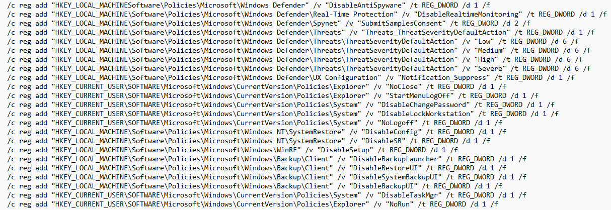

Persistence via scheduled task also found:
```
/c SCHTASKS.exe /Create /RU "NT AUTHORITY\SYSTEM" /sc onstart /TN "SystemDefense" /TR "%s" /F
```

The entire ransom note is also extracted in strings:

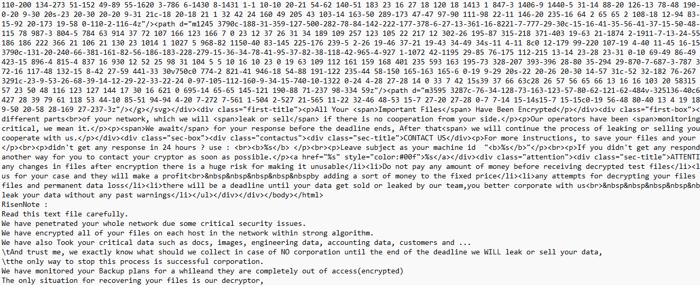

Lastly we see the contact information strings:
```
return deQueue
http://s2wk77h653qn54csf4gp52orhem4y72dgxsquxulf255pcymazeepbyd.onion/
dectokyo@cock.li
dectokyo@onionmail.org , TELEGRAM:@tokyosupp
Proof Setup
risen1
Adobe Photoshop
Adobe Photoshop 2020
```

The inclusion of photoshop seems to suggest that this ransomware might have masqueraded as a free installer for Adobe Photoshop.
## Answers

### 1. Which text file was opened by the malware after initializing a critical section?

In IDA, we see an `InitializeCriticalSection` call, immediately followed by a `CreateFileW` for RisenLogs.txt

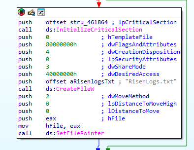


### 2. What is the mutex that was created by the malware?

Immediately following the RisenLogs.txt, we see the CreateMutexA for `RISEN_MUTEX`

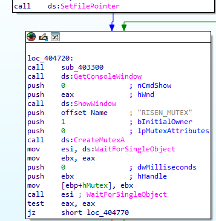

### 3. How many countries (system languages) does the malware prevent itself from running in?

Immediately following `GetSystemDefaultUILanguage`, we see 5 consecutive compares, which jump(skip) if the language matches.

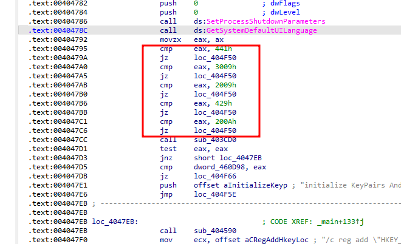

Using [System.Globalization.CultureInfo Class documentation](http://www1.cs.columbia.edu/~lok/csharp/refdocs/System.Globalization/types/CultureInfo.html) I tried identifying the triggering languages, but the results appear more random than I had hoped.
- 0x0441: sw-KE (Swahili - Kenya)
- 0x3009: en-ZW (English - Zimbabwe)
- 0x2009: en-JM (English - Jamaica)
- 0x0429: fa-IR (Farsi - Iran)
- 0x200A: es-VE (Spanish - Venezuela)
### 4. What is the address of GetSystemInfo? (In Hex)

We can use IDA cross references functionality to find this call location rather than hunting through the tree.

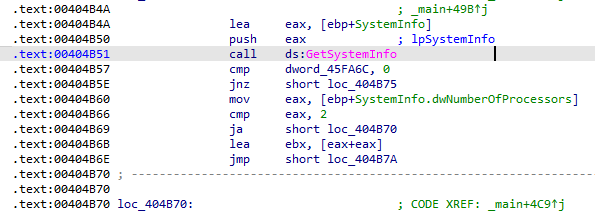

`0x404B51`

### 5. What is the first API that is resolved in the sub_403120 function?

Moving to subroutine at 0x403120:

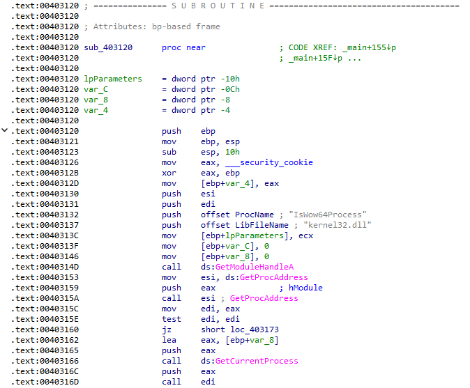

`IsWow64Process`
### 6. What is the scheduled task name created by the malware?

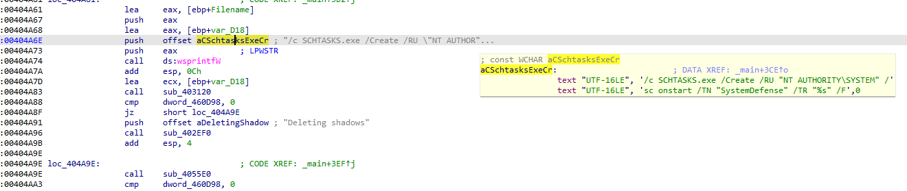

We can see the schtask arguments created here, with a task name `SystemDefense`. Also worth noting that this could be found in strings.
### 7. What is the array name that contains the volume used by the ransomware to encrypt files?

Within the `main` tree, we can see a drive letter Q:\\ mov'd after the ransomware encryption begins:

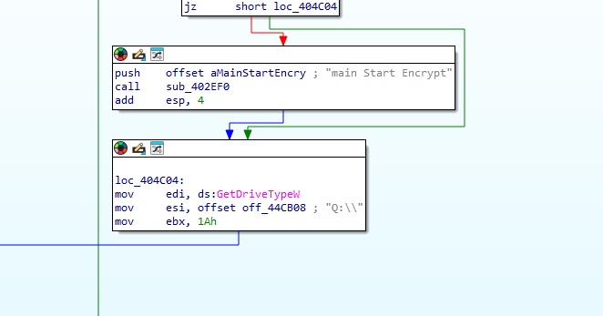

The question here is looking for the offset reference used: `off_44CB08`

### 8. What is the Telegram username of the threat actor?

This can be found in the `main` function in IDA. The information was also discovered earlier in the strings:
```
dectokyo@onionmail.org , TELEGRAM:@tokyosupp
```

## Impact

It might be worth noting that this file hash has been reported to VirusTotal beginning in March of 2024, nearly a year ago. https://www.virustotal.com/gui/file/350ba69da5c837dcb7dad72ced74396456d520fb917fb408c069d0dc726c6c66/ The file provided may have been a ransomware object originally found in the wild.

A key aspect of ransomware is that the victim's files are (reversibly) encrypted, and only the threat actor knows the key to decryption. While we see the overall behavior from this file appears as real ransomware, the previous investigation did not find any C2 domain that may have been used to receive encryption keys or sensitive files from victims. Attempts to analyze the sample dynamically has resulted in memory errors, and the VirusTotal sandbox behaviors also suggest Windows Werfault (crashing) is happening there as well. `UPX` was identified as a domain within the VirusTotal sandbox, so maybe it is possible that this file hash was manually unpacked by a different malware analyst in a way that broke the functionality of the ransomware.

VirusTotal labels this malware as "BlackHunt", and an investigation of the supplied contacts shows articles related on a ransomware campaign for Black Hunt 2.0 with patterns that appear similar to this sample: https://www.pcrisk.com/removal-guides/27326-black-hunt-2-0-ransomware
