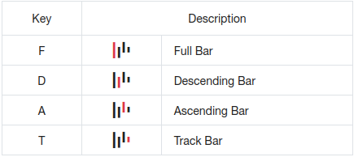
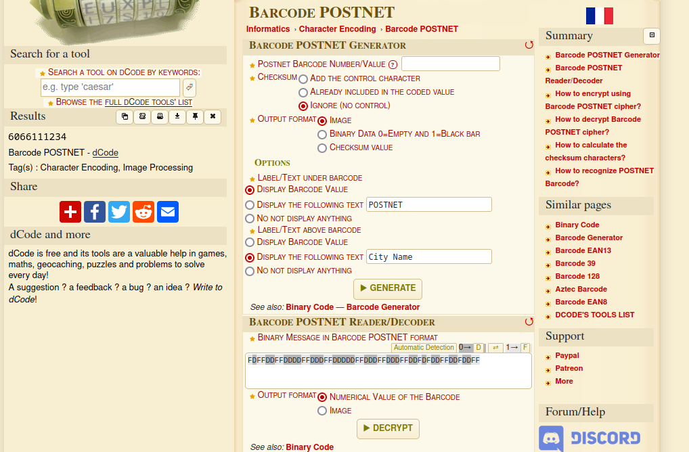

## Misc
### Corny Kernel
>Use our corny little driver to mess with the Linux kernel at runtime!
---------
Checking the attached file:
```c
// SPDX-License-Identifier: GPL-2.0-only  
  
#define pr_fmt(fmt) KBUILD_MODNAME ": " fmt  
  
#include <linux/module.h>  
#include <linux/init.h>  
#include <linux/kernel.h>  
  
extern const char *flag1, *flag2;  
  
static int __init pwny_init(void)  
{  
       pr_alert("%s\n", flag1);  
       return 0;  
}  
  
static void __exit pwny_exit(void)  
{  
       pr_info("%s\n", flag2);  
}  
  
module_init(pwny_init);  
module_exit(pwny_exit);  
  
MODULE_AUTHOR("Nitya");  
MODULE_DESCRIPTION("UIUCTF23");  
MODULE_LICENSE("GPL");  
MODULE_VERSION("0.1");
```
We can see this module produces two flag parts, `flag1` and `flag2`. One at init and one at exit. Entering the challenge terminal:
```bash
$ socat file:$(tty),raw,echo=0 tcp:corny-kernel.chal.uiuc.tf:1337  
== proof-of-work: disabled ==  
                            + mount -n -t proc -o nosuid,noexec,nodev proc /proc/  
+ mkdir -p /dev /sys /etc  
+ mount -n -t devtmpfs -o 'mode=0755,nosuid,noexec' devtmpfs /dev  
+ mount -n -t sysfs -o nosuid,noexec,nodev sys /sys  
+ cd /root  
+ exec setsid cttyhack ash -l  
/root # ls  
pwnymodule.ko.gz  
/root #
```

We find a `gzip` file in cwd. Interestingly, `file` is not on this system but it is an irrelevant check. When we unzip we are left with [.ko file, which is a kernel object.](https://fileinfo.com/extension/ko) We can interact with this using `modprobe` or `insmod`.

```bash
/root # insmod pwnymodule.ko
[   10.571676] pwnymodule: uiuctf{m4ster_
/root # rmmod pwnymodule.ko
/root #

```

Upon installing the module we see the first half of the flag. This makes sense considering `module_init` will produce the flag1 according to our source code. I thought that using `rmmod` to uninstall would produce the second half of the flag, but it did not go to terminal output.

Eventually I think to check `dmesg`:
```
/root # dmesg
<...SNIP...>
[   10.571676] pwnymodule: uiuctf{m4ster_
[  112.877984] pwnymodule: k3rNE1_haCk3r}
```

The difference seems to be primarily in that flag1 is produced with `pr_alert()` while flag2 is produced with `pr_info()`. Alert goes to stdout, while info goes to logs, perhaps?

`uiuctf{m4ster_k3rNE1_haCk3r}`


### vimjail1
>Connect with `socat file:$(tty),raw,echo=0 tcp:vimjail1.chal.uiuc.tf:1337`. You may need to install socat
-----
Checking the vimrc:
```bash
$ cat vimrc    
set nocompatible  
set insertmode  
  
inoremap <c-o> nope  
inoremap <c-l> nope  
inoremap <c-z> nope  
inoremap <c-\><c-n> nope
```

we can see the default is set to insert mode over normal mode. Additionally, several common escape keystrokes have been remapped to "nope". However, looking carefully shows a small mistake. `<c-\><c-n>` has been mapped to "nope", but these keystrokes individually have not. And so, we can still use `<c-\>` to escape.

Using `<c-\>` followed by `<c-n>`, we see insert mode has changed and we are able to supply `:` commands. Trying :shell,
```
Shell commands and some functionality not allowed in rvim
```

It looks like we cannot enter a regular shell being in rvim.. perhaps we can open a file named `flag.txt`?

```
uiuctf{n0_3sc4p3_f0r_y0u_8613a322d0eb0628}
```

It is worth noting that if you input `<c-\>` followed by `<c-n>` too quickly, then you still get an error. There must be a somewhat large delay for this to work.


### vimjail2
>Connect with `socat file:$(tty),raw,echo=0 tcp:vimjail2.chal.uiuc.tf:1337`. You may need to install socat
-----
Checking the vimrc, we see the same remaps as vimjail1. Plus some additional remaps:
```vim
cnoremap a _  
cnoremap b _  
cnoremap c _  
cnoremap d _  
cnoremap e _  
cnoremap f _  
cnoremap g _
```
and so on. All special characters and lowercase letters are substituted with `_`, with the exception of lowercase `q`. When we enter normal mode through the same method as vimjail1, we find that we are unable to input any commands. However, exiting with :q produces the flag:

```vim
E137: Viminfo file is not writable: /home/user/viminfo  
Press ENTER or type command to continue  
uiuctf{<left><left><left><left>_c364201e0d86171b}
```

It feels unintended, and based on the flag name, it looks like the intended solution involved sifting through something using left arrow keystrokes.

## OSINT
The OSINT challenges involved a series of exercises related to one another. Though I did not personally solve all of them myself I will cover the related challenges solved by teammates as well.
### What's for Dinner?
>Jonah Explorer, world renowned, recently landed in the city of Chicago, so you fly there to try and catch him. He was spotted at a joyful Italian restaurant in West Loop. You miss him narrowly but find out that he uses a well known social network and and loves documenting his travels and reviewing his food. Find his online profile.
-------
With this prompt, we are informed of Jonah enjoying an italian dinner within a small subsection of Chicago. Given this information, I began sifting through all italian restaurants within that zone looking for a recent review or posting by our Jonah. After searching for hours, my fellow colleague managed to find a [twitter account belonging to him](https://www.twitter.com/jonahexplorer). Surprisingly enough, Jonah had zero tweets announcing his dinner or even mentioning the place in Chicago. I still don't know where he ate. His only tweet is one containing the flag. 
`uiuctf{i_like_spaghetti}`


### Finding Jonah?
>Jonah offered a reward to whoever can find out what hotel he is staying in. Based on the past information (chals), can you find out what the hotel he stayed at was? Flag should be uiuctf{hotel_name_inn}
-----------
Provided image:


We can see two rather tall buildings, with the left one having more identifiable features in a curved top shape. [Perusing the tallest buildings in chicago](https://en.wikipedia.org/wiki/List_of_tallest_buildings_in_Chicago) we can identify it fairly quickly as [River Point](https://en.wikipedia.org/wiki/River_Point), located at 444 West Lake Street. We know we are looking at a hotel, so from here we can try to guess the hotel location based on the angle of the building, and the relative sizes of the nearby buildings. Eventually we land on a successful guess of `uiuctf{hampton_inn}`. The inn can be found at [this location](https://www.google.com/maps/place/Hampton+Inn+%26+Suites+Chicago-Downtown/@41.8903697,-87.6312605,396m/data=!3m1!1e3!4m13!1m3!2m2!1shotel!6e3!3m8!1s0x880e2cb21a4ff293:0xc2dacd58d2f3e1b9!5m2!4m1!1i2!8m2!3d41.8906367!4d-87.6292348!16s%2Fg%2F1vk6zth7!5m1!1e4?entry=ttu)


### Jonah's Journal
>After dinner, Jonah took notes into an online notebook and pushed his changes there. His usernames have been relatively consistent but what country is he going to next? Flag should be in format uiuctf{country_name}
-------------------
This challenge is dependent on solving `What's For Dinner?`, as this one contains the key info of account username. There are several online notetaking services, but the language here is a strong suggestion on where it might be. It states that jonah "pushed his changes there". The reference here is likely to a `git push`, which is the method to submit changes on `git` based services such as github. Searching here we can see right away, https://github.com/jonahexplorer. There is exactly 1 public repo on this account, and in it he states the following:
```
storing all my adventure codes

I think that the next place I wanna visit is the great wall of china, but not until I get off of flight UA5040
```
And so, we have our answer. `uiuctf{china}`.


### First class mail
>Jonah posted a picture online with random things on a table. Can you find out what zip code he is located in? Flag format should be uiuctf{zipcode}, ex: uiuctf{12345}.
-----------
Provided image:


The image contains a lot of items, but only a couple stand out as interesting. The first being an insurance letter with the return address in plain sight. Trying `uiuctf{16530}` did not pass, so this address is not it. The other letter, however, has the mail address hidden but the mail barcode is shown in plain sight. [Intelligent Mail Barcodes](https://postalpro.usps.com/mailing/intelligent-mail-barcode) are used by the USPS to sort mail delivery quickly and easily. If we can decode this, we might be able to learn Jonah's zip code. We can convert the barcode using this decoder key, then submitting it to an online decoder tool: 



Decoding our letter:
`FDFFDDFFDDDDFFDDDFFDDDDDFFDDDFFDDDFFDDFDFDDFFDDFDDFF`

Using [dcode.fr to decode](https://www.dcode.fr/barcode-postnet):



We see the 9-digit zip as `606611234`. This is known as ZIP+4, as the last 4 digits are extra specifiers to pinpoint a subsection within a regular ZIP address. The flag is only asking for the zip address with an example of 5 digits, so we submit the ZIP without the +4 appended:
`uiuctf{60661}`.
